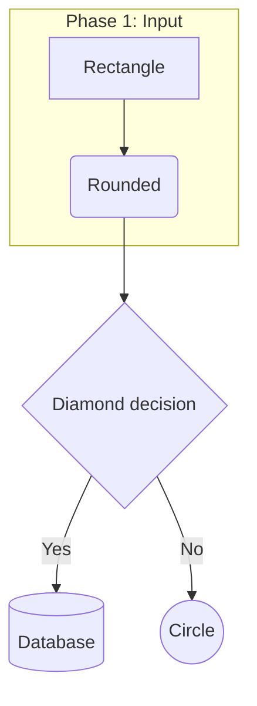
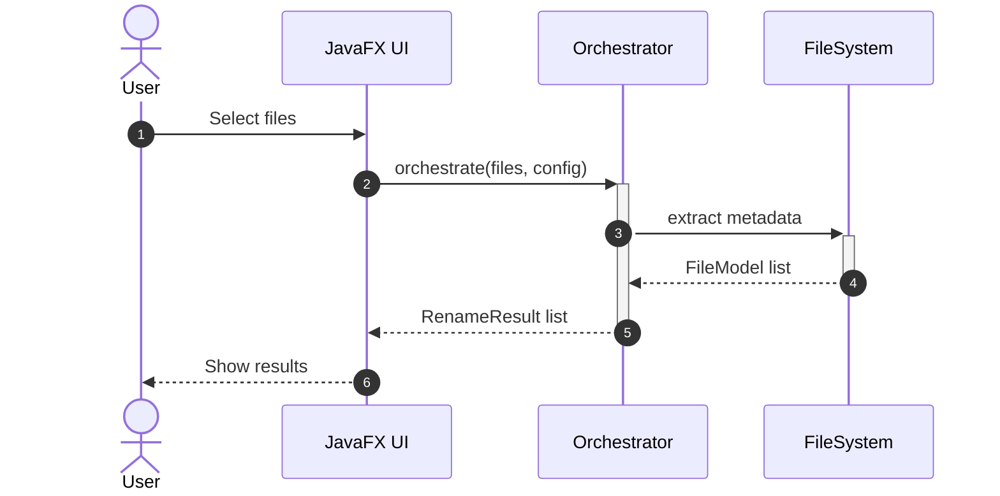
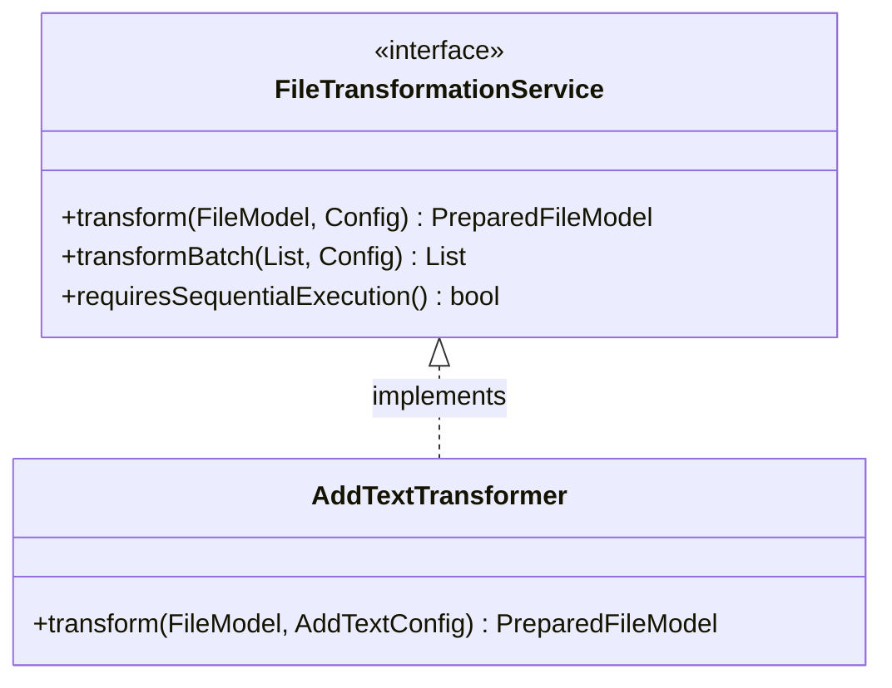
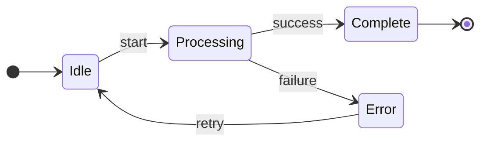
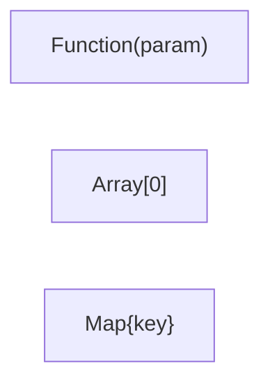

# Create Mermaid Diagrams

Invoke when creating or updating Mermaid diagrams — architecture overviews, sequence diagrams, class hierarchies, state machines, pipeline flows. Most useful for `docs/ARCHITECTURE.md` updates.

---

## Golden Rules

1. **Never put comments inline** — `%%` comments must be on their own line
2. **IDs are alphanumeric only** — no spaces, hyphens, or special chars in IDs
3. **Quote labels with special chars** — `["Step 1: Init"]` not `[Step 1: Init]`
4. **Never use reserved words as IDs** — `end`, `class`, `subgraph`, `graph`, `default`
5. **IDs never start with numbers** — use `step1` not `1stStep`

```
✅ CORRECT:
%% This is a comment
A["Step 1: Init"] --> B["Step 2: Process"]

❌ WRONG (inline comment causes parse error):
A --> B %% This breaks rendering
```

---

## Diagram Type Quick Pick

| Goal | Use |
|------|-----|
| Process flow / pipeline | `flowchart TD` or `flowchart LR` |
| Class hierarchy / interfaces | `classDiagram` |
| Method call sequence | `sequenceDiagram` |
| State machine / lifecycle | `stateDiagram-v2` |
| Project timeline | `gantt` |
| Git branching | `gitgraph` |

---

## Flowchart (Most Common)



---

## Sequence Diagram



---

## Class Diagram



---

## State Diagram



---

## Special Characters in Labels



| Character | Entity |
|-----------|--------|
| `(` `)` | `#40;` `#41;` |
| `[` `]` | `#91;` `#93;` |
| `{` `}` | `#123;` `#125;` |

---

## Validation Checklist

- [ ] No inline `%%` comments (all on own lines)
- [ ] All IDs alphanumeric, no reserved words
- [ ] Labels with `:`, `-`, `(`, etc. are quoted
- [ ] `subgraph` blocks have matching `end`
- [ ] Direction declared (`TD`, `LR`, etc.) for flowcharts

---

## Common Errors

| Error | Cause | Fix |
|-------|-------|-----|
| Parse error after `-->` | Inline comment | Move `%%` to its own line |
| Diagram doesn't render | Reserved word as ID | `end` → `endNode`, `class` → `classNode` |
| Syntax error on `(` | Unquoted parens in label | `["text(x)"]` or `["text#40;x#41;"]` |
| "end" breaks diagram | Reserved word | Use `["end"]` in label instead |
