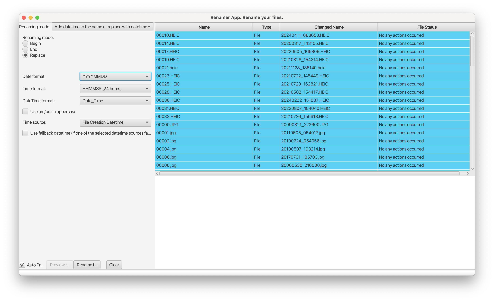
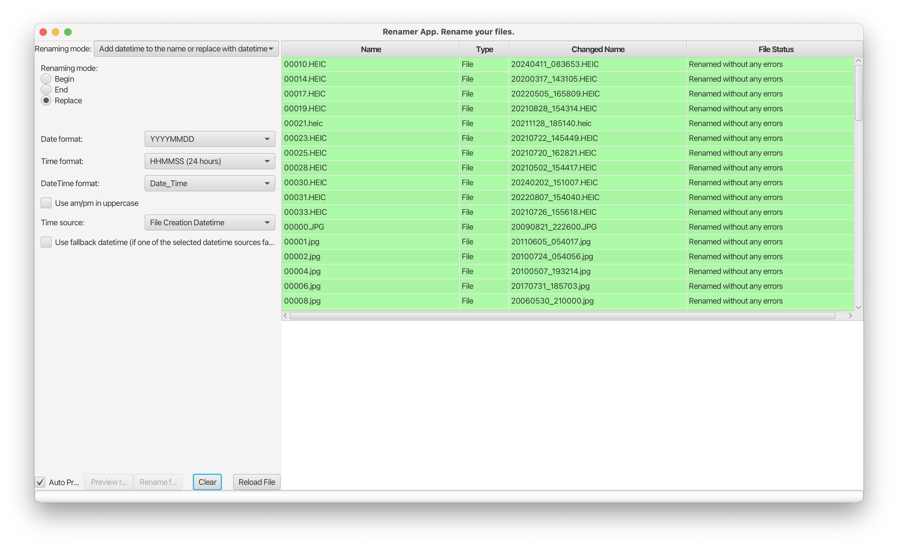
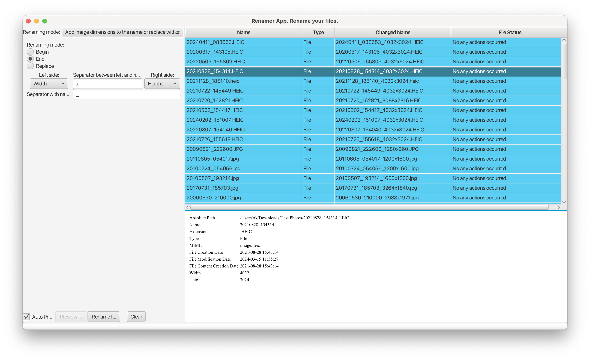

# Renamer App

Welcome to the Renamer App repository! This is a desktop tool designed to streamline the process of renaming files on
your PC. Say goodbye to manual file renaming and hello to a more efficient workflow.

[For more detailed documentation, click here](docs/documentation.md)

## Problem

When working with files on your PC, you often find yourself needing to rename multiple files according to a specific
pattern or based on certain properties of the files themselves.

For instance, let's say you have a collection of images with generic names like "IMG_0001.jpg", "IMG_0002.jpg", and so
on.

You know these files contain valuable metadata like creation dates or EXIF data, which you'd like to use to rename them
to something more descriptive, such as "20240506_172055.jpg", "20240507_123011.jpg", and so forth.

Currently, your only option is to tediously inspect each file's properties and manually craft new names. This app aims
to change that by providing a simple and intuitive way to rename files based on predefined patterns or file properties.
Whether you need to add prefixes or suffixes, replace text, or utilize file metadata, this tool has got you covered.

Also, there can be different options of renaming as:

- Adding text to the name
- Replacing text
- Generation of the digit sequence
- Adding files metadata like width\height for images
- Changing file extension (if it absent or any other cases)
- Removing text
- Removing empty symbols
- etc.

## Screenshots

Some examples of the working app





## Used Libraries

### Application Logic

- **Metadata-extractor**: A tool for reading EXIF (and some other) data from certain types of image and video files. [Metadata-extractor](https://mvnrepository.com/artifact/com.drewnoakes/metadata-extractor/2.19.0), [Docs](https://github.com/drewnoakes/metadata-extractor)
- **Tika**: Library for extracting metadata from files. Used to get Mime type. [Tika](https://mvnrepository.com/artifact/org.apache.tika/), [Docs](https://tika.apache.org)
- **JavaFX**: A Java UI library/framework. [JavaFX](https://mvnrepository.com/artifact/org.openjfx/javafx), [Docs](https://openjfx.io/index.html)

### Development

- **Lombok**: Project Lombok is a Java library that reduces boilerplate code by automatically generating getters, setters, and other common methods. [Lombok](https://mvnrepository.com/artifact/org.projectlombok/lombok), [Docs](https://projectlombok.org)
- **Mockito**: Mockito is a popular open-source framework for Java that simplifies unit testing by letting you create mock objects to isolate the code you're testing. [Mockito](https://mvnrepository.com/artifact/org.mockito), [Docs](https://site.mockito.org)
- **Google Guice**: Google Guice is an open-source framework for Java that simplifies dependency injection using annotations, making your code more modular and easier to test. [Google Guice](https://mvnrepository.com/artifact/com.google.inject/guice), [Docs](https://github.com/google/guice)
- **Junit5**: JUnit 5 is the latest version of the JUnit testing framework for Java, offering a modern approach to unit testing with features like support for Java 8 and above, various testing styles, and improved annotations. [Junit5](https://mvnrepository.com/artifact/org.junit.jupiter), [Docs](https://junit.org/junit5/)
- **Jdeploy**: Tool helps to build installers of JavaFX app. [Docs](https://www.jdeploy.com)

## How to Build and Run the App from Source

To build and run the app from source, follow these steps:

**(Expected that Java 21+ and Apache Maven 3.9.6 are installed, also these versions of tools were used during development)**

- [OpenJDK](https://openjdk.org/projects/jdk/21/), 
- [Maven](https://maven.apache.org)
- I would use following [Adoptium Project JDKs](https://adoptium.net), or JDK from Amazon - [Amazon Corretto](https://aws.amazon.com/ru/corretto/)
- [Installation JDK on macOS via Homebrew](https://formulae.brew.sh/cask/temurin#default)
- If you want to manage several versions of java on MacOS - [Jenv](https://formulae.brew.sh/formula/jenv#default)

1. Navigate to the folder containing the source code.
   ```shell
   cd /path/to/renamer_app
   ```
2. Install all dependencies and build the app using mvn.
   ```shell
   mvn clean install
   ```
3. Once the build process is complete, you'll find the executable for your OS in
   the `renamer_app/app/ui/target/ua.renamer.app.ui-{version}.jar` folder. You can run it as below:
   ```shell
   # Navigate to the UI module and run via maven javafx plugin
   cd /path/to/renamer_app/app/ui
   mvn javafx:run
   
   # Or you can run it directly by the following script from the project root
   java -jar ui/target/ua.renamer.app.ui-1.0-SNAPSHOT.jar
   
   # 1.0-SNAPSHOT is a version of the app, so check the version before run
   ```

## Code Coverage

The core module is extensively covered by unit tests, ensuring robust functionality across all non-UI related aspects of
the application.

# Languages

Currently supported 2 languages - English and Ukrainian. Language will be choosen based on the system locale, if locale - UA, Ukrainian will be used, for all other locales default is English.

# Nothing is good... TODO list for this app

- Investigate [ExifTool by Phil Harvey](https://exiftool.org) in order to use it as metadata parser for files
- Investigate other libs that can extract metadata for other file types
- Implement extracting metadata for video files
- Implement using metadata for audio files (artist name, song name, creation date, etc)
- Improve UI/UX
- Review the app, find what can be improved or added
- Add more unit tests