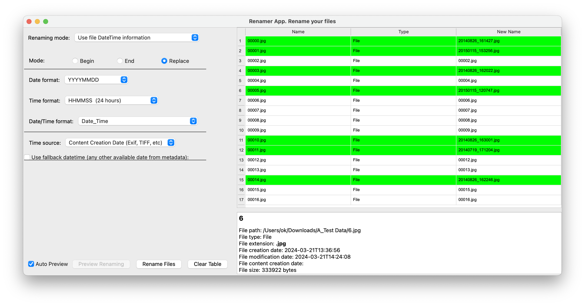
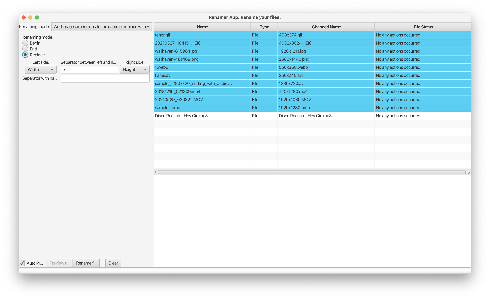
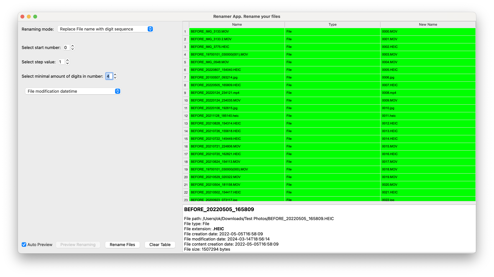

# Renamer App

Welcome to the Renamer App repository! This is a desktop tool designed to streamline the process of renaming files on
your PC. Say goodbye to manual file renaming and hello to a more efficient workflow.

[For more detailed documentation, click here](docs/documentation.md)

## Problem

When working with files on your PC, you often find yourself needing to rename multiple files according to a specific
pattern or based on certain properties of the files themselves.

For instance, let's say you have a collection of images with generic names like "IMG_0001.jpg", "IMG_0002.jpg", and so
on.

You know these files contain valuable metadata like creation dates or EXIF data, which you'd like to use to rename them
to something more descriptive, such as "20240506_172055.jpg", "20240507_123011.jpg", and so forth.

Currently, your only option is to tediously inspect each file's properties and manually craft new names. This app aims
to change that by providing a simple and intuitive way to rename files based on predefined patterns or file properties.
Whether you need to add prefixes or suffixes, replace text, or utilize file metadata, this tool has got you covered.

Also, there can be different options of renaming as:

- Adding text to the name
- Replacing text
- Generation of the digit sequence
- Adding files metadata like width\height for images
- Changing file extension (if it absent or any other cases)
- Removing text
- Removing empty symbols
- etc.

## Screenshots

Some examples of the working app





## Used Libraries

### Application Logic

- **ExifRead**: A tool for reading EXIF data from certain types of
  images. [ExifRead](https://pypi.org/project/ExifRead/), [Docs](https://github.com/ianare/exif-py)
- **Pillow**: A library for parsing image
  data. [Pillow](https://pypi.org/project/pillow/), [Docs](https://pillow.readthedocs.io/en/stable/)
- **Pillow Heif**: Adds support for HEIF codec and file types like ".heic" to
  Pillow. [Pillow Heif](https://pypi.org/project/pillow-heif/), [Docs](https://pillow-heif.readthedocs.io/en/latest/)
- **Mutagen**: Provides support for extracting audio metadata for MP3, FLAC, OGG,
  etc. [Mutagen](https://pypi.org/project/mutagen/), [Docs](https://mutagen.readthedocs.io/en/latest/)
- **PySide6**: A Python binding for the Qt framework, used for building the
  UI. [PySide6](https://pypi.org/project/PySide6/), [Docs](https://doc.qt.io/qtforpython-6/api.html)

### Development

- **PyInstaller**: A tool for bundling Python applications into standalone
  executables. [pyinstaller](https://pypi.org/project/pyinstaller/), [Docs](https://pyinstaller.org/en/stable/)
- **pytest**: A testing framework for running unit
  tests. [pytest](https://pypi.org/project/pytest/), [Docs](https://docs.pytest.org/en/latest/)
- **black**: A code formatter for maintaining consistent code
  style. [black](https://pypi.org/project/black/), [Docs](https://github.com/psf/black)

## How to Build and Run the App from Source

To build and run the app from source, follow these steps:

**(Expected that Python 3.10+ and Pipenv are installed)**

- [Python Official](https://www.python.org/downloads/), [Installation on macOS via Homebrew](https://docs.brew.sh/Homebrew-and-Python)
- [Pipenv](https://pypi.org/project/pipenv/), [Docs](https://pipenv.pypa.io/en/latest/), [Installation on macOS via Homebrew](https://formulae.brew.sh/formula/pipenv)

1. Navigate to the folder containing the source code.
   ```shell
   cd /path/to/renamer_app
   ```
2. Install all dependencies using Pipenv.
   ```shell
   pipenv install
   ```
3. Run the script to build the UI App.
   ```shell
   pipenv run pyinstaller renamer_app_ui.spec
   ```
4. Once the build process is complete, you'll find the executable for your OS in the `renamer_app/dist` folder. On
   macOS, it will be named "File Renamer.app".

## Code Style

The codebase is formatted using the black formatter with a line length limit of 120 characters (**black . --line-length
120**).

## Code Coverage

The core module is extensively covered by unit tests, ensuring robust functionality across all non-UI related aspects of
the application. We strive to maintain high code coverage to ensure stability and reliability.

# Nothing is good... TODO list for this app

- Investigate [ExifTool by Phil Harvey](https://exiftool.org) in order to use it as metadata parser for files
- Investigate other libs that can extract metadata for video files
- Implement extracting metadata for video files
- Implement using metadata for audio files (artist name, song name, creation date, etc)
- Improve UI/UX
- Review the app, find what can be improved or added
- Add more unit tests