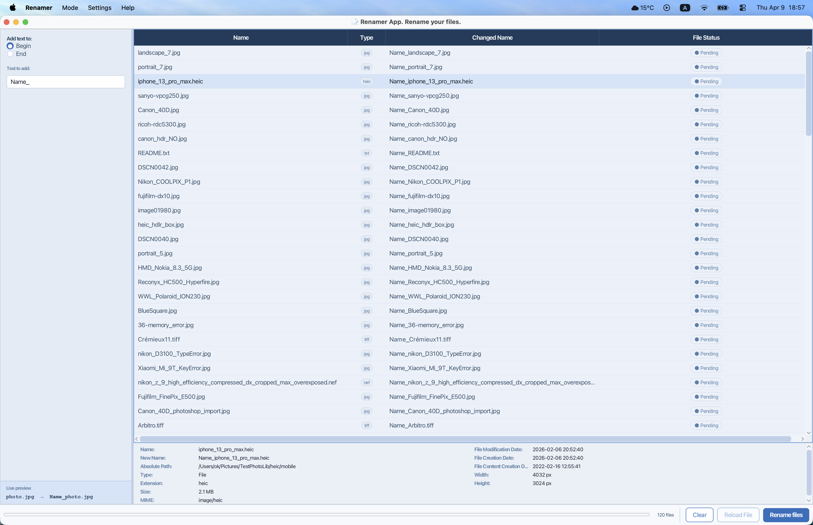
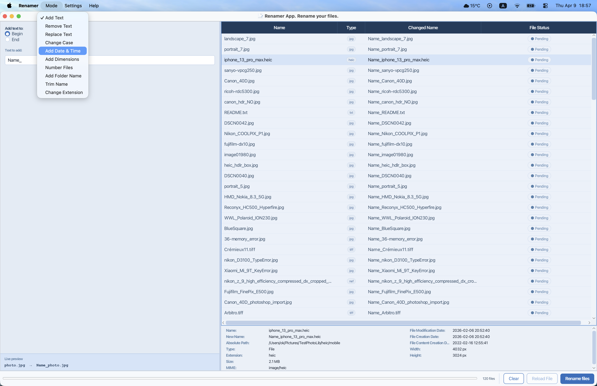
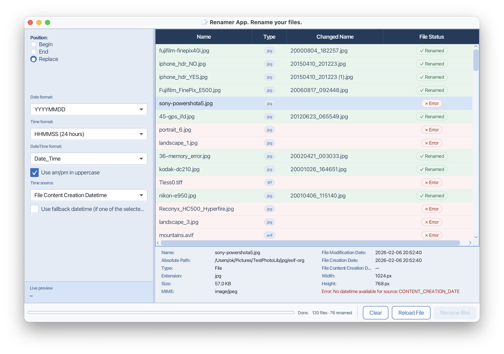

# Renamer App

**Batch rename files using metadata, patterns, and smart rules — no scripting required.**

[](https://github.com/sanyokkua/renamer_app/actions/workflows/build.yml)

---

## Purpose

Renamer App is a JavaFX desktop application for batch renaming files using metadata extracted directly from file content. It reads EXIF dates, image dimensions, audio tags, video streams, and other embedded properties to build new filenames automatically. The app provides 10 configurable transformation modes — add text, remove text, find and replace, change case, add date/time, add image dimensions, number files, add folder name, trim name, and change extension. A live preview shows every new filename before committing any rename, and native installers for macOS, Linux, and Windows require no Java installation. It is designed for photographers, audio engineers, and power users managing large collections of media files who need rule-based, preview-before-rename workflows.

### Features

- **10 renaming modes** — add text, remove text, find and replace, change case, add date/time, add image dimensions, number files, add folder name, trim name, change extension
- **Drag and drop** — drop files or entire folders onto the file list
- **Live preview** — see every new filename before committing a single rename
- **Metadata-aware** — reads EXIF dates, image dimensions, and file dates to build filenames automatically
- **19 UI languages** — switch at any time from Settings
- **Native installers** — one-click install on macOS, Linux, and Windows; no Java installation needed

### Screenshots





---

## Prerequisites

Install the following tools before building or running the app from source.

- **Java 25+** ([Temurin](https://adoptium.net) recommended)
- **Apache Maven 3.9+**

To run the app without building from source, download a native installer from [GitHub Releases](https://github.com/sanyokkua/renamer_app/releases) — no separate Java installation is required.

---

## Setup

### Download and Run (Recommended)

Download the latest release from [GitHub Releases](https://github.com/sanyokkua/renamer_app/releases) and follow the instructions for your platform.

#### macOS

1. Download the `.dmg` file.
2. Open the DMG and drag **Renamer.app** to your Applications folder.
3. Launch **Renamer** from Applications.

**macOS Gatekeeper — Unsigned App Warning**

The app is not code-signed. macOS may block it on first launch with a message like _"Renamer cannot be opened because it is from an unidentified developer."_ To allow it, use **one** of the following options:

- **Right-click → Open** — right-click the app icon and choose **Open**, then click **Open** in the prompt. This is the quickest option and only needs to be done once.
- **Remove the quarantine flag** in Terminal:
  ```bash
  xattr -rd com.apple.quarantine /Applications/Renamer.app
  ```
- **System Settings → Privacy & Security** — if the app was blocked, scroll to the bottom of the Privacy & Security pane and click **Open Anyway** next to the Renamer entry.

#### Windows

1. Download the `.zip` file.
2. Extract the zip.
3. Run `Renamer.exe` from the extracted `Renamer\` folder.

No installer is provided — the app runs directly from the extracted folder.

#### Linux

1. Download the `.deb` package or the `.tar.gz` portable archive.
2. Install the `.deb`:
   ```bash
   sudo dpkg -i renamer_<version>_amd64.deb   # or arm64
   ```
   Or extract the `.tar.gz` and run `./Renamer/bin/Renamer` directly.
3. Launch **Renamer** from your applications menu.

### Build from Source

Clone the repository and build with Maven.

```bash
git clone https://github.com/sanyokkua/renamer_app.git
cd renamer_app/app
mvn clean install -q
```

Run the app after building:

```bash
cd ui
mvn javafx:run
```

For native installer builds, code signing, and CI pipeline details, see the [Build & Package Guide](docs/developers/guides/build-and-package.md).

---

## Usage

### Running the App

After installation, launch Renamer from your applications menu or by running the executable directly.

### Project Structure

The codebase is organized as a multi-module Maven project under `app/`. Each module has a single responsibility:

| Module     | Responsibility                                                            |
|------------|---------------------------------------------------------------------------|
| `api`      | Shared interfaces, enums, and immutable models used across all modules    |
| `core`     | Business logic — all 10 transformers and the rename pipeline orchestrator |
| `backend`  | Session management and file I/O service layer                             |
| `metadata` | File metadata extractors (EXIF dates, image dimensions, MIME types)       |
| `ui`       | JavaFX frontend — controllers, FXML layouts, CSS theming                  |
| `utils`    | Standalone utility classes; not imported by other modules                 |

### Build and Test Commands

Run all commands from the `app/` directory.

```bash
mvn compile -q -ff                                         # Compile only (fast feedback)
mvn test -q -ff -Dai=true                                  # All tests, quiet output
mvn test -q -ff -Dai=true -Dtest=ClassName                # Single test class
mvn test -q -ff -Dai=true -Dtest=ClassName#methodName     # Single test method
mvn clean test jacoco:report -Dai=true                     # Coverage report
mvn verify -Pcode-quality -q                               # Checkstyle + PMD + SpotBugs
../scripts/ai-build.sh                                     # Sequential: compile → lint → test
mvn clean install -q                                       # Build all modules
cd ui && mvn javafx:run                                    # Run the app
```

### Documentation

**Users**

- [User Guide](docs/users/user-guide.md) — interface walkthrough, all 10 modes explained with examples
- [Mode Reference Card](docs/users/mode-reference-card.md) — one-page quick-reference cheat sheet

**Developers**

- [Developer Docs](docs/developers/) — architecture, guides, and reference material
  - [Project Overview](docs/developers/architecture/project-overview.md) — system overview, module map, dependency graph
  - [Pipeline Architecture](docs/developers/architecture/pipeline-architecture.md) — data-flow diagrams and transformation phases
  - [Transformation Modes](docs/developers/architecture/transformation-modes.md) — mode reference and V1 vs V2 differences
  - [Data Models](docs/developers/architecture/data-models.md) — immutable model builders, enums, session contracts
  - [Dependency Injection](docs/developers/architecture/dependency-injection.md) — Guice module hierarchy and wiring
  - [Metadata Extraction](docs/developers/architecture/metadata-extraction.md) — extractor strategies and format support
  - [UI Architecture](docs/developers/reference/ui-architecture.md) — JavaFX layout, controllers, CSS theming
  - [Settings System](docs/developers/reference/settings-system.md) — persistent configuration storage
  - [Testing Strategy](docs/developers/reference/testing-strategy.md) — unit, integration, and test data
  - [AI Agent Setup](docs/developers/reference/ai-agent-setup.md) — Claude Code agent pipeline for contributions
  - [Build & Package Guide](docs/developers/guides/build-and-package.md) — native installers, signing, CI/CD
  - [Icon Creation Guide](docs/developers/guides/icon-creation.md) — asset design and export
  - [Add Transformation Mode](docs/developers/guides/add-transformation-mode.md) — step-by-step new mode implementation
  - [Cross-Platform Notes](docs/developers/guides/cross-platform-notes.md) — platform-specific build considerations

### Tech Stack

The app is built with industry-standard Java libraries and frameworks:

| Library            | Version | Role                                            |
|--------------------|---------|-------------------------------------------------|
| Java               | 25      | Language and runtime                            |
| JavaFX             | 25.0.2  | Desktop UI framework                            |
| Google Guice       | 7.0.0   | Dependency injection                            |
| metadata-extractor | 2.19.0  | EXIF and metadata reading from images and video |
| Apache Tika        | 3.3.0   | MIME type detection                             |
| Lombok             | 1.18.44 | Boilerplate reduction                           |
| JUnit 5            | 6.0.3   | Unit and integration testing                    |

---

## License

This project is licensed under the [GNU General Public License v3.0](LICENSE).
