# Renamer App - Technical Documentation & Architecture

## Table of Contents
1. [System Overview](#1-system-overview)
2. [Technology Stack](#2-technology-stack)
3. [Project Structure](#3-project-structure)
4. [Architecture Overview](#4-architecture-overview)
5. [Core Domain Models](#5-core-domain-models)
6. [Design Patterns](#6-design-patterns)
7. [Component Details](#7-component-details)
8. [Application Flows](#8-application-flows)
9. [Threading Model](#9-threading-model)
10. [Dependency Injection](#10-dependency-injection)
11. [Extending the Application](#11-extending-the-application)

---

## 1. System Overview

**Renamer App** is a desktop application designed for batch renaming of files. It provides various modes for renaming, including:
- Adding/removing custom text
- Changing text case
- Using metadata (EXIF, creation dates, image dimensions)
- Sequencing files
- Truncating filenames
- Changing file extensions

The application is built using **Java 25** with **JavaFX** for the UI, following clean architecture principles with strict separation between the Core business logic and UI presentation layer.

---

## 2. Technology Stack

| Component | Technology | Version |
|-----------|-----------|---------|
| **Language** | Java | 25 (Preview features enabled) |
| **UI Framework** | JavaFX | 25.0.1 |
| **Dependency Injection** | Google Guice | 7.0.0 |
| **Build Tool** | Maven | Multi-module project |
| **Boilerplate Reduction** | Lombok | 1.18.42 |
| **Logging** | SLF4J + Logback | 2.0.17 / 1.5.21 |
| **File Analysis** | Apache Tika | 3.2.3 |
| **Metadata Extraction** | Metadata Extractor | 2.19.0 |
| **Testing** | JUnit 5 + Mockito | 6.0.1 / 5.20.0 |

---

## 3. Project Structure

### 3.1. Module Organization

```
renamer_app/
├── app/
│   ├── pom.xml                    # Parent POM (dependency management)
│   ├── lombok.config              # Lombok configuration
│   ├── core/                      # Core business logic module
│   │   ├── pom.xml
│   │   └── src/main/java/
│   │       └── ua/renamer/app/core/
│   │           ├── enums/         # Application enums
│   │           ├── model/         # Domain models
│   │           └── service/       # Business logic services
│   │               ├── command/   # Command pattern implementations
│   │               ├── file/      # File operations
│   │               ├── helper/    # Helper utilities
│   │               ├── mapper/    # Data mappers
│   │               └── validator/ # Validation logic
│   └── ui/                        # UI module
│       ├── pom.xml
│       └── src/main/
│           ├── java/
│           │   └── ua/renamer/app/
│           │       ├── Launcher.java          # Entry point
│           │       ├── RenamerApplication.java # JavaFX Application
│           │       └── ui/
│           │           ├── config/            # DI configuration
│           │           ├── controller/        # FXML controllers
│           │           ├── converter/         # String converters
│           │           ├── enums/             # UI enums
│           │           ├── models/            # UI models
│           │           ├── service/           # UI services
│           │           └── widget/            # Custom widgets
│           └── resources/
│               ├── fxml/                     # FXML view files
│               ├── images/                   # Application icons
│               └── langs/                    # i18n resource bundles
├── package.json                             # jDeploy config
├── icon.png, icon.ico, icon.icns           # Platform icons
└── docs/                                    # Documentation
```

### 3.2. Module Dependencies

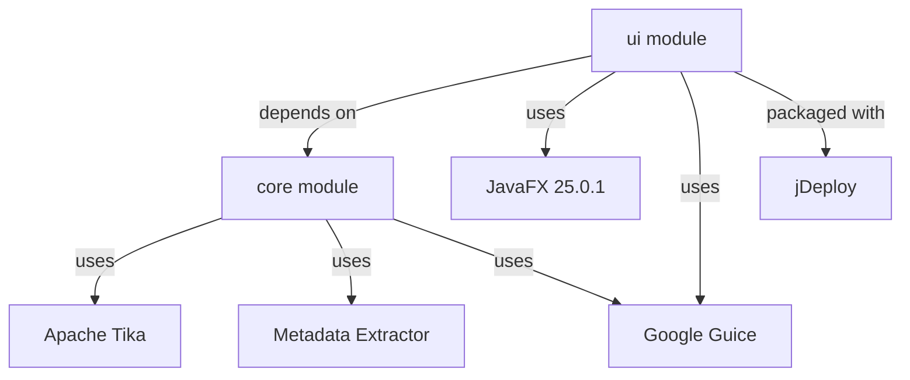

**Core Module**: Pure business logic, no UI dependencies.
**UI Module**: Depends on Core, contains all UI-related code and JavaFX controllers.

---

## 4. Architecture Overview

### 4.1. High-Level Architecture Diagram

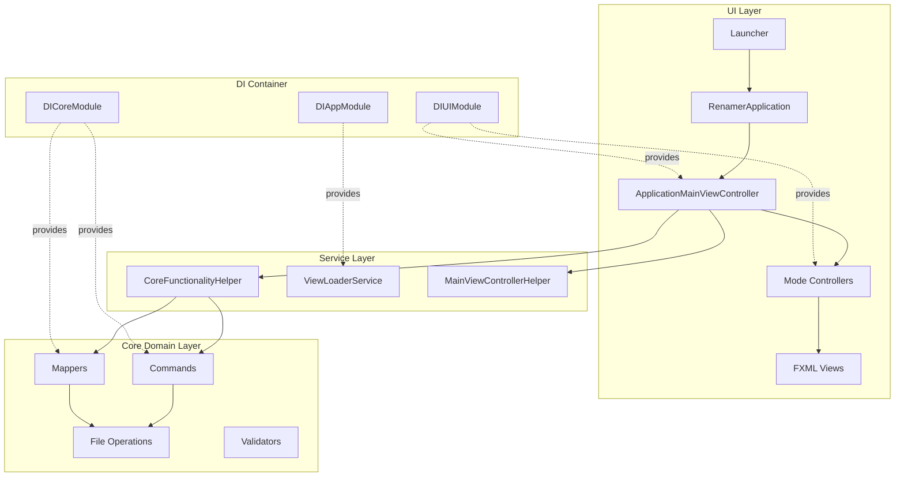

### 4.2. Layer Responsibilities

| Layer | Responsibility | Key Components |
|-------|----------------|----------------|
| **UI Layer** | User interaction, view rendering | Controllers, FXML, Widgets |
| **Service Layer** | Bridge between UI and Core | CoreFunctionalityHelper, ViewLoader |
| **Core Domain** | Business logic, file processing | Commands, Mappers, FilesOperations |
| **DI Container** | Dependency management | Guice Modules |

---

## 5. Core Domain Models

### 5.1. Data Model Hierarchy

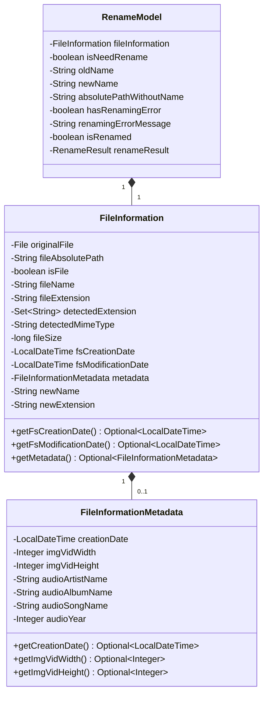

### 5.2. Model Descriptions

#### **FileInformation**
Represents comprehensive information about a file or directory:
- **File system attributes**: path, name, extension, size
- **Metadata**: Optional embedded metadata (EXIF, ID3, etc.)
- **Detection results**: MIME type, detected extensions
- **Mutable fields**: `newName`, `newExtension` (set during preparation phase)

#### **FileInformationMetadata**
Contains extracted metadata from various file types:
- **Image/Video metadata**: dimensions (width, height), creation date
- **Audio metadata**: artist, album, song name, year
- All fields are Optional to handle missing metadata gracefully

#### **RenameModel**
UI-friendly wrapper around `FileInformation`:
- **State tracking**: `isNeedRename`, `isRenamed`, `hasRenamingError`
- **Display data**: `oldName`, `newName` (used by TableView)
- **Status information**: `renameResult`, `renamingErrorMessage`

---

## 6. Design Patterns

### 6.1. Command Pattern

The **Command Pattern** is central to the renaming logic. Each operation (mapping, preparation, renaming) is encapsulated in a command.

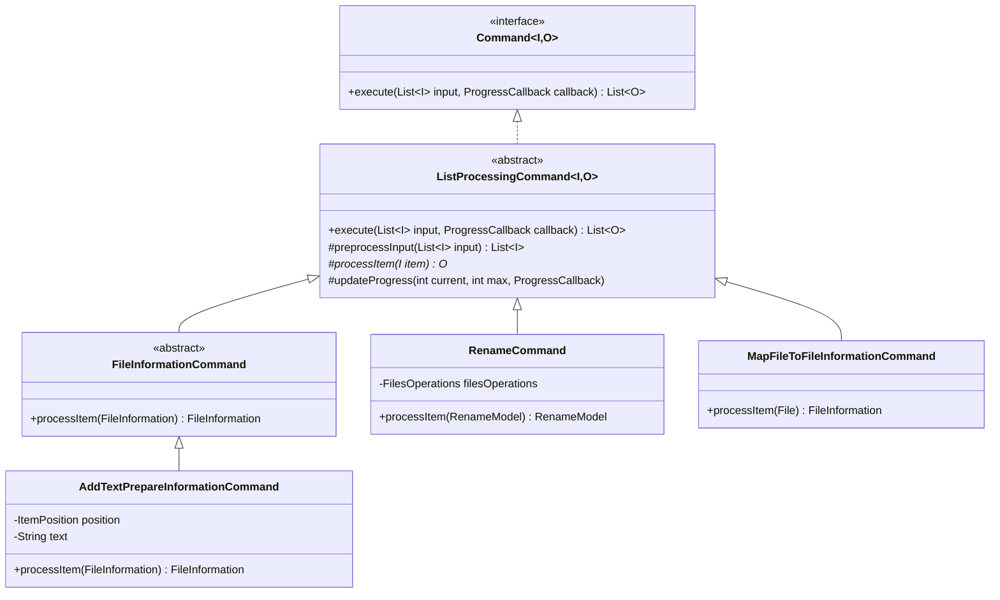

**Key Features:**
- **Parallel Processing**: `ListProcessingCommand` uses `parallelStream()` for performance
- **Progress Tracking**: Updates UI progress bar via `ProgressCallback`
- **Preprocessing Hook**: `preprocessInput()` allows batch operations (e.g., `FixEqualNamesCommand`)

### 6.2. Chain of Responsibility Pattern

Used for **metadata extraction** from different file formats:


**How it works:**
1. Each mapper checks if the file matches its supported extensions
2. If yes, it extracts metadata and returns `FileInformationMetadata`
3. If no or extraction fails, it delegates to the next mapper in the chain
4. `LastReserveMapper` is a fallback that tries all mappers sequentially

### 6.3. Model-View-Controller (MVC)

JavaFX's FXML-based MVC pattern:

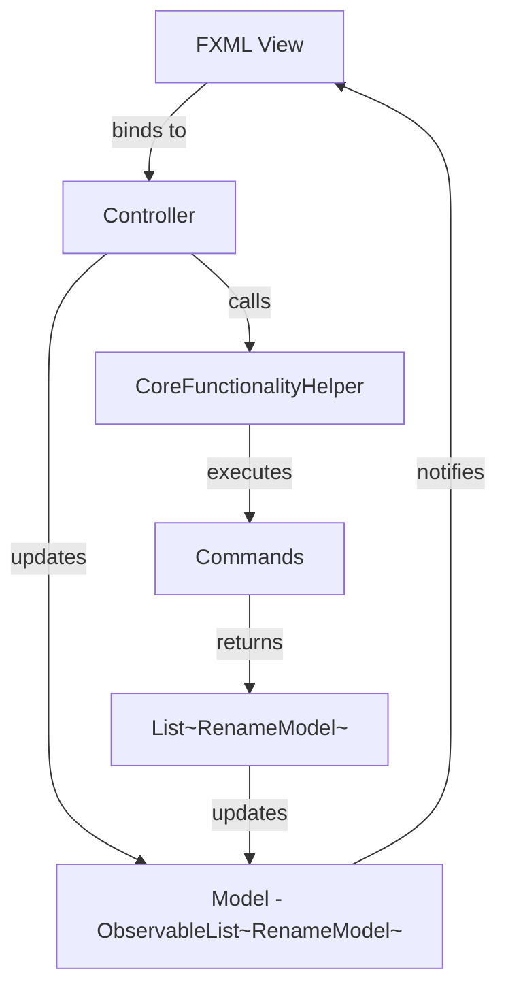

**Components:**
- **View**: FXML files (e.g., `app_main_view.fxml`, `mode_add_custom_text.fxml`)
- **Controller**: Java classes (e.g., `ApplicationMainViewController`, `ModeAddCustomTextController`)
- **Model**: `ObservableList<RenameModel>` shared across the application

### 6.4. Dependency Injection (Guice)

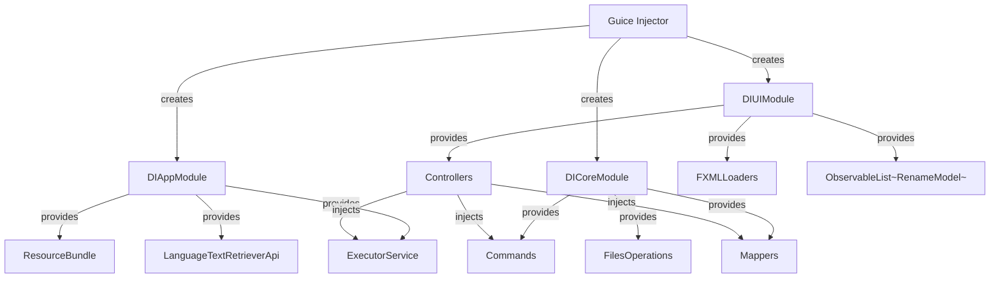

---

## 7. Component Details

### 7.1. Core Layer Components

#### **FilesOperations**
Central service for file I/O operations:
- **File attribute extraction**: `getFileAbsolutePath()`, `getFileNameWithoutExtension()`, `getFileExtension()`
- **Metadata reading**: `getFileCreationTime()`, `getFileModificationTime()`, `getFileSize()`
- **MIME detection**: `getMimeType()` using Apache Tika
- **Renaming**: `renameFile(RenameModel)` - performs the actual `Files.move()` operation
- **Path utilities**: `getParentFolders()` for extracting parent directory names

#### **Commands**

| Command | Input | Output | Purpose |
|---------|-------|--------|---------|
| `MapFileToFileInformationCommand` | `List<File>` | `List<FileInformation>` | Extracts file attributes and metadata |
| `MapFileInformationToRenameModelCommand` | `List<FileInformation>` | `List<RenameModel>` | Converts domain models to UI models |
| `RenameCommand` | `List<RenameModel>` | `List<RenameModel>` | Performs file renaming |
| `ResetRenameModelsCommand` | `List<RenameModel>` | `List<RenameModel>` | Resets `newName` to original `fileName` |
| `FixEqualNamesCommand` | `List<FileInformation>` | `List<FileInformation>` | Appends suffix to duplicate names |
| **Preparation Commands** | `List<FileInformation>` | `List<FileInformation>` | Apply renaming logic |
| - `AddTextPrepareInformationCommand` | | | Adds text at begin/end |
| - `ChangeCasePreparePrepareInformationCommand` | | | Changes case (UPPER, lower, Title) |
| - `DateTimeRenamePrepareInformationCommand` | | | Uses datetime from metadata/filesystem |
| - `ExtensionChangePrepareInformationCommand` | | | Changes file extension |
| - `ImageDimensionsPrepareInformationCommand` | | | Uses image dimensions |
| - `ParentFoldersPrepareInformationCommand` | | | Uses parent folder names |
| - `RemoveTextPrepareInformationCommand` | | | Removes text from begin/end |
| - `ReplaceTextPrepareInformationCommand` | | | Replaces text occurrences |
| - `SequencePrepareInformationCommand` | | | Adds sequential numbers |
| - `TruncateNamePrepareInformationCommand` | | | Truncates filename |

#### **Mappers**

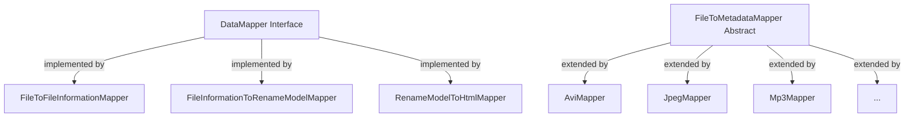

**Key Mappers:**
- **FileToFileInformationMapper**: Uses `FilesOperations` and `FileToMetadataMapper` chain
- **FileInformationToRenameModelMapper**: Creates UI models with `isNeedRename` logic
- **RenameModelToHtmlMapper**: Generates HTML for the file info display panel

### 7.2. UI Layer Components

#### **ApplicationMainViewController**
The main controller managing the entire UI:

**Key responsibilities:**
1. **File table management**: Drag & drop, selection, display
2. **Mode selection**: Dynamically loads mode-specific views
3. **Button handlers**: Preview, Rename, Clear, Reload
4. **Progress tracking**: Binds progress bar to background tasks
5. **Table styling**: Applies CSS classes based on `RenameModel` state

**Important fields:**
- `ObservableList<RenameModel> loadedAppFilesList`: Shared model
- `filesTableView`: Displays all loaded files
- `appModeContainer`: StackPane that hosts mode-specific views
- `appModeChoiceBox`: ChoiceBox for selecting renaming mode

#### **Mode Controllers**
Each renaming mode has its own controller extending `ModeBaseController`:

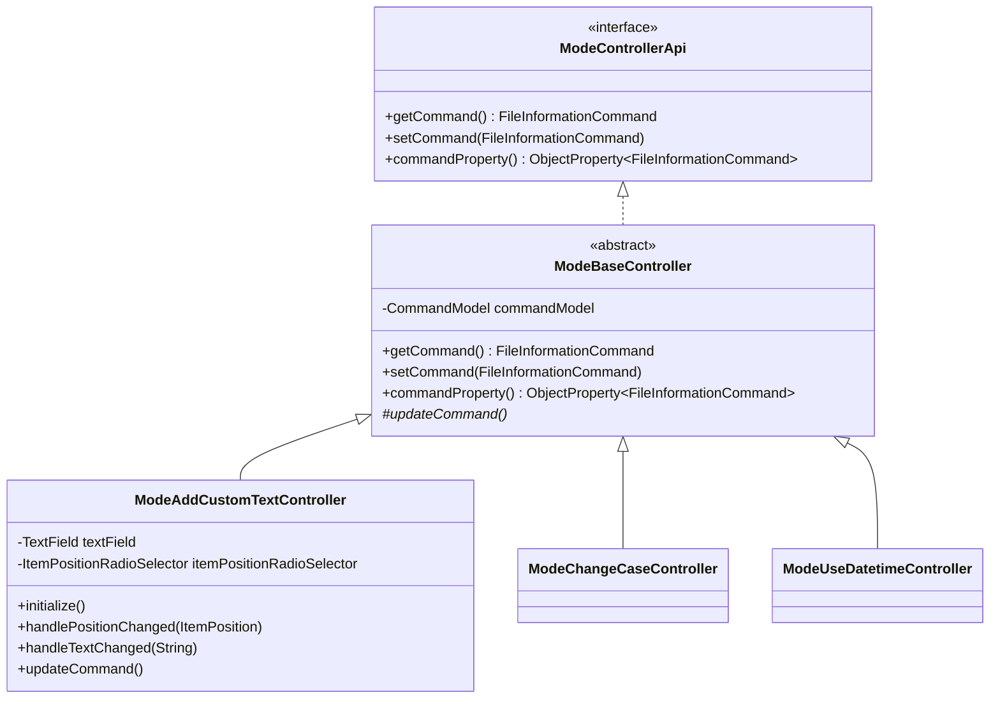

**Controller responsibilities:**
- Initialize UI widgets (TextFields, RadioButtons, etc.)
- Listen to UI value changes
- Build corresponding `FileInformationCommand` when values change
- Notify listeners via `commandProperty()` (used by `ApplicationMainViewController`)

#### **CoreFunctionalityHelper**
Bridge between UI and Core logic:

```java
// Maps files to RenameModel (used when files are dropped)
void mapFileToRenameModel(List<File>, ProgressBar, ListCallback<RenameModel>)

// Resets models and applies new command (used when mode changes)
void resetModels(List<RenameModel>, FileInformationCommand, ProgressBar, ListCallback<RenameModel>)

// Prepares files for preview (used when settings change)
void prepareFiles(List<RenameModel>, FileInformationCommand, ProgressBar, ListCallback<RenameModel>)

// Executes renaming (used when Rename button clicked)
void renameFiles(List<RenameModel>, ProgressBar, ListCallback<RenameModel>)

// Reloads files after renaming (used when Reload button clicked)
void reloadFiles(List<RenameModel>, ProgressBar, ListCallback<RenameModel>)
```

All methods:
1. Create a `javafx.concurrent.Task`
2. Execute commands in the background thread
3. Update progress bar
4. Invoke callback on JavaFX Application Thread when complete

---

## 8. Application Flows

### 8.1. Application Startup Flow

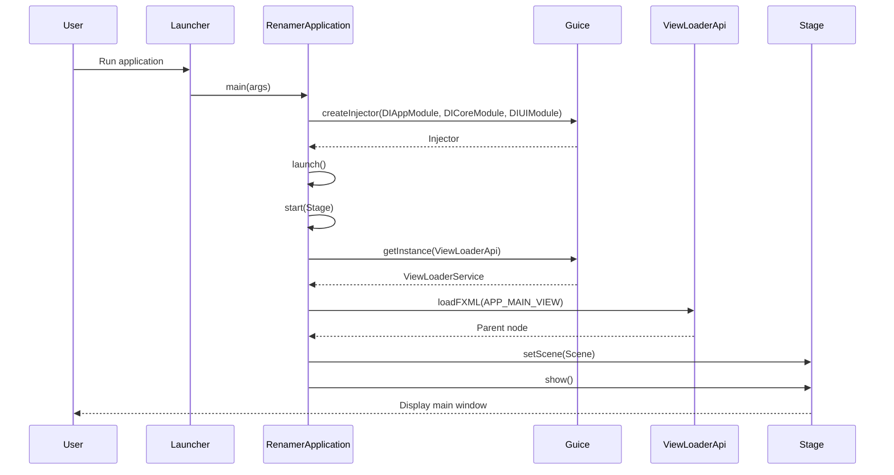

### 8.2. File Loading Flow (Drag & Drop)

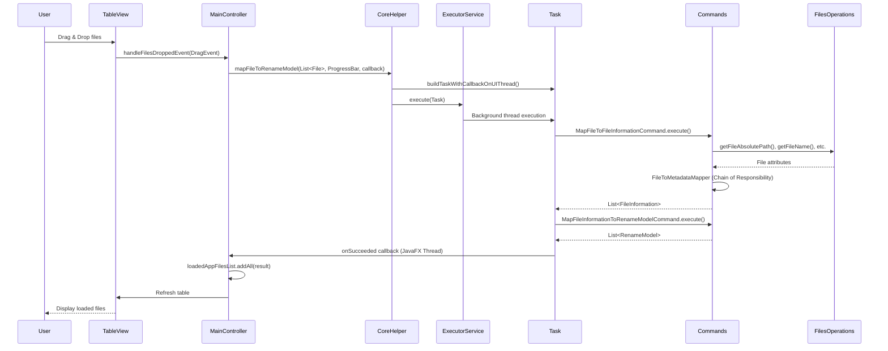

### 8.3. Preview Flow (Settings Changed)

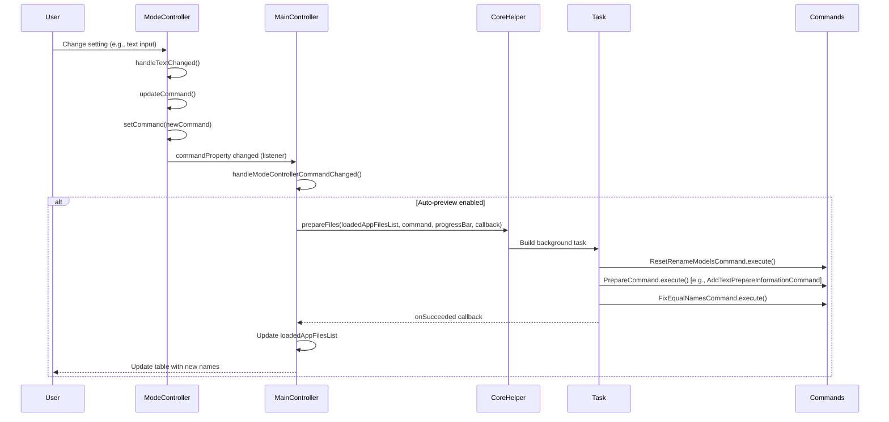

### 8.4. Rename Flow

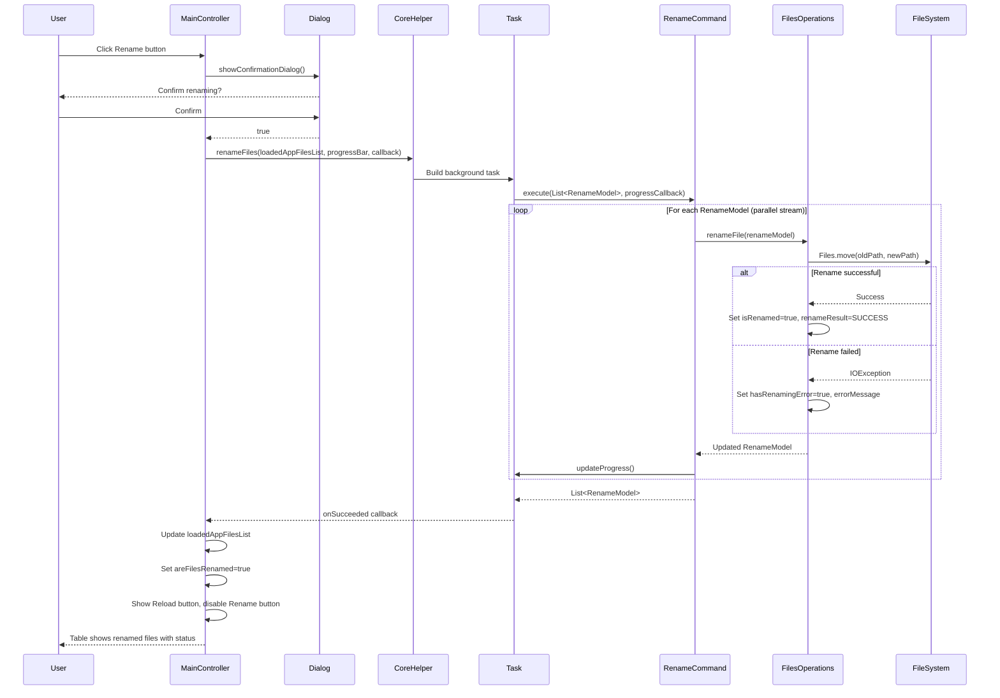

### 8.5. Mode Change Flow

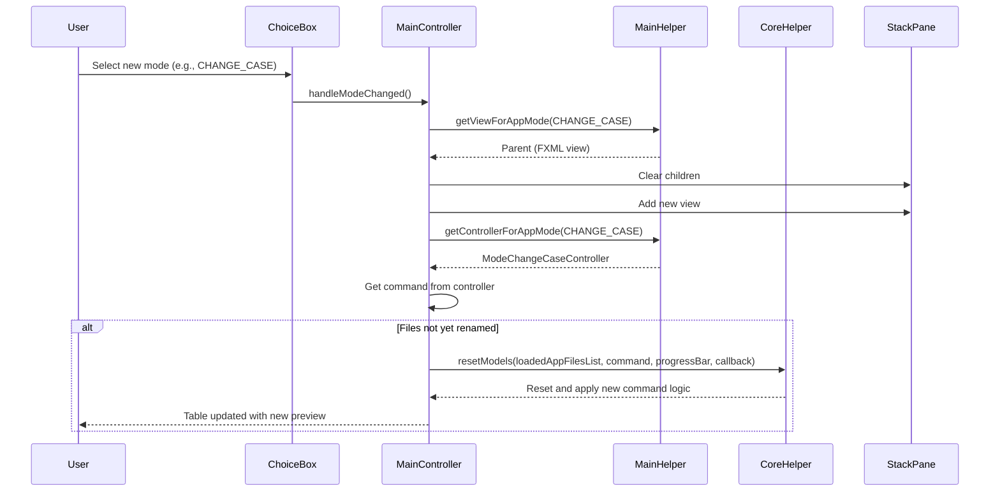

---

## 9. Threading Model

### 9.1. Thread Architecture

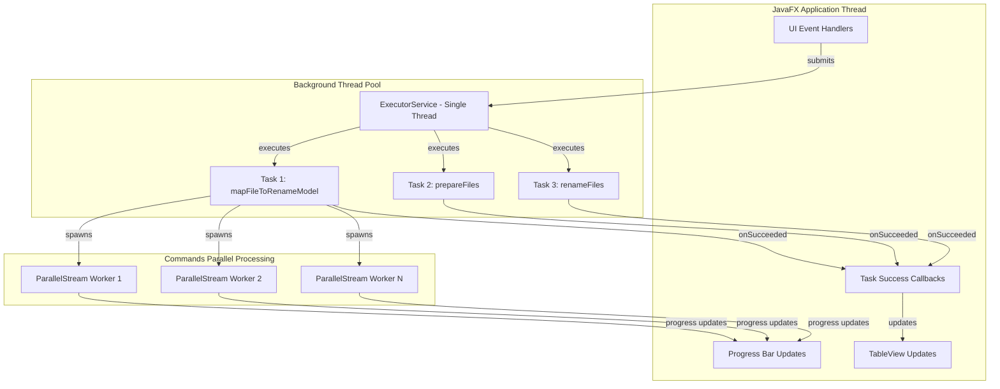

### 9.2. Threading Strategy

**ExecutorService Configuration:**
```java
// Defined in DIAppModule
ExecutorService provideExecutorService() {
    return Executors.newSingleThreadExecutor(runnable -> {
        Thread thread = new Thread(runnable);
        thread.setDaemon(true);  // Daemon thread - won't prevent JVM shutdown
        return thread;
    });
}
```

**Task Pattern:**
```java
Task<List<T>> task = new Task<>() {
    @Override
    protected List<T> call() {
        updateProgress(0, 0);  // Indeterminate
        List<T> result = executeCommand(progressCallback);
        return result;
    }
};

// Bind progress bar to task progress
progressBar.progressProperty().bind(task.progressProperty());

// Execute on background thread
executorService.execute(task);

// Callback runs on JavaFX Application Thread
task.setOnSucceeded(event -> {
    callback.accept(task.getValue());
});
```

**Parallel Processing in Commands:**
- `ListProcessingCommand.execute()` uses `parallelStream()` for parallel processing of file list
- Progress tracking is synchronized to avoid race conditions
- Each file is processed independently, allowing multi-core utilization

---

## 10. Dependency Injection

### 10.1. Guice Module Structure

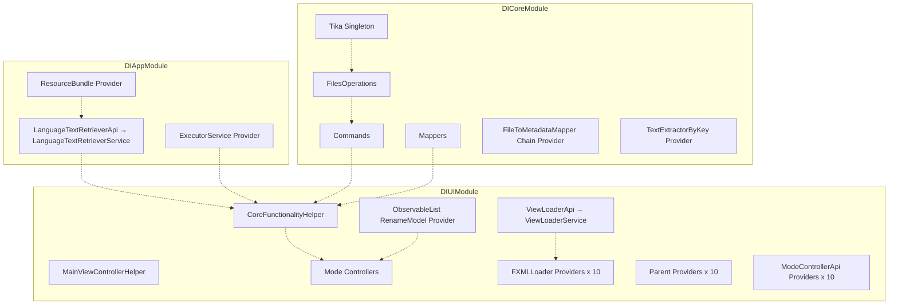

### 10.2. Key Bindings

**Singleton Services:**
```java
// DIAppModule
bind(LanguageTextRetrieverApi.class).to(LanguageTextRetrieverService.class).in(Singleton.class);

// DICoreModule
bind(Tika.class).in(Singleton.class);
bind(FilesOperations.class).in(Singleton.class);
bind(NameValidator.class).in(Singleton.class);

// DIUIModule
bind(ViewLoaderApi.class).to(ViewLoaderService.class).in(Singleton.class);
bind(ApplicationMainViewController.class).in(Singleton.class);
bind(CoreFunctionalityHelper.class).in(Singleton.class);
```

**Qualified Bindings:**
```java
// Custom qualifiers for each mode's FXML loader, Parent, and Controller
@AddCustomTextFxmlLoader
@ChangeCaseFxmlLoader
@UseDatetimeFxmlLoader
// ... and so on
```

**Provider Methods:**
```java
@Provides
@Singleton
public FileToMetadataMapper provideFileToMetadataMapper(...) {
    // Manually construct chain of responsibility
    nullMapper.setNext(aviMapper);
    aviMapper.setNext(bmpMapper);
    // ... full chain setup
    return nullMapper; // Head of the chain
}

@Provides
@Singleton
public ObservableList<RenameModel> provideAppGlobalRenameModelList() {
    return FXCollections.observableArrayList();
}
```

### 10.3. Injection Points

**Controller Injection:**
```java
@RequiredArgsConstructor(onConstructor_ = {@Inject})
public class ApplicationMainViewController implements Initializable {
    private final CoreFunctionalityHelper coreHelper;
    private final MainViewControllerHelper mainControllerHelper;
    private final AppModesConverter appModesConverter;
    private final ObservableList<RenameModel> loadedAppFilesList;
    // ...
}
```

**Service Injection:**
```java
@RequiredArgsConstructor(onConstructor_ = {@Inject})
public class CoreFunctionalityHelper {
    private final ExecutorService executorService;
    private final LanguageTextRetrieverApi languageTextRetriever;
    private final RenameModelToHtmlMapper renameModelToHtmlMapper;
    private final MapFileToFileInformationCommand mapFileToFileInformationCommand;
    private final MapFileInformationToRenameModelCommand mapFileInformationToRenameModelCommand;
    private final RenameCommand renameCommand;
    private final FixEqualNamesCommand fixEqualNamesCommand;
    private final ResetRenameModelsCommand resetRenameModelsCommand;
    // ...
}
```

---

## 11. Extending the Application

### 11.1. Adding a New Renaming Mode

**Step 1: Core Layer** - Create the command:
```java
// app/core/src/main/java/.../service/command/impl/preparation/
public class MyNewPrepareInformationCommand extends FileInformationCommand {

    private final String myParameter;

    @Override
    public FileInformation processItem(FileInformation item) {
        // Your renaming logic
        String newName = applyMyLogic(item.getFileName(), myParameter);
        item.setNewName(newName);
        return item;
    }
}
```

**Step 2: Core Layer** - Add enum:
```java
// app/core/src/main/java/.../enums/AppModes.java
public enum AppModes {
    // ... existing modes
    MY_NEW_MODE,
}
```

**Step 3: UI Layer** - Create FXML view:
```xml
<!-- app/ui/src/main/resources/fxml/mode_my_new_mode.fxml -->
<?xml version="1.0" encoding="UTF-8"?>
<?import javafx.scene.layout.VBox?>
<?import javafx.scene.control.TextField?>
<VBox xmlns:fx="http://javafx.com/fxml">
    <TextField fx:id="myParameterField" promptText="Enter parameter"/>
</VBox>
```

**Step 4: UI Layer** - Create controller:
```java
// app/ui/src/main/java/.../controller/mode/impl/
@RequiredArgsConstructor(onConstructor_ = {@Inject})
public class ModeMyNewModeController extends ModeBaseController {

    @FXML
    private TextField myParameterField;

    @Override
    public void initialize(URL location, ResourceBundle resources) {
        myParameterField.textProperty().addListener((obs, old, newVal) -> updateCommand());
    }

    @Override
    public void updateCommand() {
        String param = myParameterField.getText();
        var cmd = MyNewPrepareInformationCommand.builder()
            .myParameter(param)
            .build();
        setCommand(cmd);
    }
}
```

**Step 5: UI Layer** - Register in DI:
```java
// DIUIModule.java
private void bindViewControllers() {
    // ... existing bindings
    bind(ModeMyNewModeController.class).in(Singleton.class);
}

@Provides
@Singleton
@MyNewModeFxmlLoader
public FXMLLoader provideMyNewModeFxmlLoader(ViewLoaderApi viewLoaderApi) {
    return createFXMLLoader(viewLoaderApi, ViewNames.MODE_MY_NEW_MODE);
}

@Provides
@Singleton
@MyNewModeParent
public Parent provideMyNewModeParent(@MyNewModeFxmlLoader FXMLLoader loader) throws IOException {
    return loader.load();
}

@Provides
@Singleton
@MyNewModeController
public ModeControllerApi provideMyNewModeController(@MyNewModeFxmlLoader FXMLLoader loader,
                                                     @MyNewModeParent Parent parent) {
    return loader.getController();
}
```

**Step 6: UI Layer** - Add to ViewNames enum:
```java
public enum ViewNames {
    // ... existing
    MODE_MY_NEW_MODE("fxml/mode_my_new_mode.fxml"),
}
```

**Step 7**: Update `MainViewControllerHelper` to map `AppModes.MY_NEW_MODE` to the new controller and view.

### 11.2. Adding a New Metadata Mapper

**Create mapper:**
```java
public class MyFileTypeMapper extends FileToMetadataMapper {

    @Override
    public List<String> getSupportedExtensions() {
        return List.of(".myext");
    }

    @Override
    public FileInformationMetadata process(File input) {
        // Extract metadata using Metadata Extractor or custom logic
        return FileInformationMetadata.builder()
            .creationDate(extractedDate)
            .build();
    }
}
```

**Register in DICoreModule:**
```java
bind(MyFileTypeMapper.class).in(Singleton.class);

// Update provideFileToMetadataMapper to include in chain
webPmapper.setNext(myFileTypeMapper);
myFileTypeMapper.setNext(reserveMapper);
```

---

## Appendix: Renaming Modes Reference

| Mode | Enum | Command | Purpose |
|------|------|---------|---------|
| **Add Custom Text** | `ADD_CUSTOM_TEXT` | `AddTextPrepareInformationCommand` | Prepend or append text |
| **Change Case** | `CHANGE_CASE` | `ChangeCasePreparePrepareInformationCommand` | UPPER, lower, Title Case |
| **Use DateTime** | `USE_DATETIME` | `DateTimeRenamePrepareInformationCommand` | Use file/metadata dates |
| **Use Image Dimensions** | `USE_IMAGE_DIMENSIONS` | `ImageDimensionsPrepareInformationCommand` | Add WIDTHxHEIGHT |
| **Use Parent Folder Name** | `USE_PARENT_FOLDER_NAME` | `ParentFoldersPrepareInformationCommand` | Use folder names |
| **Remove Custom Text** | `REMOVE_CUSTOM_TEXT` | `RemoveTextPrepareInformationCommand` | Remove N chars from begin/end |
| **Replace Custom Text** | `REPLACE_CUSTOM_TEXT` | `ReplaceTextPrepareInformationCommand` | Find & replace text |
| **Add Sequence** | `ADD_SEQUENCE` | `SequencePrepareInformationCommand` | Add sequential numbers |
| **Truncate File Name** | `TRUNCATE_FILE_NAME` | `TruncateNamePrepareInformationCommand` | Limit filename length |
| **Change Extension** | `CHANGE_EXTENSION` | `ExtensionChangePrepareInformationCommand` | Change file extension |

---

## Summary

This document provides a comprehensive architectural overview of the Renamer App, covering:
- **Modular structure** with clean separation between Core and UI
- **Design patterns** (Command, Chain of Responsibility, MVC, DI)
- **Threading model** for responsive UI with background processing
- **Complete data flow** from file loading to renaming
- **Extension points** for adding new features

The application demonstrates solid software engineering practices, making it maintainable and extensible for future development.
