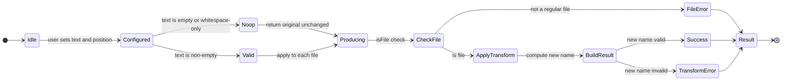
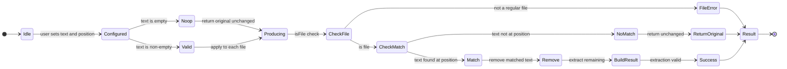

# Application Mode State Machines

**Document Type:** Technical Reference — Investigation Output
**Status:** Finalized
**Date:** 2026-03-31
**Audience:** Engineering team implementing Approach 3 (Pragmatic Facade) migration
**Scope:** State machines, parameter contracts, and validation rules for all 10 Renamer App transformation modes

---

## Table of Contents

1. [Overview and Shared Infrastructure](#1-overview-and-shared-infrastructure)
2. [State Machine Notation](#2-state-machine-notation)
3. [Mode 1: Add Custom Text](#3-mode-1-add-custom-text)
4. [Mode 2: Remove Custom Text](#4-mode-2-remove-custom-text)
5. [Mode 3: Replace Custom Text](#5-mode-3-replace-custom-text)
6. [Mode 4: Change Case](#6-mode-4-change-case)
7. [Mode 5: Add Sequence](#7-mode-5-add-sequence)
8. [Mode 6: Truncate File Name](#8-mode-6-truncate-file-name)
9. [Mode 7: Change Extension](#9-mode-7-change-extension)
10. [Mode 8: Use Datetime](#10-mode-8-use-datetime)
11. [Mode 9: Use Image Dimensions](#11-mode-9-use-image-dimensions)
12. [Mode 10: Use Parent Folder Name](#12-mode-10-use-parent-folder-name)
13. [Conflict Resolution State Machine](#13-conflict-resolution-state-machine)
14. [Cross-Mode Concerns](#14-cross-mode-concerns)
15. [Design Implications for Approach 3](#15-design-implications-for-approach-3)

---

## 1. Overview and Shared Infrastructure

### 1.1 Transformation Modes and Enums

| Mode Number | Mode Name | Enum Value | Parallelizable | Sequential Requirement |
|---|---|---|---|---|
| 1 | Add Custom Text | `ADD_TEXT` | ✅ YES | None |
| 2 | Remove Custom Text | `REMOVE_TEXT` | ✅ YES | None |
| 3 | Replace Custom Text | `REPLACE_TEXT` | ✅ YES | None |
| 4 | Change Case | `CHANGE_CASE` | ✅ YES | None |
| 5 | Add Sequence | `ADD_SEQUENCE` | ❌ **NO** | Must sort files; apply sequence in order |
| 6 | Truncate File Name | `TRUNCATE_FILE_NAME` | ✅ YES | None |
| 7 | Change Extension | `CHANGE_EXTENSION` | ✅ YES | None |
| 8 | Use Datetime | `USE_DATETIME` | ✅ YES | None (but metadata extraction is sequential per metadata API) |
| 9 | Use Image Dimensions | `USE_IMAGE_DIMENSIONS` | ✅ YES | None (metadata extraction is sequential) |
| 10 | Use Parent Folder Name | `USE_PARENT_FOLDER_NAME` | ✅ YES | None |

**Enumeration:** `TransformationMode` in `ua.renamer.app.core.enums`

---

### 1.2 Position Enums (Shared Across Modes)

**`ItemPosition`** (used by Add Text, Remove Text, Use Parent Folder Name):
- `BEGIN` — position at start of filename
- `END` — position at end of filename

**`ItemPositionExtended`** (used by Replace Text, Use Image Dimensions, Use Datetime):
- `BEGIN` — replace/insert at start
- `END` — replace/insert at end
- `EVERYWHERE` — replace all occurrences (Replace Text mode only)

**`ItemPositionWithReplacement`** (used by Replace Text, Use Datetime, Use Image Dimensions):
- `BEGIN` — replace/insert at start of filename
- `END` — replace/insert at end of filename
- `REPLACE` — replace entire filename with new value

---

### 1.3 SortSource Enum (Sequence Mode Only)

Used by Mode 5 to determine file ordering before sequence number assignment:

| Value | Source | Null Handling | Notes |
|---|---|---|---|
| `FILE_NAME` | Alphabetical filename | Sorted first | Case-sensitive |
| `FILE_PATH` | Full path string | Sorted first | Case-sensitive |
| `FILE_SIZE` | Bytes | Sorted first (0 as default) | Numeric sort |
| `FILE_CREATION_DATETIME` | Filesystem creation timestamp | Sorted first | Filesystem-dependent; nullable |
| `FILE_MODIFICATION_DATETIME` | Filesystem last modified timestamp | Sorted first | Always available (fallback: creation) |
| `FILE_CONTENT_CREATION_DATETIME` | EXIF DateTimeOriginal or video creation | Sorted first | Images/videos only; nullable |
| `IMAGE_WIDTH` | Width in pixels | Sorted first (0 as default) | Images only |
| `IMAGE_HEIGHT` | Height in pixels | Sorted first (0 as default) | Images only |

---

### 1.4 RenameStatus Enum (V2 Error Tracking)

The V2 pipeline never throws exceptions. Errors are captured in `PreparedFileModel.hasError` and `PreparedFileModel.errorMessage`, with phase information in `RenameResult.status`:

| Status | Phase | Meaning | Recoverable |
|---|---|---|---|
| `SUCCESS` | Execution | File renamed successfully | — |
| `SKIPPED` | Any | File was skipped (user action or validation) | — |
| `ERROR_EXTRACTION` | Extraction | Metadata extraction failed (e.g., image file is corrupted) | No (skip file) |
| `ERROR_TRANSFORMATION` | Transformation | Transformation produced invalid name (e.g., empty after truncation) | No (skip file) |
| `ERROR_EXECUTION` | Execution | Physical rename failed (target exists or filesystem permission denied) | Possible (retry with conflict resolution) |

---

### 1.5 Conflict Resolution Overview

**Definition:** Two or more files in the batch generate the same new filename (after transformation but before physical rename).

**When Conflicts Occur:**
- Mode 5 (Sequence) with `stepValue=0` — all files receive the same sequence number
- Mode 1 (Add Text) applied to files with different extensions and same base name
- Any mode with deterministic output and overlapping input patterns

**Resolution Strategy:**

1. **Phase 2.5 (DuplicateNameResolverImpl — Sequential):** After all per-file transformations, groups files by final name. For each group with 2+ files:
   - Keep first file unchanged
   - Append ` (01)`, ` (02)`, etc. to remaining files' names
   - Smart padding: if original filename contains leading zeros, pad conflict counter to match those zeros

2. **Phase 4 (RenameExecutionServiceImpl — Parallel):** Before physical rename, checks `Files.exists(newPath)` for each prepared file. If target already exists on disk:
   - Return `ERROR_EXECUTION` status
   - Do NOT rename
   - This catches conflicts with pre-existing files outside the batch

**Key Property:** Conflict resolution is cascading-safe. `DuplicateNameResolverImpl` uses `usedNames` tracking to prevent cascading conflicts when one file's conflict suffix creates a collision with another file's base name.

**Important Implication:** Conflict resolution runs **after** transformation but **before** disk rename. This means:
- Preview output must include conflict-resolved names (with ` (01)` suffixes)
- Preview and execution use identical resolution logic
- Cannot predict final filenames during transformation phase

---

### 1.6 Name Validation (NameValidator)

All new filenames pass through `NameValidator` (used in V2 transformation phase):

| Rule | Restriction | Applies To | Notes |
|---|---|---|---|
| Non-null | Cannot be `null` | All filenames | Checked before extension append |
| Non-empty | Cannot be empty string | All filenames | Empty string after transformation = `ERROR_TRANSFORMATION` |
| No forward slash | `/` forbidden | All filenames | Path traversal prevention |
| No colon | `:` forbidden | All filenames | Windows drive letter conflict prevention |
| Windows reserved chars | `\ * ? < > \|` forbidden | Windows only | OS-specific; other platforms allow |
| Windows reserved names | `CON`, `PRN`, `AUX`, `NUL`, `COM1–9`, `LPT1–9` | Windows only | Case-insensitive check |
| OS path validity | Uses `FileSystems.getDefault().getPath()` | OS-specific | Slow validation; used in V2 only |

---

### 1.7 V2 No-Throw Contract

The V2 pipeline (Orchestrator → Transformer → DuplicateResolver → Executor) never throws:

```java
try {
    PreparedFileModel result = transformer.transform(file, config);
    // result.hasError() will be true if any validation failed
    // result.errorMessage() contains human-readable error
} catch (Exception e) {
    // This never happens. V2 guarantees no-throw.
    // Errors are captured in PreparedFileModel fields.
}
```

**Implication for ModeParameters:** Parameter records validate during `ModeParameters.validate()` (UI-time, before submission), not during transformation. Transformation-time errors are file-specific (e.g., non-image file with Image Dimensions mode), not parameter-specific.

---

## 2. State Machine Notation

This document uses **Mermaid `stateDiagram-v2`** syntax to describe the lifecycle of each mode from user configuration through file transformation.

### 2.1 State Categories

- **`IDLE`** — Initial state; user has not configured this mode yet
- **`CONFIGURED`** — User has entered parameters; validation may or may not have run
- **`VALID`** — Parameters have been validated and found acceptable
- **`NOOP`** — Parameters are effectively no-op (e.g., empty text in Add Text mode); transformation will return original filename unchanged
- **`PRODUCING`** — Transformation is in progress (per-file state if parallelized)
- **`SUCCESS`** — Transformation completed successfully for this file
- **`FILE_ERROR`** — File-level error (e.g., not a file, not readable, metadata unavailable)
- **`CONFLICT`** — Name conflict with another file in batch (resolved by Phase 2.5)
- **`RESULT`** — Final state; file has a renamed result (success, error, or skipped)

### 2.2 Transition Triggers

- **`[user sets param]`** — User has edited a parameter field
- **`[validate]`** — Validation logic runs (before transformation)
- **`[apply to batch]`** — Batch transformation begins (per-file applies)
- **`[success]`** — New filename is valid and unique
- **`[file check]`** — Filesystem or metadata check (e.g., `isFile()`)
- **`[null/invalid]`** — Validation failed

---

## 3. Mode 1: Add Custom Text

### 3.1 State Machine



### 3.2 Parameters

**V1 (Legacy):** `position: ItemPosition`, `text: String`

**V2 (Production):** See section 15.1 for `AddTextParameters` record design.

### 3.3 Algorithm

```
Input: originalFileName, position, textToAdd
Output: newFileName (or error)

1. If textToAdd is empty or null:
   Return originalFileName (no-op)

2. If position == BEGIN:
   newFileName = textToAdd + originalFileName

3. Else (position == END):
   newFileName = originalFileName + textToAdd

4. Validate newFileName (NameValidator)
   If invalid: return error
   Else: return newFileName

5. Extension is NOT affected (unchanged)
```

### 3.4 Validation Rules

| Parameter | Rule | Severity |
|---|---|---|
| `text` | Non-null | MUST be non-null (empty string allowed) |
| `text` | Type | MUST be `String` |
| `position` | Required | MUST be one of: `BEGIN`, `END` |
| Output | Non-empty | If text is empty, treated as no-op (not an error) |
| Output | No special chars | Final name must pass `NameValidator` (no `/`, `:`, Windows reserved) |

### 3.5 Edge Cases

| Input | Behavior | V1/V2 Match |
|---|---|---|
| Empty text (`""`) | No-op; return original | ✅ Both same |
| Whitespace-only text (`"   "`) | Appended as-is; becomes part of filename | ✅ Both same |
| Unicode/emoji in text | Appended as-is (no escaping) | ✅ Both same |
| Text with path separators (`text="/foo"`) | ⚠️ Appended as-is; likely triggers NameValidator error | ✅ Both same |
| Very long text | Combined name may exceed filesystem limit | ⚠️ Only V2 checks (NameValidator); V1 may silently exceed |

### 3.6 Parallelization

**Parallelizable: YES** — Each file's text addition is independent. No shared state. No ordering requirement.

### 3.7 V1 vs V2 Differences

| Aspect | V1 | V2 | Impact |
|---|---|---|---|
| Model mutability | Mutates in-place | Returns immutable result | V1 cannot preview; V2 can compose |
| File validation | No `isFile()` check | Checks `isFile()` before transform | V2 skips directories |
| Character validation | No validation on text | Text accepted as-is (checked in final name) | Same result |
| Error capture | Boolean flag + string | Structured `RenameStatus` | V2 reports phase of error |

### 3.8 Design Implications for ModeParameters

```java
public sealed record AddTextParameters(
    String textToAdd,
    ItemPosition position
) implements ModeParameters {

    @Override
    public ValidationResult validate() {
        if (position == null) {
            return ValidationResult.error("Position is required");
        }
        // Empty text is allowed (no-op), not an error
        return ValidationResult.success();
    }
}
```

**Implementation notes:**
- No validation required for non-empty text (any string allowed)
- Position enum prevents invalid values at compile-time
- Empty text treated as no-op during transformation, not parameter validation failure

---

## 4. Mode 2: Remove Custom Text

### 4.1 State Machine



### 4.2 Parameters

**V1:** `position: ItemPosition`, `text: String`

**V2:** See section 15.2.

### 4.3 Algorithm

```
Input: originalFileName, position, textToRemove
Output: newFileName (or error)

1. If textToRemove is empty or null:
   Return originalFileName (no-op)

2. If position == BEGIN:
   If originalFileName.startsWith(textToRemove):
       newFileName = originalFileName.substring(textToRemove.length())
   Else:
       Return originalFileName (no match, no change)

3. Else (position == END):
   If originalFileName.endsWith(textToRemove):
       newFileName = originalFileName.substring(0, length - textToRemove.length())
   Else:
       Return originalFileName (no match, no change)

4. Validate newFileName (NameValidator)
   If invalid: return error
   Else: return newFileName

5. Extension is NOT affected (unchanged)
```

### 4.4 Validation Rules

| Parameter | Rule | Severity |
|---|---|---|
| `text` | Non-null | MUST be non-null (empty string allowed) |
| `text` | Type | MUST be `String` |
| `position` | Required | MUST be one of: `BEGIN`, `END` |
| Matching | Not required | No match at position = no-op (not an error) |
| Case sensitivity | Exact match required | Matching is case-sensitive |

### 4.5 Edge Cases

| Input | Behavior | Notes |
|---|---|---|
| Empty text | No-op; return original | Not an error |
| Text longer than filename | No match; return original | Safe substring behavior |
| Text partially matches | No removal; return original | Only removes exact match at position |
| Multiple occurrences | Only at position removed | BEGIN/END remove only one occurrence |
| Removing entire name | Allowed; results in empty string | ⚠️ Likely triggers NameValidator error |

### 4.6 Parallelization

**Parallelizable: YES** — Text matching and removal are independent per-file.

### 4.7 V1 vs V2 Differences

All identical. Both use `startsWith()` / `endsWith()` and exact string matching.

### 4.8 Design Implications for ModeParameters

```java
public sealed record RemoveTextParameters(
    String textToRemove,
    ItemPosition position
) implements ModeParameters {

    @Override
    public ValidationResult validate() {
        if (position == null) {
            return ValidationResult.error("Position is required");
        }
        return ValidationResult.success();
    }
}
```

---

## 5. Mode 3: Replace Custom Text

### 5.1 State Machine

```mermaid
stateDiagram-v2
    direction LR
    [*] --> Idle

    Idle --> Configured: user sets text, replacement, position

    Configured --> Noop: textToReplace is empty
    Configured --> Valid: textToReplace is non-empty

    Valid --> Producing: apply to each file
    Noop --> Producing: return original unchanged

    Producing --> CheckFile: isFile check
    CheckFile --> FileError: not a regular file
    CheckFile --> SelectStrategy: is file

    SelectStrategy --> StrategyBegin: position == BEGIN
    SelectStrategy --> StrategyEnd: position == END
    SelectStrategy --> StrategyEverywhere: position == EVERYWHERE

    StrategyBegin --> CheckStartMatch: check startsWith
    StrategyEnd --> CheckEndMatch: check endsWith
    StrategyEverywhere --> ReplaceAll: String.replace all

    CheckStartMatch --> StartMatch: match found
    CheckStartMatch --> NoMatch: no match

    CheckEndMatch --> EndMatch: match found
    CheckEndMatch --> NoMatch: no match

    StartMatch --> BuildStart: replace at start
    EndMatch --> BuildEnd: replace at end
    ReplaceAll --> BuildEverywhere: replace all occurrences
    NoMatch --> ReturnOriginal: return unchanged

    BuildStart --> ValidateResult: validate result
    BuildEnd --> ValidateResult
    BuildEverywhere --> ValidateResult

    ValidateResult --> Success: valid
    ValidateResult --> TransformError: invalid

    Success --> Result
    FileError --> Result
    ReturnOriginal --> Result
    TransformError --> Result

    Result --> [*]
```



### 5.2 Parameters

**V1:** `position: ItemPositionExtended`, `textToReplace: String`, `newValueToAdd: String`

**V2:** See section 15.3 for `ReplaceTextParameters` record design.

### 5.3 Algorithm

#### **CRITICAL SECURITY DIFFERENCE: V1 vs V2**

🔧 **DESIGN DECISION NEEDED:**
- **V1 treats `textToReplace` as a REGEX pattern** (uses `String.replaceFirst()`, `Pattern` metacharacters have special meaning)
- **V2 treats `textToReplace` as a LITERAL string** (uses `startsWith()`, `endsWith()`, `String.replace()`)
- **V1 Security Issue:** User input `"$1.*"` is interpreted as a regex backreference and wildcard, not literal text

**For Approach 3 Implementation:** Recommend V2 behavior (literal string matching). If regex support is required later, add it as a separate mode (`REPLACE_TEXT_REGEX`) with explicit user opt-in.

#### **Algorithm (V2 Literal String Matching):**

```
Input: originalFileName, textToReplace, replacementText, position
Output: newFileName (or error)

1. If textToReplace is empty or null:
   Return originalFileName (no-op)

2. If position == BEGIN:
   If originalFileName.startsWith(textToReplace):
       newFileName = replacementText + originalFileName.substring(textToReplace.length())
   Else:
       Return originalFileName (no match)

3. Else If position == END:
   If originalFileName.endsWith(textToReplace):
       newFileName = originalFileName.substring(0, length - textToReplace.length()) + replacementText
   Else:
       Return originalFileName (no match)

4. Else (position == EVERYWHERE):
   newFileName = originalFileName.replace(textToReplace, replacementText)
   // All occurrences replaced; non-overlapping semantics

5. Validate newFileName
   If invalid: return error
   Else: return newFileName

6. Extension is NOT affected (unchanged)
```

#### **Algorithm (V1 Regex Pattern Matching — Legacy Only):**

```
If position == BEGIN:
    newFileName = originalFileName.replaceFirst(textToReplace, newValueToAdd)
    // replaceFirst on full string; if pattern doesn't match at start,
    // may still match later (different from V2 BEGIN behavior)

Else If position == END:
    reversed = reverse(originalFileName)
    reversed = reversed.replaceFirst(reverse(textToReplace), reverse(newValueToAdd))
    newFileName = reverse(reversed)
    // Attempts to find last occurrence by reversing

Else (position == EVERYWHERE):
    newFileName = originalFileName.replace(textToReplace, newValueToAdd)
    // String.replace (not Pattern.replaceAll); literal replacement
```

### 5.4 Validation Rules

| Parameter | Rule | Severity |
|---|---|---|
| `textToReplace` | Non-null | MUST be non-null (empty string allowed) |
| `replacementText` | Non-null | MUST be non-null (empty string removes text) |
| `position` | Required | MUST be one of: `BEGIN`, `END`, `EVERYWHERE` |
| Matching | Not required | No match = no-op (not an error) |
| Case sensitivity | Exact match (V2) | Matching is case-sensitive |

### 5.5 Edge Cases

| Input | V2 Behavior | V1 Behavior (Regex) | Mismatch |
|---|---|---|---|
| textToReplace=`"$1"` | Literal `$1` removed | Backreference (error or unexpected) | ⚠️ **MAJOR** |
| textToReplace=`".*"` | Literal `.*` removed | Regex wildcard (matches anything!) | ⚠️ **MAJOR** |
| position=BEGIN, pattern at END | No replacement | May still replace if matches anywhere | ⚠️ **MODERATE** |
| Empty replacement | Removes textToReplace | Removes textToReplace | ✅ Same |
| Overlapping patterns | Uses non-overlap semantics (`"aaa".replace("aa","X")` = `"Xa"`) | Same (String.replace is used for EVERYWHERE) | ✅ Same |

### 5.6 Parallelization

**Parallelizable: YES** — Text replacement is independent per-file (no shared counters or dependencies).

### 5.7 V1 vs V2 Differences

| Aspect | V1 | V2 | Impact |
|---|---|---|---|
| Pattern syntax | Regex (Java Pattern) | Literal string | ⚠️ **CRITICAL:** Different results for patterns with `$`, `(`, `*`, `.` etc. |
| Security | User input interpreted as pattern | User input treated as literal | ⚠️ **CRITICAL:** V1 is exploitable |
| BEGIN/END semantics | May match anywhere if pattern doesn't anchor | Only match at position | Behavioral difference |

### 5.8 Design Implications for ModeParameters

```java
public sealed record ReplaceTextParameters(
    String textToReplace,
    String replacementText,
    ItemPositionExtended position
) implements ModeParameters {

    @Override
    public ValidationResult validate() {
        if (position == null) {
            return ValidationResult.error("Position is required");
        }
        if (replacementText == null) {
            return ValidationResult.error("Replacement text is required (empty string allowed)");
        }
        return ValidationResult.success();
    }
}
```

**Implementation notes:**
- Use literal string matching (V2 approach), not regex
- Empty replacement text is valid (removes the matched text)
- If regex support needed in future, create separate `ReplaceTextRegexParameters` record

---

## 6. Mode 4: Change Case

### 6.1 State Machine

```mermaid
stateDiagram-v2
    direction LR
    [*] --> Idle

    Idle --> Configured: user selects case and capitalization

    Configured --> Valid: parameters set

    Valid --> Producing: apply to each file

    Producing --> CheckFile: isFile check
    CheckFile --> FileError: not a regular file
    CheckFile --> AnalyzeCase: is file

    AnalyzeCase --> SeparateWords: identify word boundaries

    SeparateWords --> ApplyCase: apply case transformation

    ApplyCase --> CheckCapitalize: capitalizeFirstLetter flag
    CheckCapitalize --> NoCapitalize: false
    CheckCapitalize --> Capitalize: true

    NoCapitalize --> BuildResult: build new name
    Capitalize --> CapitalizeFirst: uppercase first char
    CapitalizeFirst --> BuildResult

    BuildResult --> ValidateResult: validate
    ValidateResult --> Success: valid
    ValidateResult --> TransformError: empty result

    Success --> Result
    FileError --> Result
    TransformError --> Result

    Result --> [*]
```



### 6.2 Parameters

**V1:** `textCase: TextCaseOptions`, `capitalize: boolean`

**V2:** See section 15.4.

### 6.3 Algorithm

#### **Word Separation (Applied to All Non-Simple Cases):**

```
Input: originalFileName
Output: List<String> words

1. Replace delimiters with space: replace [_.-] with space
2. Split by whitespace: words = name.split("\\s+")
3. Split camelCase boundaries:
   Split where lowercase→uppercase transition (aB → a|B)
   Regex: (?<=[a-z])(?=[A-Z])
4. Split alphanumeric boundaries:
   Split where digit↔letter transition
   Regex: (?<=\d)(?=\D)|(?<=\D)(?=\d)
5. Filter: remove empty or blank-only words
```

**Example:** `"myFileName_test.123value"` → `["my", "File", "Name", "test", "123", "value"]`

#### **Case Algorithms:**

| Case Option | Algorithm | Example Input | Example Output |
|---|---|---|---|
| `CAMEL_CASE` | First word lowercase, rest TitleCase, no separator | `"Hello World Test"` | `"helloWorldTest"` |
| `PASCAL_CASE` | All words TitleCase, no separator | `"hello world test"` | `"HelloWorldTest"` |
| `SNAKE_CASE` | All words lowercase, joined by `_` | `"Hello World Test"` | `"hello_world_test"` |
| `SNAKE_CASE_SCREAMING` | All words UPPERCASE, joined by `_` | `"hello world test"` | `"HELLO_WORLD_TEST"` |
| `KEBAB_CASE` | All words lowercase, joined by `-` | `"hello world test"` | `"hello-world-test"` |
| `UPPERCASE` | Direct `.toUpperCase()` (no word split) | `"helloWorld"` | `"HELLOWORLD"` |
| `LOWERCASE` | Direct `.toLowerCase()` (no word split) | `"HelloWorld"` | `"helloworld"` |
| `TITLE_CASE` | All words TitleCase, joined by space | `"hello world test"` | `"Hello World Test"` |

#### **Capitalization (Applied After Case Conversion):**

```
If capitalizeFirstLetter == true:
    newName = newName.charAt(0).toUpperCase() + newName.substring(1)
```

### 6.4 Validation Rules

| Parameter | Rule | Severity |
|---|---|---|
| `caseOption` | Required | MUST be one of 8 enum values |
| `capitalizeFirstLetter` | Type | MUST be `boolean` (default: false) |
| Input | Non-empty | If filename is empty/blank, return original |
| Word list | Not empty | If no words extracted, return original |

### 6.5 Edge Cases

| Input | Behavior | Notes |
|---|---|---|
| Empty filename | Return original unchanged | Not an error |
| Only delimiters (`"___"`) | Word list empty; return original | Delimiters consumed and not preserved |
| Leading/trailing delimiters (`"_test_"`) | Stripped during word separation | `["test"]` |
| Numeric words (`"hello123world"`) | Split into `["hello", "123", "world"]` | Numbers are word boundaries |
| Unicode/emoji | Treated as non-alphanumeric; not split on | Emoji remain in output |
| Single character | No delimiters to process; direct case applied | e.g., `"a"` + UPPERCASE = `"A"` |
| ⚠️ V1 bug | `capitalize=true` on empty filename | V1 throws `IndexOutOfBoundsException`; V2 guards with `isEmpty()` check |

### 6.6 Parallelization

**Parallelizable: YES** — Each file's case conversion is independent.

### 6.7 V1 vs V2 Differences

| Aspect | V1 | V2 | Impact |
|---|---|---|---|
| Empty filename handling | ❌ Throws exception | ✅ Returns original | V2 is safer |
| Word separation | Same algorithm | Same algorithm | ✅ Identical |
| Capitalization logic | Same | Same | ✅ Identical |

### 6.8 Design Implications for ModeParameters

```java
public sealed record ChangeCaseParameters(
    TextCaseOptions caseOption,
    boolean capitalizeFirstLetter
) implements ModeParameters {

    @Override
    public ValidationResult validate() {
        if (caseOption == null) {
            return ValidationResult.error("Case option is required");
        }
        return ValidationResult.success();
    }
}
```

---

## 7. Mode 5: Add Sequence

### 7.1 State Machine

```mermaid
stateDiagram-v2
    direction LR
    [*] --> Idle

    Idle --> Configured: user sets sort, start, step, padding

    Configured --> Valid: parameters set

    Valid --> BatchSort: **SEQUENTIAL ONLY** sort all files

    BatchSort --> SortBySource: apply SortSource criteria

    SortBySource --> ApplySequence: **SEQUENTIAL** assign numbers

    ApplySequence --> FileLoop: for each file in sorted order

    FileLoop --> CheckFile: isFile check
    CheckFile --> FileError: not a regular file
    CheckFile --> IncrementCounter: is file

    IncrementCounter --> FormatNumber: format with padding

    FormatNumber --> ReplaceFilename: new name = formatted number

    ReplaceFilename --> ValidateResult: validate

    ValidateResult --> Success: valid
    ValidateResult --> TransformError: empty or invalid

    Success --> NextFile: loop
    FileError --> NextFile

    NextFile --> FileLoop: more files
    NextFile --> Complete: all done

    Complete --> Result
    Result --> [*]
```



### 7.2 Parameters

**V1 & V2:** `sortSource: SortSource`, `startNumber: int`, `stepValue: int`, `padding: int`

### 7.3 Algorithm

```
Input: List<File> files, SortSource sortSource, int startNumber, int stepValue, int padding
Output: List<PreparedFileModel> with sequence names

1. Sort all files by sortSource criteria (see section 1.3):
   - If sorting by date/dimensions and value is null, place at beginning
   - If padding is requested and zero-padding present in original names,
     use max(originalNameDigits, log10(fileCount)) for conflict resolution padding

2. Initialize counter = startNumber

3. For each file in sorted order:
   a. Check isFile() → skip if directory
   b. newNumber = counter
   c. counter += stepValue
   d. Format newNumber:
      - If padding == 0: use raw number (e.g., "5")
      - If padding > 0: zero-pad to padding digits (e.g., "00005")
   e. newFileName = formattedNumber (REPLACES entire original name!)
   f. Validate newFileName
   g. If valid: return as PreparedFileModel
      Else: return as ERROR_TRANSFORMATION

4. Extension remains unchanged

5. ** CRITICAL: This mode MUST be sequential.
   Do NOT parallelize.
   Call transformBatch(), not transform().
```

### 7.4 Validation Rules

| Parameter | Rule | Severity |
|---|---|---|
| `startNumber` | Type | MUST be `int` (can be negative) |
| `stepValue` | Type | MUST be `int` (can be negative for descending) |
| `padding` | Type | MUST be `int` >= 0 |
| Input | Non-empty | Empty file list → empty result |
| Sequence space | Not checked | `startNumber + fileCount * stepValue` can overflow; latent bug |

### 7.5 Edge Cases

| Input | Behavior | Notes |
|---|---|---|
| `stepValue = 0` | All files get same number → triggers duplicate resolution | ⚠️ By design; conflict suffix resolves |
| `stepValue < 0` | Descending sequence | e.g., start=100, step=-1 → 100, 99, 98... |
| `startNumber < 0` | Negative sequence numbers allowed | e.g., -5, -4, -3... |
| `padding > actual digits` | Zero-padding applied | e.g., `padding=5`, `number=42` → `"00042"` |
| `padding = 0` | No padding | Raw numbers: 1, 2, 3... |
| ⚠️ File order stability | Order depends on SortSource stability | If two files equal by sortSource, order is undefined (may vary between runs) |
| ⚠️ Non-file inputs | V2 filters; V1 may not | V2 marks directory entries as ERROR_TRANSFORMATION |

### 7.6 Parallelization

**Parallelizable: NO** — MUST be sequential.

- Counter state (`AtomicInteger` or simple `int`) is shared across all files
- Files must be processed in sorted order to produce deterministic sequence assignment
- `FileTransformationService.requiresSequentialExecution()` returns `true`
- **Must call `transformBatch(files, config)`, NOT `transform(file, config)`**
- Single-file `transform()` throws `UnsupportedOperationException`

### 7.7 V1 vs V2 Differences

Both implement identical algorithm. No differences.

### 7.8 Design Implications for ModeParameters

```java
public sealed record SequenceParameters(
    SortSource sortSource,
    int startNumber,
    int stepValue,
    int padding
) implements ModeParameters {

    @Override
    public ValidationResult validate() {
        if (sortSource == null) {
            return ValidationResult.error("Sort source is required");
        }
        if (padding < 0) {
            return ValidationResult.error("Padding must be >= 0");
        }
        return ValidationResult.success();
    }

    @Override
    public boolean requiresSequentialExecution() {
        return true;
    }
}
```

**Implementation notes:**
- Add `requiresSequentialExecution()` method to `ModeParameters` interface (default: `false`)
- Orchestrator must check this flag and call `transformBatch()` if `true`
- Single-file preview (if attempted) must handle sequential modes specially or skip them

---

## 8. Mode 6: Truncate File Name

### 8.1 State Machine

```mermaid
stateDiagram-v2
    direction LR
    [*] --> Idle

    Idle --> Configured: user sets truncation option and count

    Configured --> Valid: parameters set

    Valid --> Producing: apply to each file

    Producing --> CheckFile: isFile check
    CheckFile --> FileError: not a regular file
    CheckFile --> SelectStrategy: is file

    SelectStrategy --> StrategyBegin: REMOVE_SYMBOLS_IN_BEGIN
    SelectStrategy --> StrategyEnd: REMOVE_SYMBOLS_FROM_END
    SelectStrategy --> StrategyTrim: TRUNCATE_EMPTY_SYMBOLS

    StrategyBegin --> CheckBeginCount: numberOfSymbols < 1
    CheckBeginCount --> NoOpBegin: return original
    CheckBeginCount --> SubstringBegin: substring(numberOfSymbols)

    StrategyEnd --> CheckEndCount: numberOfSymbols < 1
    CheckEndCount --> NoOpEnd: return original
    CheckEndCount --> SubstringEnd: substring(0, length - numberOfSymbols)

    StrategyTrim --> TrimWhitespace: String.trim()
    TrimWhitespace --> BuildResult: build result

    SubstringBegin --> ValidateBegin: validate result
    SubstringEnd --> ValidateEnd: validate result

    ValidateBegin --> CheckEmpty: empty string?
    ValidateEnd --> CheckEmpty: empty string?
    BuildResult --> CheckEmpty: check result

    CheckEmpty --> EmptyError: **V2 ONLY**: empty result is ERROR
    CheckEmpty --> EmptyAllow: **V1 ONLY**: empty result allowed
    CheckEmpty --> Success: non-empty result

    Success --> Result
    FileError --> Result
    NoOpBegin --> Result
    NoOpEnd --> Result
    EmptyError --> Result
    EmptyAllow --> Result

    Result --> [*]
```



### 8.2 Parameters

**V1 & V2:** `truncateOptions: TruncateOptions`, `numberOfSymbols: int`

### 8.3 Algorithm

```
Input: originalFileName, truncateOptions, numberOfSymbols
Output: newFileName (or error)

1. If numberOfSymbols < 1:
   Return originalFileName (no-op)

2. Switch truncateOptions:

   a) REMOVE_SYMBOLS_IN_BEGIN:
      newFileName = originalFileName.substring(numberOfSymbols)
      // If numberOfSymbols >= length: result is empty string

   b) REMOVE_SYMBOLS_FROM_END:
      newFileName = originalFileName.substring(0, length - numberOfSymbols)
      // If numberOfSymbols >= length: result is empty string

   c) TRUNCATE_EMPTY_SYMBOLS:
      newFileName = originalFileName.trim()
      // numberOfSymbols is ignored

3. Validate newFileName:
   V1: empty string is ALLOWED (no validation error)
   V2: empty string is ERROR_TRANSFORMATION

4. Extension is NOT affected (unchanged)
```

### 8.4 Validation Rules

| Parameter | Rule | Severity |
|---|---|---|
| `truncateOptions` | Required | MUST be one of 3 enum values |
| `numberOfSymbols` | Type | MUST be `int` (< 1 treated as no-op) |
| Empty result | V1: allowed; V2: error | ⚠️ **KEY DIFFERENCE** |

### 8.5 Edge Cases

| Input | V1 Behavior | V2 Behavior | Mismatch |
|---|---|---|---|
| numberOfSymbols = 0 | No-op; return original | No-op; return original | ✅ Same |
| numberOfSymbols > length | Empty string result (allowed) | **ERROR_TRANSFORMATION** | ⚠️ **BEHAVIORAL DIFFERENCE** |
| numberOfSymbols = length | Empty string result (allowed) | **ERROR_TRANSFORMATION** | ⚠️ **BEHAVIORAL DIFFERENCE** |
| TRUNCATE_EMPTY_SYMBOLS on `"test"` | `"test"` (no leading/trailing space) | `"test"` (same) | ✅ Same |
| TRUNCATE_EMPTY_SYMBOLS on `"  test  "` | `"test"` | `"test"` | ✅ Same |
| Negative numberOfSymbols | Treated as < 1; no-op | No-op | ✅ Same |

### 8.6 Parallelization

**Parallelizable: YES** — Each file's truncation is independent.

### 8.7 V1 vs V2 Differences

| Aspect | V1 | V2 | Impact |
|---|---|---|---|
| Empty result handling | ✅ Allowed | ❌ Returns ERROR_TRANSFORMATION | ⚠️ **BEHAVIORAL DIFFERENCE** |
| Validation | No checks | NameValidator + explicit empty check | V2 stricter |

🔧 **DESIGN DECISION NEEDED:**
- If empty filenames are invalid (as they logically are), recommend V2 behavior (error on empty)
- If legacy compatibility required, V1 allows them; confirm behavior with stakeholders

### 8.8 Design Implications for ModeParameters

```java
public sealed record TruncateParameters(
    TruncateOptions truncateOptions,
    int numberOfSymbols
) implements ModeParameters {

    @Override
    public ValidationResult validate() {
        if (truncateOptions == null) {
            return ValidationResult.error("Truncate option is required");
        }
        return ValidationResult.success();
    }
}
```

---

## 9. Mode 7: Change Extension

### 9.1 State Machine

```mermaid
stateDiagram-v2
    direction LR
    [*] --> Idle

    Idle --> Configured: user enters new extension

    Configured --> Valid: parameters set

    Valid --> Producing: apply to each file

    Producing --> CheckFile: isFile check
    CheckFile --> FileError: not a regular file
    CheckFile --> ProcessExt: is file

    ProcessExt --> StripWhitespace: trim input

    StripWhitespace --> CheckDot: starts with dot?
    CheckDot --> RemoveDot: yes; remove leading dot
    CheckDot --> UseDirect: no; use as-is

    RemoveDot --> StoreExt: extension without dot
    UseDirect --> StoreExt: extension as-is

    StoreExt --> ValidateExt: **V2 ONLY** check not empty
    ValidateExt --> ExtEmpty: empty after strip
    ValidateExt --> ExtValid: non-empty

    ExtEmpty --> ExtError: **V2 ONLY**: ERROR_TRANSFORMATION
    ExtEmpty --> ExtAllow: **V1 ONLY**: remove extension

    ExtValid --> BuildResult: build new filename with extension
    ExtAllow --> BuildResult: same (allows empty ext)

    BuildResult --> Success: result valid
    Success --> Result
    FileError --> Result
    ExtError --> Result

    Result --> [*]
```

### 9.2 Parameters

**V1 & V2:** `newExtension: String`

### 9.3 Algorithm

```
Input: originalFileName, newExtension
Output: newFileName (with new extension)

1. Strip whitespace: ext = newExtension.trim()

2. V1 Normalization:
   If !ext.startsWith("."): ext = "." + ext
   // Stores ".ext" format

3. V2 Normalization:
   If ext.startsWith("."): ext = ext.substring(1)
   // Stores "ext" format (without dot)

4. V1 Validation:
   If ext.isEmpty() after strip: remove extension (newFileName = nameOnly)

5. V2 Validation:
   If ext.isEmpty() after strip: return ERROR_TRANSFORMATION

6. Build result:
   V1: newFileName = nameOnly + ext  (ext includes dot)
   V2: newFileName = nameOnly + "." + ext  (adds dot)

7. Result format is identical despite different internal representations
```

### 9.4 Validation Rules

| Parameter | Rule | Severity |
|---|---|---|
| `newExtension` | Non-null | MUST be non-null |
| `newExtension` | Type | MUST be `String` |
| Empty after strip | V1: allowed (removes extension); V2: ERROR_TRANSFORMATION | ⚠️ **BEHAVIORAL DIFFERENCE** |

### 9.5 Edge Cases

| Input | V1 Behavior | V2 Behavior | Mismatch |
|---|---|---|---|
| `".jpg"` | Stored as `".jpg"` | Stored as `"jpg"` (internal, same output) | ✅ Same output |
| `"jpg"` | Stored as `".jpg"` | Stored as `"jpg"` (internal, same output) | ✅ Same output |
| `"   "` (whitespace only) | Trimmed to `""` → allows (removes ext) | Trimmed to `""` → **ERROR_TRANSFORMATION** | ⚠️ **BEHAVIORAL DIFFERENCE** |
| `""` (empty string) | Allows (removes extension) | **ERROR_TRANSFORMATION** | ⚠️ **BEHAVIORAL DIFFERENCE** |
| `".tar.gz"` | Treated as single extension `.tar.gz` | Treated as single extension `tar.gz` | ✅ Same (name becomes "archive") |
| `"JPG"` (uppercase) | Stored as `.JPG` (case preserved) | Stored as `JPG` (case preserved) | ✅ Same (no normalization) |
| Unicode extension `".文件"` | Allowed as-is | Allowed as-is | ✅ Same |

### 9.6 Parallelization

**Parallelizable: YES** — Each file's extension change is independent.

### 9.7 V1 vs V2 Differences

| Aspect | V1 | V2 | Impact |
|---|---|---|---|
| Whitespace-only extension | ✅ Allowed (removes extension) | ❌ ERROR_TRANSFORMATION | ⚠️ **BEHAVIORAL DIFFERENCE** |
| Empty extension | ✅ Allowed (removes extension) | ❌ ERROR_TRANSFORMATION | ⚠️ **BEHAVIORAL DIFFERENCE** |
| Dot handling | Stores with dot `".jpg"` | Stores without dot `"jpg"` (output identical) | ✅ Same output |

🔧 **DESIGN DECISION NEEDED:**
- Recommend V2 behavior (error on empty/whitespace extension)
- If removing extension is a valid use case, add separate mode or parameter flag

### 9.8 Design Implications for ModeParameters

```java
public sealed record ExtensionChangeParameters(
    String newExtension
) implements ModeParameters {

    @Override
    public ValidationResult validate() {
        if (newExtension == null) {
            return ValidationResult.error("Extension is required");
        }
        String trimmed = newExtension.trim();
        if (trimmed.isEmpty()) {
            return ValidationResult.error("Extension cannot be empty after whitespace removal");
        }
        return ValidationResult.success();
    }
}
```

---

## 10. Mode 8: Use Datetime

### 10.1 State Machine

```mermaid
stateDiagram-v2
    direction LR
    [*] --> Idle

    Idle --> Configured: user sets source, formats, position, separator

    Configured --> Valid: validate at least one format set

    Valid --> Producing: apply to each file

    Producing --> CheckFile: isFile check
    CheckFile --> FileError: not a regular file
    CheckFile --> ExtractDateTime: is file

    ExtractDateTime --> SelectSource: pick datetime source

    SelectSource --> SourceFile: FILE_CREATION_DATE
    SelectSource --> SourceModified: FILE_MODIFICATION_DATE
    SelectSource --> SourceContent: CONTENT_CREATION_DATE
    SelectSource --> SourceCurrent: CURRENT_DATE
    SelectSource --> SourceCustom: CUSTOM_DATE

    SourceFile --> ReadMeta: read filesystem timestamp
    SourceModified --> ReadMeta: read filesystem timestamp
    SourceContent --> ExtractExif: extract EXIF/video metadata
    SourceCurrent --> GetNow: LocalDateTime.now()
    SourceCustom --> UseCustom: use user-provided datetime

    ReadMeta --> CheckNull: null check
    ExtractExif --> CheckNull: null check
    GetNow --> CheckNull: (never null)
    UseCustom --> CheckNull: (never null)

    CheckNull --> DateNull: datetime is null
    CheckNull --> DateFound: datetime found

    DateNull --> FallbackV1: V1 with fallback flag
    DateNull --> FallbackV2: V2 without fallback

    FallbackV1 --> UseFallback: try fallback datetime (min of available)
    FallbackV1 --> UseFallbackCustom: or use customDateTime if flag set
    UseFallback --> Format: format datetime
    UseFallbackCustom --> Format: format datetime

    FallbackV2 --> ErrorNoDate: **ERROR_TRANSFORMATION**: no datetime available

    DateFound --> Format: format datetime

    Format --> ApplyPosition: BEGIN, END, or REPLACE

    ApplyPosition --> BuildResult: build new name with datetime

    BuildResult --> ValidateResult: validate

    ValidateResult --> Success: valid
    ValidateResult --> TransformError: invalid

    Success --> Result
    FileError --> Result
    ErrorNoDate --> Result
    TransformError --> Result

    Result --> [*]
```



### 10.2 Parameters

**V1 (10 fields):**
```
dateTimeSource: DateTimeSource
dateFormat: DateFormat (31 values, including DO_NOT_USE_DATE)
timeFormat: TimeFormat (21 values, including DO_NOT_USE_TIME)
dateTimeFormat: DateTimeFormat (11 combination formats + NUMBER_OF_SECONDS)
dateTimePositionInTheName: ItemPositionWithReplacement
dateTimeAndNameSeparator: String
useUppercaseForAmPm: boolean
customDateTime: LocalDateTime
useFallbackDateTime: boolean
useCustomDateTimeAsFallback: boolean
```

**V2 (7 fields — SIMPLIFIED, 3 FIELDS MISSING):**
```
source: DateTimeSource
dateFormat: DateFormat
timeFormat: TimeFormat
dateTimeFormat: DateTimeFormat
position: ItemPositionWithReplacement
customDateTime: LocalDateTime (nullable)
separator: String (nullable)

// MISSING FROM V2:
// - useUppercaseForAmPm (not supported; always use locale default)
// - useFallbackDateTime (not supported; hard error on null)
// - useCustomDateTimeAsFallback (not supported; hard error on null)
```

### 10.3 Algorithm

```
Input: originalFileName, dateTimeSource, formats, position, separator, customDateTime, fallback flags
Output: newFileName with formatted datetime (or error)

1. Check if datetime needed:
   If dateFormat == DO_NOT_USE_DATE AND timeFormat == DO_NOT_USE_TIME:
       Return originalFileName (no-op)

2. Extract datetime based on source:
   FILE_CREATION_DATE:
       datetime = file.creationTime (optional, filesystem-dependent)
   FILE_MODIFICATION_DATE:
       datetime = file.lastModifiedTime (usually available)
   CONTENT_CREATION_DATE:
       datetime = EXIF.DateTimeOriginal (images only; null for non-images)
   CURRENT_DATE:
       datetime = LocalDateTime.now()
   CUSTOM_DATE:
       datetime = customDateTime (user-provided)

3. Handle null datetime:
   V1 with fallback flags:
       If useFallbackDateTime:
           Try min(available dates)
       If useCustomDateTimeAsFallback AND useFallbackDateTime:
           Use customDateTime as fallback
       Else: keep null
   V2 (no fallback):
       If datetime == null: return ERROR_TRANSFORMATION

4. Format datetime:
   a) DateFormatter.format(datetime, dateFormat, timeFormat, dateTimeFormat)
   b) Apply useUppercaseForAmPm (V1 only)
   c) Result: formatted string (e.g., "2024-03-31 14:30:45")

5. Apply position:
   BEGIN:
       newFileName = formattedDateTime + separator + originalFileName
   END:
       newFileName = originalFileName + separator + formattedDateTime
   REPLACE:
       newFileName = formattedDateTime

6. Validate newFileName

7. Extension unchanged (unless REPLACE position removes it)
```

### 10.4 Validation Rules

| Parameter | Rule | Severity |
|---|---|---|
| `source` | Required | MUST be one of 5 enum values |
| `dateFormat` | At least one required | MUST be date OR time format (not both DO_NOT_USE) |
| `timeFormat` | At least one required | (see above) |
| `dateTimeFormat` | Type | MUST be one of 11 combination formats or SECONDS_SINCE_1970 |
| `position` | Required | MUST be one of: BEGIN, END, REPLACE |
| `separator` | Optional | MUST be string (null → default space) |
| `customDateTime` | Conditional | MUST be non-null if source == CUSTOM_DATE |
| Null datetime | V1: fallback flags; V2: error | ⚠️ **MAJOR DIFFERENCE** |

### 10.5 Edge Cases

| Input | V1 Behavior | V2 Behavior | Mismatch |
|---|---|---|---|
| Non-image file + CONTENT_CREATION_DATE | useFallbackDateTime tries min(available) | **ERROR_TRANSFORMATION** | ⚠️ **MAJOR** |
| File with no EXIF data + CONTENT_CREATION_DATE | Falls back to min(other dates) or custom | **ERROR_TRANSFORMATION** | ⚠️ **MAJOR** |
| CURRENT_DATE (different each run) | Name changes on each execution | Same (not deterministic) | ⚠️ Preview != execution |
| Timezone info in EXIF | Parsed naively (may lose zone info) | Parsed naively (may lose zone info) | ⚠️ Both problematic |
| customDateTime == null + source=CUSTOM_DATE | V1: null (may use as fallback) | V2: **ERROR_TRANSFORMATION** | ⚠️ **MAJOR** |
| Both date and time DO_NOT_USE | No-op; return original | No-op; return original | ✅ Same |

### 10.6 Parallelization

**Parallelizable: YES** — Each file's metadata extraction and formatting is independent (metadata APIs are thread-safe per Tika/metadata-extractor contracts).

### 10.7 V1 vs V2 Differences

| Aspect | V1 | V2 | Impact |
|---|---|---|---|
| Fallback datetime handling | ✅ Fallback to min of available dates | ❌ Hard error (no fallback) | ⚠️ **MAJOR:** V1 more lenient |
| useUppercaseForAmPm | ✅ Supported | ❌ Not supported (hardcoded locale) | Feature loss in V2 |
| useCustomDateTimeAsFallback | ✅ Supported | ❌ Not supported | Feature loss in V2 |
| Non-image + CONTENT_CREATION_DATE | Fallback to available dates | **ERROR_TRANSFORMATION** | ⚠️ **MAJOR:** Different results |

🔧 **DESIGN DECISION FOR APPROACH 3:**

Option A (Strict V2): Implement V2 behavior; document that non-image files cannot use CONTENT_CREATION_DATE. Users see error.

Option B (V1 Compatibility): Add fallback flags to V2 config; implement fallback logic in transformer. Supports V1 feature parity.

Option C (Hybrid): Add fallback flags but deprecate useUppercaseForAmPm and useCustomDateTimeAsFallback. Gradual migration path.

**Recommendation:** Implement Option B for feature parity during migration. Plan Option C deprecation in future iteration.

### 10.8 Design Implications for ModeParameters

```java
public sealed record DateTimeParameters(
    DateTimeSource source,
    DateFormat dateFormat,
    TimeFormat timeFormat,
    DateTimeFormat dateTimeFormat,
    ItemPositionWithReplacement position,
    LocalDateTime customDateTime,  // nullable
    String separator,              // nullable; default " "
    boolean useUppercaseForAmPm,   // V1 feature; V2: consider adding back
    boolean useFallbackDateTime,   // V1 feature; V2: consider adding back
    boolean useCustomDateTimeAsFallback  // V1 feature; V2: consider adding back
) implements ModeParameters {

    @Override
    public ValidationResult validate() {
        if (source == null) {
            return ValidationResult.error("DateTime source is required");
        }
        if (dateFormat == DO_NOT_USE_DATE && timeFormat == DO_NOT_USE_TIME) {
            return ValidationResult.error("At least one of date or time format must be set");
        }
        if (source == DateTimeSource.CUSTOM_DATE && customDateTime == null) {
            return ValidationResult.error("Custom datetime must be set when source is CUSTOM_DATE");
        }
        return ValidationResult.success();
    }
}
```

---

## 11. Mode 9: Use Image Dimensions

### 11.1 State Machine

```mermaid
stateDiagram-v2
    direction LR
    [*] --> Idle

    Idle --> Configured: user sets left side, right side, separators

    Configured --> Valid: validate at least one side set

    Valid --> Producing: apply to each file

    Producing --> CheckFile: isFile check
    CheckFile --> FileError: not a regular file
    CheckFile --> ExtractMeta: is file

    ExtractMeta --> ReadImageMeta: extract image metadata
    ReadImageMeta --> ReadVideoMeta: or extract video metadata
    ReadVideoMeta --> CheckHasMeta: check if width/height available

    CheckHasMeta --> NoMeta: both width and height null
    CheckHasMeta --> HasMeta: at least one available

    NoMeta --> ErrorNoMeta: **V2**: ERROR_TRANSFORMATION
    NoMeta --> NoChangeV1: **V1**: return original

    HasMeta --> SelectLeft: pick left side value
    SelectLeft --> SelectRight: pick right side value

    SelectLeft --> BuildDim: build dimension string
    SelectRight --> BuildDim: with separator between sides

    BuildDim --> ApplyPosition: BEGIN, END, or REPLACE

    ApplyPosition --> BuildWithSep: build with name separator
    BuildWithSep --> ValidateResult: validate

    ValidateResult --> Success: valid
    ValidateResult --> TransformError: invalid

    Success --> Result
    FileError --> Result
    ErrorNoMeta --> Result
    NoChangeV1 --> Result
    TransformError --> Result

    Result --> [*]
```



### 11.2 Parameters

**V1 (5 fields):**
```
position: ItemPositionWithReplacement
leftSide: ImageDimensionOptions (DO_NOT_USE, WIDTH, HEIGHT)
rightSide: ImageDimensionOptions (DO_NOT_USE, WIDTH, HEIGHT)
dimensionSeparator: String (e.g., "x")
nameSeparator: String (separator between name and dimension block)
```

**V2 (4 fields — MISSING `nameSeparator`):**
```
leftSide: ImageDimensionOptions
rightSide: ImageDimensionOptions
separator: String (dimension separator, e.g., "x")
position: ItemPositionWithReplacement

// MISSING FROM V2:
// - nameSeparator: hardcoded to space " "
```

### 11.3 Algorithm

```
Input: originalFileName, leftSide, rightSide, dimensionSeparator, position, nameSeparator
Output: newFileName with dimensions (or error)

1. If both leftSide == DO_NOT_USE AND rightSide == DO_NOT_USE:
   Return originalFileName (no-op)

2. Extract dimensions from metadata:
   IF image file:
       width = ImageMeta.width (int, nullable)
       height = ImageMeta.height (int, nullable)
   ELSE IF video file:
       width = VideoMeta.width (int, nullable)
       height = VideoMeta.height (int, nullable)
   ELSE (audio or unknown):
       width = null
       height = null

3. Handle null dimensions:
   V1: if both null, return original unchanged
   V2: if both null, return ERROR_TRANSFORMATION
   NOTE: A file may have only width or only height (e.g., dimension unavailable)

4. Build dimension string:
   leftValue = (leftSide == WIDTH ? width : leftSide == HEIGHT ? height : null)
   rightValue = (rightSide == WIDTH ? width : rightSide == HEIGHT ? height : null)

   IF leftValue != null AND rightValue != null:
       dimensionString = leftValue + dimensionSeparator + rightValue
   ELSE IF leftValue != null:
       dimensionString = leftValue
   ELSE IF rightValue != null:
       dimensionString = rightValue
   ELSE:
       (both null; handled in step 3)

5. Apply position:
   V1:
       BEGIN: newFileName = dimensionString + nameSeparator + originalFileName
       END: newFileName = originalFileName + nameSeparator + dimensionString
       REPLACE: newFileName = dimensionString

   V2 (nameSeparator hardcoded to space):
       BEGIN: newFileName = dimensionString + " " + originalFileName
       END: newFileName = originalFileName + " " + dimensionString
       REPLACE: newFileName = dimensionString

6. Validate newFileName

7. Extension unchanged (unless REPLACE position removes it)
```

### 11.4 Validation Rules

| Parameter | Rule | Severity |
|---|---|---|
| `leftSide` | Required | MUST be one of 3 enum values |
| `rightSide` | Required | MUST be one of 3 enum values |
| `separator` | Required | MUST be string (dimension separator) |
| `position` | Required | MUST be one of: BEGIN, END, REPLACE |
| `nameSeparator` (V1 only) | Optional | Custom separator between name and dimensions |
| At least one side | Required | MUST have leftSide != DO_NOT_USE OR rightSide != DO_NOT_USE |

### 11.5 Edge Cases

| Input | V1 Behavior | V2 Behavior | Mismatch |
|---|---|---|---|
| Non-image/non-video file | Return original (null dimensions) | **ERROR_TRANSFORMATION** | ⚠️ **MAJOR** |
| File with only width (height null) | Uses width: `"1920"` | Same | ✅ Same |
| File with only height (width null) | Uses height: `"1080"` | Same | ✅ Same |
| Both leftSide and rightSide == WIDTH | Dimension string: `"1920x1920"` (unusual) | Same | ✅ Same |
| Zero dimensions (`0x0` file) | Technically valid, allowed | Same | ✅ Same |
| Very large dimensions | Allowed; may exceed filesystem name limit | Same (will error at validation) | ✅ Same |
| Custom nameSeparator (V1) | User can specify `"_"`, `"-"`, etc. | **Hardcoded to space** | ⚠️ **BUG IN V2** |

### 11.6 Parallelization

**Parallelizable: YES** — Each file's metadata extraction and dimension formatting is independent.

### 11.7 V1 vs V2 Differences

| Aspect | V1 | V2 | Impact |
|---|---|---|---|
| Non-image/video handling | Return original unchanged | **ERROR_TRANSFORMATION** | ⚠️ **MAJOR** |
| nameSeparator | User-configurable | **Hardcoded to space** | ⚠️ **BUG:** V2 ignores config |

🔧 **DESIGN DECISION FOR APPROACH 3:**

The hardcoded space separator in V2 is a design inconsistency. Recommend:
- Add `nameSeparator: String` back to `ImageDimensionsParameters`
- Update transformer to respect this parameter
- Document why V1's flexibility is important for file naming

### 11.8 Design Implications for ModeParameters

```java
public sealed record ImageDimensionsParameters(
    ImageDimensionOptions leftSide,
    ImageDimensionOptions rightSide,
    String separator,           // dimension separator (e.g., "x")
    ItemPositionWithReplacement position,
    String nameSeparator        // MISSING FROM V2: add back for compatibility
) implements ModeParameters {

    @Override
    public ValidationResult validate() {
        if (leftSide == null || rightSide == null) {
            return ValidationResult.error("Both left and right sides required");
        }
        if (leftSide == ImageDimensionOptions.DO_NOT_USE
            && rightSide == ImageDimensionOptions.DO_NOT_USE) {
            return ValidationResult.error("At least one side must be used");
        }
        if (position == null) {
            return ValidationResult.error("Position is required");
        }
        return ValidationResult.success();
    }
}
```

---

## 12. Mode 10: Use Parent Folder Name

### 12.1 State Machine

```mermaid
stateDiagram-v2
    direction LR
    [*] --> Idle

    Idle --> Configured: user sets parent count, position, separator

    Configured --> Valid: parameters set

    Valid --> Producing: apply to each file

    Producing --> CheckFile: isFile check
    CheckFile --> FileError: not a regular file
    CheckFile --> CheckCount: numberOfParents > 0

    CheckCount --> NoParents: numberOfParents < 1
    CheckCount --> TraverseTree: numberOfParents >= 1

    NoParents --> ReturnOriginal: return original unchanged

    TraverseTree --> WalkUp: walk up directory tree

    WalkUp --> CollectNames: collect folder names

    CollectNames --> CheckFound: any parents found

    CheckFound --> NoParentFound: no parents (root-level file)
    CheckFound --> ParentsFound: parent folders collected

    NoParentFound --> ErrorNoParent: **V2**: ERROR_TRANSFORMATION
    NoParentFound --> ReturnOrigV1: **V1**: return original

    ParentsFound --> ReverseList: reverse folder list

    ReverseList --> JoinWithSep: join with separator

    JoinWithSep --> ApplyPosition: BEGIN or END

    ApplyPosition --> BuildResult: build with filename
    BuildResult --> ValidateResult: validate

    ValidateResult --> Success: valid
    ValidateResult --> TransformError: invalid

    Success --> Result
    FileError --> Result
    ErrorNoParent --> Result
    ReturnOrigV1 --> Result
    TransformError --> Result

    Result --> [*]
```



### 12.2 Parameters

**V1 & V2:** `numberOfParents: int`, `position: ItemPosition`, `separator: String`

**Note:** `ItemPosition` only (BEGIN/END) — **NO REPLACE option**, unlike other modes.

### 12.3 Algorithm

```
Input: filePath, numberOfParents, position, separator
Output: newFileName with parent folder names (or error)

1. If numberOfParents <= 0:
   Return originalFileName (no-op)

2. Extract file's path:
   path = file.getAbsolutePath()
   e.g., "/home/user/documents/subfolder/document.txt"

3. Walk up directory tree:
   parentFolders = []
   current = file.parent
   count = 0

   While count < numberOfParents AND current != null:
       parentFolders.add(current.name)
       current = current.parent
       count++

4. Handle root-level file:
   If parentFolders.isEmpty():
       V1: return original unchanged
       V2: return ERROR_TRANSFORMATION

5. Build parent string:
   Reverse parentFolders (closest parent first)
   parentString = join(reversed, separator)

   Example: file at /home/user/docs/file.txt, numberOfParents=2
       Collected: ["docs", "user"]
       Reversed: ["user", "docs"]
       Joined: "user/docs"

6. Apply position:
   BEGIN: newFileName = parentString + separator + originalFileName
   END: newFileName = originalFileName + separator + parentString

   NOTE: separator appears TWICE:
       - Between parent folder names (in parentString)
       - Between parent block and filename

7. Validate newFileName

8. Extension unchanged
```

### 12.4 Validation Rules

| Parameter | Rule | Severity |
|---|---|---|
| `numberOfParents` | Type | MUST be `int` >= 0 |
| `position` | Required | MUST be one of: `BEGIN`, `END` (no REPLACE) |
| `separator` | Required | MUST be string (empty string allowed) |
| Root-level file | V1: allowed (unchanged); V2: error | ⚠️ **BEHAVIORAL DIFFERENCE** |

### 12.5 Edge Cases

| Input | V1 Behavior | V2 Behavior | Mismatch |
|---|---|---|---|
| numberOfParents = 0 | No-op; return original | No-op; return original | ✅ Same |
| numberOfParents > available depth | Uses all available parents | Same | ✅ Same |
| Root-level file (no parent) | Return original unchanged | **ERROR_TRANSFORMATION** | ⚠️ **BEHAVIORAL DIFFERENCE** |
| Empty separator | `"user" + "" + "docs" + "" + "file.txt"` = `"userdocsfile.txt"` | Same | ✅ Same |
| numberOfParents = 1 | Gets immediate parent folder | Same | ✅ Same |
| Symbolic links | Follows symlinks; uses logical path | Same (uses path API) | ✅ Same |

### 12.6 Parallelization

**Parallelizable: YES** — Each file's path is independent; no shared state.

### 12.7 V1 vs V2 Differences

| Aspect | V1 | V2 | Impact |
|---|---|---|---|
| Root-level file handling | Return original unchanged | **ERROR_TRANSFORMATION** | ⚠️ **BEHAVIORAL DIFFERENCE** |
| Path resolution | Uses file.parent iteration | Same | ✅ Same |

🔧 **DESIGN DECISION FOR APPROACH 3:**

Recommend V2 behavior (error on root-level files). Root-level files have no parent, making this mode semantically invalid. Document this constraint.

### 12.8 Design Implications for ModeParameters

```java
public sealed record ParentFolderParameters(
    int numberOfParents,
    ItemPosition position,
    String separator
) implements ModeParameters {

    @Override
    public ValidationResult validate() {
        if (position == null) {
            return ValidationResult.error("Position is required (BEGIN or END only)");
        }
        if (position == ItemPositionWithReplacement.REPLACE) {
            return ValidationResult.error("REPLACE position not supported for parent folder mode");
        }
        if (numberOfParents < 0) {
            return ValidationResult.error("Number of parents must be >= 0");
        }
        return ValidationResult.success();
    }
}
```

---

## 13. Conflict Resolution State Machine

### 13.1 Definition and Timing

**Conflict:** Two or more files in the batch transform to the same final filename (same name + extension).

**When it occurs:** After Phase 2 (Transformation) but before Phase 4 (Execution).

**Who handles it:** `DuplicateNameResolverImpl` (Phase 2.5 — sequential, always runs).

### 13.2 State Machine

```mermaid
stateDiagram-v2
    direction LR
    [*] --> GroupByName

    GroupByName --> BuildGroups: group PreparedFileModels by final name

    BuildGroups --> EvaluateGroups: for each group

    EvaluateGroups --> SingleFile: group.size() == 1
    EvaluateGroups --> MultiFile: group.size() > 1

    SingleFile --> KeepUnchanged: no conflict
    MultiFile --> MarkAsConflict: multiple files, same name

    MarkAsConflict --> TrackUsedNames: maintain usedNames set
    TrackUsedNames --> ProcessConflict: assign conflict suffixes

    ProcessConflict --> KeepFirst: first file unchanged
    KeepFirst --> AssignSuffix: remaining files get (01), (02), ...

    AssignSuffix --> CheckUnique: check if new name unique
    CheckUnique --> NameUnique: not in usedNames
    CheckUnique --> NameCollide: collision detected

    NameUnique --> AddUsed: add to usedNames
    AddUsed --> NextFile: move to next file

    NameCollide --> Retry: increment suffix, try again
    Retry --> CheckUnique: loop until unique

    KeepUnchanged --> AddUsed
    NextFile --> EvaluateGroups: process next group

    EvaluateGroups --> AllProcessed: all groups done
    AllProcessed --> Result: return resolved list
    Result --> [*]
```



### 13.3 Algorithm (DuplicateNameResolverImpl)

```
Input: List<PreparedFileModel> files (post-transformation, pre-execution)
Output: List<PreparedFileModel> (with conflict-resolved names)

1. Group files by full name (name + extension):
   Map<String, List<PreparedFileModel>> groups = new HashMap()

   For each file in files:
       If file.hasError: skip (errors not resolved)
       Else: groups.computeIfAbsent(file.finalName, k -> []).add(file)

2. Process each group:
   Set<String> usedNames = new HashSet()
   List<PreparedFileModel> resolved = new ArrayList()

   For each (groupName, filesInGroup) in groups:

       If filesInGroup.size() == 1:
           // No conflict
           file = filesInGroup.get(0)
           usedNames.add(file.finalName)
           resolved.add(file)
       Else:
           // Conflict detected; assign suffixes

           // Keep first file unchanged
           firstFile = filesInGroup.get(0)
           usedNames.add(firstFile.finalName)
           resolved.add(firstFile)

           // Assign suffixes to remaining files
           For i = 1 to filesInGroup.size() - 1:
               file = filesInGroup.get(i)
               originalName = file.nameWithoutExtension
               extension = file.extension

               // Smart padding: use max(originalZeroPadding, log10(conflictGroupSize))
               paddingWidth = max(countLeadingZeros(originalName),
                                 log10(filesInGroup.size()))

               suffixNumber = 1
               While true:
                   suffix = String.format("(%0" + paddingWidth + "d)", suffixNumber)
                   candidateName = originalName + " " + suffix + "." + extension

                   If !usedNames.contains(candidateName):
                       usedNames.add(candidateName)
                       file.setNameWithSuffix(candidateName)
                       resolved.add(file)
                       break
                   Else:
                       suffixNumber++  // Cascading conflict prevention

3. Return resolved
```

### 13.4 Example: Cascading Conflict Prevention

```
Input files:
  file1.txt → transforms to → "document.txt"
  file2.txt → transforms to → "document.txt"
  file3.txt → transforms to → "document (01).txt"  (already transformed)

Phase 2.5 (Conflict Resolution):
  Groups:
    "document.txt": [file1, file2]
    "document (01).txt": [file3]

  Process first group:
    - file1: keep as "document.txt" → add to usedNames
    - file2: try "(01)" → "document (01).txt" → CONFLICT! (file3 already has it)
    - file2: try "(02)" → "document (02).txt" → UNIQUE → assign

  Result:
    file1 → "document.txt"
    file2 → "document (02).txt"
    file3 → "document (01).txt"

No cascading collision occurs because usedNames tracks all names being written.
```

### 13.5 Conflict Resolution at Execution Time

**Phase 4 (RenameExecutionServiceImpl):** Before physical rename, checks for disk conflicts.

```
For each PreparedFileModel:
    Check if target path already exists: Files.exists(newPath)

    If exists:
        Return RenameStatus.ERROR_EXECUTION
        Error message: "Target file already exists"
        Do NOT rename
    Else:
        Attempt rename
        If successful: RenameStatus.SUCCESS
        If IOException: RenameStatus.ERROR_EXECUTION
```

**Key:** This catches conflicts with files OUTSIDE the batch (e.g., another user's file on shared filesystem, or files created between preview and execution).

### 13.6 Edge Cases

| Scenario | Phase 2.5 Result | Phase 4 Result | Notes |
|---|---|---|---|
| 3 files → same name | Suffixes (01), (02) assigned | Each checks disk before rename | ✅ Safe |
| Name collision with existing batch file | Cascading: suffix incremented | Disk check catches any edge case | ✅ Covered |
| Pre-existing disk file | Ignored in Phase 2.5 | **ERROR_EXECUTION** caught in Phase 4 | ✅ Two-phase safety |
| File with transformation error | Skipped in Phase 2.5 grouping | Not attempted in Phase 4 | ✅ Errors propagated |
| Case-change rename (case-insensitive FS) | May appear as duplicate on case-insensitive FS | Special case handling (preserve same file) | ⚠️ Filesystem-dependent |

---

## 14. Cross-Mode Concerns

### 14.1 Mode Ordering and Cumulative Effects

When multiple modes are applied sequentially in a single batch (future feature), the output of one mode becomes the input to the next. Order matters.

**Example: Mode 1 (Add Text) → Mode 6 (Truncate)**
```
Original: "document.txt"
After Mode 1: "PREFIX_document.txt"
After Mode 6 (remove first 7 chars): "document.txt"

Reverse order:
Original: "document.txt"
After Mode 6: "cument.txt"
After Mode 1: "PREFIX_cument.txt"

Results differ based on order.
```

### 14.2 Mode Dependencies

| Mode | Depends On | Notes |
|---|---|---|
| Add Sequence | ALL previous modes | Must run last (after all name modifications) to avoid overwriting |
| Change Extension | Requires valid filename | Must run after modes that modify base name |
| Use Datetime | Requires file metadata | No dependency on other modes |
| Use Parent Folder | Requires filesystem path | No dependency on other modes |
| Others | Independent | Can be applied in any order |

### 14.3 Idempotence

An operation is **idempotent** if applying it twice produces the same result as applying it once.

| Mode | Idempotent | Notes |
|---|---|---|
| Add Text | ❌ NO | Applying twice appends text twice: "PREFIX" → "PREFIXPREFIX" |
| Remove Text | ✅ YES | Removes text once; no match second time → original returned |
| Replace Text | ⚠️ CONDITIONAL | Idempotent only if replacement text doesn't match pattern |
| Change Case | ✅ YES | Case conversion is idempotent: UPPERCASE → UPPERCASE |
| Add Sequence | ❌ NO | Sequence number changes on each run (depends on file order) |
| Truncate | ✅ YES | Truncating twice: `file.txt` → `ile.txt` → `ile.txt` (no-op) |
| Change Extension | ⚠️ CONDITIONAL | Idempotent if new extension == old extension |
| Use Datetime | ❌ NO | CURRENT_DATE changes on each run (not deterministic) |
| Use Image Dimensions | ✅ YES | Dimensions don't change (metadata static) |
| Use Parent Folder | ✅ YES | Parent folder names don't change |

### 14.4 Conflict Interaction Between Modes

- **Mode 5 (Sequence) + others:** Sequence mode has high collision risk (especially stepValue=0). Conflict resolution always resolves via suffix.
- **Mode 1 (Add Text) + Mode 6 (Truncate):** Can create conflicts if add and truncate cancel out: `"name"` + PREFIX → `"PREFIXname"` → truncate first 6 → `"name"`.
- **Mode 3 (Replace) + Mode 4 (Case):** Order matters for predictability. Replace a specific case, then change case.

---

## 15. Design Implications for Approach 3

### 15.1 ModeParameters Sealed Hierarchy

Implement a sealed interface with one record per mode:

```java
// ua.renamer.app.core.v2.api.ModeParameters
public sealed interface ModeParameters permits
    AddTextParameters,
    RemoveTextParameters,
    ReplaceTextParameters,
    ChangeCaseParameters,
    SequenceParameters,
    TruncateParameters,
    ExtensionChangeParameters,
    DateTimeParameters,
    ImageDimensionsParameters,
    ParentFolderParameters {

    /**
     * Validate this mode's parameters.
     * This runs before transformation to catch user input errors early.
     */
    ValidationResult validate();

    /**
     * Some modes (e.g., Sequence) cannot be parallelized.
     * Return true if this mode must use transformBatch() instead of transform().
     */
    default boolean requiresSequentialExecution() {
        return false;
    }
}
```

Each record implements `validate()` to check user input:

```java
public sealed record AddTextParameters(
    String textToAdd,
    ItemPosition position
) implements ModeParameters {

    @Override
    public ValidationResult validate() {
        if (position == null) {
            return ValidationResult.error("Position is required");
        }
        // Empty text is allowed (no-op)
        return ValidationResult.success();
    }
}
```

### 15.2 V1 vs V2 Feature Gaps

Several V1 features are missing from V2. Approach 3 must decide: restore them or drop them.

| Feature | V1 | V2 | Recommendation |
|---|---|---|---|
| **Datetime: useUppercaseForAmPm** | ✅ Supported | ❌ Missing | **Restore if needed; otherwise drop** |
| **Datetime: useFallbackDateTime** | ✅ Supported | ❌ Missing | **Restore for V1 compatibility** |
| **Datetime: useCustomDateTimeAsFallback** | ✅ Supported | ❌ Missing | **Restore for V1 compatibility** |
| **Image Dimensions: nameSeparator** | ✅ Configurable | ❌ Hardcoded space | **MUST RESTORE** (bug in V2) |
| **Change Case: capitalize flag** | ✅ Post-case uppercase | ✅ Supported | ✅ Both identical |

**Recommendation for Implementation:**

1. Add missing parameters to V2 records (restore V1 features)
2. Implement fallback logic in transformers where needed
3. Fix Image Dimensions hardcoded separator bug
4. Use deprecation annotations for features to be removed in future versions

### 15.3 Parameter Validation: UI vs Backend

| Validation Type | UI Time | Backend Time | Example |
|---|---|---|---|
| **Required field** | ✅ Check before submit | ✅ Double-check | Missing position enum |
| **Type validity** | ✅ Type-safe via Java types | ✅ Immutable record | Cannot pass String to enum field |
| **Business rule** | ✅ Check before submit | ✅ Enforce | Datetime source=CUSTOM but customDateTime=null |
| **File-level error** | ❌ Cannot check | ✅ Check during transform | Non-image file with Image Dimensions mode |
| **Name validation** | ⚠️ Hard to check | ✅ Always check | Final name passes NameValidator |
| **Conflict detection** | ⚠️ Preview-only (Phase 2.5) | ✅ Always checked | Two files → same name |

**Rule:** Validation that depends on user input only → UI. Validation that depends on file content or filesystem → Backend.

### 15.4 API Boundary: Backend → UI

```java
// Result of transformation
public sealed record RenameResult(
    File originalFile,
    String originalName,
    String newName,
    String newExtension,
    RenameStatus status,
    String errorMessage  // null if status == SUCCESS or SKIPPED
) {}

// Status tracks which phase failed
public enum RenameStatus {
    SUCCESS,              // File renamed successfully
    SKIPPED,              // File was skipped (user or validation)
    ERROR_EXTRACTION,     // Metadata extraction failed
    ERROR_TRANSFORMATION, // Transformation validation failed
    ERROR_EXECUTION       // Physical rename failed (disk)
}
```

### 15.5 Recommended Field Names for Consistency

To reduce confusion between V1 and V2, use consistent field names in records:

| Concept | Recommended Name | Used By |
|---|---|---|
| Text to add | `textToAdd` | Add Text |
| Text to remove | `textToRemove` | Remove Text |
| Text to replace | `textToReplace` | Replace Text |
| Replacement text | `replacementText` | Replace Text |
| Separator (general) | `separator` | Multiple modes |
| Position in file | `position` | Multiple modes |
| Case style | `caseOption` | Change Case |
| Capitalize first letter | `capitalizeFirstLetter` | Change Case |
| Number of items | `numberOfParents`, `numberOfSymbols` | Sequence, Truncate, Parent Folder |

### 15.6 Package Structure for V2 API

Recommend this JPMS-compliant structure:

```
ua.renamer.app.core.v2.api
  ├── ModeParameters (sealed interface)
  ├── [10 concrete parameter records]
  ├── TransformationService (service interface)
  ├── RenameResult (record)
  ├── RenameStatus (enum)
  └── ValidationResult (record)

ua.renamer.app.core.v2.impl
  ├── [10 transformer implementations]
  ├── FileRenameOrchestratorImpl
  ├── DuplicateNameResolverImpl
  ├── RenameExecutionServiceImpl
  └── [helper classes]

ua.renamer.app.core.v2.interfaces (NOT exported)
  └── [internal interfaces used only within V2 module]

ua.renamer.app.core.v2.exception (NOT exported)
  └── [internal exception types]
```

Add to `module-info.java`:

```java
exports ua.renamer.app.core.v2.api;
// v2.impl, v2.interfaces, v2.exception are NOT exported
// (internal to core module)
```

### 15.7 Backward Compatibility with V1

Approach 3 retains V1 command infrastructure but migrates to V2 at backend.

**No code changes required to:**
- Mode controllers (still exist; still FXML-based)
- InjectQualifiers (still used for controller injection)
- `CoreFunctionalityHelper` external API (same contract)

**Code changes required to:**
- `CoreFunctionalityHelper` internals: detect command type → build ModeParameters → call V2 orchestrator
- Add result converter: `RenameResult` → `RenameModel` (for ObservableList compatibility)

**Do NOT change:**
- FXML files (Mode controllers still FXML-backed)
- `RenameModel` domain class (still used in UI)
- `ObservableList<RenameModel>` global state (still holds results)

### 15.8 Testing Strategy

**Unit tests:** Test each `ModeParameters` record independently.

```java
class AddTextParametersTest {
    @Test void validate_requiresPosition() {
        var params = new AddTextParameters("test", null);
        assertThat(params.validate().isError()).isTrue();
    }

    @Test void validate_allowsEmptyText() {
        var params = new AddTextParameters("", ItemPosition.BEGIN);
        assertThat(params.validate().isSuccess()).isTrue();
    }
}
```

**Integration tests:** Test each `FileTransformationService` with real files.

```java
class AddTextTransformerTest {
    @Test void transform_addsTextAtBegin() {
        var file = testFile("document.txt");
        var params = new AddTextParameters("PREFIX_", ItemPosition.BEGIN);
        var result = transformer.transform(file, params);
        assertThat(result.newName()).isEqualTo("PREFIX_document");
    }
}
```

**Conflict resolution tests:** Test DuplicateNameResolverImpl with collision scenarios.

```java
class DuplicateNameResolverTest {
    @Test void resolve_assignsSuffixToDuplicates() {
        var file1 = prepared("document.txt", "document", "txt");
        var file2 = prepared("document.txt", "document", "txt");
        var resolved = resolver.resolve(List.of(file1, file2));
        assertThat(resolved.get(0).newName()).isEqualTo("document");
        assertThat(resolved.get(1).newName()).isEqualTo("document (01)");
    }
}
```

### 15.9 Summary of Design Decisions

| Decision | Rationale |
|---|---|
| Sealed `ModeParameters` interface | Type-safe parameter passing; compile-time safety |
| One record per mode | Clarity; IDE autocomplete; Javadoc per mode |
| `requiresSequentialExecution()` | Sequence mode must run sequentially; all others can parallelize |
| Restore missing V1 features | Feature parity during migration; avoid surprising users |
| Fix Image Dimensions separator bug | Correctness; no reason to perpetuate V2 bug |
| Package V2 as core.v2.api | JPMS boundary; clear public vs internal separation |
| Retain V1 command infrastructure | Backward compatibility; incremental migration |
| Add `ValidationResult` record | Structured error reporting; replaces ad-hoc boolean + string |

---

## Appendix: Quick Reference

### Mode Summary Table

| # | Mode | V1 Params (Count) | V2 Params (Count) | V2 Features vs V1 | Sequential | Conflict Risk |
|---|---|---|---|---|---|---|
| 1 | Add Text | 2 | 2 | Identical | No | Low |
| 2 | Remove Text | 2 | 2 | Identical | No | Low |
| 3 | Replace Text | 3 | 3 | ⚠️ Literal vs Regex | No | Medium |
| 4 | Change Case | 2 | 2 | ✅ V2 safer (no crash) | No | Low |
| 5 | Add Sequence | 4 | 4 | Identical | **YES** | High (stepValue=0) |
| 6 | Truncate | 2 | 2 | ⚠️ Empty handling | No | Low |
| 7 | Change Extension | 1 | 1 | ⚠️ Empty handling | No | Very Low |
| 8 | Use Datetime | 10 | 7 | ❌ 3 features missing | No | Very Low |
| 9 | Image Dimensions | 5 | 4 | ⚠️ Hardcoded separator bug | No | Low |
| 10 | Parent Folder | 3 | 3 | ⚠️ Root-level error | No | Very Low |

---

**Document Version:** 1.0
**Last Updated:** 2026-03-31
**Status:** Finalized — Investigation Output Complete

This document is a reference for implementing Approach 3 (Pragmatic Facade) migration. All 10 modes are documented with state machines, algorithms, validation rules, edge cases, V1/V2 differences, and design implications. Use section 15 (Design Implications) as the implementation specification for the ModeParameters sealed hierarchy.
