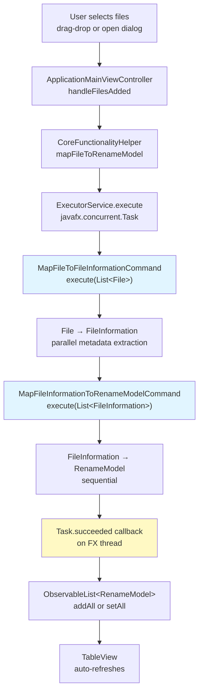
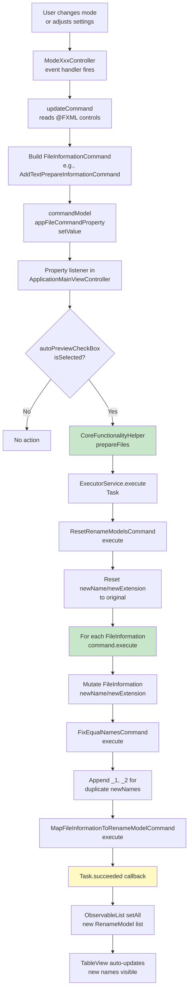
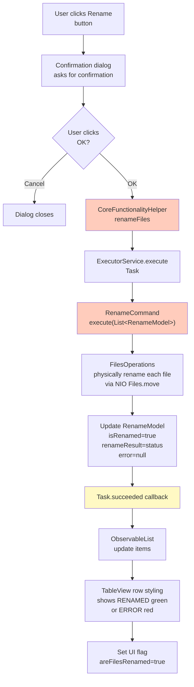

# UI-Backend Architecture: Renamer App

**Last Updated:** March 2026
**Status:** Production (V1 path); V2 wired but unused
**Audience:** Architecture redesign planners, new contributors, maintainers

---

## Executive Summary

The Renamer App's UI-backend connection uses the **V1 Command Pattern** architecture exclusively. The newer **V2 Strategy + Pipeline architecture** (FileRenameOrchestrator, immutable models, virtual threads) is fully implemented and wired into the dependency injection container but never invoked by the UI layer.

**Critical fact for redesign:** The UI binds all transformation state into mutable `FileInformation` objects that are modified in-place by V1 commands. There is no bridge to V2's immutable models or its modern pipeline. This document captures all nuances of the current system to inform a redesign strategy.

---

## 1. Application Startup & Dependency Injection

### 1.1 Entry Point

```
Launcher.main(args)
  ↓
RenamerApplication.start(Stage primaryStage)  // extends javafx.application.Application
  ↓
Creates Guice Injector(DIAppModule, DICoreModule, DIUIModule)
  ↓
Gets ViewLoaderApi and LanguageTextRetrieverApi from injector
  ↓
Loads ApplicationMainView.fxml via ViewLoaderService
  ↓
Sets Stage, icon, scene, displays window
```

### 1.2 Three-Module DI Stack

#### DIAppModule (`ua.renamer.app.ui.config`)
Provides application-level singletons:
- `LanguageTextRetrieverApi` → `LanguageTextRetrieverService`
  - Loads `ResourceBundle` from `langs/lang` (locale-aware)
- `ExecutorService` — **single-threaded daemon executor**
  - Used for all background V1 command execution
  - Created via `Executors.newSingleThreadExecutor()` with daemon flag
  - **Note:** Completely separate from V2's virtual thread pool

#### DICoreModule (`ua.renamer.app.ui.config`)
Wires all core business logic for V1 + V2 infrastructure:

**V1 components (all Singleton):**
- Metadata mappers (chain-of-responsibility for EXIF/media parsing)
  - `AviMapper`, `BmpMapper`, `JpegMapper`, `Mp3Mapper`, `Mp4Mapper`, `PngMapper`, `GifMapper`, `TiffMapper`, `QuickTimeMapper`, `WavMapper`, `EpsMapper`, `WebPMapper`
  - Culminates in `FileToMetadataMapper`
- Data mappers
  - `DataMapper<File, FileInformation>` → `FileToFileInformationMapper`
  - `DataMapper<FileInformation, RenameModel>` → `FileInformationToRenameModelMapper`
  - `DataMapper<RenameModel, String>` → `RenameModelToHtmlMapper`
- V1 Commands (all Singleton)
  - `MapFileToFileInformationCommand` — File → FileInformation (parallel metadata extraction)
  - `MapFileInformationToRenameModelCommand` — FileInformation → RenameModel
  - `FixEqualNamesCommand` — append `_1`, `_2` for duplicates
  - `RenameCommand` — physically rename files
  - `ResetRenameModelsCommand` — reset newName/newExtension to originals
- Services
  - `NameValidator`, `DateTimeOperations`

**V2 infrastructure (installed via `install(new DIV2ServiceModule())`)**
- `FileRenameOrchestratorImpl` (4-phase pipeline)
- 10 `FileTransformationService<C>` implementations
- `DuplicateNameResolverImpl`, `RenameExecutionServiceImpl`
- `ThreadAwareFileMapper`
- **Status:** Bound in DI but never injected by UI controllers

#### DIUIModule (`ua.renamer.app.ui.config`)
UI-layer wiring:
- `ViewLoaderApi` → `ViewLoaderService` (Singleton)
- `CoreFunctionalityHelper` (Singleton) — **THE UI-Backend Bridge**
- `MainViewControllerHelper` (Singleton) — mode UI orchestrator
- 10 custom radio selector widgets + builder factory
- 11 string converters (enum converters for AppModes, DateFormat, etc.)
- 10 mode controllers (all Singleton)
- `ObservableList<RenameModel>` (@AppGlobalRenameModelList) — **global file list state**
- FXMLLoader providers (10 qualified), Parent providers (10 qualified), ModeControllerApi providers (10 qualified)

**DI startup chain:**
```java
Guice.createInjector(
    new DIAppModule(),
    new DICoreModule(),      // installs DIV2ServiceModule internally
    new DIUIModule()
)
```

---

## 2. FXML Loading & Guice Controller Factory Integration

### 2.1 ViewLoaderService

```java
// ua.renamer.app.ui.service.impl.ViewLoaderService implements ViewLoaderApi
public class ViewLoaderService {
    public Parent loadView(Class<? extends Initializable> controllerClass) {
        FXMLLoader fxmlLoader = new FXMLLoader();

        // Critical: Set controller factory to use Guice for DI
        fxmlLoader.setControllerFactory(controllerClass_ ->
            injector.getInstance(controllerClass_)
        );

        // Load FXML from classpath
        // Controllers are instantiated with full DI injection
        Parent root = fxmlLoader.load(resourceStream);
        return root;
    }
}
```

**Effect:** Every FXML controller is wired with all its dependencies via Guice constructor injection. Controllers are singletons (bound in `DIUIModule`), so they persist for the application lifetime.

### 2.2 FXML Files & Controller Mapping

| FXML File | Controller Class | Purpose |
|-----------|------------------|---------|
| `ApplicationMainView.fxml` | `ApplicationMainViewController` | Main window layout |
| `ModeAddCustomText.fxml` | `ModeAddCustomTextController` | Add text mode |
| `ModeAddSequence.fxml` | `ModeAddSequenceController` | Sequence mode |
| `ModeChangeCase.fxml` | `ModeChangeCaseController` | Case change mode |
| `ModeChangeExtension.fxml` | `ModeChangeExtensionController` | Extension change mode |
| `ModeRemoveCustomText.fxml` | `ModeRemoveCustomTextController` | Remove text mode |
| `ModeReplaceCustomText.fxml` | `ModeReplaceCustomTextController` | Replace text mode |
| `ModeTruncateFileName.fxml` | `ModeTruncateFileNameController` | Truncate mode |
| `ModeUseDatetime.fxml` | `ModeUseDatetimeController` | Datetime metadata mode |
| `ModeUseImageDimensions.fxml` | `ModeUseImageDimensionsController` | Image dimensions mode |
| `ModeUseParentFolderName.fxml` | `ModeUseParentFolderNameController` | Parent folder name mode |

All FXML files are in the classpath at `fxml/` and loaded once at startup.

### 2.3 InjectQualifiers: Disambiguating 10 Modes

Because Guice uses type-based binding, injecting 10 `FXMLLoader` instances requires disambiguation. `InjectQualifiers` interface defines 31 custom `@jakarta.inject.Qualifier` annotations:

**FXML Loader Qualifiers (10):**
```java
@AddCustomTextFxmlLoader, @ChangeCaseFxmlLoader, @UseDatetimeFxmlLoader,
@UseImageDimensionsFxmlLoader, @UseParentFolderNameFxmlLoader,
@RemoveCustomTextFxmlLoader, @ReplaceCustomTextFxmlLoader,
@AddSequenceFxmlLoader, @TruncateFileNameFxmlLoader, @ChangeExtensionFxmlLoader
```

**Parent Scene Graph Qualifiers (10):**
Same names with `FxmlLoader` suffix replaced with no suffix (e.g., `@AddCustomTextFxmlLoader` becomes qualifiers for both FXMLLoader and Parent).

**ModeControllerApi Qualifiers (10):**
Same names with `Controller` suffix (e.g., `@AddCustomTextController`).

**DIUIModule Provider Methods (30):**
```java
@Provides @Singleton @AddCustomTextFxmlLoader
FXMLLoader provideAddCustomTextFxmlLoader(Injector injector) {
    FXMLLoader loader = new FXMLLoader();
    loader.setControllerFactory(injector::getInstance);
    loader.setLocation(getClass().getResource("/fxml/ModeAddCustomText.fxml"));
    return loader;
}

@Provides @Singleton @AddCustomText
Parent provideAddCustomTextParent(@AddCustomTextFxmlLoader FXMLLoader loader) {
    return loader.load();
}

@Provides @Singleton @AddCustomTextController
ModeControllerApi provideAddCustomTextController(@AddCustomText Parent parent) {
    return (ModeControllerApi) parent.getProperties().get("controller");
}
```
(Repeated for all 10 modes)

**Pain Point for Redesign:** Adding a new mode requires editing `InjectQualifiers.java` (3 new annotations), `DIUIModule` (3 new provider methods), `ViewNames` enum (new entry), and `MainViewControllerHelper` (new method binding mode to view). This is a major friction point.

---

## 3. UI Controller Hierarchy

### 3.1 ModeControllerApi (Interface)

```java
// ua.renamer.app.ui.controller.mode.ModeControllerApi
public interface ModeControllerApi {
    FileInformationCommand getCommand();
    void setCommand(FileInformationCommand fileInformationCommand);
    ObjectProperty<FileInformationCommand> commandProperty();
    void updateCommand();
}
```

**Key Contract:** Every mode controller produces a `FileInformationCommand` — the V1 interface for transforming `FileInformation` objects. This is the only way UI communicates transformations to the backend.

### 3.2 ModeBaseController (Abstract)

```java
// ua.renamer.app.ui.controller.mode.ModeBaseController
public abstract class ModeBaseController implements ModeControllerApi, Initializable {
    protected CommandModel commandModel;

    @Override
    public FileInformationCommand getCommand() {
        updateCommand();
        return commandModel.getAppFileCommand();
    }

    @Override
    public void updateCommand() {
        // Implemented by concrete mode controller
        // Reads all @FXML UI control values
        // Builds and sets a new FileInformationCommand
    }

    @Override
    public ObjectProperty<FileInformationCommand> commandProperty() {
        return commandModel.appFileCommandProperty();
    }
}
```

**Pattern:** All 10 mode controllers extend this. Each implements `updateCommand()` to read UI controls and build a command object.

### 3.3 Concrete Mode Controllers (10 implementations)

All in `ua.renamer.app.ui.controller.mode.impl`:

**ModeAddCustomTextController:**
- @FXML fields: `textFieldCustomText`, `itemPositionRadioSelector`
- Event handlers: `handleTextFieldCustomTextChanged()`, `handlePositionChanged()`
- `updateCommand()` → builds `AddTextPrepareInformationCommand(text, position)`

**ModeAddSequenceController:**
- @FXML fields: `spinnerStartNumber`, `spinnerStepValue`, `spinnerPadding`, `sortSourceChoiceBox`
- `updateCommand()` → builds `SequencePrepareInformationCommand(...)`

**ModeChangeCaseController:**
- @FXML fields: `textCaseChoiceBox`, `capitalizeCheckBox`
- `updateCommand()` → builds `ChangeCasePreparePrepareInformationCommand(...)`

**ModeChangeExtensionController:**
- @FXML fields: `textFieldNewExtension`
- `updateCommand()` → builds `ExtensionChangePrepareInformationCommand(...)`

**ModeRemoveCustomTextController:**
- @FXML fields: `textFieldCustomText`, `itemPositionExtendedRadioSelector`
- `updateCommand()` → builds `RemoveTextPrepareInformationCommand(...)`

**ModeReplaceCustomTextController:**
- @FXML fields: `textFieldTextToReplace`, `textFieldNewValue`, `itemPositionWithReplacementRadioSelector`
- `updateCommand()` → builds `ReplaceTextPrepareInformationCommand(...)`

**ModeTruncateFileNameController:**
- @FXML fields: `truncateOptionsChoiceBox`, `numberOfSymbolsSpinner`, `itemPositionTruncateRadioSelector`
- `updateCommand()` → builds `TruncateNamePrepareInformationCommand(...)`

**ModeUseDatetimeController:**
- @FXML fields: 10+ fields for date/time configuration (dateTimeSourceChoiceBox, dateFormatChoiceBox, timeFormatChoiceBox, etc.)
- `updateCommand()` → builds `DateTimeRenamePrepareInformationCommand(...)` with all settings

**ModeUseImageDimensionsController:**
- @FXML fields: `itemPositionRadioSelector`, `textFieldLeftSide`, `textFieldRightSide`, `separatorChoiceBox`
- `updateCommand()` → builds `ImageDimensionsPrepareInformationCommand(...)`

**ModeUseParentFolderNameController:**
- @FXML fields: `itemPositionRadioSelector`, `numberOfParentsSpinner`, `separatorChoiceBox`
- `updateCommand()` → builds `ParentFoldersPrepareInformationCommand(...)`

### 3.4 ApplicationMainViewController

```java
// ua.renamer.app.ui.controller.ApplicationMainViewController implements Initializable
@RequiredArgsConstructor(onConstructor_ = {@Inject})
public class ApplicationMainViewController implements Initializable {
    private final CoreFunctionalityHelper coreHelper;
    private final MainViewControllerHelper mainControllerHelper;
    private final AppModesConverter appModesConverter;
    private final ObservableList<RenameModel> loadedAppFilesList;

    // UI Controls
    @FXML private ChoiceBox<AppModes> appModeChoiceBox;
    @FXML private StackPane appModeContainer;
    @FXML private CheckBox autoPreviewCheckBox;
    @FXML private Button previewBtn, renameBtn, clearBtn, reloadBtn;
    @FXML private TableView<RenameModel> filesTableView;
    @FXML private TableColumn<RenameModel, String> originalNameColumn, itemTypeColumn, newNameColumn, statusColumn;
    @FXML private WebView fileInfoWebView;
    @FXML private ProgressBar appProgressBar;
}
```

**Responsibilities:**
1. Orchestrate mode switching (load/unload UI views)
2. Bind TableView to global `ObservableList<RenameModel>` file list
3. Wire event handlers for buttons (Preview, Rename, Clear, Reload)
4. Listen to mode controller command property changes → trigger preview if enabled
5. Handle file drag-drop and open dialog
6. Display file metadata in WebView on table row selection
7. Manage progress bar visibility during async operations

**Control flow (Preview example):**
```
User adjusts mode controls (e.g., types text in AddCustomText mode)
  ↓
Mode controller's event handler fires (e.g., handleTextChanged)
  ↓
handleTextChanged() calls updateCommand()
  ↓
updateCommand() reads all UI controls, builds AddTextPrepareInformationCommand
  ↓
commandModel.appFileCommandProperty().setValue(newCommand)  ← property change
  ↓ Listener in ApplicationMainViewController fires
handleModeControllerCommandChanged()
  ↓
IF autoPreviewCheckBox.isSelected()
  coreHelper.prepareFiles(loadedAppFilesList, command, progressBar, callback)
  ↓ Callback on FX thread
updateProgress() in ProgressBar
filesTableView auto-updates (ObservableList items changed)
```

---

## 4. Data Flow: File Loading



**Threading:** Background (ExecutorService) → FX thread (Platform.runLater via Task.succeeded)

**Result:** The global `loadedAppFilesList` is populated with `RenameModel` objects. Each `RenameModel` wraps a mutable `FileInformation` object. The `newName` and `newExtension` fields are initially set to match the original file name/extension.

---

## 5. Data Flow: Transformation Preview



**Key insight:** The entire transformation state lives in `FileInformation.newName` and `FileInformation.newExtension`. These are mutated in-place by the command. There is no immutable representation until physical rename.

---

## 6. Data Flow: Rename Execution



**Error handling:** If `RenameCommand.execute()` fails for a file, `RenameModel.hasRenamingError` is set to true and `renamingErrorMessage` is populated. The TableView row is styled red.

---

## 7. Threading Model

### 7.1 Two Separate Threading Strategies

**V1 (UI Path — Current):**
- **Main UI Thread:** All scene graph operations, event handlers
- **Background Thread:** Single daemon thread from `ExecutorService` runs `javafx.concurrent.Task<V>`
  - Task bridges to FX thread via `updateProgress()` listener and `succeeded()` callback
  - Sequential operations (commands execute one after another)
  - Progress reported atomically via `Task.updateProgress(current, total)`

**V2 (Wired but Unused):**
- **Virtual Thread Pool:** `Executors.newVirtualThreadPerTaskExecutor()` per operation
  - File extraction phase: parallel virtual threads, one per file
  - Transformation phase: parallel (except SequenceTransformer which is sequential)
  - Rename phase: parallel virtual threads
  - `CompletableFuture.supplyAsync()` with `join()` to collect results

### 7.2 Current Threading Pattern (V1)

```java
// From CoreFunctionalityHelper.buildTaskWithCallbackOnUIThread
public void prepareFiles(List<RenameModel> list, FileInformationCommand cmd,
                         ProgressBar bar, ListCallback<RenameModel> callback) {
    Task<List<RenameModel>> task = new Task<>() {
        @Override
        protected List<RenameModel> call() {
            // Background thread
            updateProgress(0, 0);
            List<RenameModel> result = resetRenameModelsCommand.execute(list, this::updateProgress);
            // ... more commands ...
            return result;
        }

        @Override
        protected void succeeded() {
            // FX thread (called by Task automatically)
            callback.accept(getValue());
        }
    };

    // Bind progress bar to task progress
    bar.progressProperty().bind(task.progressProperty());

    // Submit to background thread
    executorService.submit(task);
}
```

**Note:** Progress callback is `this::updateProgress`, which is `Task.updateProgress(current, total)`. This is thread-safe internally and notifies listeners on the FX thread.

### 7.3 No Virtual Threads in UI Path

The V2 pipeline's `FileRenameOrchestratorImpl` uses virtual threads:
```java
ExecutorService executor = Executors.newVirtualThreadPerTaskExecutor();
CompletableFuture.supplyAsync(/* extract metadata */, executor)
    .thenApplyAsync(/* transform */, executor)
    .thenApplyAsync(/* resolve duplicates */)
    .thenApplyAsync(/* physical rename */, executor)
    .join();  // block and collect results
```

This is never invoked from the UI layer. The UI exclusively uses the single-threaded `ExecutorService` from `DIAppModule`.

---

## 8. V1 Backend: The Current Pipeline

### 8.1 V1 Models

**FileInformation** (`ua.renamer.app.core.model`)
- Mutable representation of a file
- Fields: `oldName`, `newName`, `oldExtension`, `newExtension` (all writable)
- Metadata fields: `fileInformationMetadata` (EXIF, dimensions, creation date, etc.)
- Mutated in-place by transformation commands

**RenameModel** (`ua.renamer.app.core.model`)
- Wraps `FileInformation`
- Tracks state: `isRenamed`, `needRename`, `hasRenamingError`, `renamingErrorMessage`, `renameResult`
- Used by UI (TableView, WebView)

**RenameResult** (V1 enum)
- `NO_ACTIONS_HAPPEN`, `RENAMED_WITHOUT_ERRORS`, `NOT_RENAMED_BECAUSE_NOT_NEEDED`, `NOT_RENAMED_BECAUSE_OF_ERROR`
- Set on `RenameModel.renameResult` after physical rename

**FileInformationCommand** (interface)
- Single method: `List<FileInformation> execute(List<FileInformation>, ProgressCallback)`
- Mutates `newName`/`newExtension` on each item
- Returns the same list (for chaining)

### 8.2 V1 Command Classes (All Singleton in DI)

| Command | Input | Output | Effect |
|---------|-------|--------|--------|
| `MapFileToFileInformationCommand` | List<File> | List<FileInformation> | Metadata extraction (EXIF, mimeType, dates) |
| `MapFileInformationToRenameModelCommand` | List<FileInformation> | List<RenameModel> | Wraps FileInfo in RenameModel |
| `AddTextPrepareInformationCommand` | — | — | Sets newName = oldName + text (or other positions) |
| `RemoveTextPrepareInformationCommand` | — | — | Removes substring from newName |
| `ReplaceTextPrepareInformationCommand` | — | — | Replaces substring in newName |
| `ChangeCasePreparePrepareInformationCommand` | — | — | Changes case (UPPER, lower, Title) |
| `ExtensionChangePrepareInformationCommand` | — | — | Sets newExtension to new value |
| `SequencePrepareInformationCommand` | — | — | Appends sequence numbers (001, 002, ...) to newName |
| `DateTimeRenamePrepareInformationCommand` | — | — | Uses EXIF/file dates in newName |
| `ImageDimensionsPrepareInformationCommand` | — | — | Appends image dimensions to newName |
| `ParentFoldersPrepareInformationCommand` | — | — | Uses parent folder names in newName |
| `TruncateNamePrepareInformationCommand` | — | — | Truncates newName to N characters |
| `FixEqualNamesCommand` | List<FileInfo> | List<FileInfo> | Appends _1, _2 for duplicate newNames |
| `ResetRenameModelsCommand` | List<RenameModel> | List<RenameModel> | Resets newName/newExtension to original |
| `RenameCommand` | List<RenameModel> | List<RenameModel> | Physically renames files, updates isRenamed/renameResult |

### 8.3 V1 Execution Model

All commands follow this pattern:
```java
public class SomeCommand implements FileInformationCommand {
    @Override
    public List<FileInformation> execute(List<FileInformation> items, ProgressCallback callback) {
        for (int i = 0; i < items.size(); i++) {
            FileInformation item = items.get(i);
            // Mutate newName and/or newExtension
            item.setNewName(/* calculated new name */);
            item.setNewExtension(/* calculated new extension */);
            if (callback != null) callback.updateProgress(i, items.size());
        }
        return items;  // Return the mutated list
    }
}
```

**No immutable representation.** All state is mutation-based. Calling the same command twice on the same list mutates it further (unless reset first).

---

## 9. V2 Backend: Wired But Unused

### 9.1 V2 Models (All Immutable @Value @Builder)

**FileModel** (immutable)
- Extracted from File: name, extension, created date, modified date, metadata, mimeType, category
- No public setter

**PreparedFileModel** (immutable)
- FileModel + calculated newName + hasError + errorMessage + TransformationMetadata
- Built via `.withNewName()`, `.withHasError()`, etc.

**RenameResult** (V2 record, immutable)
- PreparedFileModel + RenameStatus + executedAt
- RenameStatus enum: SUCCESS, SKIPPED, ERROR_EXTRACTION, ERROR_TRANSFORMATION, ERROR_EXECUTION

### 9.2 V2 Pipeline (FileRenameOrchestratorImpl)

```java
public List<RenameResult> execute(List<File> files,
                                  TransformationMode mode,
                                  Object config,
                                  ProgressCallback callback) {
    // Phase 1: Extraction (parallel, virtual threads)
    List<FileModel> extracted = files.parallelStream()
        .map(fileMapper::map)
        .collect(toList());

    // Phase 2: Transformation (parallel or sequential)
    List<PreparedFileModel> prepared = extracted.parallelStream()
        .map(fm -> transformationService.transform(fm, config))
        .collect(toList());

    // Phase 3: Duplicate Resolution (sequential)
    List<PreparedFileModel> resolved =
        duplicateResolver.resolve(prepared);

    // Phase 4: Physical Rename (parallel, virtual threads)
    List<RenameResult> results = resolved.parallelStream()
        .map(pfm -> renameService.execute(pfm))
        .collect(toList());

    return results;
}
```

**Advantages over V1:**
- Immutable models prevent accidental state corruption
- Virtual threads for parallelism (lightweight, millions possible)
- Structured error handling via `RenameStatus` enum
- No in-place mutation — easier to reason about state
- Explicit transformation phase dependencies

**Why It's Unused:** The UI layer has never been refactored to invoke this. All mode controllers produce V1 `FileInformationCommand` objects, not V2 config classes. There is no adapter layer to convert V1 commands to V2 configs.

---

## 10. Key Pain Points for Redesign

### 10.1 **V2 Orphaned from UI**

The V2 pipeline is production-ready but never called. The UI continues to use V1's mutation-based approach. This creates:
- Duplicated effort maintaining two pipelines
- Inconsistent error handling (V1 boolean flags vs. V2 status enums)
- Impossible to preview multiple transformations simultaneously (V1 mutates in-place)
- No undo/replay (no immutable history)

### 10.2 **Mutable V1 Models Block Advanced Features**

`FileInformation.newName` is mutated in-place by every command. This means:
- Cannot preview "Add Text then Remove Text" then "Add Text again" without resetting
- Cannot undo a preview
- Cannot show side-by-side comparison of different transformations
- Impossible to compose transformations into a pipeline UI

### 10.3 **No V2-to-UI Adapter**

There is no mapping from V2's `PreparedFileModel`/`RenameResult` to `RenameModel`. The `TableView` binds to `ObservableList<RenameModel>` (V1), not V2. To switch to V2:
- Must create adapter converting `RenameResult` → `RenameModel`
- Or refactor TableView binding to accept V2 models
- Or create an entirely new UI model bridging V1 and V2

### 10.4 **Mode Controller Command Type Mismatch**

- Mode controllers produce `FileInformationCommand` (V1 interface)
- V2 pipeline expects typed config objects (`AddTextConfig`, `RemoveTextConfig`, etc.)
- No automatic conversion; any V2 adoption requires rewriting all 10 mode controllers

### 10.5 **InjectQualifiers Proliferation**

Adding a new mode requires:
1. 3 new qualifiers in `InjectQualifiers.java` (FXMLLoader, Parent, Controller)
2. 3 new provider methods in `DIUIModule`
3. New `@FXMLLoader` / `@Parent` / `@Controller` entries
4. New entry in `ViewNames` enum
5. New method in `MainViewControllerHelper`

**High friction.** A simple 100-line FXML file requires editing 5+ locations and 20+ lines of boilerplate.

### 10.6 **Single-Threaded Executor vs. Virtual Threads**

V1 path uses a single daemon thread (`ExecutorService`), blocking all operations sequentially. V2 pipeline uses a virtual thread pool. These are fundamentally different execution models:
- V1 scales poorly (one file at a time on one thread)
- V2 scales well (thousands of virtual threads)
- Cannot mix them without careful coordination

### 10.7 **CoreFunctionalityHelper Is a Tight Bottleneck**

All UI-backend communication flows through `CoreFunctionalityHelper`. This 140-line class directly references:
- All 5 V1 commands
- The global `ExecutorService`
- The HTML mapper
- All callback patterns

To change the backend, you must rewrite this class and all 50+ call sites in controllers.

### 10.8 **Global Mutable State (ObservableList)**

`ObservableList<RenameModel> loadedAppFilesList` is:
- Injected into `ApplicationMainViewController`
- Bound to `TableView` as its item list
- Accessed via `@AppGlobalRenameModelList` qualifier
- Mutated by multiple callers (append files, reset models, update models after rename)

Hard to reason about ownership. No clear "who is responsible for this list?" Refactoring requires careful coordination.

### 10.9 **WebView for File Details (HTML Coupling)**

File metadata is displayed as an HTML string via `RenameModelToHtmlMapper`. The UI is tightly coupled to:
- HTML generation logic (in a mapper class)
- String HTML (not a structured reactive component)
- Difficult to change display format without modifying the mapper

### 10.10 **No Structured Error Propagation to UI**

V2 captures errors in `RenameStatus` (SUCCESS, ERROR_EXTRACTION, ERROR_TRANSFORMATION, ERROR_EXECUTION), but V1 uses:
- `RenameModel.hasRenamingError` (boolean)
- `RenameModel.renamingErrorMessage` (string)

Errors are displayed as plain text in the table status column. No structured error types, no recovery options, no error categorization.

---

## 11. Appendix: Class Reference

### UI Layer Classes

| Class | Package | Role |
|-------|---------|------|
| `ApplicationMainViewController` | `ua.renamer.app.ui.controller` | Main window orchestrator |
| `ModeBaseController` | `ua.renamer.app.ui.controller.mode` | Base class for all mode controllers |
| `ModeControllerApi` | `ua.renamer.app.ui.controller.mode` | Interface for mode controllers |
| `Mode*Controller` (10) | `ua.renamer.app.ui.controller.mode.impl` | Concrete mode controllers |
| `CoreFunctionalityHelper` | `ua.renamer.app.ui.service.impl` | UI-Backend bridge |
| `MainViewControllerHelper` | `ua.renamer.app.ui.service.impl` | Mode UI orchestrator |
| `ViewLoaderService` | `ua.renamer.app.ui.service.impl` | FXML loader with Guice factory |
| `DIAppModule` | `ua.renamer.app.ui.config` | Application-level DI config |
| `DICoreModule` | `ua.renamer.app.ui.config` | Core module DI config (installs DIV2ServiceModule) |
| `DIUIModule` | `ua.renamer.app.ui.config` | UI-layer DI config |
| `InjectQualifiers` | `ua.renamer.app.ui.config` | 31 qualifier annotations |

### V1 Backend Classes

| Class | Package | Role |
|-------|---------|------|
| `FileInformation` | `ua.renamer.app.core.model` | Mutable file representation |
| `RenameModel` | `ua.renamer.app.core.model` | UI wrapper around FileInformation |
| `FileInformationCommand` | `ua.renamer.app.core.service.command` | Interface for transformation commands |
| `MapFileToFileInformationCommand` | `ua.renamer.app.core.service.command.impl` | File → FileInformation |
| `MapFileInformationToRenameModelCommand` | `ua.renamer.app.core.service.command.impl` | FileInformation → RenameModel |
| `*PrepareInformationCommand` (10) | `ua.renamer.app.core.service.command.impl` | Transformation commands |
| `FixEqualNamesCommand` | `ua.renamer.app.core.service.command.impl` | Duplicate name resolution |
| `ResetRenameModelsCommand` | `ua.renamer.app.core.service.command.impl` | Reset newName/newExtension |
| `RenameCommand` | `ua.renamer.app.core.service.command.impl` | Physical file rename |
| `RenameModelToHtmlMapper` | `ua.renamer.app.core.service.mapper.impl` | RenameModel → HTML string |

### V2 Backend Classes (Wired, Unused)

| Class | Package | Role |
|-------|---------|------|
| `FileModel` | `ua.renamer.app.core.v2.model` | Immutable file representation |
| `PreparedFileModel` | `ua.renamer.app.core.v2.model` | FileModel + transformation result |
| `RenameResult` | `ua.renamer.app.core.v2.model` | Final rename result with status |
| `RenameStatus` | `ua.renamer.app.core.v2.model` | Enum: SUCCESS, SKIPPED, ERROR_* |
| `FileRenameOrchestratorImpl` | `ua.renamer.app.core.v2.service` | 4-phase pipeline orchestrator |
| `FileTransformationService<C>` | `ua.renamer.app.core.v2.service.transformation` | Interface for transformers |
| `*Transformer` (10) | `ua.renamer.app.core.v2.service.transformation.impl` | V2 transformation implementations |
| `DuplicateNameResolverImpl` | `ua.renamer.app.core.v2.service` | Duplicate resolution (appends `(01)`, `(02)`) |
| `RenameExecutionServiceImpl` | `ua.renamer.app.core.v2.service` | Physical file rename with virtual threads |
| `DIV2ServiceModule` | `ua.renamer.app.core.config` | V2 DI configuration (installed by DICoreModule) |

### DI & Wiring

| Class | Package | Role |
|-------|---------|------|
| `RenamerApplication` | `ua.renamer.app.ui` | JavaFX Application entry point |
| `Launcher` | `ua.renamer.app` | main() entry point |
| `LanguageTextRetrieverApi` | `ua.renamer.app.ui.service` | i18n abstraction |
| `LanguageTextRetrieverService` | `ua.renamer.app.ui.service.impl` | ResourceBundle-backed i18n |
| `ListCallback<T>` | `ua.renamer.app.ui.service` | Callback for async operations |
| `ViewLoaderApi` | `ua.renamer.app.ui.service` | FXML loader abstraction |
| `CommandModel` | `ua.renamer.app.ui.models` | Wraps ObjectProperty<FileInformationCommand> |

---

## Summary for Redesign

This document captures the complete UI-backend architecture as it exists today. The critical points:

1. **V1 is the only active path.** All UI communicates via `FileInformationCommand` objects operating on mutable `FileInformation`.

2. **V2 is wired but orphaned.** The pipeline works perfectly but is never invoked from the UI.

3. **No bridge exists.** Adopting V2 requires building an adapter layer and rewriting `CoreFunctionalityHelper` and all 10 mode controllers.

4. **Mutable-first design blocks advanced features.** Undo, replay, pipeline composition, and simultaneous preview all require immutable models.

5. **High DI friction.** Adding a mode requires changes in 5+ locations across two files.

6. **Threading strategy mismatch.** V1 is single-threaded; V2 uses virtual threads. Mixing them requires careful refactoring.

Any redesign should consider whether to:
- **Option A:** Adopt V2 wholesale (major effort, but modern and scalable)
- **Option B:** Keep V1 but add the V2 pipeline in parallel (allows gradual migration)
- **Option C:** Refactor V1 to be immutable without switching to V2 (intermediate effort, moderate benefit)
- **Option D:** Extract V1 infrastructure into reusable layers (enables cleaner testing)

This architecture document should inform that decision.
