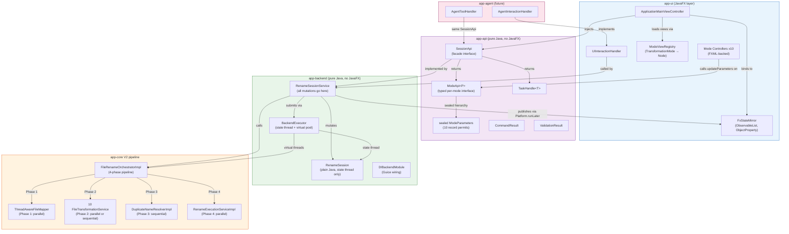
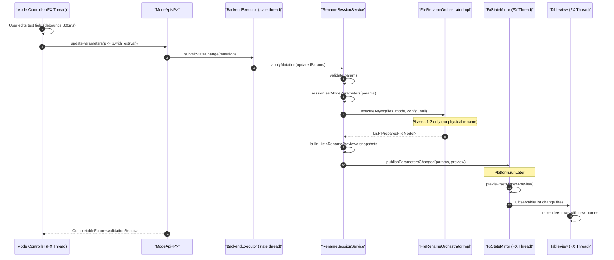
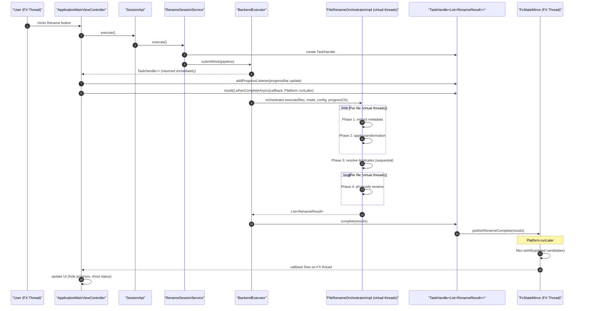

# V2 API Design Approaches

**Document Type:** Architecture Comparison
**Status:** Updated — Phase 0 (V2 Stabilization) added after mode investigation
**Last Updated:** March 2026
**Audience:** Engineering leads, contributors planning the V2-to-UI integration

---

## Table of Contents

1. [Problem Statement](#1-problem-statement)
2. [Design Constraints](#2-design-constraints)
3. [The Four Approaches](#3-the-four-approaches)
   - [Approach 1: Thin Adapter Bridge](#approach-1-thin-adapter-bridge-v1v2-shim)
   - [Approach 2: Full SessionApi](#approach-2-full-sessionapi-guideline-reference-implementation)
   - [Approach 3: Pragmatic Facade](#approach-3-pragmatic-facade-sessionapi-without-generic-ui-generation)
   - [Approach 4: Observable Service Bus](#approach-4-observable-service-bus-fx-first)
4. [Comparison Matrix](#4-comparison-matrix)
5. [Detailed Recommendation](#5-detailed-recommendation)
   - [Phase 0: V2 Stabilization](#phase-0-v2-stabilization-prerequisite--must-complete-before-phase-1) ← **Start here**
   - [Phase 1: Structural Foundation](#phase-1-structural-foundation-23-weeks)
   - [Phase 2: Controller Migration](#phase-2-controller-migration-23-weeks-one-mode-at-a-time)
   - [Phase 3: Agent Integration](#phase-3-agent-integration-and-advanced-features-future)
6. [V2 Integration Architecture Diagram](#6-v2-integration-architecture-diagram)
7. [Data Flow Diagrams](#7-data-flow-diagrams)
8. [Key Interface Contracts](#8-key-interface-contracts)
9. [Backward Compatibility Notes](#9-backward-compatibility-notes)

---

## 1. Problem Statement

The Renamer App has two fully implemented generations that have never been connected:

**V1** (Command Pattern) is wired to the UI and handles all production traffic. It uses mutable `FileInformation` objects modified in-place by `FileInformationCommand` implementations. All 10 mode controllers produce V1 commands. `CoreFunctionalityHelper` bridges commands to a single-threaded `ExecutorService`. The global `ObservableList<RenameModel>` holds all file state. Error reporting is ad-hoc (boolean flags + strings on `RenameModel`).

**V2** (Strategy + Pipeline) exists in `app/core` and `app/api`, is fully wired into Guice via `DIV2ServiceModule`, and is never called by any UI controller. The `FileRenameOrchestratorImpl` implements a four-phase pipeline using virtual threads with structured error capture via `RenameStatus`. V2 config objects (`AddTextConfig`, `RemoveTextConfig`, etc.) are immutable `@Value @Builder(setterPrefix = "with")` records. V2 has no UI adapter.

### Ten Specific Pain Points

1. **V2 is orphaned.** `FileRenameOrchestratorImpl` is never invoked. V2 investment is wasted.
2. **Mutable V1 models block advanced features.** No undo, no multi-transform preview, no composition. `FileInformation.newName` is mutated in-place — comparing two transformation results requires a full reset cycle.
3. **No V2-to-UI adapter exists.** `PreparedFileModel` and `RenameResult` cannot feed the `TableView<RenameModel>` without a conversion layer that does not exist.
4. **Command type mismatch.** Mode controllers produce `FileInformationCommand` (V1). V2 expects typed config objects (`AddTextConfig`, etc.). No automatic bridge.
5. **InjectQualifiers proliferation.** Adding a new mode requires editing 5+ files (3 new qualifiers, 3 new `@Provides` methods in `DIUIModule`, 1 `ViewNames` entry, 1 `MainViewControllerHelper` mapping). High friction.
6. **Incompatible execution models.** V1 uses a single daemon thread; V2 uses `Executors.newVirtualThreadPerTaskExecutor()`. They cannot be mixed without explicit coordination.
7. **`CoreFunctionalityHelper` is a bottleneck.** All 5 hardcoded V1 commands pass through this 140-line class. Changing the backend requires rewriting it and all its call sites.
8. **Global mutable `ObservableList`.** No clear ownership, mutated from multiple paths. Race-prone.
9. **WebView HTML coupling.** File metadata is emitted as raw HTML by `RenameModelToHtmlMapper`. Changing display format requires modifying a mapper class.
10. **No structured error propagation.** V1 uses boolean flags; V2 has `RenameStatus` enum — but the UI cannot consume it because V2 is never called.

### Requirements for the Solution

| Requirement | Rationale |
|---|---|
| V2 pipeline must be the execution engine | Immutable models, virtual threads, structured errors |
| No JavaFX imports in backend modules | JPMS boundary enforcement; enables agent use |
| Typed mode parameters with compile-time safety | Prevent runtime misconfiguration |
| Thread safety through explicit model, not ad-hoc | Prevent silent observable list corruption |
| AI agent can use backend without JavaFX | Future extensibility without rewriting |
| Adding a new mode touches as few files as possible | Reduce friction and error surface |
| Incremental migration — no "big bang" rewrite | App must remain runnable throughout |

---

## 2. Design Constraints

These are non-negotiable boundaries any solution must respect:

- **Java 25 with JPMS.** Every new package must be exported in `module-info.java`. JPMS prevents accidental cross-module coupling when enforced correctly.
- **JavaFX 25.** The app runs as a desktop application today. JavaFX threading rules (`Platform.runLater`, FX thread ownership of all scene-graph nodes) are strictly enforced at runtime.
- **Google Guice 7 only.** Constructor injection, `@Provides @Singleton` methods. No Spring, no CDI, no other DI framework.
- **V2 pipeline must be adopted, not abandoned.** `FileRenameOrchestratorImpl` with its four phases and virtual-thread execution model is the target engine. V1 commands (`MapFileToFileInformationCommand`, etc.) should be retired as each phase is replaced.
- **The app must remain runnable throughout migration.** Each phase of the migration must leave the app in a working state. No all-or-nothing rewrites.
- **No new DI frameworks, build tools, or test libraries.** The existing Maven multi-module structure, JUnit 5, AssertJ, and Mockito 5 are the tools available.

---

## 3. The Four Approaches

### Approach 1: Thin Adapter Bridge (V1→V2 Shim)

**Core idea:** Keep the entire V1 UI infrastructure intact (all 10 mode controllers, `InjectQualifiers`, `DIUIModule` wiring, `CoreFunctionalityHelper` external API). Replace only the internals of `CoreFunctionalityHelper` to call `FileRenameOrchestratorImpl` instead of the V1 commands. Add a converter that maps V1 `FileInformationCommand` execution semantics to typed V2 config objects. Map V2 `RenameResult` back to `RenameModel` for `TableView` compatibility.

**How it works in practice:**

1. Inside `CoreFunctionalityHelper.prepareFiles()`, intercept the `FileInformationCommand` and identify which V2 config object it corresponds to (e.g., `AddTextPrepareInformationCommand` → build `AddTextConfig`).
2. Call `orchestrator.executeAsync(files, mode, config, progressCallback)` on a background thread.
3. Convert `List<RenameResult>` back to `List<RenameModel>` via a new `RenameResultToRenameModelConverter`.
4. Continue delivering results to the `ObservableList<RenameModel>` as before.

The external contract of `CoreFunctionalityHelper` does not change. Mode controllers do not change. The FXML files do not change. `InjectQualifiers` does not change.

**Pros:**
- Smallest possible blast radius. If the shim fails, only the backend engine changes — UI code is untouched.
- V2 pipeline is immediately adopted for actual execution.
- Reversible: the original V1 command execution can be restored by removing one conditional branch.
- Testable in isolation: the shim can be unit-tested without any JavaFX context.

**Cons:**
- Perpetuates V1's architectural problems (mutable models, tight coupling, InjectQualifiers boilerplate). Technical debt is not reduced.
- The V1→V2 config conversion logic is fragile. `FileInformationCommand` is an opaque interface — identifying which config to build from it requires brittle `instanceof` chains or reflection.
- Mode controllers still produce V1 types. If a V2 config grows fields that V1 commands do not express (e.g., a `locale` field for date formatting), the shim silently loses data.
- No path to agent integration. `SessionApi` does not exist in this approach — an agent would need to instantiate JavaFX command objects.
- Preview-as-V2-run is expensive: the shim would run the full 4-phase V2 pipeline (including duplicate resolution) on every preview request, whereas V1 skips rename and just mutates names.
- Does not solve the thread model mismatch: V2's pipeline uses virtual threads but the shim submits it via the legacy single-threaded `ExecutorService`, negating parallelism.

**Effort:** Low initial, High long-term (debt accumulates).

---

### Approach 2: Full SessionApi (Guideline Reference Implementation)

**Core idea:** Implement exactly what `docs/JavaFX_Backend_UI_Architecture_Guideline.md` specifies. Introduce a new `app-api` Maven module containing: `SessionApi`, `ModeApi<P>`, `ModeDescriptor<P>`, `FieldDescriptor` (sealed hierarchy), sealed `ModeParameters` records, `TaskHandle<T>`, `CommandResult`, `ValidationResult`, `InteractionHandler`. Introduce a new `app-backend` module (no `javafx.*` dependency) containing: `RenameSession`, `RenameSessionService`, `BackendExecutor`, `FxStateMirror`, and a `RenameModes` registry with one `ModeDescriptor` constant per mode. Replace all 10 FXML-based mode controllers and `InjectQualifiers` boilerplate with a generic `ModeViewFactory` that generates forms at runtime from `FieldDescriptor` lists. Replace `CoreFunctionalityHelper` with `SessionApi` injection in `ApplicationMainViewController`. An `app-agent` module can be added with `AgentToolHandler` using the same `SessionApi`.

**How it works in practice:**

1. `RenameModes` registry holds 10 `ModeDescriptor<P>` constants, each specifying `defaultFactory`, `List<FieldDescriptor>`, and the mapping to `TransformationMode`.
2. `RenameSessionService` owns `RenameSession` state. All mutations go through `BackendExecutor.submitStateChange()` (single state thread).
3. After each mutation, `recomputePreview()` calls the V2 transformation phase (without executing renames) and publishes snapshots via `FxStateMirror`.
4. `FxStateMirror` wraps `ObservableList<RenameCandidate>` and `ObservableList<RenamePreview>`, only mutated via `Platform.runLater`.
5. `ApplicationMainViewController` binds to `FxStateMirror` properties. Mode switching calls `session.selectMode(RenameModes.ADD_TEXT)` which returns `ModeApi<AddTextParams>`.
6. `ModeViewFactory.create(modeApi)` generates a `VBox` with the correct widgets from `ModeDescriptor.fields()` using a sealed `switch` on `FieldDescriptor` subtypes.
7. No mode-specific controllers remain; `InjectQualifiers` drops from 31 to 0 mode-related annotations.

**Pros:**
- Complete architectural alignment with the guideline.
- Agent integration is structurally guaranteed (backend has no `javafx.*`, `SessionApi` is pure Java).
- Adding a new mode requires exactly 3 things: parameter record, descriptor constant, registry entry.
- Thread safety through explicit model (state thread + FX mirror).
- `ModeDescriptor.toJsonSchema()` generates agent tool schemas automatically.
- `ValidationResult` from `ModeParameters.validate()` unifies UI error display and agent error responses.

**Cons:**
- Largest scope of any option. Every mode controller, every FXML file, `InjectQualifiers`, `DIUIModule`, `CoreFunctionalityHelper`, and `MainViewControllerHelper` all change simultaneously.
- `ModeViewFactory` generic form generation may not accommodate all current modes' custom layouts (e.g., `ModeUseDatetimeController` has 10+ interdependent fields with conditional visibility). Some modes may need custom view overrides anyway, partially defeating the generic approach.
- New Maven modules (`app-api`, `app-backend`) require JPMS `module-info.java` configuration and changes to all parent POMs — infrastructure work before any feature delivers.
- High risk of extended broken-build periods during migration. The transition from "V1 controllers wire to `FileInformationCommand`" to "no V1 controllers exist" cannot be done incrementally at the controller level.
- `FieldDescriptor` sealed hierarchy is complex to design correctly upfront; conditional visibility logic (`VisibilityCondition`) is non-trivial in generic form builders.
- Team must learn and correctly implement 8+ new interfaces/classes before the app runs again.

**Effort:** High. Estimated 4–6 weeks of dedicated engineering.

---

### Approach 3: Pragmatic Facade (SessionApi Without Generic UI Generation)

**Core idea:** Introduce a lighter `app-api` module with `SessionApi`, `ModeApi<P>`, sealed `ModeParameters` records with typed withers, `FxStateMirror`, `TaskHandle<T>`, `CommandResult`, and `ValidationResult`. Introduce `app-backend` with `RenameSession`, `RenameSessionService`, and `BackendExecutor`. Retain all 10 FXML files and all 10 mode-specific controller classes, but refactor them to push typed `ModeParameters` records through `ModeApi<P>` instead of building `FileInformationCommand` objects. Eliminate `CoreFunctionalityHelper` — `ApplicationMainViewController` injects `SessionApi` directly. Eliminate `CommandModel`/`ObjectProperty<FileInformationCommand>` — replaced by `ModeApi<P>.parameters()` observable. Reduce `InjectQualifiers` from 31 mode-related annotations to 10 (only controller qualifiers; FXMLLoader and Parent qualifiers are eliminated by moving to a `ViewRegistry` that maps `TransformationMode` to `Node` factories). Skip `ModeDescriptor`, `FieldDescriptor`, and `ModeViewFactory` in this iteration — they can be added as Phase 2 work if agent integration is prioritized.

**How it works in practice:**

1. Each mode controller implements a new `ModeControllerV2Api` interface that exposes `ModeApi<P> getModeApi()` and `void bind(ModeApi<P> modeApi)`.
2. On mode selection, `ApplicationMainViewController` calls `session.selectMode(mode)` → receives `ModeApi<P>`. It loads the appropriate FXML, calls `controller.bind(modeApi)`, and displays the view.
3. Each mode controller reads its FXML controls (unchanged), and on each UI change calls `modeApi.updateParameters(p -> p.withField(value))` via the typed wither.
4. `RenameSessionService.recomputePreview()` invokes the V2 transformation phase (phases 1–3, no physical rename) and publishes results to `FxStateMirror`.
5. `FxStateMirror` exposes `ReadOnlyListProperty<RenamePreview>` that `ApplicationMainViewController` binds to the `TableView`.
6. `session.execute()` calls `FileRenameOrchestratorImpl.executeAsync()` and returns a `TaskHandle<List<RenameResult>>`. The main controller binds `TaskHandle.addProgressListener` to the `ProgressBar` and updates the `TableView` on completion.
7. An agent adapter can use `SessionApi` + `ModeApi<P>` via typed parameter updates (`modeApi.updateParameters(p -> p.withText(val))`). Because `ModeParameters` is a sealed hierarchy, the agent code is type-safe. No `ModeDescriptor` or JSON schema generation is required in Phase 1 — the agent can be statically coded against the known 10 modes.

**Pros:**
- Adopts V2 pipeline fully and correctly (no shim, no config guesswork).
- Preserves FXML investment — existing mode layouts are kept with all their custom UI controls, conditional fields, and UX decisions.
- Agent integration is structurally enabled: `SessionApi` and `ModeApi<P>` are in `app-api` (no JavaFX). An agent adapter is possible without rewriting the backend.
- `InjectQualifiers` simplification: from 31 mode-specific annotations to 10 (only controller qualifiers, discoverable via a `ModeViewRegistry`).
- Explicitly incremental: each mode controller can be migrated one at a time. After migrating one controller, the app compiles and runs; unmigrated controllers continue on V1 until their turn.
- Defers `ModeDescriptor`/`FieldDescriptor` complexity to a future phase when agent requirements are concretely known.
- Thread safety through explicit model (state thread + FX mirror) — same as Approach 2.
- Eliminates `CoreFunctionalityHelper` cleanly, removing the bottleneck.
- Eliminates `ObservableList<RenameModel>` as global state — replaced by `FxStateMirror.files()` with clear ownership.

**Cons:**
- Retains 10 FXML controller classes and 10 FXML files. These still need refactoring (removing `updateCommand()`, removing `commandModel`, adding `bind(ModeApi<P>)`). Migration effort per controller is moderate.
- No automatic form generation — if a new mode needs a new UI, a developer must write FXML and a controller (same as today, but with simpler wiring).
- Generic agent integration requires hand-coded tool definitions per mode (no `toJsonSchema()` auto-generation). This is acceptable for Phase 1; Phase 2 can add `ModeDescriptor`.
- `ModeViewRegistry` (mapping `TransformationMode` to view factory) is a new component not in the guideline, requiring design.
- Dual API surface during migration: some controllers will still use V1 `commandProperty()` while others use `ModeApi<P>`. Code reviewers must be vigilant.

**Effort:** Medium. Estimated 2–3 weeks if done controller-by-controller.

---

### Approach 4: Observable Service Bus (FX-First)

**Core idea:** Create a single `AppStateService` class with JavaFX observable properties as its public API: `ObservableList<RenameFile>`, `ObjectProperty<RenameMode>`, `ObjectProperty<ModeParameters>`, `ObservableList<RenamePreview>`. Service methods mutate these properties and trigger V2 pipeline execution (async via `javafx.concurrent.Task`). Mode controllers bind directly to `AppStateService` properties. No `SessionApi` abstraction, no thread separation, no `FxStateMirror`. `AppStateService` is a Guice singleton injected into all controllers.

**How it works in practice:**

1. `AppStateService` is a JavaFX-aware class with `SimpleObjectProperty` and `SimpleListProperty` fields.
2. When the user changes a mode setting, a controller calls `appState.setParameters(newParams)`.
3. `AppStateService.setParameters()` fires a `Task` that runs the V2 transformation phases 1–3 on a background thread, then calls `Platform.runLater` to update observable properties.
4. `ApplicationMainViewController` binds `TableView` to `appState.previewProperty()`.
5. No separation between FX and backend: `AppStateService` imports `javafx.beans`, `javafx.collections`.

**Pros:**
- Simplest possible code — no `BackendExecutor`, no state thread, no `FxStateMirror`.
- JavaFX observable infrastructure already familiar to all controllers.
- V2 pipeline is adopted (the `Task` calls `FileRenameOrchestratorImpl`).
- No new Maven modules needed.

**Cons:**
- **Fundamentally blocks agent integration.** Any agent would need JavaFX as a dependency (to use `ObservableList`, `ObjectProperty`, etc.) or a separate IPC/REST bridge — both of which represent more complexity than Approach 3's clean separation.
- Violates the guideline's core principle: "No `javafx.*` in backend." JPMS enforcement cannot be applied.
- Thread safety is at best ad-hoc. JavaFX observable properties do not enforce which thread mutates them. Background `Task` threads reading or writing `ObjectProperty` without `Platform.runLater` silently corrupts.
- Global `AppStateService` is as problematic as global `ObservableList<RenameModel>` — unclear ownership, difficult to test without a running JavaFX application.
- Cannot be tested without a `Platform.startup()` call, making unit tests slow and fragile.
- No cancellation model beyond `Task.cancel()`, which cannot cancel V2's internal virtual thread pool.

**Effort:** Low initial, but structurally forecloses future goals.

---

## 4. Comparison Matrix

| Criterion | Approach 1: Thin Adapter | Approach 2: Full SessionApi | Approach 3: Pragmatic Facade | Approach 4: Service Bus |
|---|---|---|---|---|
| **V2 pipeline adoption** | Partial (shim; config guesswork) | Full | Full | Full |
| **AI agent readiness** | None (JavaFX coupling throughout) | Complete (auto-schema from descriptors) | Structural (manual tool defs in Phase 1) | None without IPC bridge |
| **New mode effort** | 5+ files (V1 boilerplate unchanged) | 3 things only (record, descriptor, registry) | FXML + controller + 1 registry entry | FXML + controller + binding code |
| **Thread safety** | Ad-hoc (inherits V1 problems) | Explicit model (state thread + FX mirror) | Explicit model (state thread + FX mirror) | Ad-hoc (no enforcement) |
| **Migration effort** | Low (internals swap) | High (all controllers replaced) | Medium (one controller at a time) | Low-Medium |
| **UI flexibility** | None (FXML locked in) | Maximum (generic form generation) | High (FXML kept; can override) | Low (FX coupling everywhere) |
| **Type safety** | Runtime (instanceof chains in shim) | Compile-time (sealed hierarchy + generics) | Compile-time (sealed hierarchy + generics) | Runtime (ObjectProperty unchecked) |
| **Testability** | Moderate (shim testable; controllers not) | High (backend pure Java; no FX needed) | High (backend pure Java; no FX needed) | Low (requires JavaFX runtime) |
| **Risk** | Low initial, high long-term | High initial (big scope change) | Low-Medium (incremental) | Medium (structural dead-end) |
| **Agent schema generation** | None | Automatic (ModeDescriptor.toJsonSchema) | Manual Phase 1; Automatic Phase 2 | Not applicable |
| **Eliminates InjectQualifiers boilerplate** | No | Yes (fully replaced) | Partially (10→0 if ViewRegistry added) | No |
| **Eliminates CoreFunctionalityHelper** | No (internals change, API stays) | Yes | Yes | Yes |
| **FX-thread safety guaranteed by JPMS** | No | Yes (app-backend has no javafx require) | Yes (app-backend has no javafx require) | No |

---

## 5. Detailed Recommendation

**Selected approach: Approach 3 — Pragmatic Facade.**

### Justification Against the Guideline Goals

The guideline specifies three outcomes: agent readiness, no `javafx.*` in the backend, and typed parameters. Approach 3 achieves all three at the architectural level:

- **Agent readiness:** `SessionApi` and `ModeApi<P>` live in `app-api` with no JavaFX dependency. An `AgentToolHandler` can instantiate `SessionApi`, call `session.selectMode()`, call `modeApi.updateParameters()` with typed records, and call `session.execute()`. The Phase 1 agent must hand-code tool definitions for 10 modes — but that is a few hundred lines of static code, not an architectural barrier. Phase 2 adds `ModeDescriptor` to auto-generate schemas.
- **No JavaFX in backend:** `app-backend`'s `module-info.java` does not `require javafx.base`. JPMS enforces this at compile time. `FxStateMirror` lives in `app-ui`, where JavaFX is allowed.
- **Typed parameters:** The sealed `ModeParameters` hierarchy with typed `withX()` withers gives compile-time correctness for all 10 modes. A `switch` over `ModeParameters` is compiler-checked.

Approach 2 (Full SessionApi) also achieves all three goals but at 2x the scope. The additional complexity — `ModeDescriptor`, `FieldDescriptor`, sealed form field hierarchy, `ModeViewFactory`, `VisibilityCondition` — addresses a Phase 2 concern (auto-schema for agents) by eliminating a Phase 1 asset (10 carefully designed FXML layouts). The Datetime mode controller alone has 10+ interdependent UI controls whose conditional behavior would require complex `VisibilityCondition` chains. Retaining that FXML is the pragmatic choice.

### Justification Against Codebase Reality

The V2 pipeline already exists and works correctly. The 10 mode controllers are functional and their FXML layouts encode real UX decisions (spinners for numeric ranges, radio selectors for position choices, choice boxes for enum options). Approach 3 respects both.

The key insight is that the mode controllers are not wrong — they just talk to the wrong thing. Instead of building `FileInformationCommand` objects, they need to build typed `ModeParameters` records and push them through `ModeApi<P>`. That refactoring is localized to each controller's `updateCommand()` method and its replacement. No FXML changes are required.

### Justification on Migration Risk

Approach 1 creates permanent debt (the shim hardens V1). Approach 4 forecloses agent integration. Approach 2 risks weeks of broken builds while the generic form system is being built and tested.

Approach 3 is incremental: the app continues to run on V1 for every unmigrated controller. A developer migrates one controller, runs `mvn compile`, runs the app, confirms the mode works, and moves to the next. The dual-API period (some controllers V1, some V2) is explicitly managed via the transition plan below.

### Phased Migration Plan

**Phase 0: V2 Stabilization (prerequisite — must complete before Phase 1)**

Before building the backend API on top of V2, the V2 pipeline must be feature-complete relative to V1, null-safe, and bug-free. Building `SessionApi` on a broken foundation propagates defects upward. Full detail: see **`docs/V2_STABILIZATION_PLAN.md`**.

Summary of changes required in Phase 0:

*Bugs to fix (V2 regressions):*
- **BUG-1** `ImageDimensionsTransformer` — hardcoded space as `nameSeparator`; add `nameSeparator` field to `ImageDimensionsConfig` and use it in the transformer
- **BUG-2** `SequenceTransformer` — negative `padding` causes `MissingFormatWidthException`; validate in `SequenceConfig` constructor and guard in `formatSequenceNumber()`
- **BUG-3** `ThreadAwareFileMapper` — no null-check after `fileMetadataMapper.extract()`; wrap result in `Optional.ofNullable()`
- **BUG-4** `RenameExecutionServiceImpl` — disk conflict returns immediate `ERROR_EXECUTION` with no suffix retry; implement suffix resolution matching Phase 2.5 behavior

*Missing features to restore (V1 capabilities absent from V2):*
- **FEATURE-1** `DateTimeConfig` / `DateTimeTransformer` — add `useFallbackDateTime`; when primary date source is null, find minimum of available dates
- **FEATURE-2** `DateTimeConfig` / `DateTimeTransformer` — add `useCustomDateTimeAsFallback`; when fallback triggered, use `customDateTime` if set
- **FEATURE-3** `DateTimeConfig` / `DateTimeTransformer` — add `useUppercaseForAmPm`; post-format case conversion for AM/PM time formats
- **FEATURE-4** Same as BUG-1 — `ImageDimensionsConfig` `nameSeparator` is both a bug fix and a V1 feature restoration

*General stability (applies across all V2 classes):*
- **STABILITY-1** All 10 transformer `transform()` methods: null-check `config`, null-coerce string fields
- **STABILITY-2** All 10 config classes: add constructor/builder validation for required fields and numeric ranges
- **STABILITY-3** `RenameExecutionServiceImpl`: call `NameValidator.isValid()` before `Files.move()`, return `ERROR_TRANSFORMATION` on invalid filename

**Phase 0 completion gate:** `mvn test -q -ff -Dai=true` passes with zero failures; `mvn verify -Pcode-quality -q` passes; no transformer produces NPE for any edge case in `docs/MODE_STATE_MACHINES.md`.

---

**Phase 1: Structural foundation (2–3 weeks)**

Introduce the new module structure and core abstractions without removing any V1 code. The app continues to run entirely on V1 throughout this phase.

- Create `app-api` Maven module. Define `SessionApi`, `ModeApi<P>`, `ModeParameters` (sealed, 10 permits), `TaskHandle<T>`, `CommandResult`, `ValidationResult`, and 10 concrete parameter records with typed withers. No JavaFX imports anywhere.
- Create `app-backend` Maven module. Define `RenameSession`, `RenameSessionService`, `BackendExecutor`, `FxStateMirror` (in `app-ui`), and the Guice module `DIBackendModule`. Wire `FxStateMirror` into `DIUIModule`.
- `RenameSessionService` calls `FileRenameOrchestratorImpl` for preview computation (phases 1–3) and for execution (all 4 phases). No V1 commands are involved.
- `ApplicationMainViewController` gains a `SessionApi` constructor parameter alongside the existing `CoreFunctionalityHelper`. Both are active; `SessionApi` is not yet called.
- Define `ModeControllerV2Api` interface in `app-ui`: `void bind(ModeApi<P> modeApi)`.
- All existing 10 controllers remain unchanged and functional.
- Build validates: `mvn compile -q -ff` passes.

**Phase 2: Controller migration (2–3 weeks, one mode at a time)**

Migrate each of the 10 mode controllers from V1 (`FileInformationCommand`) to V2 (`ModeParameters`). For each controller:

1. Add `implements ModeControllerV2Api<XxxParams>` to the class.
2. Replace `updateCommand()` with `bind(ModeApi<XxxParams> modeApi)` — attach listeners on each FXML control that call `modeApi.updateParameters(p -> p.withField(val))`.
3. `ApplicationMainViewController.onModeSelected()` checks whether the loaded controller implements `ModeControllerV2Api`. If yes, call `session.selectMode(mode)` and `controller.bind(modeApi)`. If no (V1), fall back to existing command path.
4. When all 10 controllers are migrated, remove the V1 fallback branch.
5. After all controllers are migrated: remove `CoreFunctionalityHelper`, remove V1 command wiring from `DICoreModule`, reduce `InjectQualifiers` (drop FXMLLoader and Parent qualifiers; mode controllers are now wired via `ModeViewRegistry`).

Suggested migration order (easiest to most complex): `ModeChangeExtensionController` → `ModeChangeCaseController` → `ModeAddCustomTextController` → `ModeRemoveCustomTextController` → `ModeReplaceCustomTextController` → `ModeTruncateFileNameController` → `ModeUseParentFolderNameController` → `ModeUseImageDimensionsController` → `ModeAddSequenceController` → `ModeUseDatetimeController`.

**Phase 3: Agent integration and advanced features (future)**

With the V2 backbone fully in place, Phase 3 layers on agent support and removes remaining V1 artifacts:

- Add `app-agent` Maven module with `AgentToolHandler` implementing `InteractionHandler`.
- Optionally add `ModeDescriptor<P>` and `FieldDescriptor` sealed hierarchy to auto-generate tool schemas from the 10 parameter records. This can coexist with the existing FXML controllers — controllers ignore `FieldDescriptor` but the agent uses it.
- Remove V1 models (`FileInformation`, `RenameModel`) once all `TableView` bindings have been migrated to `FxStateMirror.preview()`.
- Remove V1 command classes and their Guice bindings.
- Add undo/redo by storing a `Deque<ModeParameters>` in `RenameSession`.

---

## 6. V2 Integration Architecture Diagram



---

## 7. Data Flow Diagrams

### 7.1 Mode Parameter Update to Preview Refresh



### 7.2 Execute Rename



---

## 8. Key Interface Contracts

This section defines the interface signatures for the Approach 3 implementation. All interfaces belong in `app-api`. No `javafx.*` imports are permitted. These interfaces connect to the existing V2 classes as described in the annotations below.

### 8.1 SessionApi

```java
package ua.renamer.app.api.session;

import java.nio.file.Path;
import java.util.List;
import java.util.concurrent.CompletableFuture;

/**
 * The single entry point for all backend operations.
 *
 * <p>All mutating methods return CompletableFuture so neither the FX thread
 * nor any virtual thread ever blocks waiting for backend state changes.
 *
 * <p>Observable properties (files, preview, status) are published via
 * FxStateMirror on the FX thread. Agents can poll snapshot() instead.
 *
 * <p>Relates to V2: SessionApi.execute() ultimately calls
 * FileRenameOrchestrator.executeAsync(). SessionApi.selectMode() triggers
 * FileRenameOrchestrator.executeAsync() for preview computation (phases 1-3).
 */
public interface SessionApi {

    // File management
    CompletableFuture<CommandResult> addFiles(List<Path> paths);
    CompletableFuture<CommandResult> removeFiles(List<String> fileIds);
    CompletableFuture<CommandResult> clearFiles();

    // Mode selection — returns typed API for the selected mode
    <P extends ModeParameters> CompletableFuture<ModeApi<P>>
        selectMode(TransformationMode mode);

    // Execution — returns handle for progress + cancellation
    TaskHandle<List<RenameSessionResult>> execute();

    // Guard: can execute be called right now?
    boolean canExecute();

    // State snapshot for agents (no observable binding needed)
    SessionSnapshot snapshot();

    // Available actions (drives enabled/disabled buttons and agent tool list)
    List<AvailableAction> availableActions();
}
```

**Relationship to V2:** `execute()` calls `FileRenameOrchestrator.executeAsync(files, mode, config, callback)`. `selectMode()` triggers `FileRenameOrchestrator.executeAsync()` for phases 1–3 only to generate the preview. `RenameSessionResult` wraps V2's `RenameResult` and `RenameStatus`.

### 8.2 ModeApi\<P\>

```java
package ua.renamer.app.api.session;

import java.util.concurrent.CompletableFuture;

/**
 * Typed per-mode operations.
 *
 * <p>P is the concrete ModeParameters subtype for this mode.
 * The UI obtains this from session.selectMode(), then calls updateParameters()
 * as the user adjusts controls. The agent calls updateParameters() with typed
 * wither expressions derived from the sealed ModeParameters hierarchy.
 *
 * <p>parameters() returns an observable handle — UI controllers can
 * listen to it without a JavaFX dependency via a plain ChangeListener<P>
 * interface defined in app-api (not javafx.beans.value.ChangeListener).
 */
public interface ModeApi<P extends ModeParameters> {

    // Current transformation mode
    TransformationMode mode();

    // Current parameter state — read via snapshot, not JavaFX binding
    P currentParameters();

    // Register a listener called (on the backend state thread) when parameters change
    void addParameterListener(ParameterListener<P> listener);
    void removeParameterListener(ParameterListener<P> listener);

    // Type-safe update via mutator function — returns validation outcome
    CompletableFuture<ValidationResult> updateParameters(ParamMutator<P> mutator);

    // Reset to defaults for this mode
    CompletableFuture<Void> resetParameters();

    @FunctionalInterface
    interface ParameterListener<P extends ModeParameters> {
        void onParametersChanged(P updated);
    }

    @FunctionalInterface
    interface ParamMutator<P extends ModeParameters> {
        P apply(P current);
    }
}
```

**Note:** The FX-thread binding uses `FxStateMirror` rather than JavaFX properties on `ModeApi` directly. UI controllers listen via `FxStateMirror.parametersProperty()`. `ModeApi.addParameterListener` is primarily for the backend's internal recompute-preview loop.

### 8.3 ModeParameters (Sealed Interface Header with 3 Example Permits)

```java
package ua.renamer.app.api.session;

/**
 * Sealed interface for all mode-specific parameter objects.
 *
 * <p>Each permit is a Java record with typed withX() withers.
 * The sealed constraint ensures every switch over ModeParameters
 * is compiler-checked — adding a new mode without handling it
 * everywhere is a compile error.
 *
 * <p>validate() runs in the backend (RenameSessionService) after
 * each updateParameters() call. The UI receives the ValidationResult
 * via CompletableFuture and renders field-level errors. The agent
 * receives the same structured errors as data.
 *
 * <p>These records contain no JavaFX types. They are pure Java
 * value types that cross the FX-to-backend thread boundary as
 * immutable snapshots.
 */
public sealed interface ModeParameters
    permits AddTextParams,
            RemoveTextParams,
            ReplaceTextParams,
            ChangeCaseParams,
            DateTimeParams,
            ImageDimensionsParams,
            SequenceParams,
            ParentFolderParams,
            TruncateParams,
            ExtensionChangeParams {

    TransformationMode mode();

    ValidationResult validate();
}

// ── Example permit 1: AddTextParams ─────────────────────────────────────────

/**
 * Parameters for the ADD_TEXT transformation mode.
 *
 * <p>Corresponds to V2's AddTextConfig. RenameSessionService converts
 * AddTextParams → AddTextConfig before calling FileRenameOrchestrator.
 */
public record AddTextParams(
    String text,
    ItemPosition position
) implements ModeParameters {

    public AddTextParams {
        // Compact constructor — validation in validate(), not here
    }

    @Override
    public TransformationMode mode() { return TransformationMode.ADD_TEXT; }

    @Override
    public ValidationResult validate() {
        if (text == null || text.isBlank())
            return ValidationResult.fieldError("text", "Text to add cannot be empty");
        return ValidationResult.ok();
    }

    public AddTextParams withText(String text) {
        return new AddTextParams(text, position);
    }

    public AddTextParams withPosition(ItemPosition position) {
        return new AddTextParams(text, position);
    }
}

// ── Example permit 2: SequenceParams ────────────────────────────────────────

/**
 * Parameters for the ADD_SEQUENCE transformation mode.
 *
 * <p>Corresponds to V2's SequenceConfig. The sequence transformer
 * requires sequential (not parallel) execution; RenameSessionService
 * signals this to FileRenameOrchestratorImpl via TransformationMode.ADD_SEQUENCE.
 */
public record SequenceParams(
    int startNumber,
    int stepValue,
    int paddingDigits,
    SortSource sortSource
) implements ModeParameters {

    @Override
    public TransformationMode mode() { return TransformationMode.ADD_SEQUENCE; }

    @Override
    public ValidationResult validate() {
        if (stepValue <= 0)
            return ValidationResult.fieldError("stepValue", "Step must be positive");
        if (paddingDigits < 0)
            return ValidationResult.fieldError("paddingDigits", "Padding cannot be negative");
        return ValidationResult.ok();
    }

    public SequenceParams withStartNumber(int startNumber) {
        return new SequenceParams(startNumber, stepValue, paddingDigits, sortSource);
    }

    public SequenceParams withStepValue(int stepValue) {
        return new SequenceParams(startNumber, stepValue, paddingDigits, sortSource);
    }

    public SequenceParams withPaddingDigits(int paddingDigits) {
        return new SequenceParams(startNumber, stepValue, paddingDigits, sortSource);
    }

    public SequenceParams withSortSource(SortSource sortSource) {
        return new SequenceParams(startNumber, stepValue, paddingDigits, sortSource);
    }
}

// ── Example permit 3: DateTimeParams ────────────────────────────────────────

/**
 * Parameters for the USE_DATETIME transformation mode.
 *
 * <p>Corresponds to V2's DateTimeConfig. This is the most complex
 * params record — it has 7 fields reflecting the 10+ controls in
 * ModeUseDatetimeController's FXML. The FXML layout is preserved;
 * the controller maps each control to a withX() call.
 */
public record DateTimeParams(
    DateTimeSource source,
    DateFormat dateFormat,
    TimeFormat timeFormat,
    ItemPosition position,
    boolean useDatePart,
    boolean useTimePart,
    boolean applyToExtension
) implements ModeParameters {

    @Override
    public TransformationMode mode() { return TransformationMode.USE_DATETIME; }

    @Override
    public ValidationResult validate() {
        if (!useDatePart && !useTimePart)
            return ValidationResult.fieldError("useDatePart",
                "At least one of date or time must be included");
        return ValidationResult.ok();
    }

    public DateTimeParams withSource(DateTimeSource source) {
        return new DateTimeParams(source, dateFormat, timeFormat, position,
            useDatePart, useTimePart, applyToExtension);
    }

    public DateTimeParams withDateFormat(DateFormat dateFormat) {
        return new DateTimeParams(source, dateFormat, timeFormat, position,
            useDatePart, useTimePart, applyToExtension);
    }

    public DateTimeParams withTimeFormat(TimeFormat timeFormat) {
        return new DateTimeParams(source, dateFormat, timeFormat, position,
            useDatePart, useTimePart, applyToExtension);
    }

    public DateTimeParams withPosition(ItemPosition position) {
        return new DateTimeParams(source, dateFormat, timeFormat, position,
            useDatePart, useTimePart, applyToExtension);
    }

    public DateTimeParams withUseDatePart(boolean useDatePart) {
        return new DateTimeParams(source, dateFormat, timeFormat, position,
            useDatePart, useTimePart, applyToExtension);
    }

    public DateTimeParams withUseTimePart(boolean useTimePart) {
        return new DateTimeParams(source, dateFormat, timeFormat, position,
            useDatePart, useTimePart, applyToExtension);
    }

    public DateTimeParams withApplyToExtension(boolean applyToExtension) {
        return new DateTimeParams(source, dateFormat, timeFormat, position,
            useDatePart, useTimePart, applyToExtension);
    }
}
```

**Relationship to V2:** Each `ModeParameters` record maps to an existing V2 config class in `app-api/model/config/`. `RenameSessionService` performs the conversion: `AddTextParams` → `AddTextConfig`, `SequenceParams` → `SequenceConfig`, etc. This conversion is explicit and centralized in one place rather than distributed across 10 mode controllers as in V1.

### 8.4 TaskHandle\<T\>

```java
package ua.renamer.app.api.session;

import java.util.concurrent.CompletableFuture;

/**
 * Handle for a long-running backend operation.
 *
 * <p>UI usage: attach progress listener (updates ProgressBar on FX thread),
 * attach completion callback via result().whenCompleteAsync(cb, Platform::runLater).
 *
 * <p>Agent usage: block on result().join() from a virtual thread.
 * Add a progress listener for logging only.
 *
 * <p>Relates to V2: the underlying operation is
 * FileRenameOrchestrator.executeAsync(), which returns a CompletableFuture
 * wrapping the 4-phase pipeline. TaskHandle wraps that future and adds
 * cancellation and progress listener support.
 */
public interface TaskHandle<T> {

    String taskId();

    // Never null. Completes normally with result or exceptionally.
    // In the V2 no-throw contract, the result is always a List<RenameResult>
    // where individual failures are encoded in RenameStatus, not exceptions.
    CompletableFuture<T> result();

    // Signal cancellation. Best-effort — in-flight virtual threads
    // complete their current file before stopping.
    void requestCancellation();

    boolean isCancellationRequested();

    void addProgressListener(ProgressListener listener);
    void removeProgressListener(ProgressListener listener);

    @FunctionalInterface
    interface ProgressListener {
        // workDone and totalWork are -1 if indeterminate
        void onProgress(double workDone, double totalWork, String message);
    }
}
```

### 8.5 FxStateMirror

```java
package ua.renamer.app.ui.state;

import javafx.beans.property.*;
import javafx.collections.*;

/**
 * The FX-thread-safe mirror of backend session state.
 *
 * <p>Lives in app-ui (JavaFX allowed here).
 * The backend calls the publish methods from the backend state thread;
 * each publish method wraps its body in Platform.runLater to ensure
 * all ObservableList and Property mutations happen on the FX thread.
 *
 * <p>UI controllers call only the read-only accessors and bind to them
 * once in initialize(). They never call publish methods.
 *
 * <p>Relates to V2: RenameCandidate wraps FileModel (name, extension,
 * path, metadata). RenamePreview wraps PreparedFileModel's newName and
 * hasError fields. RenameSessionResult wraps RenameResult + RenameStatus.
 * None of the V2 types are exposed directly to the FX layer — only
 * their FX-safe snapshot equivalents.
 */
public class FxStateMirror {

    // ── Read-only properties for UI binding ──────────────────────────────────

    public ReadOnlyListProperty<RenameCandidate> files() { ... }
    public ReadOnlyListProperty<RenamePreview> preview() { ... }
    public ReadOnlyObjectProperty<SessionStatus> status() { ... }
    public ReadOnlyObjectProperty<TransformationMode> activeMode() { ... }

    // ── Publish methods (called from backend state thread) ───────────────────

    // Called after addFiles / removeFiles / clearFiles
    void publishFilesChanged(List<RenameCandidate> candidates,
                             List<RenamePreview> preview) {
        // Platform.runLater(() -> { ... })
    }

    // Called after every updateParameters() + recomputePreview()
    void publishPreviewChanged(List<RenamePreview> preview) {
        // Platform.runLater(() -> { ... })
    }

    // Called after selectMode()
    void publishModeChanged(TransformationMode mode) {
        // Platform.runLater(() -> { ... })
    }

    // Called after execute() completes
    void publishRenameComplete(List<RenameSessionResult> results,
                               SessionStatus newStatus) {
        // Platform.runLater(() -> { ... })
    }

    // Called when status changes (EMPTY, FILES_LOADED, MODE_CONFIGURED, etc.)
    void publishStatusChanged(SessionStatus status) {
        // Platform.runLater(() -> { ... })
    }
}
```

**Key invariant:** The FX thread reads `FxStateMirror`'s observable properties. The backend state thread writes them exclusively through `Platform.runLater`. No JavaFX class is ever imported in `RenameSessionService`, `RenameSession`, or `BackendExecutor`. JPMS enforces this: `app-backend`'s `module-info.java` has no `requires javafx.*` directive.

---

## 9. Backward Compatibility Notes

### Classes to Delete (by migration phase)

| Phase | Classes to Delete | Reason |
|---|---|---|
| Phase 2 (after all 10 controllers migrated) | `CoreFunctionalityHelper` | Replaced by `SessionApi` injection in `ApplicationMainViewController` |
| Phase 2 (after all 10 controllers migrated) | `CommandModel` | Replaced by `ModeApi<P>.currentParameters()` + `FxStateMirror.activeMode()` |
| Phase 2 (after all 10 controllers migrated) | `ModeControllerApi` (old V1 interface) | Replaced by `ModeControllerV2Api` |
| Phase 2 | FXMLLoader and Parent qualifiers in `InjectQualifiers` | Replaced by `ModeViewRegistry` map |
| Phase 2 | FXMLLoader and Parent `@Provides` methods in `DIUIModule` (20 of 30) | Replaced by `ModeViewRegistry` |
| Phase 3 | `FileInformation` | All binding migrated to `FxStateMirror` snapshot types |
| Phase 3 | `RenameModel` | Replaced by `RenameCandidate` + `RenamePreview` + `RenameSessionResult` |
| Phase 3 | All V1 command classes (10 `*PrepareInformationCommand` + 5 utility commands) | V2 pipeline handles all phases |
| Phase 3 | `MapFileToFileInformationCommand`, `MapFileInformationToRenameModelCommand` | Replaced by `ThreadAwareFileMapper` via orchestrator |
| Phase 3 | `RenameModelToHtmlMapper` | WebView replaced by structured `TableView` columns bound to `RenameSessionResult` fields |

### Classes to Keep

| Class | Reason |
|---|---|
| `FileRenameOrchestratorImpl` | Core V2 engine — the entire redesign is built around it |
| All 10 `FileTransformationService` implementations | Unchanged — called by orchestrator |
| `DuplicateNameResolverImpl`, `RenameExecutionServiceImpl` | Unchanged V2 pipeline stages |
| `ThreadAwareFileMapper` | Phase 1 of V2 pipeline |
| All `*Config` classes in `app-api/model/config` | V2 orchestrator input types; mapped from `ModeParameters` |
| `TransformationMode` enum | Shared between V1 enums and V2 pipeline |
| `RenameStatus` enum | V2 error categorization; surfaced via `RenameSessionResult` |
| All 10 mode FXML files | Retained through Phases 1 and 2; potentially replaced in Phase 3 |
| All 10 mode controller Java classes | Retained; refactored from V1 command builders to V2 param pushers |

### Avoiding a "Big Bang" Rewrite

The critical rule for a safe migration is: **the V1 command path and the V2 session path must coexist in `ApplicationMainViewController` simultaneously during Phase 2.**

This is achieved via the `ModeControllerV2Api` marker interface. The main controller checks `instanceof ModeControllerV2Api` before deciding whether to route through `session.selectMode()` (V2 path) or the legacy `commandProperty()` listener (V1 path). This dual-path check is deleted only after the last controller is migrated.

The `CoreFunctionalityHelper` is kept alive until every controller has been migrated. It should not be touched until the dual-path check is removed — modifying it while some controllers still depend on it risks breaking the V1 fallback for unmigrated modes.

**Build validation between each controller migration:**

```bash
# After migrating each controller, confirm the app compiles:
cd app && mvn compile -q -ff

# After migrating each controller, run all tests:
cd app && mvn test -q -ff -Dai=true

# After the full migration, run quality checks:
cd app && mvn verify -Pcode-quality -q
```

---

*This document was produced as an architectural comparison — it does not prescribe exact implementation steps. Implementation planning and step-by-step file-level changes belong in a `PLAN.md` artifact produced by the architect agent after this document is reviewed and the approach is confirmed.*
