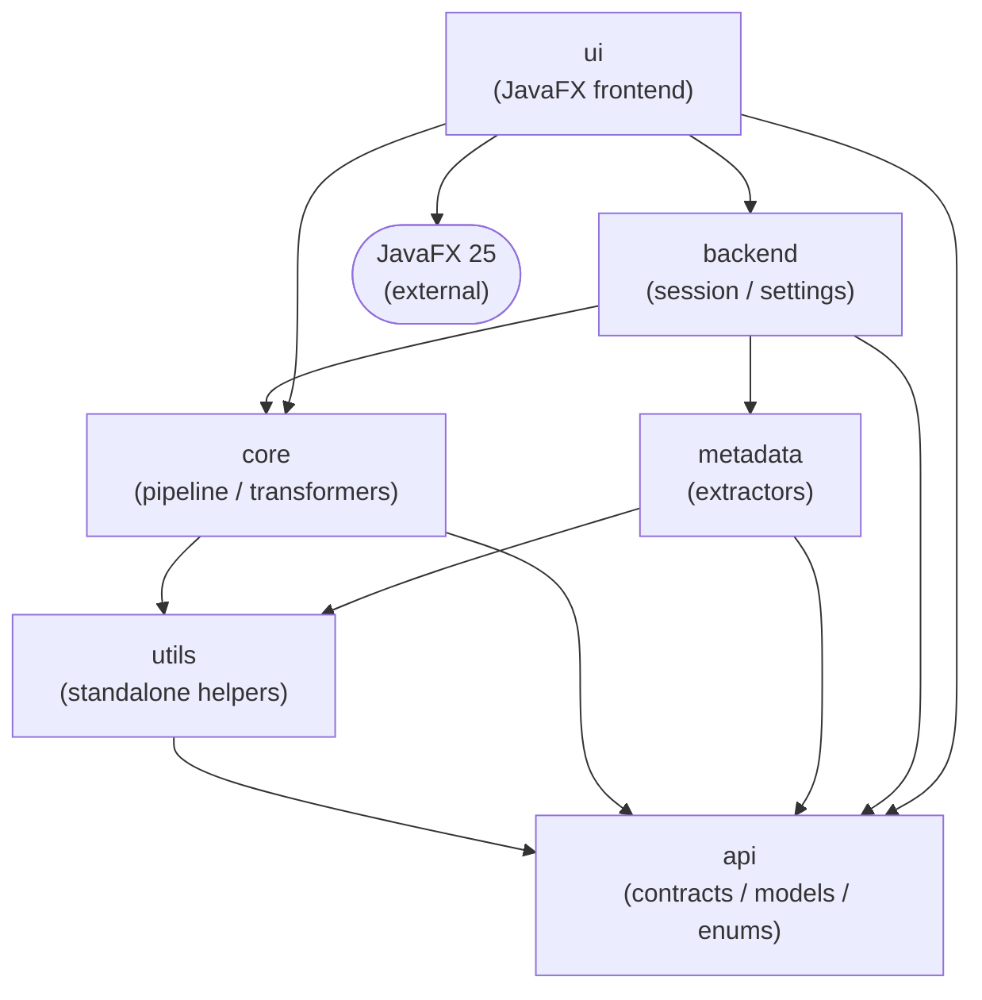
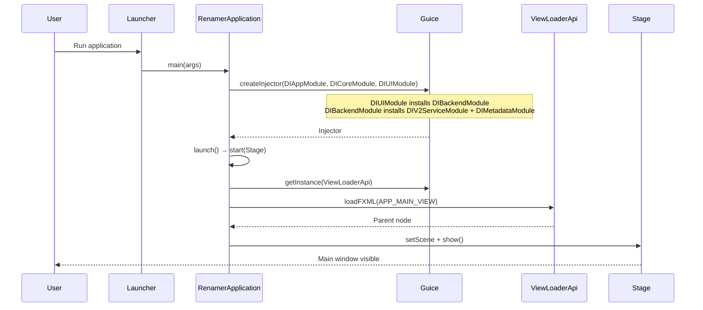
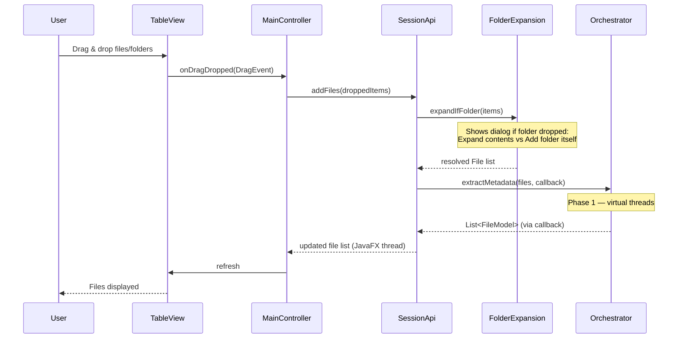
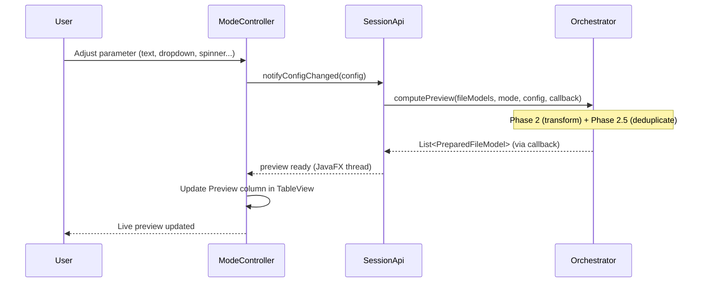
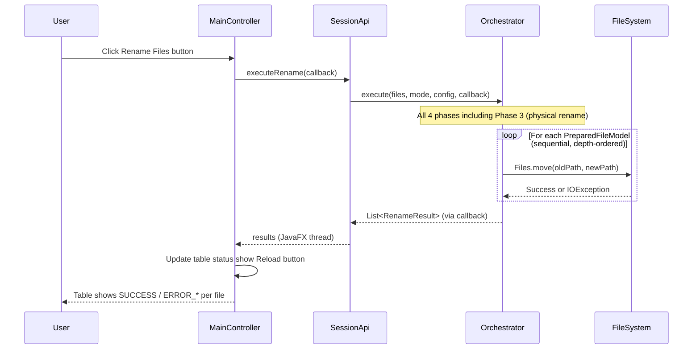
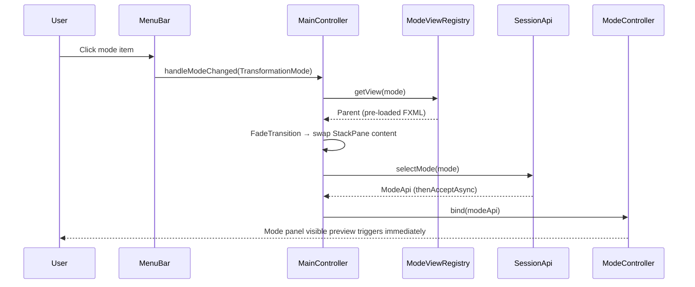
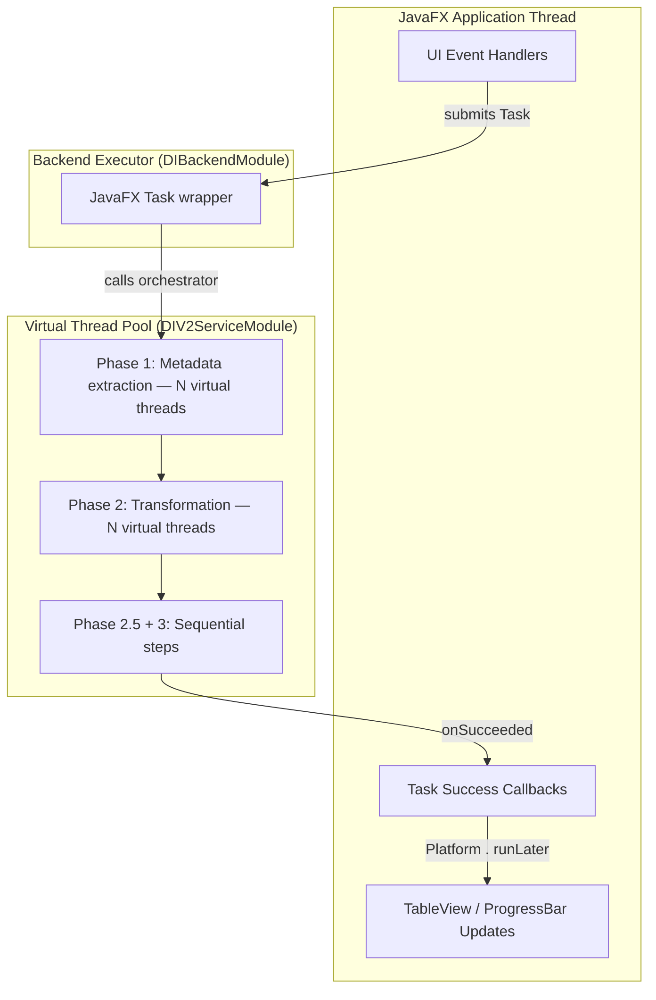
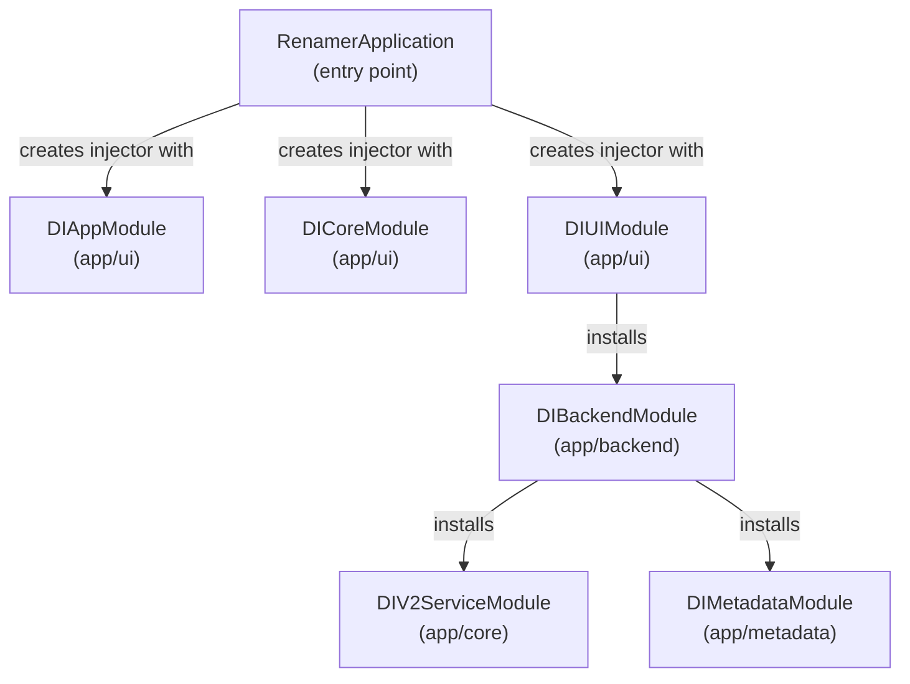

# Renamer App — Architecture Overview

## Table of Contents

1. [System Overview](#1-system-overview)
2. [Technology Stack](#2-technology-stack)
3. [Project Structure](#3-project-structure)
4. [Pipeline Architecture](#4-pipeline-architecture)
5. [Application Flows](#5-application-flows)
6. [Threading Model](#6-threading-model)
7. [Data Models](#7-data-models)
8. [Transformation Modes](#8-transformation-modes)
9. [Metadata Extraction](#9-metadata-extraction)
10. [Dependency Injection](#10-dependency-injection)
11. [Further Reading](#11-further-reading)

---

## 1. System Overview

**Renamer App** is a JavaFX 25 desktop application for batch file renaming. It extracts embedded metadata (EXIF dates,
image dimensions, audio tags, video streams) and applies one of 10 renaming modes to produce new filenames — with a live
preview before committing any changes to disk.

**10 renaming modes:**

- Add Text, Remove Text, Find & Replace, Change Case
- Add Date/Time (from EXIF or file system), Add Dimensions, Number Files
- Add Folder Name, Trim Name, Change Extension

The app follows a strict **multi-module clean architecture**: shared contracts in `api`, business logic in `core`,
metadata extraction in `metadata`, session management in `backend`, and JavaFX presentation in `ui`.
See [Project Overview](project-overview.md) for a deeper module walkthrough.

---

## 2. Technology Stack

| Component                 | Technology         | Version         |
|---------------------------|--------------------|-----------------|
| **Language**              | Java               | 25              |
| **UI Framework**          | JavaFX             | 25.0.2          |
| **Dependency Injection**  | Google Guice       | 7.0.0           |
| **Build Tool**            | Maven              | Multi-module    |
| **Boilerplate Reduction** | Lombok             | 1.18.44         |
| **Logging**               | SLF4J + Logback    | 2.0.17 / 1.5.32 |
| **MIME Detection**        | Apache Tika        | 3.3.0           |
| **Metadata Extraction**   | metadata-extractor | 2.19.0          |
| **Audio Metadata**        | jAudioTagger       | 2.0.19          |
| **Testing**               | JUnit 5 + Mockito  | 6.0.3 / 5.23.0  |

---

## 3. Project Structure

### 3.1 Module Organization

The app is a 6-module Maven project under `app/`. Each module has a single, bounded responsibility:

| Module     | Root Package              | Responsibility                                                                                                             |
|------------|---------------------------|----------------------------------------------------------------------------------------------------------------------------|
| `api`      | `ua.renamer.app.api`      | Shared interfaces, enums, and immutable models (`FileModel`, `PreparedFileModel`, `RenameResult`, config sealed interface) |
| `utils`    | `ua.renamer.app.utils`    | Standalone utility classes; **not imported by other modules**                                                              |
| `core`     | `ua.renamer.app.core`     | Rename pipeline: all 10 transformers, orchestrator, duplicate resolver, name validator                                     |
| `metadata` | `ua.renamer.app.metadata` | File metadata extractors: 20 image formats, 3 video formats, 19 audio formats                                              |
| `backend`  | `ua.renamer.app.backend`  | Session management (`SessionApi`), settings, folder expansion, logging config                                              |
| `ui`       | `ua.renamer.app.ui`       | JavaFX frontend: controllers, FXML, CSS, DI wiring, mode registry                                                          |

### 3.2 Directory Layout

```
renamer_app/
├── app/
│   ├── pom.xml                        # Parent POM (v2.0.0; dependency management)
│   ├── api/                           # Shared contracts module
│   │   └── src/main/java/ua/renamer/app/api/
│   │       ├── enums/                 # ItemPosition, TextCaseOptions, DateTimeSource, etc.
│   │       └── model/                 # FileModel, PreparedFileModel, RenameResult, RenameStatus,
│   │                                  #   TransformationMode, TransformationConfig (sealed)
│   ├── utils/                         # Standalone helpers (not imported by other modules)
│   ├── core/                          # Pipeline business logic
│   │   └── src/main/java/ua/renamer/app/core/
│   │       ├── config/                # DIV2ServiceModule
│   │       ├── mapper/                # ThreadAwareFileMapper
│   │       └── service/               # Transformers, orchestrator, validators
│   ├── metadata/                      # Metadata extraction
│   │   └── src/main/java/ua/renamer/app/metadata/
│   │       └── extractor/             # Category dispatchers + format-specific extractors
│   ├── backend/                       # Session and service layer
│   │   └── src/main/java/ua/renamer/app/backend/
│   │       ├── config/                # DIBackendModule
│   │       └── service/               # RenameSessionService, SettingsService, etc.
│   └── ui/                            # JavaFX frontend
│       └── src/main/
│           ├── java/ua/renamer/app/
│           │   ├── Launcher.java      # Entry point
│           │   ├── RenamerApplication.java
│           │   └── ui/
│           │       ├── config/        # DIAppModule, DICoreModule, DIUIModule
│           │       ├── controller/    # ApplicationMainViewController + 10 mode controllers
│           │       ├── widget/        # Custom JavaFX widgets
│           │       └── service/       # ViewLoaderService, ModeViewRegistry
│           └── resources/
│               ├── fxml/              # FXML view files
│               ├── images/            # Application icons
│               └── langs/             # 19 i18n resource bundles
├── scripts/
│   └── ai-build.sh                    # Sequential: compile → lint → test
├── docs/                              # Documentation
├── icon.png, icon.ico, icon.icns      # Platform icons
└── .github/workflows/                 # CI (ci.yml) and release workflows
```

### 3.3 Module Dependency Graph



**Key constraint:** `backend` has no `requires javafx.*` — it is a pure Java module enforced at compile time by JPMS.
The UI layer is the only module that depends on JavaFX.

---

## 4. Pipeline Architecture

The rename operation runs as a four-phase pipeline. The entry point is `FileRenameOrchestratorImpl` in
`ua.renamer.app.core.service.impl`.

### 4.1 Phase Overview

| Phase                          | Input                     | Output                    | Threading                                        | Key Class                                      |
|--------------------------------|---------------------------|---------------------------|--------------------------------------------------|------------------------------------------------|
| **1 — Metadata Extraction**    | `List<File>`              | `List<FileModel>`         | Parallel, virtual threads                        | `ThreadAwareFileMapper`                        |
| **2 — Transformation**         | `List<FileModel>`         | `List<PreparedFileModel>` | Parallel (9 modes) / sequential (`NUMBER_FILES`) | `FileTransformationService<C>` implementations |
| **2.5 — Duplicate Resolution** | `List<PreparedFileModel>` | `List<PreparedFileModel>` | Sequential                                       | `DuplicateNameResolverImpl`                    |
| **3 — Physical Rename**        | `List<PreparedFileModel>` | `List<RenameResult>`      | Sequential, depth-ordered                        | `RenameExecutionServiceImpl`                   |

### 4.2 Data Flow

```
File  ──Phase 1──▶  FileModel  ──Phase 2──▶  PreparedFileModel  ──Phase 2.5──▶  PreparedFileModel  ──Phase 3──▶  RenameResult
```

### 4.3 No-Throw Contract

The pipeline **never throws**. All errors are captured in model fields:

- `PreparedFileModel.hasError` / `PreparedFileModel.errorMessage` — transformation errors
- `RenameResult.status` (`RenameStatus` enum: `SUCCESS`, `SKIPPED`, `ERROR_EXTRACTION`, `ERROR_TRANSFORMATION`,
  `ERROR_EXECUTION`)

### 4.4 Preview vs Execute

The orchestrator exposes three entry points:

- `extractMetadata(files, callback)` — Phase 1 only (file drop)
- `computePreview(fileModels, mode, config, callback)` — Phases 2 + 2.5 (live preview)
- `execute(files, mode, config, callback)` / `executeAsync(...)` — all 4 phases (rename button)

See [Pipeline Architecture](pipeline-architecture.md) for the full sequence diagram and duplicate resolution algorithm.

---

## 5. Application Flows

### 5.1 Startup



### 5.2 File Drop



### 5.3 Live Preview



### 5.4 Rename Execution



### 5.5 Mode Change



---

## 6. Threading Model

### 6.1 Thread Architecture



### 6.2 Threading Rules

| Concern               | Mechanism                                                                             |
|-----------------------|---------------------------------------------------------------------------------------|
| Pipeline phases 1 & 2 | `Executors.newVirtualThreadPerTaskExecutor()` — one virtual thread per file           |
| Phase 2.5 & 3         | Sequential single-thread (ordering required)                                          |
| UI updates            | Always via `Platform.runLater()` or `Task.setOnSucceeded` (JavaFX Application Thread) |
| Background tasks      | Wrapped in JavaFX `Task<T>` submitted to `BackendExecutor` (`DIBackendModule`)        |
| `NUMBER_FILES` mode   | Explicitly sequential within Phase 2 — counter state is shared across files           |

**Rule:** No code outside `app/ui` may touch JavaFX APIs. The `backend` module enforces this at compile time via JPMS (
no `requires javafx.*`).

---

## 7. Data Models

The pipeline passes data through three immutable model classes:

| Model               | Package                    | Produced By                                | Fields                                                   |
|---------------------|----------------------------|--------------------------------------------|----------------------------------------------------------|
| `FileModel`         | `ua.renamer.app.api.model` | `ThreadAwareFileMapper`                    | File attributes + extracted metadata (image/video/audio) |
| `PreparedFileModel` | `ua.renamer.app.api.model` | Transformers / `DuplicateNameResolverImpl` | Original file ref + new name + error state               |
| `RenameResult`      | `ua.renamer.app.api.model` | `RenameExecutionServiceImpl`               | Original + new path + `RenameStatus`                     |

All models use `@Builder(setterPrefix = "with")` — the non-standard prefix is critical; `file.withOriginalFile(f)` not
`file.originalFile(f)`.

→ **Full reference:** [Data Models](data-models.md)

---

## 8. Transformation Modes

Each of the 10 modes is implemented as a `FileTransformationService<C>` where `C` is a sealed config class from
`ua.renamer.app.api.model.config`:

```java
public sealed interface TransformationConfig
        permits AddTextConfig, RemoveTextConfig, ReplaceTextConfig,
        CaseChangeConfig, DateTimeConfig, ImageDimensionsConfig,
        SequenceConfig, ParentFolderConfig, TruncateConfig,
        ExtensionChangeConfig {
}
```

Config classes use `@Value @Builder(setterPrefix = "with")` with validation in the builder's `build()` method.
Transformer implementations live in `ua.renamer.app.core.service.transformation`.

→ **Full reference:** [Transformation Modes](transformation-modes.md) · [Mode State Machines](MODE_STATE_MACHINES.md)

---

## 9. Metadata Extraction

Metadata extraction happens in Phase 1. A `CategoryFileMetadataExtractorResolver` dispatches by file category (IMAGE /
AUDIO / VIDEO / GENERIC) to a category-specific extractor, which routes to a format-specific implementation.

**Supported formats:**

- **Image (20):** JPEG, PNG, GIF, BMP, TIFF, WebP, HEIC/HEIF, AVIF, ICO, PCX, EPS, PSD, ARW, CR2, CR3, NEF, ORF, RAF,
  RW2, DNG
- **Audio (19):** MP3, WAV, FLAC, OGG, WMA, AIFF, APE, and more via jAudioTagger
- **Video (3):** MP4, QuickTime (MOV), AVI

Extracted metadata flows into `FileModel` as `FileMeta` (containing optional `ImageMeta`, `VideoMeta`, or `AudioMeta`).

→ **Full reference:** [Metadata Extraction](metadata-extraction.md)

---

## 10. Dependency Injection

The app uses **Google Guice 7** with constructor injection only. Six modules wire the entire object graph:



| Module              | Key Bindings                                                                                                          |
|---------------------|-----------------------------------------------------------------------------------------------------------------------|
| `DIAppModule`       | `LanguageTextRetrieverApi`, `ResourceBundle`, UI `ExecutorService`                                                    |
| `DICoreModule`      | `NameValidator`, `TextExtractorByKey`                                                                                 |
| `DIUIModule`        | 10 mode controllers, converters, widgets, `ModeViewRegistry`, `FxStateMirror`                                         |
| `DIBackendModule`   | `SessionApi → RenameSessionService`, `SettingsService`, `BackendExecutor` (virtual threads), `FolderExpansionService` |
| `DIV2ServiceModule` | `FileRenameOrchestrator`, `DuplicateNameResolver`, `RenameExecutionService`, 10 transformers                          |
| `DIMetadataModule`  | `FileMetadataMapper`, `CategoryFileMetadataExtractorResolver`, all extractors                                         |

**Constructor injection only** — no field injection, no setter injection:

```java

@RequiredArgsConstructor(onConstructor_ = {@Inject})
public class MyService {
    private final SomeDependency dependency;
}
```

→ **Full reference:** [Dependency Injection](dependency-injection.md)

---

## 11. Further Reading

### Architecture

| Document                                          | Contents                                                           |
|---------------------------------------------------|--------------------------------------------------------------------|
| [Project Overview](project-overview.md)           | Module map, JPMS design decisions, tech stack                      |
| [Pipeline Architecture](pipeline-architecture.md) | Full sequence diagram, phase details, no-throw contract            |
| [Transformation Modes](transformation-modes.md)   | Strategy pattern, sealed config interface, all 10 mode specs       |
| [Mode State Machines](MODE_STATE_MACHINES.md)     | Per-mode state diagrams, algorithms, validation rules              |
| [Metadata Extraction](metadata-extraction.md)     | Extractor hierarchy, all supported formats, `FileMeta` structure   |
| [Data Models](data-models.md)                     | `FileModel`, `PreparedFileModel`, `RenameResult`, builder patterns |
| [Dependency Injection](dependency-injection.md)   | All 6 modules, bindings, mode registration pattern                 |

### Developer Guides

| Document                                                        | Contents                                                                    |
|-----------------------------------------------------------------|-----------------------------------------------------------------------------|
| [Add Transformation Mode](../guides/add-transformation-mode.md) | Step-by-step guide: config class → transformer → UI controller → DI → tests |
| [Add Language](../guides/add-language.md)                       | Adding a new UI language                                                    |
| [Build & Package](../guides/build-and-package.md)               | Build commands, native installer builds, CI pipeline                        |
| [Cross-Platform Notes](../guides/cross-platform-notes.md)       | macOS/Linux/Windows environment specifics                                   |

### Reference

| Document                                             | Contents                                                      |
|------------------------------------------------------|---------------------------------------------------------------|
| [AI Agent Setup](../reference/ai-agent-setup.md)     | Claude Code agents, skills, MCP servers, development workflow |
| [Testing Strategy](../reference/testing-strategy.md) | Test conventions, integration tests, coverage                 |
| [UI Architecture](../reference/ui-architecture.md)   | JavaFX layout, FXML structure, CSS system, mode controllers   |
| [Settings System](../reference/settings-system.md)   | Language and log level settings                               |
