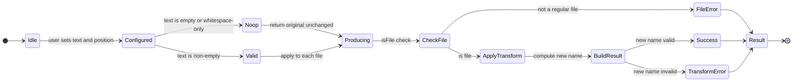
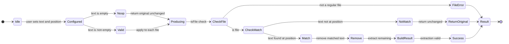

# Application Mode State Machines

**Document Type:** Technical Reference
**Status:** Finalized
**Date:** 2026-04-09
**Audience:** Engineering team maintaining and extending the Renamer App
**Scope:** State machines, parameter contracts, and validation rules for all 10 Renamer App transformation modes

---

## Table of Contents

1. [Overview and Shared Infrastructure](#1-overview-and-shared-infrastructure)
2. [State Machine Notation](#2-state-machine-notation)
3. [Mode 1: Add Text](#3-mode-1-add-text)
4. [Mode 2: Remove Text](#4-mode-2-remove-text)
5. [Mode 3: Replace Text](#5-mode-3-replace-text)
6. [Mode 4: Change Case](#6-mode-4-change-case)
7. [Mode 5: Number Files](#7-mode-5-number-files)
8. [Mode 6: Trim Name](#8-mode-6-trim-name)
9. [Mode 7: Change Extension](#9-mode-7-change-extension)
10. [Mode 8: Add Date & Time](#10-mode-8-add-date--time)
11. [Mode 9: Add Dimensions](#11-mode-9-add-dimensions)
12. [Mode 10: Add Folder Name](#12-mode-10-add-folder-name)
13. [Conflict Resolution State Machine](#13-conflict-resolution-state-machine)
14. [Cross-Mode Concerns](#14-cross-mode-concerns)

---

## 1. Overview and Shared Infrastructure

### 1.1 Transformation Modes and Enums

| Mode Number | Mode Name        | Enum Value         | Parallelizable | Sequential Requirement                    |
|-------------|------------------|--------------------|----------------|-------------------------------------------|
| 1           | Add Text         | `ADD_TEXT`         | ✅ YES          | None                                      |
| 2           | Remove Text      | `REMOVE_TEXT`      | ✅ YES          | None                                      |
| 3           | Replace Text     | `REPLACE_TEXT`     | ✅ YES          | None                                      |
| 4           | Change Case      | `CHANGE_CASE`      | ✅ YES          | None                                      |
| 5           | Number Files     | `NUMBER_FILES`     | ❌ **NO**       | Must sort files; apply sequence in order  |
| 6           | Trim Name        | `TRIM_NAME`        | ✅ YES          | None                                      |
| 7           | Change Extension | `CHANGE_EXTENSION` | ✅ YES          | None                                      |
| 8           | Add Date & Time  | `ADD_DATETIME`     | ✅ YES          | None (metadata extraction is thread-safe) |
| 9           | Add Dimensions   | `ADD_DIMENSIONS`   | ✅ YES          | None (metadata extraction is thread-safe) |
| 10          | Add Folder Name  | `ADD_FOLDER_NAME`  | ✅ YES          | None                                      |

**Enumeration:** `TransformationMode` in `ua.renamer.app.api.model`

---

### 1.2 Position Enums (Shared Across Modes)

**`ItemPosition`** (used by Add Text, Remove Text, Add Folder Name):

- `BEGIN` — position at start of filename
- `END` — position at end of filename

**`ItemPositionExtended`** (used by Replace Text only):

- `BEGIN` — replace/insert at start
- `END` — replace/insert at end
- `EVERYWHERE` — replace all occurrences

**`ItemPositionWithReplacement`** (used by Add Date & Time, Add Dimensions):

- `BEGIN` — insert at start of filename
- `END` — insert at end of filename
- `REPLACE` — replace entire filename with new value

---

### 1.3 SortSource Enum (Number Files Mode Only)

Used by Mode 5 to determine file ordering before sequence number assignment:

| Value                            | Source                                  | Null Handling               | Notes                                 |
|----------------------------------|-----------------------------------------|-----------------------------|---------------------------------------|
| `FILE_NAME`                      | Alphabetical filename                   | Sorted first                | Case-sensitive                        |
| `FILE_PATH`                      | Full path string                        | Sorted first                | Case-sensitive                        |
| `FILE_SIZE`                      | Bytes                                   | Sorted first (0 as default) | Numeric sort                          |
| `FILE_CREATION_DATETIME`         | Filesystem creation timestamp           | Sorted first                | Filesystem-dependent; nullable        |
| `FILE_MODIFICATION_DATETIME`     | Filesystem last modified timestamp      | Sorted first                | Always available (fallback: creation) |
| `FILE_CONTENT_CREATION_DATETIME` | EXIF DateTimeOriginal or video creation | Sorted first                | Images/videos only; nullable          |
| `IMAGE_WIDTH`                    | Width in pixels                         | Sorted first (0 as default) | Images only                           |
| `IMAGE_HEIGHT`                   | Height in pixels                        | Sorted first (0 as default) | Images only                           |

---

### 1.4 RenameStatus Enum (Error Tracking)

The pipeline never throws exceptions. Errors are captured in `PreparedFileModel.hasError` and
`PreparedFileModel.errorMessage`, with phase information in `RenameResult.status`:

| Status                 | Phase          | Meaning                                                                | Recoverable                               |
|------------------------|----------------|------------------------------------------------------------------------|-------------------------------------------|
| `SUCCESS`              | Execution      | File renamed successfully                                              | —                                         |
| `SKIPPED`              | Any            | File was skipped (user action or validation)                           | —                                         |
| `ERROR_EXTRACTION`     | Extraction     | Metadata extraction failed (e.g., image file is corrupted)             | No (skip file)                            |
| `ERROR_TRANSFORMATION` | Transformation | Transformation produced invalid name (e.g., empty after truncation)    | No (skip file)                            |
| `ERROR_EXECUTION`      | Execution      | Physical rename failed (target exists or filesystem permission denied) | Possible (retry with conflict resolution) |

---

### 1.5 Conflict Resolution Overview

**Definition:** Two or more files in the batch generate the same new filename (after transformation but before physical
rename).

**When Conflicts Occur:**

- Mode 5 (Number Files) with `stepValue=0` — all files receive the same sequence number
- Mode 1 (Add Text) applied to files with different extensions and same base name
- Any mode with deterministic output and overlapping input patterns

**Resolution Strategy:**

1. **Phase 2.5 (DuplicateNameResolverImpl — Sequential):** After all per-file transformations, groups files by final
   name. For each group with 2+ files:
    - Keep first file unchanged
    - Append ` (01)`, ` (02)`, etc. to remaining files' names
    - Smart padding: if original filename contains leading zeros, pad conflict counter to match those zeros

2. **Phase 4 (RenameExecutionServiceImpl — Parallel):** Before physical rename, checks `Files.exists(newPath)` for each
   prepared file. If target already exists on disk:
    - Return `ERROR_EXECUTION` status
    - Do NOT rename
    - This catches conflicts with pre-existing files outside the batch

**Key Property:** Conflict resolution is cascading-safe. `DuplicateNameResolverImpl` uses `usedNames` tracking to
prevent cascading conflicts when one file's conflict suffix creates a collision with another file's base name.

**Important Implication:** Conflict resolution runs **after** transformation but **before** disk rename. This means:

- Preview output must include conflict-resolved names (with ` (01)` suffixes)
- Preview and execution use identical resolution logic
- Cannot predict final filenames during transformation phase

---

### 1.6 Name Validation (NameValidator)

All new filenames pass through `NameValidator` (`ua.renamer.app.core.service.validator.impl`) during the transformation
phase:

| Rule                   | Restriction                                    | Applies To    | Notes                                                      |
|------------------------|------------------------------------------------|---------------|------------------------------------------------------------|
| Non-null               | Cannot be `null`                               | All filenames | Checked before extension append                            |
| Non-empty              | Cannot be empty string                         | All filenames | Empty string after transformation = `ERROR_TRANSFORMATION` |
| No forward slash       | `/` forbidden                                  | All filenames | Path traversal prevention                                  |
| No colon               | `:` forbidden                                  | All filenames | Windows drive letter conflict prevention                   |
| Windows reserved chars | `\ * ? < > \|` forbidden                       | Windows only  | OS-specific; other platforms allow                         |
| Windows reserved names | `CON`, `PRN`, `AUX`, `NUL`, `COM1–9`, `LPT1–9` | Windows only  | Case-insensitive check                                     |
| OS path validity       | Uses `FileSystems.getDefault().getPath()`      | OS-specific   | Slow validation; used as final check                       |

---

### 1.7 No-Throw Contract

The pipeline (Orchestrator → Transformer → DuplicateResolver → Executor) never throws:

```java
try{
PreparedFileModel result = transformer.transform(file, config);
// result.hasError() will be true if any validation failed
// result.errorMessage() contains human-readable error
}catch(
Exception e){
        // This never happens. The pipeline guarantees no-throw.
        // Errors are captured in PreparedFileModel fields.
        }
```

**Implication:** Parameter configs validate during controller initialization (UI-time, before submission), not during
transformation. Transformation-time errors are file-specific (e.g., non-image file with Add Dimensions mode), not
parameter-specific.

---

## 2. State Machine Notation

This document uses **Mermaid `stateDiagram-v2`** syntax to describe the lifecycle of each mode from user configuration
through file transformation.

### 2.1 State Categories

- **`IDLE`** — Initial state; user has not configured this mode yet
- **`CONFIGURED`** — User has entered parameters; validation may or may not have run
- **`VALID`** — Parameters have been validated and found acceptable
- **`NOOP`** — Parameters are effectively no-op (e.g., empty text in Add Text mode); transformation will return original
  filename unchanged
- **`PRODUCING`** — Transformation is in progress (per-file state if parallelized)
- **`SUCCESS`** — Transformation completed successfully for this file
- **`FILE_ERROR`** — File-level error (e.g., not a file, not readable, metadata unavailable)
- **`CONFLICT`** — Name conflict with another file in batch (resolved by Phase 2.5)
- **`RESULT`** — Final state; file has a renamed result (success, error, or skipped)

### 2.2 Transition Triggers

- **`[user sets param]`** — User has edited a parameter field
- **`[validate]`** — Validation logic runs (before transformation)
- **`[apply to batch]`** — Batch transformation begins (per-file applies)
- **`[success]`** — New filename is valid and unique
- **`[file check]`** — Filesystem or metadata check (e.g., `isFile()`)
- **`[null/invalid]`** — Validation failed

---

## 3. Mode 1: Add Text

### 3.1 State Machine



### 3.2 Parameters

`textToAdd: String`, `position: ItemPosition`

### 3.3 Algorithm

```
Input: originalFileName, position, textToAdd
Output: newFileName (or error)

1. If textToAdd is empty or null:
   Return originalFileName (no-op)

2. If position == BEGIN:
   newFileName = textToAdd + originalFileName

3. Else (position == END):
   newFileName = originalFileName + textToAdd

4. Validate newFileName (NameValidator)
   If invalid: return error
   Else: return newFileName

5. Extension is NOT affected (unchanged)
```

### 3.4 Validation Rules

| Parameter   | Rule             | Severity                                                             |
|-------------|------------------|----------------------------------------------------------------------|
| `textToAdd` | Non-null         | MUST be non-null (empty string allowed)                              |
| `textToAdd` | Type             | MUST be `String`                                                     |
| `position`  | Required         | MUST be one of: `BEGIN`, `END`                                       |
| Output      | Non-empty        | If text is empty, treated as no-op (not an error)                    |
| Output      | No special chars | Final name must pass `NameValidator` (no `/`, `:`, Windows reserved) |

### 3.5 Edge Cases

| Input                                     | Behavior                                                            |
|-------------------------------------------|---------------------------------------------------------------------|
| Empty text (`""`)                         | No-op; return original                                              |
| Whitespace-only text (`"   "`)            | Appended as-is; becomes part of filename                            |
| Unicode/emoji in text                     | Appended as-is (no escaping)                                        |
| Text with path separators (`text="/foo"`) | ⚠️ Appended as-is; likely triggers NameValidator error              |
| Very long text                            | Combined name may exceed filesystem limit; NameValidator catches it |

### 3.6 Parallelization

**Parallelizable: YES** — Each file's text addition is independent. No shared state. No ordering requirement.

---

## 4. Mode 2: Remove Text

### 4.1 State Machine



### 4.2 Parameters

`textToRemove: String`, `position: ItemPosition`

### 4.3 Algorithm

```
Input: originalFileName, position, textToRemove
Output: newFileName (or error)

1. If textToRemove is empty or null:
   Return originalFileName (no-op)

2. If position == BEGIN:
   If originalFileName.startsWith(textToRemove):
       newFileName = originalFileName.substring(textToRemove.length())
   Else:
       Return originalFileName (no match, no change)

3. Else (position == END):
   If originalFileName.endsWith(textToRemove):
       newFileName = originalFileName.substring(0, length - textToRemove.length())
   Else:
       Return originalFileName (no match, no change)

4. Validate newFileName (NameValidator)
   If invalid: return error
   Else: return newFileName

5. Extension is NOT affected (unchanged)
```

### 4.4 Validation Rules

| Parameter        | Rule                 | Severity                                    |
|------------------|----------------------|---------------------------------------------|
| `textToRemove`   | Non-null             | MUST be non-null (empty string allowed)     |
| `textToRemove`   | Type                 | MUST be `String`                            |
| `position`       | Required             | MUST be one of: `BEGIN`, `END`              |
| Matching         | Not required         | No match at position = no-op (not an error) |
| Case sensitivity | Exact match required | Matching is case-sensitive                  |

### 4.5 Edge Cases

| Input                     | Behavior                                                                      |
|---------------------------|-------------------------------------------------------------------------------|
| Empty text                | No-op; return original                                                        |
| Text longer than filename | No match; return original                                                     |
| Text partially matches    | No removal; return original (only removes exact match at position)            |
| Multiple occurrences      | Only at position removed; BEGIN/END remove only one occurrence                |
| Removing entire name      | Allowed; results in empty string → NameValidator returns ERROR_TRANSFORMATION |

### 4.6 Parallelization

**Parallelizable: YES** — Text matching and removal are independent per-file.

---

## 5. Mode 3: Replace Text

### 5.1 State Machine

```mermaid
stateDiagram-v2
    direction LR
    [*] --> Idle
    Idle --> Configured: user sets text, replacement, position
    Configured --> Noop: textToReplace is empty
    Configured --> Valid: textToReplace is non-empty
    Valid --> Producing: apply to each file
    Noop --> Producing: return original unchanged
    Producing --> CheckFile: isFile check
    CheckFile --> FileError: not a regular file
    CheckFile --> SelectStrategy: is file
    SelectStrategy --> StrategyBegin: position == BEGIN
    SelectStrategy --> StrategyEnd: position == END
    SelectStrategy --> StrategyEverywhere: position == EVERYWHERE
    StrategyBegin --> CheckStartMatch: check startsWith
    StrategyEnd --> CheckEndMatch: check endsWith
    StrategyEverywhere --> ReplaceAll: String.replace all
    CheckStartMatch --> StartMatch: match found
    CheckStartMatch --> NoMatch: no match
    CheckEndMatch --> EndMatch: match found
    CheckEndMatch --> NoMatch: no match
    StartMatch --> BuildStart: replace at start
    EndMatch --> BuildEnd: replace at end
    ReplaceAll --> BuildEverywhere: replace all occurrences
    NoMatch --> ReturnOriginal: return unchanged
    BuildStart --> ValidateResult: validate result
    BuildEnd --> ValidateResult
    BuildEverywhere --> ValidateResult
    ValidateResult --> Success: valid
    ValidateResult --> TransformError: invalid
    Success --> Result
    FileError --> Result
    ReturnOriginal --> Result
    TransformError --> Result
    Result --> [*]
```



### 5.2 Parameters

`textToReplace: String`, `replacementText: String`, `position: ItemPositionExtended`

### 5.3 Algorithm

**Note:** Text matching uses **literal string matching** (not regex). User input is never interpreted as a pattern.

```
Input: originalFileName, textToReplace, replacementText, position
Output: newFileName (or error)

1. If textToReplace is empty or null:
   Return originalFileName (no-op)

2. If position == BEGIN:
   If originalFileName.startsWith(textToReplace):
       newFileName = replacementText + originalFileName.substring(textToReplace.length())
   Else:
       Return originalFileName (no match)

3. Else If position == END:
   If originalFileName.endsWith(textToReplace):
       newFileName = originalFileName.substring(0, length - textToReplace.length()) + replacementText
   Else:
       Return originalFileName (no match)

4. Else (position == EVERYWHERE):
   newFileName = originalFileName.replace(textToReplace, replacementText)
   // All occurrences replaced; non-overlapping semantics

5. Validate newFileName
   If invalid: return error
   Else: return newFileName

6. Extension is NOT affected (unchanged)
```

### 5.4 Validation Rules

| Parameter         | Rule         | Severity                                     |
|-------------------|--------------|----------------------------------------------|
| `textToReplace`   | Non-null     | MUST be non-null (empty string allowed)      |
| `replacementText` | Non-null     | MUST be non-null (empty string removes text) |
| `position`        | Required     | MUST be one of: `BEGIN`, `END`, `EVERYWHERE` |
| Matching          | Not required | No match = no-op (not an error)              |
| Case sensitivity  | Exact match  | Matching is case-sensitive                   |

### 5.5 Edge Cases

| Input                                       | Behavior                                                  |
|---------------------------------------------|-----------------------------------------------------------|
| `textToReplace=""`                          | No-op; return original                                    |
| `replacementText=""`                        | Removes `textToReplace` without replacement               |
| `position=BEGIN`, pattern not at start      | No replacement; return original                           |
| `position=EVERYWHERE`, overlapping patterns | Non-overlap semantics: `"aaa".replace("aa","X")` = `"Xa"` |

### 5.6 Parallelization

**Parallelizable: YES** — Text replacement is independent per-file (no shared counters or dependencies).

---

## 6. Mode 4: Change Case

### 6.1 State Machine

```mermaid
stateDiagram-v2
    direction LR
    [*] --> Idle
    Idle --> Configured: user selects case and capitalization
    Configured --> Valid: parameters set
    Valid --> Producing: apply to each file
    Producing --> CheckFile: isFile check
    CheckFile --> FileError: not a regular file
    CheckFile --> AnalyzeCase: is file
    AnalyzeCase --> SeparateWords: identify word boundaries
    SeparateWords --> ApplyCase: apply case transformation
    ApplyCase --> CheckCapitalize: capitalizeFirstLetter flag
    CheckCapitalize --> NoCapitalize: false
    CheckCapitalize --> Capitalize: true
    NoCapitalize --> BuildResult: build new name
    Capitalize --> CapitalizeFirst: uppercase first char
    CapitalizeFirst --> BuildResult
    BuildResult --> ValidateResult: validate
    ValidateResult --> Success: valid
    ValidateResult --> TransformError: empty result
    Success --> Result
    FileError --> Result
    TransformError --> Result
    Result --> [*]
```



### 6.2 Parameters

`caseOption: TextCaseOptions`, `capitalizeFirstLetter: boolean`

### 6.3 Algorithm

#### **Word Separation (Applied to All Non-Simple Cases):**

```
Input: originalFileName
Output: List<String> words

1. Replace delimiters with space: replace [_.-] with space
2. Split by whitespace: words = name.split("\\s+")
3. Split camelCase boundaries:
   Split where lowercase→uppercase transition (aB → a|B)
   Regex: (?<=[a-z])(?=[A-Z])
4. Split alphanumeric boundaries:
   Split where digit↔letter transition
   Regex: (?<=\d)(?=\D)|(?<=\D)(?=\d)
5. Filter: remove empty or blank-only words
```

**Example:** `"myFileName_test.123value"` → `["my", "File", "Name", "test", "123", "value"]`

#### **Case Algorithms:**

| Case Option            | Algorithm                                          | Example Input        | Example Output       |
|------------------------|----------------------------------------------------|----------------------|----------------------|
| `CAMEL_CASE`           | First word lowercase, rest TitleCase, no separator | `"Hello World Test"` | `"helloWorldTest"`   |
| `PASCAL_CASE`          | All words TitleCase, no separator                  | `"hello world test"` | `"HelloWorldTest"`   |
| `SNAKE_CASE`           | All words lowercase, joined by `_`                 | `"Hello World Test"` | `"hello_world_test"` |
| `SNAKE_CASE_SCREAMING` | All words UPPERCASE, joined by `_`                 | `"hello world test"` | `"HELLO_WORLD_TEST"` |
| `KEBAB_CASE`           | All words lowercase, joined by `-`                 | `"hello world test"` | `"hello-world-test"` |
| `UPPERCASE`            | Direct `.toUpperCase()` (no word split)            | `"helloWorld"`       | `"HELLOWORLD"`       |
| `LOWERCASE`            | Direct `.toLowerCase()` (no word split)            | `"HelloWorld"`       | `"helloworld"`       |
| `TITLE_CASE`           | All words TitleCase, joined by space               | `"hello world test"` | `"Hello World Test"` |

#### **Capitalization (Applied After Case Conversion):**

```
If capitalizeFirstLetter == true:
    newName = newName.charAt(0).toUpperCase() + newName.substring(1)
```

### 6.4 Validation Rules

| Parameter               | Rule      | Severity                                    |
|-------------------------|-----------|---------------------------------------------|
| `caseOption`            | Required  | MUST be one of 8 enum values                |
| `capitalizeFirstLetter` | Type      | MUST be `boolean` (default: false)          |
| Input                   | Non-empty | If filename is empty/blank, return original |
| Word list               | Not empty | If no words extracted, return original      |

### 6.5 Edge Cases

| Input                                    | Behavior                                                                        |
|------------------------------------------|---------------------------------------------------------------------------------|
| Empty filename                           | Return original unchanged                                                       |
| Only delimiters (`"___"`)                | Word list empty; return original (delimiters consumed and not preserved)        |
| Leading/trailing delimiters (`"_test_"`) | Stripped during word separation → `["test"]`                                    |
| Numeric words (`"hello123world"`)        | Split into `["hello", "123", "world"]` (numbers are word boundaries)            |
| Unicode/emoji                            | Treated as non-alphanumeric; not split on; remain in output                     |
| Single character                         | No delimiters to process; direct case applied (e.g., `"a"` + UPPERCASE = `"A"`) |
| `capitalize=true` on empty filename      | Guards with `isEmpty()` check; returns original                                 |

### 6.6 Parallelization

**Parallelizable: YES** — Each file's case conversion is independent.

---

## 7. Mode 5: Number Files

### 7.1 State Machine

```mermaid
stateDiagram-v2
    direction LR
    [*] --> Idle
    Idle --> Configured: user sets sort, start, step, padding
    Configured --> Valid: parameters set
    Valid --> BatchSort: **SEQUENTIAL ONLY** sort all files
    BatchSort --> SortBySource: apply SortSource criteria
    SortBySource --> ApplySequence: **SEQUENTIAL** assign numbers
    ApplySequence --> FileLoop: for each file in sorted order
    FileLoop --> CheckFile: isFile check
    CheckFile --> FileError: not a regular file
    CheckFile --> IncrementCounter: is file
    IncrementCounter --> FormatNumber: format with padding
    FormatNumber --> ReplaceFilename: new name = formatted number
    ReplaceFilename --> ValidateResult: validate
    ValidateResult --> Success: valid
    ValidateResult --> TransformError: empty or invalid
    Success --> NextFile: loop
    FileError --> NextFile
    NextFile --> FileLoop: more files
    NextFile --> Complete: all done
    Complete --> Result
    Result --> [*]
```



### 7.2 Parameters

`sortSource: SortSource`, `startNumber: int`, `stepValue: int`, `padding: int`

### 7.3 Algorithm

```
Input: List<File> files, SortSource sortSource, int startNumber, int stepValue, int padding
Output: List<PreparedFileModel> with sequence names

1. Sort all files by sortSource criteria (see section 1.3):
   - If sorting by date/dimensions and value is null, place at beginning

2. Initialize counter = startNumber

3. For each file in sorted order:
   a. Check isFile() → skip if directory
   b. newNumber = counter
   c. counter += stepValue
   d. Format newNumber:
      - If padding == 0: use raw number (e.g., "5")
      - If padding > 0: zero-pad to padding digits (e.g., "00005")
   e. newFileName = formattedNumber (REPLACES entire original name!)
   f. Validate newFileName
   g. If valid: return as PreparedFileModel
      Else: return as ERROR_TRANSFORMATION

4. Extension remains unchanged

5. ** CRITICAL: This mode MUST be sequential.
   Do NOT parallelize.
   Single-file transform() throws UnsupportedOperationException.
```

### 7.4 Validation Rules

| Parameter      | Rule        | Severity                                                       |
|----------------|-------------|----------------------------------------------------------------|
| `startNumber`  | Type        | MUST be `int` (can be negative)                                |
| `stepValue`    | Type        | MUST be `int` (can be negative for descending)                 |
| `padding`      | Type        | MUST be `int` >= 0                                             |
| Input          | Non-empty   | Empty file list → empty result                                 |
| Sequence space | Not checked | `startNumber + fileCount * stepValue` can overflow; latent bug |

### 7.5 Edge Cases

| Input                     | Behavior                                                                           |
|---------------------------|------------------------------------------------------------------------------------|
| `stepValue = 0`           | All files get same number → triggers duplicate conflict resolution                 |
| `stepValue < 0`           | Descending sequence (e.g., start=100, step=-1 → 100, 99, 98...)                    |
| `startNumber < 0`         | Negative sequence numbers allowed                                                  |
| `padding > actual digits` | Zero-padding applied (e.g., `padding=5`, `number=42` → `"00042"`)                  |
| `padding = 0`             | No padding; raw numbers: 1, 2, 3...                                                |
| ⚠️ File order stability   | If two files are equal by sortSource, order is undefined and may vary between runs |

### 7.6 Parallelization

**Parallelizable: NO** — MUST be sequential.

- Counter state is shared across all files
- Files must be processed in sorted order to produce deterministic sequence assignment
- **Must call `transformBatch(files, config)`, NOT `transform(file, config)`**
- Single-file `transform()` throws `UnsupportedOperationException`

---

## 8. Mode 6: Trim Name

### 8.1 State Machine

```mermaid
stateDiagram-v2
    direction LR
    [*] --> Idle
    Idle --> Configured: user sets truncation option and count
    Configured --> Valid: parameters set
    Valid --> Producing: apply to each file
    Producing --> CheckFile: isFile check
    CheckFile --> FileError: not a regular file
    CheckFile --> SelectStrategy: is file
    SelectStrategy --> StrategyBegin: REMOVE_SYMBOLS_IN_BEGIN
    SelectStrategy --> StrategyEnd: REMOVE_SYMBOLS_FROM_END
    SelectStrategy --> StrategyTrim: TRUNCATE_EMPTY_SYMBOLS
    StrategyBegin --> CheckBeginCount: numberOfSymbols < 1
    CheckBeginCount --> NoOpBegin: return original
    CheckBeginCount --> SubstringBegin: substring(numberOfSymbols)
    StrategyEnd --> CheckEndCount: numberOfSymbols < 1
    CheckEndCount --> NoOpEnd: return original
    CheckEndCount --> SubstringEnd: substring(0, length - numberOfSymbols)
    StrategyTrim --> TrimWhitespace: String.trim()
    TrimWhitespace --> BuildResult: build result
    SubstringBegin --> ValidateBegin: validate result
    SubstringEnd --> ValidateEnd: validate result
    ValidateBegin --> CheckEmpty: empty string?
    ValidateEnd --> CheckEmpty: empty string?
    BuildResult --> CheckEmpty: check result
    CheckEmpty --> EmptyError: empty result is ERROR_TRANSFORMATION
    CheckEmpty --> Success: non-empty result
    Success --> Result
    FileError --> Result
    NoOpBegin --> Result
    NoOpEnd --> Result
    EmptyError --> Result
    Result --> [*]
```



### 8.2 Parameters

`truncateOptions: TruncateOptions`, `numberOfSymbols: int`

### 8.3 Algorithm

```
Input: originalFileName, truncateOptions, numberOfSymbols
Output: newFileName (or error)

1. If numberOfSymbols < 1:
   Return originalFileName (no-op)

2. Switch truncateOptions:

   a) REMOVE_SYMBOLS_IN_BEGIN:
      newFileName = originalFileName.substring(numberOfSymbols)
      // If numberOfSymbols >= length: result is empty string

   b) REMOVE_SYMBOLS_FROM_END:
      newFileName = originalFileName.substring(0, length - numberOfSymbols)
      // If numberOfSymbols >= length: result is empty string

   c) TRUNCATE_EMPTY_SYMBOLS:
      newFileName = originalFileName.trim()
      // numberOfSymbols is ignored

3. Validate newFileName:
   Empty string → ERROR_TRANSFORMATION

4. Extension is NOT affected (unchanged)
```

### 8.4 Validation Rules

| Parameter         | Rule     | Severity                                             |
|-------------------|----------|------------------------------------------------------|
| `truncateOptions` | Required | MUST be one of 3 enum values                         |
| `numberOfSymbols` | Type     | MUST be `int` (< 1 treated as no-op)                 |
| Empty result      | Error    | Empty string after truncation = ERROR_TRANSFORMATION |

### 8.5 Edge Cases

| Input                                    | Behavior                                         |
|------------------------------------------|--------------------------------------------------|
| `numberOfSymbols = 0`                    | No-op; return original                           |
| `numberOfSymbols > length`               | Empty string → ERROR_TRANSFORMATION              |
| `numberOfSymbols = length`               | Empty string → ERROR_TRANSFORMATION              |
| `TRUNCATE_EMPTY_SYMBOLS` on `"test"`     | `"test"` (no leading/trailing spaces; unchanged) |
| `TRUNCATE_EMPTY_SYMBOLS` on `"  test  "` | `"test"` (spaces stripped)                       |
| Negative `numberOfSymbols`               | Treated as < 1; no-op                            |

### 8.6 Parallelization

**Parallelizable: YES** — Each file's truncation is independent.

---

## 9. Mode 7: Change Extension

### 9.1 State Machine

```mermaid
stateDiagram-v2
    direction LR
    [*] --> Idle
    Idle --> Configured: user enters new extension
    Configured --> Valid: parameters set
    Valid --> Producing: apply to each file
    Producing --> CheckFile: isFile check
    CheckFile --> FileError: not a regular file
    CheckFile --> ProcessExt: is file
    ProcessExt --> StripWhitespace: trim input
    StripWhitespace --> CheckDot: starts with dot?
    CheckDot --> RemoveDot: yes; remove leading dot
    CheckDot --> UseDirect: no; use as-is
    RemoveDot --> StoreExt: extension without dot
    UseDirect --> StoreExt: extension as-is
    StoreExt --> ValidateExt: check not empty
    ValidateExt --> ExtEmpty: empty after strip
    ValidateExt --> ExtValid: non-empty
    ExtEmpty --> ExtError: ERROR_TRANSFORMATION
    ExtValid --> BuildResult: build new filename with extension
    BuildResult --> Success: result valid
    Success --> Result
    FileError --> Result
    ExtError --> Result
    Result --> [*]
```

### 9.2 Parameters

`newExtension: String`

### 9.3 Algorithm

```
Input: originalFileName, newExtension
Output: newFileName (with new extension)

1. Strip whitespace: ext = newExtension.trim()

2. Normalize:
   If ext.startsWith("."): ext = ext.substring(1)
   // Stores "ext" format (without dot)

3. Validation:
   If ext.isEmpty() after strip: return ERROR_TRANSFORMATION

4. Build result:
   newFileName = nameOnly + "." + ext

5. Result: extension changed; base name unchanged
```

### 9.4 Validation Rules

| Parameter         | Rule     | Severity                                                  |
|-------------------|----------|-----------------------------------------------------------|
| `newExtension`    | Non-null | MUST be non-null                                          |
| `newExtension`    | Type     | MUST be `String`                                          |
| Empty after strip | Error    | Whitespace-only or empty extension = ERROR_TRANSFORMATION |

### 9.5 Edge Cases

| Input                     | Behavior                                            |
|---------------------------|-----------------------------------------------------|
| `".jpg"`                  | Stored as `"jpg"` internally; output `"file.jpg"`   |
| `"jpg"`                   | Stored as `"jpg"` internally; output `"file.jpg"`   |
| `"   "` (whitespace only) | Trimmed to `""` → ERROR_TRANSFORMATION              |
| `""` (empty string)       | ERROR_TRANSFORMATION                                |
| `".tar.gz"`               | Treated as single extension; output `"file.tar.gz"` |
| `"JPG"` (uppercase)       | Case preserved; no normalization                    |
| Unicode extension `".文件"` | Allowed as-is                                       |

### 9.6 Parallelization

**Parallelizable: YES** — Each file's extension change is independent.

---

## 10. Mode 8: Add Date & Time

### 10.1 State Machine

```mermaid
stateDiagram-v2
    direction LR
    [*] --> Idle
    Idle --> Configured: user sets source, formats, position, separator
    Configured --> Valid: validate at least one format set
    Valid --> Producing: apply to each file
    Producing --> CheckFile: isFile check
    CheckFile --> FileError: not a regular file
    CheckFile --> ExtractDateTime: is file
    ExtractDateTime --> SelectSource: pick datetime source
    SelectSource --> SourceFile: FILE_CREATION_DATE
    SelectSource --> SourceModified: FILE_MODIFICATION_DATE
    SelectSource --> SourceContent: CONTENT_CREATION_DATE
    SelectSource --> SourceCurrent: CURRENT_DATE
    SelectSource --> SourceCustom: CUSTOM_DATE
    SourceFile --> ReadMeta: read filesystem timestamp
    SourceModified --> ReadMeta: read filesystem timestamp
    SourceContent --> ExtractExif: extract EXIF/video metadata
    SourceCurrent --> GetNow: LocalDateTime.now()
    SourceCustom --> UseCustom: use user-provided datetime
    ReadMeta --> CheckNull: null check
    ExtractExif --> CheckNull: null check
    GetNow --> CheckNull: (never null)
    UseCustom --> CheckNull: (never null)
    CheckNull --> DateNull: datetime is null
    CheckNull --> DateFound: datetime found
    DateNull --> CheckFallback: useFallbackDateTime flag
    CheckFallback --> UseFallback: true; try min of available datetimes
    CheckFallback --> ErrorNoDate: false; ERROR_TRANSFORMATION
    UseFallback --> CheckCustomFallback: useCustomDateTimeAsFallback flag
    CheckCustomFallback --> UseCustomFb: true AND customDateTime set
    CheckCustomFallback --> Format: false; use min datetime
    UseCustomFb --> Format: use customDateTime as fallback
    DateFound --> Format: format datetime
    Format --> ApplyPosition: BEGIN, END, or REPLACE
    ApplyPosition --> BuildResult: build new name with datetime
    BuildResult --> ValidateResult: validate
    ValidateResult --> Success: valid
    ValidateResult --> TransformError: invalid
    Success --> Result
    FileError --> Result
    ErrorNoDate --> Result
    TransformError --> Result
    Result --> [*]
```



### 10.2 Parameters

`DateTimeConfig` fields:

```
source: DateTimeSource
dateFormat: DateFormat (31 values, including DO_NOT_USE_DATE)
timeFormat: TimeFormat (21 values, including DO_NOT_USE_TIME)
dateTimeFormat: DateTimeFormat (11 combination formats)
position: ItemPositionWithReplacement
customDateTime: LocalDateTime (nullable; required when source == CUSTOM_DATE)
separator: String (nullable; separator between datetime string and filename)
useFallbackDateTime: boolean (when true, falls back to min of available datetimes on null)
useUppercaseForAmPm: boolean (AM/PM capitalization in time format)
useCustomDateTimeAsFallback: boolean (when true AND useFallbackDateTime, uses customDateTime as ultimate fallback)
applyToExtension: boolean (when true, datetime is appended to the extension as well)
```

### 10.3 Algorithm

```
Input: originalFileName, source, formats, position, separator, customDateTime, fallback flags
Output: newFileName with formatted datetime (or error)

1. Check if datetime needed:
   If dateFormat == DO_NOT_USE_DATE AND timeFormat == DO_NOT_USE_TIME:
       Return originalFileName (no-op)

2. Extract datetime based on source:
   FILE_CREATION_DATE:
       datetime = file.creationTime (optional, filesystem-dependent)
   FILE_MODIFICATION_DATE:
       datetime = file.lastModifiedTime (usually available)
   CONTENT_CREATION_DATE:
       datetime = EXIF.DateTimeOriginal (images only; null for non-images)
   CURRENT_DATE:
       datetime = LocalDateTime.now()
   CUSTOM_DATE:
       datetime = customDateTime (user-provided)

3. Handle null datetime:
   If useFallbackDateTime == true:
       Try min(available dates: creation, modification)
       If useCustomDateTimeAsFallback == true AND customDateTime != null:
           Use customDateTime as final fallback
   If datetime still null: return ERROR_TRANSFORMATION

4. Format datetime:
   a) DateFormatter.format(datetime, dateFormat, timeFormat, dateTimeFormat)
   b) Apply useUppercaseForAmPm to AM/PM tokens
   c) Result: formatted string (e.g., "2024-03-31 14:30:45")

5. Apply position:
   BEGIN:
       newFileName = formattedDateTime + separator + originalFileName
   END:
       newFileName = originalFileName + separator + formattedDateTime
   REPLACE:
       newFileName = formattedDateTime

6. Validate newFileName

7. Extension unchanged (unless REPLACE position removes it, or applyToExtension is true)
```

### 10.4 Validation Rules

| Parameter        | Rule                  | Severity                                          |
|------------------|-----------------------|---------------------------------------------------|
| `source`         | Required              | MUST be one of 5 enum values                      |
| `dateFormat`     | At least one required | MUST be date OR time format (not both DO_NOT_USE) |
| `timeFormat`     | At least one required | (see above)                                       |
| `dateTimeFormat` | Type                  | MUST be one of 11 combination formats             |
| `position`       | Required              | MUST be one of: `BEGIN`, `END`, `REPLACE`         |
| `separator`      | Optional              | MUST be string (null → default space)             |
| `customDateTime` | Conditional           | MUST be non-null if source == CUSTOM_DATE         |

### 10.5 Edge Cases

| Input                                                                  | Behavior                                                                         |
|------------------------------------------------------------------------|----------------------------------------------------------------------------------|
| Non-image file + `CONTENT_CREATION_DATE` + `useFallbackDateTime=false` | ERROR_TRANSFORMATION                                                             |
| Non-image file + `CONTENT_CREATION_DATE` + `useFallbackDateTime=true`  | Falls back to min of available filesystem dates                                  |
| `CURRENT_DATE` source                                                  | Not deterministic; preview may differ from execution if time passes between them |
| `customDateTime == null` + `source=CUSTOM_DATE`                        | ERROR_TRANSFORMATION                                                             |
| Both date and time `DO_NOT_USE`                                        | No-op; return original                                                           |
| Timezone info in EXIF                                                  | Parsed naively; timezone information may be lost                                 |

### 10.6 Parallelization

**Parallelizable: YES** — Each file's metadata extraction and formatting is independent (metadata APIs are thread-safe
per Tika/metadata-extractor contracts).

---

## 11. Mode 9: Add Dimensions

### 11.1 State Machine

```mermaid
stateDiagram-v2
    direction LR
    [*] --> Idle
    Idle --> Configured: user sets left side, right side, separators
    Configured --> Valid: validate at least one side set
    Valid --> Producing: apply to each file
    Producing --> CheckFile: isFile check
    CheckFile --> FileError: not a regular file
    CheckFile --> ExtractMeta: is file
    ExtractMeta --> ReadImageMeta: extract image metadata
    ReadImageMeta --> ReadVideoMeta: or extract video metadata
    ReadVideoMeta --> CheckHasMeta: check if width/height available
    CheckHasMeta --> NoMeta: both width and height null
    CheckHasMeta --> HasMeta: at least one available
    NoMeta --> ErrorNoMeta: ERROR_TRANSFORMATION
    HasMeta --> SelectLeft: pick left side value
    SelectLeft --> SelectRight: pick right side value
    SelectLeft --> BuildDim: build dimension string
    SelectRight --> BuildDim: with separator between sides
    BuildDim --> ApplyPosition: BEGIN, END, or REPLACE
    ApplyPosition --> BuildWithSep: build with name separator
    BuildWithSep --> ValidateResult: validate
    ValidateResult --> Success: valid
    ValidateResult --> TransformError: invalid
    Success --> Result
    FileError --> Result
    ErrorNoMeta --> Result
    TransformError --> Result
    Result --> [*]
```



### 11.2 Parameters

`ImageDimensionsConfig` fields:

```
position: ItemPositionWithReplacement
leftSide: ImageDimensionOptions (DO_NOT_USE, WIDTH, HEIGHT)
rightSide: ImageDimensionOptions (DO_NOT_USE, WIDTH, HEIGHT)
separator: String (between the two dimension values, e.g., "x")
nameSeparator: String (between the dimension block and the filename)
```

### 11.3 Algorithm

```
Input: originalFileName, leftSide, rightSide, separator, nameSeparator, position
Output: newFileName with dimensions (or error)

1. If both leftSide == DO_NOT_USE AND rightSide == DO_NOT_USE:
   Return originalFileName (no-op)

2. Extract dimensions from metadata:
   IF image file:
       width = ImageMeta.width (int, nullable)
       height = ImageMeta.height (int, nullable)
   ELSE IF video file:
       width = VideoMeta.width (int, nullable)
       height = VideoMeta.height (int, nullable)
   ELSE (audio or unknown):
       width = null
       height = null

3. Handle null dimensions:
   If both width and height null: return ERROR_TRANSFORMATION

4. Build dimension string:
   leftValue = (leftSide == WIDTH ? width : leftSide == HEIGHT ? height : null)
   rightValue = (rightSide == WIDTH ? width : rightSide == HEIGHT ? height : null)

   IF leftValue != null AND rightValue != null:
       dimensionString = leftValue + separator + rightValue
   ELSE IF leftValue != null:
       dimensionString = leftValue
   ELSE IF rightValue != null:
       dimensionString = rightValue

5. Apply position:
   BEGIN: newFileName = dimensionString + nameSeparator + originalFileName
   END:   newFileName = originalFileName + nameSeparator + dimensionString
   REPLACE: newFileName = dimensionString

6. Validate newFileName

7. Extension unchanged (unless REPLACE position removes it)
```

### 11.4 Validation Rules

| Parameter         | Rule     | Severity                                                        |
|-------------------|----------|-----------------------------------------------------------------|
| `leftSide`        | Required | MUST be one of 3 enum values                                    |
| `rightSide`       | Required | MUST be one of 3 enum values                                    |
| `separator`       | Required | MUST be string (dimension separator)                            |
| `nameSeparator`   | Required | MUST be string (between name and dimensions)                    |
| `position`        | Required | MUST be one of: `BEGIN`, `END`, `REPLACE`                       |
| At least one side | Required | MUST have leftSide != `DO_NOT_USE` OR rightSide != `DO_NOT_USE` |

### 11.5 Edge Cases

| Input                                      | Behavior                                                             |
|--------------------------------------------|----------------------------------------------------------------------|
| Non-image/non-video file                   | ERROR_TRANSFORMATION (no dimension metadata)                         |
| File with only width (height null)         | Uses width only: `"1920"`                                            |
| File with only height (width null)         | Uses height only: `"1080"`                                           |
| Both `leftSide` and `rightSide` == `WIDTH` | Dimension string: `"1920x1920"` (technically valid)                  |
| Zero dimensions (`0x0` file)               | Technically valid, allowed                                           |
| Very large dimensions                      | Allowed; may exceed filesystem name limit (NameValidator catches it) |

### 11.6 Parallelization

**Parallelizable: YES** — Each file's metadata extraction and dimension formatting is independent.

---

## 12. Mode 10: Add Folder Name

### 12.1 State Machine

```mermaid
stateDiagram-v2
    direction LR
    [*] --> Idle
    Idle --> Configured: user sets parent count, position, separator
    Configured --> Valid: parameters set
    Valid --> Producing: apply to each file
    Producing --> CheckFile: isFile check
    CheckFile --> FileError: not a regular file
    CheckFile --> CheckCount: numberOfParents > 0
    CheckCount --> NoParents: numberOfParents < 1
    CheckCount --> TraverseTree: numberOfParents >= 1
    NoParents --> ReturnOriginal: return original unchanged
    TraverseTree --> WalkUp: walk up directory tree
    WalkUp --> CollectNames: collect folder names
    CollectNames --> CheckFound: any parents found
    CheckFound --> NoParentFound: no parents (root-level file)
    CheckFound --> ParentsFound: parent folders collected
    NoParentFound --> ErrorNoParent: ERROR_TRANSFORMATION
    ParentsFound --> ReverseList: reverse folder list
    ReverseList --> JoinWithSep: join with separator
    JoinWithSep --> ApplyPosition: BEGIN or END
    ApplyPosition --> BuildResult: build with filename
    BuildResult --> ValidateResult: validate
    ValidateResult --> Success: valid
    ValidateResult --> TransformError: invalid
    Success --> Result
    FileError --> Result
    ErrorNoParent --> Result
    TransformError --> Result
    Result --> [*]
```



### 12.2 Parameters

`numberOfParents: int`, `position: ItemPosition`, `separator: String`

**Note:** Uses `ItemPosition` only (BEGIN/END) — no REPLACE option.

### 12.3 Algorithm

```
Input: filePath, numberOfParents, position, separator
Output: newFileName with parent folder names (or error)

1. If numberOfParents <= 0:
   Return originalFileName (no-op)

2. Extract file's path:
   path = file.getAbsolutePath()
   e.g., "/home/user/documents/subfolder/document.txt"

3. Walk up directory tree:
   parentFolders = []
   current = file.parent
   count = 0

   While count < numberOfParents AND current != null:
       parentFolders.add(current.name)
       current = current.parent
       count++

4. Handle root-level file:
   If parentFolders.isEmpty():
       Return ERROR_TRANSFORMATION

5. Build parent string:
   Reverse parentFolders (closest parent first)
   parentString = join(reversed, separator)

   Example: file at /home/user/docs/file.txt, numberOfParents=2
       Collected: ["docs", "user"]
       Reversed: ["user", "docs"]
       Joined: "user/docs"  (separator="/")

6. Apply position:
   BEGIN: newFileName = parentString + separator + originalFileName
   END:   newFileName = originalFileName + separator + parentString

   NOTE: separator appears TWICE:
       - Between parent folder names (in parentString)
       - Between parent block and filename

7. Validate newFileName

8. Extension unchanged
```

### 12.4 Validation Rules

| Parameter         | Rule     | Severity                                          |
|-------------------|----------|---------------------------------------------------|
| `numberOfParents` | Type     | MUST be `int` >= 0                                |
| `position`        | Required | MUST be one of: `BEGIN`, `END` (no REPLACE)       |
| `separator`       | Required | MUST be string (empty string allowed)             |
| Root-level file   | Error    | No parent folder available = ERROR_TRANSFORMATION |

### 12.5 Edge Cases

| Input                               | Behavior                                                        |
|-------------------------------------|-----------------------------------------------------------------|
| `numberOfParents = 0`               | No-op; return original                                          |
| `numberOfParents > available depth` | Uses all available parents                                      |
| Root-level file (no parent)         | ERROR_TRANSFORMATION                                            |
| Empty separator                     | `"user" + "" + "docs" + "" + "file.txt"` = `"userdocsfile.txt"` |
| `numberOfParents = 1`               | Gets immediate parent folder only                               |
| Symbolic links                      | Follows symlinks; uses logical path                             |

### 12.6 Parallelization

**Parallelizable: YES** — Each file's path is independent; no shared state.

---

## 13. Conflict Resolution State Machine

### 13.1 Definition and Timing

**Conflict:** Two or more files in the batch transform to the same final filename (same name + extension).

**When it occurs:** After Phase 2 (Transformation) but before Phase 4 (Execution).

**Who handles it:** `DuplicateNameResolverImpl` (Phase 2.5 — sequential, always runs).

### 13.2 State Machine

```mermaid
stateDiagram-v2
    direction LR
    [*] --> GroupByName
    GroupByName --> BuildGroups: group PreparedFileModels by final name
    BuildGroups --> EvaluateGroups: for each group
    EvaluateGroups --> SingleFile: group.size() == 1
    EvaluateGroups --> MultiFile: group.size() > 1
    SingleFile --> KeepUnchanged: no conflict
    MultiFile --> MarkAsConflict: multiple files, same name
    MarkAsConflict --> TrackUsedNames: maintain usedNames set
    TrackUsedNames --> ProcessConflict: assign conflict suffixes
    ProcessConflict --> KeepFirst: first file unchanged
    KeepFirst --> AssignSuffix: remaining files get (01), (02), ...
    AssignSuffix --> CheckUnique: check if new name unique
    CheckUnique --> NameUnique: not in usedNames
    CheckUnique --> NameCollide: collision detected
    NameUnique --> AddUsed: add to usedNames
    AddUsed --> NextFile: move to next file
    NameCollide --> Retry: increment suffix, try again
    Retry --> CheckUnique: loop until unique
    KeepUnchanged --> AddUsed
    NextFile --> EvaluateGroups: process next group
    EvaluateGroups --> AllProcessed: all groups done
    AllProcessed --> Result: return resolved list
    Result --> [*]
```



### 13.3 Algorithm (DuplicateNameResolverImpl)

```
Input: List<PreparedFileModel> files (post-transformation, pre-execution)
Output: List<PreparedFileModel> (with conflict-resolved names)

1. Group files by full name (name + extension):
   Map<String, List<PreparedFileModel>> groups = new HashMap()

   For each file in files:
       If file.hasError: skip (errors not resolved)
       Else: groups.computeIfAbsent(file.finalName, k -> []).add(file)

2. Process each group:
   Set<String> usedNames = new HashSet()
   List<PreparedFileModel> resolved = new ArrayList()

   For each (groupName, filesInGroup) in groups:

       If filesInGroup.size() == 1:
           // No conflict
           file = filesInGroup.get(0)
           usedNames.add(file.finalName)
           resolved.add(file)
       Else:
           // Conflict detected; assign suffixes

           // Keep first file unchanged
           firstFile = filesInGroup.get(0)
           usedNames.add(firstFile.finalName)
           resolved.add(firstFile)

           // Assign suffixes to remaining files
           For i = 1 to filesInGroup.size() - 1:
               file = filesInGroup.get(i)
               originalName = file.nameWithoutExtension
               extension = file.extension

               // Smart padding: use max(originalZeroPadding, log10(conflictGroupSize))
               paddingWidth = max(countLeadingZeros(originalName),
                                 log10(filesInGroup.size()))

               suffixNumber = 1
               While true:
                   suffix = String.format("(%0" + paddingWidth + "d)", suffixNumber)
                   candidateName = originalName + " " + suffix + "." + extension

                   If !usedNames.contains(candidateName):
                       usedNames.add(candidateName)
                       file.setNameWithSuffix(candidateName)
                       resolved.add(file)
                       break
                   Else:
                       suffixNumber++  // Cascading conflict prevention

3. Return resolved
```

### 13.4 Example: Cascading Conflict Prevention

```
Input files:
  file1.txt → transforms to → "document.txt"
  file2.txt → transforms to → "document.txt"
  file3.txt → transforms to → "document (01).txt"  (already transformed)

Phase 2.5 (Conflict Resolution):
  Groups:
    "document.txt": [file1, file2]
    "document (01).txt": [file3]

  Process first group:
    - file1: keep as "document.txt" → add to usedNames
    - file2: try "(01)" → "document (01).txt" → CONFLICT! (file3 already has it)
    - file2: try "(02)" → "document (02).txt" → UNIQUE → assign

  Result:
    file1 → "document.txt"
    file2 → "document (02).txt"
    file3 → "document (01).txt"

No cascading collision occurs because usedNames tracks all names being written.
```

### 13.5 Conflict Resolution at Execution Time

**Phase 4 (RenameExecutionServiceImpl):** Before physical rename, checks for disk conflicts.

```
For each PreparedFileModel:
    Check if target path already exists: Files.exists(newPath)

    If exists:
        Return RenameStatus.ERROR_EXECUTION
        Error message: "Target file already exists"
        Do NOT rename
    Else:
        Attempt rename
        If successful: RenameStatus.SUCCESS
        If IOException: RenameStatus.ERROR_EXECUTION
```

**Key:** This catches conflicts with files OUTSIDE the batch (e.g., files created between preview and execution).

### 13.6 Edge Cases

| Scenario                                 | Phase 2.5 Result                               | Phase 4 Result                    | Notes                   |
|------------------------------------------|------------------------------------------------|-----------------------------------|-------------------------|
| 3 files → same name                      | Suffixes `(01)`, `(02)` assigned               | Each checks disk before rename    | ✅ Safe                  |
| Name collision with existing batch file  | Cascading: suffix incremented                  | Disk check catches any edge case  | ✅ Covered               |
| Pre-existing disk file                   | Ignored in Phase 2.5                           | ERROR_EXECUTION caught in Phase 4 | ✅ Two-phase safety      |
| File with transformation error           | Skipped in Phase 2.5 grouping                  | Not attempted in Phase 4          | ✅ Errors propagated     |
| Case-change rename (case-insensitive FS) | May appear as duplicate on case-insensitive FS | Special case handling             | ⚠️ Filesystem-dependent |

---

## 14. Cross-Mode Concerns

### 14.1 Mode Ordering and Cumulative Effects

When multiple modes are applied sequentially in a single batch, the output of one mode becomes the input to the next.
Order matters.

**Example: Mode 1 (Add Text) → Mode 6 (Trim Name)**

```
Original: "document.txt"
After Mode 1: "PREFIX_document.txt"
After Mode 6 (remove first 7 chars): "document.txt"

Reverse order:
Original: "document.txt"
After Mode 6: "cument.txt"
After Mode 1: "PREFIX_cument.txt"

Results differ based on order.
```

### 14.2 Mode Dependencies

| Mode             | Depends On               | Notes                                                             |
|------------------|--------------------------|-------------------------------------------------------------------|
| Number Files     | ALL previous modes       | Must run last (after all name modifications) to avoid overwriting |
| Change Extension | Requires valid filename  | Must run after modes that modify base name                        |
| Add Date & Time  | Requires file metadata   | No dependency on other modes                                      |
| Add Folder Name  | Requires filesystem path | No dependency on other modes                                      |
| Others           | Independent              | Can be applied in any order                                       |

### 14.3 Idempotence

An operation is **idempotent** if applying it twice produces the same result as applying it once.

| Mode             | Idempotent     | Notes                                                                  |
|------------------|----------------|------------------------------------------------------------------------|
| Add Text         | ❌ NO           | Applying twice appends text twice                                      |
| Remove Text      | ✅ YES          | Removes text once; no match second time → original returned            |
| Replace Text     | ⚠️ CONDITIONAL | Idempotent only if replacement text doesn't match pattern              |
| Change Case      | ✅ YES          | Case conversion is idempotent                                          |
| Number Files     | ❌ NO           | Sequence number changes on each run (depends on file order)            |
| Trim Name        | ✅ YES          | Truncating twice: `file.txt` → `ile.txt` → `ile.txt` (no-op on second) |
| Change Extension | ⚠️ CONDITIONAL | Idempotent if new extension == old extension                           |
| Add Date & Time  | ❌ NO           | `CURRENT_DATE` changes on each run (not deterministic)                 |
| Add Dimensions   | ✅ YES          | Dimensions don't change (metadata static)                              |
| Add Folder Name  | ✅ YES          | Parent folder names don't change                                       |

### 14.4 Conflict Interaction Between Modes

- **Mode 5 (Number Files) + others:** Sequence mode has high collision risk (especially `stepValue=0`). Conflict
  resolution always resolves via suffix.
- **Mode 1 (Add Text) + Mode 6 (Trim Name):** Can create conflicts if add and truncate cancel out.
- **Mode 3 (Replace) + Mode 4 (Case):** Order matters for predictability. Replace a specific case, then change case.

---

## Appendix: Quick Reference

### Mode Summary Table

| #  | Mode             | Parameters | Sequential | Conflict Risk        |
|----|------------------|------------|------------|----------------------|
| 1  | Add Text         | 2          | No         | Low                  |
| 2  | Remove Text      | 2          | No         | Low                  |
| 3  | Replace Text     | 3          | No         | Medium               |
| 4  | Change Case      | 2          | No         | Low                  |
| 5  | Number Files     | 4          | **YES**    | High (`stepValue=0`) |
| 6  | Trim Name        | 2          | No         | Low                  |
| 7  | Change Extension | 1          | No         | Very Low             |
| 8  | Add Date & Time  | 11         | No         | Very Low             |
| 9  | Add Dimensions   | 5          | No         | Low                  |
| 10 | Add Folder Name  | 3          | No         | Very Low             |

---

**Document Version:** 2.0
**Last Updated:** 2026-04-09
**Status:** Current — reflects production codebase
