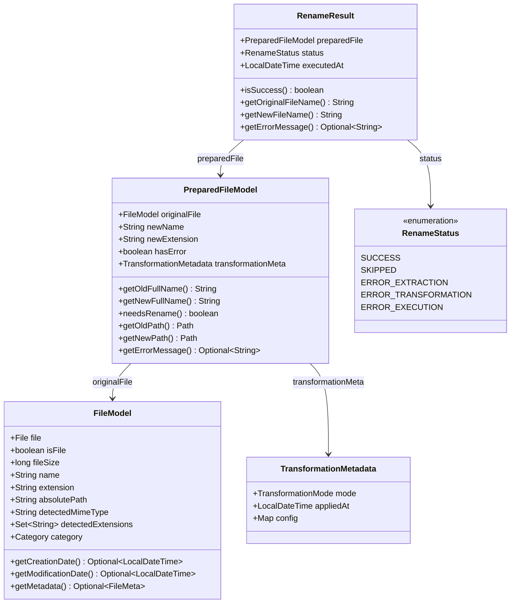

# Data Models — Renamer App Technical Reference

This document describes the core data structures in the Renamer App V2 pipeline: immutable models, their fields,
optional accessors, builder patterns, and enums. Use this as the authoritative reference for what every model field
means and how to construct or modify models.

## Table of Contents

1. [Model Chain Overview](#model-chain-overview)
2. [FileModel](#filemodel)
3. [PreparedFileModel](#preparedfilemodel)
4. [RenameResult & RenameStatus](#renameresult--renamestatus)
5. [TransformationMetadata](#transformationmetadata)
6. [Builder Pattern](#builder-pattern)
7. [Enum Reference](#enum-reference)
8. [Config Classes](#config-classes)

---

## Model Chain Overview

The V2 pipeline flows through four phases, producing a sequence of immutable models:

| Phase                           | Input               | Output                         | Producer                                 | Notes                                                |
|---------------------------------|---------------------|--------------------------------|------------------------------------------|------------------------------------------------------|
| Phase 1: Metadata Extraction    | `File`              | `FileModel`                    | `ThreadAwareFileMapper`                  | Parallel, virtual threads                            |
| Phase 2: Transformation         | `FileModel`         | `PreparedFileModel`            | Transformer (e.g., `AddTextTransformer`) | Parallel (most modes); sequential for `NUMBER_FILES` |
| Phase 2.5: Duplicate Resolution | `PreparedFileModel` | `PreparedFileModel` (modified) | `DuplicateNameResolverImpl`              | Sequential; appends `_1`, `_2` suffixes              |
| Phase 3: Physical Rename        | `PreparedFileModel` | `RenameResult`                 | `RenameExecutionServiceImpl`             | Sequential, depth-ordered                            |

Model classes reside in `ua.renamer.app.api.model` and are exported via JPMS in `app/api/module-info.java`.

### Data Flow Diagram



---

## FileModel

Immutable model representing a file after metadata extraction (Phase 1 output). All fields are `final` and set via
builder at construction time.

**Package:** `ua.renamer.app.api.model`  
**Builder prefix:** `with`

### Fields

| Field                | Type            | Nullable | Optional Accessor       | Description                                                                                                  |
|----------------------|-----------------|----------|-------------------------|--------------------------------------------------------------------------------------------------------------|
| `file`               | `File`          | No       | —                       | `java.io.File` reference to the file on disk                                                                 |
| `isFile`             | `boolean`       | No       | —                       | `false` when metadata extraction failed; signals error state to downstream phases. Getter method: `isFile()` |
| `fileSize`           | `long`          | No       | —                       | File size in bytes                                                                                           |
| `name`               | `String`        | No       | —                       | Filename without extension                                                                                   |
| `extension`          | `String`        | No       | —                       | Extension without leading dot; empty string if no extension                                                  |
| `absolutePath`       | `String`        | No       | —                       | Absolute filesystem path as string                                                                           |
| `creationDate`       | `LocalDateTime` | Yes      | `getCreationDate()`     | Filesystem creation timestamp; null if OS does not report it (e.g., Unix systems)                            |
| `modificationDate`   | `LocalDateTime` | Yes      | `getModificationDate()` | Filesystem last-modified timestamp; null if unavailable                                                      |
| `detectedMimeType`   | `String`        | No       | —                       | MIME type string detected by Apache Tika (e.g., `image/jpeg`, `audio/mpeg`)                                  |
| `detectedExtensions` | `Set<String>`   | No       | —                       | All known file extensions for this MIME type from the `AppMimeTypes` registry (read-only `Set`)              |
| `category`           | `Category`      | No       | —                       | Derived from MIME type: `IMAGE`, `AUDIO`, `VIDEO`, or `GENERIC`                                              |
| `metadata`           | `FileMeta`      | Yes      | `getMetadata()`         | Format-specific metadata (EXIF, audio tags, video streams); null for `GENERIC` files or if extraction failed |

### Construction Example

```java
FileModel model = FileModel.builder()
        .withFile(new File("/path/to/image.jpg"))
        .withIsFile(true)
        .withFileSize(2048576)
        .withName("image")
        .withExtension("jpg")
        .withAbsolutePath("/path/to/image.jpg")
        .withCreationDate(LocalDateTime.now())
        .withModificationDate(LocalDateTime.now())
        .withDetectedMimeType("image/jpeg")
        .withDetectedExtensions(Set.of("jpg", "jpeg", "jpe"))
        .withCategory(Category.IMAGE)
        .withMetadata(imageMeta)
        .build();
```

---

## PreparedFileModel

Immutable model representing a file after transformation (Phase 2 output). Bridges transformation and physical
execution. This is the only model with `toBuilder()` support — used by `DuplicateNameResolverImpl` to produce modified
copies with suffixed names.

**Package:** `ua.renamer.app.api.model`  
**Builder prefix:** `with`  
**toBuilder support:** `yes` (enables `.toBuilder().withNewName(...).build()` for suffix appending)

### Fields

| Field                | Type                     | Nullable | Optional Accessor   | Description                                                                           |
|----------------------|--------------------------|----------|---------------------|---------------------------------------------------------------------------------------|
| `originalFile`       | `FileModel`              | No       | —                   | The `FileModel` from Phase 1; carries all metadata forward                            |
| `newName`            | `String`                 | No       | —                   | Computed new filename without extension; set by transformer                           |
| `newExtension`       | `String`                 | No       | —                   | Computed new extension without dot; set by transformer (may be empty)                 |
| `hasError`           | `boolean`                | No       | —                   | `true` if the file had an error in Phase 1 or transformation failed in Phase 2        |
| `errorMessage`       | `String`                 | Yes      | `getErrorMessage()` | Human-readable error description when `hasError == true`; null if `hasError == false` |
| `transformationMeta` | `TransformationMetadata` | No       | —                   | Audit record: which transformation mode was applied, when, and with what config       |

### Computed Methods

| Method              | Return Type        | Description                                                                                           |
|---------------------|--------------------|-------------------------------------------------------------------------------------------------------|
| `getOldFullName()`  | `String`           | Original full filename: `name + "." + extension` omitting dot if extension is empty                   |
| `getNewFullName()`  | `String`           | New full filename: `newName + "." + newExtension` omitting dot if extension is empty                  |
| `needsRename()`     | `boolean`          | `true` when `!hasError && !getOldFullName().equals(getNewFullName())` — file requires physical rename |
| `getOldPath()`      | `Path`             | `java.nio.file.Path` to the original file                                                             |
| `getNewPath()`      | `Path`             | `Path` for the target (sibling of original with `getNewFullName()` as filename)                       |
| `getErrorMessage()` | `Optional<String>` | Wraps the nullable `errorMessage` field                                                               |

### Construction Example — Direct Builder

```java
PreparedFileModel model = PreparedFileModel.builder()
        .withOriginalFile(fileModel)
        .withNewName("photo")
        .withNewExtension("jpg")
        .withHasError(false)
        .withTransformationMeta(transformationMetadata)
        .build();
```

### Construction Example — Suffix via toBuilder()

The duplicate-resolution phase uses `toBuilder()` to append a collision suffix:

```java
PreparedFileModel suffixed = original.toBuilder()
        .withNewName(original.getNewName() + " (1)")
        .build();
```

This preserves all other fields (`originalFile`, `newExtension`, `transformationMeta`) unchanged.

---

## RenameResult & RenameStatus

### RenameResult

Immutable model representing the outcome of Phase 3 physical rename execution.

**Package:** `ua.renamer.app.api.model`  
**Builder prefix:** `with`

| Field          | Type                | Nullable | Optional Accessor   | Description                                                              |
|----------------|---------------------|----------|---------------------|--------------------------------------------------------------------------|
| `preparedFile` | `PreparedFileModel` | No       | —                   | The model that was executed                                              |
| `status`       | `RenameStatus`      | No       | —                   | Final outcome of the rename attempt                                      |
| `errorMessage` | `String`            | Yes      | `getErrorMessage()` | Error details when status is an `ERROR_*` value; null on success or skip |
| `executedAt`   | `LocalDateTime`     | No       | —                   | Timestamp when the physical rename was attempted                         |

### Convenience Methods

| Method                  | Return Type        | Description                                  |
|-------------------------|--------------------|----------------------------------------------|
| `isSuccess()`           | `boolean`          | `status == RenameStatus.SUCCESS`             |
| `getOriginalFileName()` | `String`           | Delegates to `preparedFile.getOldFullName()` |
| `getNewFileName()`      | `String`           | Delegates to `preparedFile.getNewFullName()` |
| `getErrorMessage()`     | `Optional<String>` | Wraps the nullable `errorMessage` field      |

### RenameStatus Enum

Each status value is set by a specific phase and has distinct semantics:

| Value                  | Set by                  | Meaning                                                                                                                                                           |
|------------------------|-------------------------|-------------------------------------------------------------------------------------------------------------------------------------------------------------------|
| `SUCCESS`              | Phase 3                 | File physically renamed on disk successfully                                                                                                                      |
| `SKIPPED`              | Phase 3                 | File was not renamed (either `needsRename() == false` or an error in a prior phase blocked execution)                                                             |
| `ERROR_EXTRACTION`     | Phase 1 or global catch | File unreadable, inaccessible, or metadata extraction threw an exception; also used for uncaught exceptions that escape all phase guards                          |
| `ERROR_TRANSFORMATION` | Phase 2                 | Transformation produced an illegal filename (e.g., contains `:` on Windows) or transformer threw an exception                                                     |
| `ERROR_EXECUTION`      | Phase 3                 | Physical rename failed — I/O error (permission denied, disk full), target exists and all 999 conflict-suffix slots exhausted, or filesystem rejected the new name |

### Construction Example

```java
RenameResult result = RenameResult.builder()
        .withPreparedFile(preparedModel)
        .withStatus(RenameStatus.SUCCESS)
        .withErrorMessage(null)
        .withExecutedAt(LocalDateTime.now())
        .build();
```

---

## TransformationMetadata

Immutable audit record attached to every `PreparedFileModel`. Tracks which transformation was applied, when, and with
what configuration.

**Package:** `ua.renamer.app.api.model`  
**Builder prefix:** `with`

| Field       | Type                  | Description                                                                                                         |
|-------------|-----------------------|---------------------------------------------------------------------------------------------------------------------|
| `mode`      | `TransformationMode`  | The transformation mode (e.g., `ADD_TEXT`, `CHANGE_CASE`) that produced this model                                  |
| `appliedAt` | `LocalDateTime`       | Timestamp when the transformer ran                                                                                  |
| `config`    | `Map<String, Object>` | Key-value snapshot of the config used: field name → value. Example: `{"textToAdd": "prefix_", "position": "BEGIN"}` |

The `config` map is populated by transformers during Phase 2 by reading the configuration object and serializing its
fields. It is preserved through Phases 2.5 and 3 unchanged.

### Construction Example

```java
TransformationMetadata meta = TransformationMetadata.builder()
        .withMode(TransformationMode.ADD_TEXT)
        .withAppliedAt(LocalDateTime.now())
        .withConfig(Map.of(
                "textToAdd", "prefix_",
                "position", "BEGIN"
        ))
        .build();
```

---

## Builder Pattern

All four model classes and all ten config classes use a consistent Lombok-generated immutable builder pattern.

### @Value Annotation

```java

@Value
@Builder(setterPrefix = "with")
public class FileModel {
    String name;
    String extension;
    // ... other fields
}
```

**What `@Value` does:**

- Makes all fields `private final`
- Generates an all-args constructor that accepts fields in declaration order
- Generates `equals()`, `hashCode()`, and `toString()` based on all fields
- Makes the class effectively immutable: no setter methods exist

**What `@Builder(setterPrefix = "with")` does:**

- Generates a nested `Builder` class with fluent setter methods
- Every setter is prefixed with `with` — NOT the field name
- Setter methods return `this` for method chaining
- `build()` returns the final immutable instance

### Critical Builder Rule: `with` Prefix Required

Every builder setter must use the `with` prefix. Using the field name directly causes a **compile error**.

```java
// CORRECT ✓
FileModel model = FileModel.builder()
                .withName("photo")
                .withExtension("jpg")
                .withIsFile(true)
                .build();

// WRONG — compile error ✗
FileModel model = FileModel.builder()
        .name("photo")       // Method does not exist
        .extension("jpg")    // Method does not exist
        .isFile(true)        // Method does not exist
        .build();
```

### toBuilder() — Modification by Copy

Only `PreparedFileModel` includes `toBuilder = true` in its builder annotation. This generates a method that creates a
new builder pre-populated with all current field values, enabling modification-by-copy:

```java
@Builder(setterPrefix = "with", toBuilder = true)
public class PreparedFileModel { ... }

// Create a modified copy
PreparedFileModel modified = original.toBuilder()
    .withNewName("new_name")
    .build();
// All other fields (originalFile, newExtension, transformationMeta, etc.) are preserved
```

This pattern is used in `DuplicateNameResolverImpl` to append collision-resolution suffixes without rebuilding from
scratch.

### @Builder.Default — Optional Boolean Fields

`DateTimeConfig` uses `@Builder.Default` for four optional boolean flags. This ensures that when you don't set them on
the builder, they retain their default value instead of defaulting to `null` or `false`:

```java
@Value
@Builder(setterPrefix = "with")
public class DateTimeConfig implements TransformationConfig {
    // ... required fields ...

    @Builder.Default
    boolean useFallbackDateTime = false;

    @Builder.Default
    boolean useUppercaseForAmPm = true;

    @Builder.Default
    boolean useCustomDateTimeAsFallback = false;

    @Builder.Default
    boolean applyToExtension = false;
}

// Usage: defaults are applied automatically
DateTimeConfig config = DateTimeConfig.builder()
    .withSource(DateTimeSource.FILE_MODIFICATION_DATE)
    .withDateFormat(DateFormat.YYYY_MM_DD_DASHED)
    .withTimeFormat(TimeFormat.HH_MM_24_TOGETHER)
    .withPosition(ItemPositionWithReplacement.BEGIN)
    // useFallbackDateTime = false (default)
    // useUppercaseForAmPm = true (default)
    // useCustomDateTimeAsFallback = false (default)
    // applyToExtension = false (default)
    .build();

// Or override a default
DateTimeConfig config2 = DateTimeConfig.builder()
    .withSource(DateTimeSource.FILE_MODIFICATION_DATE)
    .withDateFormat(DateFormat.YYYY_MM_DD_DASHED)
    .withTimeFormat(TimeFormat.HH_MM_24_TOGETHER)
    .withPosition(ItemPositionWithReplacement.BEGIN)
    .withUseUppercaseForAmPm(false)  // Override to lowercase AM/PM
    .build();
```

Fields without `@Builder.Default` default to `null` (for objects) or `0`/`false` (for primitives) — always set them
explicitly on the builder, or the `build()` method will reject the instance with `NullPointerException`.

---

## Enum Reference

The `api` module defines 15 enums across two packages plus one functional interface.

### EnumWithExample Interface

Located in `ua.renamer.app.api.enums`, this is a `@FunctionalInterface` (not an enum):

```java

@FunctionalInterface
public interface EnumWithExample {
    String getExampleString();
}
```

Four enums implement it to provide UI examples: `DateFormat`, `DateTimeFormat`, `TextCaseOptions`, `TimeFormat`.

### ua.renamer.app.api.enums

These 13 enums drive transformation logic and UI presentation.

| Enum                          | Count | Values                                                                                                                                                                           | Purpose                                                                                                                                                                             |
|-------------------------------|-------|----------------------------------------------------------------------------------------------------------------------------------------------------------------------------------|-------------------------------------------------------------------------------------------------------------------------------------------------------------------------------------|
| `AppMimeTypes`                | 43    | `AUDIO_MP3`, `IMAGE_JPEG`, `VIDEO_H264`, ...                                                                                                                                     | MIME type constants and extension registry. Methods: `getMimeString()` (e.g., `"audio/mpeg"`), `getExtensions()` (returns `Set<String>` of known extensions)                        |
| `Category`                    | 4     | `GENERIC`, `IMAGE`, `VIDEO`, `AUDIO`                                                                                                                                             | File category derived from MIME type; routes to correct metadata extractor in Phase 1                                                                                               |
| `DateFormat`                  | 31    | `DO_NOT_USE_DATE`, `YYYY_MM_DD_TOGETHER`, `YYYY_MM_DD_WHITE_SPACED`, `MM_DD_YYYY_UNDERSCORED`, `DD_MM_YY_DASHED`, ...                                                            | Date portion pattern in `ADD_DATETIME` mode. Implements `EnumWithExample`. Methods: `getExampleString()`, `getFormatter()` (returns `Optional<DateTimeFormatter>`)                  |
| `DateTimeFormat`              | 11    | `DATE_TIME_TOGETHER`, `DATE_TIME_WHITE_SPACED`, `DATE_TIME_UNDERSCORED`, `DATE_TIME_DOTTED`, `DATE_TIME_DASHED`, `REVERSE_DATE_TIME_*`, `NUMBER_OF_SECONDS_SINCE_JANUARY_1_1970` | Combined date-time layout in `ADD_DATETIME` mode. Implements `EnumWithExample`.                                                                                                     |
| `DateTimeSource`              | 5     | `FILE_CREATION_DATE`, `FILE_MODIFICATION_DATE`, `CONTENT_CREATION_DATE`, `CURRENT_DATE`, `CUSTOM_DATE`                                                                           | Which datetime value to embed in `ADD_DATETIME` mode                                                                                                                                |
| `ImageDimensionOptions`       | 3     | `DO_NOT_USE`, `WIDTH`, `HEIGHT`                                                                                                                                                  | Which image dimension(s) to embed in `ADD_DIMENSIONS` mode                                                                                                                          |
| `ItemPosition`                | 2     | `BEGIN`, `END`                                                                                                                                                                   | Where to insert/remove text (used by `ADD_TEXT`, `REMOVE_TEXT`, `ADD_FOLDER_NAME`)                                                                                                  |
| `ItemPositionExtended`        | 3     | `BEGIN`, `END`, `EVERYWHERE`                                                                                                                                                     | Position for `REPLACE_TEXT` mode; `EVERYWHERE` replaces all occurrences                                                                                                             |
| `ItemPositionWithReplacement` | 3     | `BEGIN`, `END`, `REPLACE`                                                                                                                                                        | Position for `ADD_DATETIME` and `ADD_DIMENSIONS`; `REPLACE` overwrites the entire filename                                                                                          |
| `SortSource`                  | 8     | `FILE_NAME`, `FILE_PATH`, `FILE_SIZE`, `FILE_CREATION_DATETIME`, `FILE_MODIFICATION_DATETIME`, `FILE_CONTENT_CREATION_DATETIME`, `IMAGE_WIDTH`, `IMAGE_HEIGHT`                   | Sort order for `NUMBER_FILES` mode; determines which file receives index 1. Memory note: `SortSource` is intentional behavior; only per-folder counting was the bug. Do not modify. |
| `TextCaseOptions`             | 8     | `CAMEL_CASE`, `PASCAL_CASE`, `SNAKE_CASE`, `SNAKE_CASE_SCREAMING`, `KEBAB_CASE`, `UPPERCASE`, `LOWERCASE`, `TITLE_CASE`                                                          | Target case style in `CHANGE_CASE` mode. Implements `EnumWithExample`.                                                                                                              |
| `TimeFormat`                  | 21    | `DO_NOT_USE_TIME`, `HH_MM_SS_24_TOGETHER`, `HH_MM_24_WHITE_SPACED`, `HH_MM_SS_AM_PM_UNDERSCORED`, ...                                                                            | Time portion pattern in `ADD_DATETIME` mode (24-hour and 12-hour AM/PM variants). Implements `EnumWithExample`. Methods: `getExampleString()`, `getFormatter()`                     |
| `TruncateOptions`             | 3     | `REMOVE_SYMBOLS_IN_BEGIN`, `REMOVE_SYMBOLS_FROM_END`, `TRUNCATE_EMPTY_SYMBOLS`                                                                                                   | How `TRIM_NAME` mode removes characters                                                                                                                                             |

### ua.renamer.app.api.model

These 2 enums represent data states passed through the pipeline.

| Enum                 | Count | Values                                                                                                                                                         | Purpose                                                                                        |
|----------------------|-------|----------------------------------------------------------------------------------------------------------------------------------------------------------------|------------------------------------------------------------------------------------------------|
| `TransformationMode` | 10    | `ADD_TEXT`, `REMOVE_TEXT`, `REPLACE_TEXT`, `CHANGE_CASE`, `ADD_DATETIME`, `ADD_DIMENSIONS`, `NUMBER_FILES`, `ADD_FOLDER_NAME`, `TRIM_NAME`, `CHANGE_EXTENSION` | The currently active rename mode; used by the orchestrator to route to the correct transformer |
| `RenameStatus`       | 5     | `SUCCESS`, `SKIPPED`, `ERROR_EXTRACTION`, `ERROR_TRANSFORMATION`, `ERROR_EXECUTION`                                                                            | Final outcome of Phase 3 physical rename; set by `RenameExecutionServiceImpl`                  |

---

## Config Classes

All 10 transformation modes have a corresponding configuration class. They share a common sealed interface for
compile-time exhaustiveness checking.

**Common Sealed Interface:**

```java
public sealed interface TransformationConfig
        permits AddTextConfig, RemoveTextConfig, ReplaceTextConfig,
        CaseChangeConfig, DateTimeConfig, ImageDimensionsConfig,
        SequenceConfig, ParentFolderConfig, TruncateConfig,
        ExtensionChangeConfig {
}
```

The `sealed` keyword means:

- The compiler knows all permitted subtypes at compile time
- Transformers can use pattern-matching `switch` expressions with exhaustiveness checking
- Adding a new transformation mode requires updating the permits clause

All config classes:

- Are `@Value` (immutable)
- Use `@Builder(setterPrefix = "with")` (builder pattern)
- Implement `TransformationConfig` (sealed interface)
- Include a custom nested `Builder.build()` method that validates required fields and business constraints before
  returning

### Config Classes Reference

| Config Class            | Package                           | Fields                                                                                                                                                                                                                                                                                                                      | Key Validations                                                                                                                                                                          |
|-------------------------|-----------------------------------|-----------------------------------------------------------------------------------------------------------------------------------------------------------------------------------------------------------------------------------------------------------------------------------------------------------------------------|------------------------------------------------------------------------------------------------------------------------------------------------------------------------------------------|
| `AddTextConfig`         | `ua.renamer.app.api.model.config` | `textToAdd: String` (required), `position: ItemPosition` (required)                                                                                                                                                                                                                                                         | Both fields non-null                                                                                                                                                                     |
| `RemoveTextConfig`      | `ua.renamer.app.api.model.config` | `textToRemove: String` (required), `position: ItemPosition` (required)                                                                                                                                                                                                                                                      | Both fields non-null                                                                                                                                                                     |
| `ReplaceTextConfig`     | `ua.renamer.app.api.model.config` | `textToReplace: String` (required), `replacementText: String` (required), `position: ItemPositionExtended` (required)                                                                                                                                                                                                       | All fields non-null                                                                                                                                                                      |
| `CaseChangeConfig`      | `ua.renamer.app.api.model.config` | `caseOption: TextCaseOptions` (required), `capitalizeFirstLetter: boolean` (default false)                                                                                                                                                                                                                                  | `caseOption` non-null                                                                                                                                                                    |
| `DateTimeConfig`        | `ua.renamer.app.api.model.config` | `source: DateTimeSource` (required), `dateFormat: DateFormat` (required), `timeFormat: TimeFormat` (required), `dateTimeFormat: DateTimeFormat` (nullable), `position: ItemPositionWithReplacement` (required), `customDateTime: LocalDateTime` (nullable), `separator: String` (nullable), + 4 boolean flags with defaults | `source`, `dateFormat`, `timeFormat`, `position` non-null; `customDateTime` required when `source == CUSTOM_DATE`; flags default to `false` except `useUppercaseForAmPm` (defaults true) |
| `ImageDimensionsConfig` | `ua.renamer.app.api.model.config` | `leftSide: ImageDimensionOptions` (required), `rightSide: ImageDimensionOptions` (required), `separator: String` (nullable), `position: ItemPositionWithReplacement` (required), `nameSeparator: String` (required)                                                                                                         | `position`, `leftSide`, `rightSide`, `nameSeparator` non-null; at least one of `leftSide` or `rightSide` must not be `DO_NOT_USE`                                                        |
| `SequenceConfig`        | `ua.renamer.app.api.model.config` | `startNumber: int`, `stepValue: int`, `padding: int`, `sortSource: SortSource`, `perFolderCounting: boolean`                                                                                                                                                                                                                | `padding >= 0`                                                                                                                                                                           |
| `ParentFolderConfig`    | `ua.renamer.app.api.model.config` | `numberOfParentFolders: int` (required), `position: ItemPosition` (required), `separator: String` (nullable)                                                                                                                                                                                                                | `position` non-null; `numberOfParentFolders >= 1`                                                                                                                                        |
| `TruncateConfig`        | `ua.renamer.app.api.model.config` | `numberOfSymbols: int`, `truncateOption: TruncateOptions` (required)                                                                                                                                                                                                                                                        | `truncateOption` non-null; `numberOfSymbols >= 0`                                                                                                                                        |
| `ExtensionChangeConfig` | `ua.renamer.app.api.model.config` | `newExtension: String` (required)                                                                                                                                                                                                                                                                                           | Non-null, non-blank (after trim)                                                                                                                                                         |

For detailed transformer behavior and how each config is consumed,
see [transformation-modes.md](./transformation-modes.md).

### Example: Building a DateTimeConfig

```java
DateTimeConfig config = DateTimeConfig.builder()
        .withSource(DateTimeSource.FILE_MODIFICATION_DATE)
        .withDateFormat(DateFormat.YYYY_MM_DD_DASHED)
        .withTimeFormat(TimeFormat.HH_MM_24_TOGETHER)
        .withPosition(ItemPositionWithReplacement.BEGIN)
        .withDateTimeFormat(DateTimeFormat.DATE_TIME_UNDERSCORED)
        .withSeparator(" - ")
        .withUseFallbackDateTime(true)
        .withUseUppercaseForAmPm(false)
        .build();
// If source is CUSTOM_DATE and customDateTime is not set, build() throws IllegalArgumentException
```

---

## Cross-References

- **Pipeline flow:** [pipeline-architecture.md](./pipeline-architecture.md) — how models are created and passed between
  phases
- **Per-mode behavior:** [transformation-modes.md](./transformation-modes.md) — transformer algorithms and config usage
  for each of the 10 modes
- **Dependency injection:** [dependency-injection.md](./dependency-injection.md) — how services are wired using Google
  Guice
- **Main architecture:** [ARCHITECTURE.md](./ARCHITECTURE.md) — system overview, technology stack, project structure
