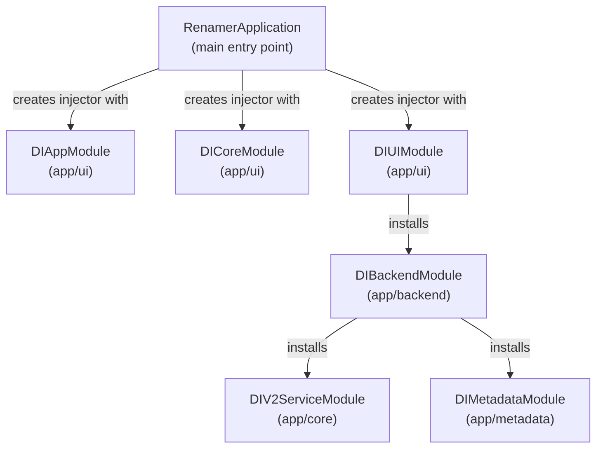

# Dependency Injection in the Renamer App

This document explains how the Renamer App wires dependencies using Google Guice 7, which modules compose the injector,
and how to add new bindings.

## 1. Why Guice

The Renamer App uses Google Guice for dependency injection instead of Spring because:

- **Lightweight**: No container overhead or classpath scanning — ideal for desktop applications
- **Explicit wiring**: `AbstractModule` subclasses define all bindings in code, making the graph transparent
- **Constructor injection enforced**: Lombok's `@RequiredArgsConstructor(onConstructor_ = {@Inject})` pattern ensures
  all dependencies are declared at construction time — no hidden field injection

Guice bindings are configured in dedicated modules located in the `config` packages of each artifact.

## 2. Module Wiring Graph

The Renamer App composes six modules in a hierarchical structure. This diagram shows the actual wiring established when
`RenamerApplication.main()` creates the injector:



**Injector creation in production:**

```java
injector = Guice.createInjector(new DIAppModule(), new DICoreModule(), new DIUIModule());
```

The argument to `createInjector()` lists only the root modules. Installed modules (`DIBackendModule`,
`DIV2ServiceModule`, `DIMetadataModule`) are transitively included via `install()` calls.

### Composition Root

`DIUIModule.configure()` calls `install(new DIBackendModule())`, making `DIUIModule` the composition root that pulls in
all other modules. This design ensures that:

- **UI concerns stay at the top**: State publishers, mode view registry, and FXML loaders are bound in `DIUIModule`
- **Backend is reusable**: `DIBackendModule` can be tested independently with mock state publishers
- **Single entry point**: All bindings resolve through the UI module in production

## 3. Per-Module Responsibility

| Module              | Maven Artifact | Key Bindings                                                                                                                                                                                                                                                                                                        | Scope     |
|---------------------|----------------|---------------------------------------------------------------------------------------------------------------------------------------------------------------------------------------------------------------------------------------------------------------------------------------------------------------------|-----------|
| `DIAppModule`       | `app/ui`       | `LanguageTextRetrieverApi` → `LanguageTextRetrieverService`; `ResourceBundle` (i18n); `ExecutorService` (UI background thread)                                                                                                                                                                                      | Singleton |
| `DICoreModule`      | `app/ui`       | `NameValidator`; `TextExtractorByKey` (functional interface for i18n lookups)                                                                                                                                                                                                                                       | Singleton |
| `DIUIModule`        | `app/ui`       | Installs `DIBackendModule`; 10 mode controllers; 11 string converters; 4 custom widget classes + 4 builders; `ModeViewRegistry`; `FxStateMirror`; `StatePublisher` (UI-aware pub/sub)                                                                                                                               | Singleton |
| `DIBackendModule`   | `app/backend`  | Installs `DIMetadataModule` + `DIV2ServiceModule`; `SessionApi` → `RenameSessionService`; `SettingsService` → `SettingsServiceImpl`; `BackendExecutor` (virtual threads); `FolderExpansionService` → `FolderExpansionServiceImpl`; `LoggingConfigService` (eager singleton)                                         | Singleton |
| `DIV2ServiceModule` | `app/core`     | `FileMapper` → `ThreadAwareFileMapper`; `DuplicateNameResolver` → `DuplicateNameResolverImpl`; `RenameExecutionService` → `RenameExecutionServiceImpl`; `FileRenameOrchestrator` → `FileRenameOrchestratorImpl`; 10 transformer classes (ADD_TEXT, CHANGE_CASE, DATE_TIME, etc.)                                    | Singleton |
| `DIMetadataModule`  | `app/metadata` | `FileMetadataMapper` → `ThreadAwareFileMetadataMapper`; `FileMetadataExtractorResolver` → `CategoryFileMetadataExtractorResolver`; 4 category dispatchers; 20 image format extractors; 3 video format extractors; 1 unified audio extractor; `DateTimeUtils` → `DateTimeConverter`; `FileUtils` → `CommonFileUtils` | Singleton |

**Why everything is singleton:** All bindings are stateless or thread-safe. The transformers, extractors, and mappers
are designed to process immutable input without modifying shared state. Virtual threads in `DIBackendModule` and
`DIV2ServiceModule` handle concurrency.

## 4. Constructor Injection Pattern

Every service in the Renamer App uses constructor injection. This is the required pattern:

```java
@RequiredArgsConstructor(onConstructor_ = {@Inject})
public class MyService {
    private final SomeDependency dependency;
    private final AnotherDependency another;
}
```

**How it works:**

1. Lombok's `@RequiredArgsConstructor` generates a constructor with parameters for all `final` fields (in declaration
   order)
2. The `onConstructor_ = {@Inject}` meta-annotation adds `@Inject` to that constructor
3. Guice uses the `@Inject` marker to resolve and inject dependencies at construction time
4. All dependencies are immutable (`final`) — no setters, no mutation

**Bindings in a module:**

```java
// Direct binding (interface → implementation)
bind(MyServiceApi.class).to(MyServiceImpl.class).in(Singleton.class);

// Concrete binding (class → itself)
bind(MyService.class).in(Singleton.class);

// Provider method (complex wiring)
@Provides
@Singleton
MyTransformer provideMyTransformer(Dep1 dep1, Dep2 dep2) {
    return new MyTransformer(dep1, dep2);
}
```

**Prohibited patterns in this project:**

- ❌ Field injection (`@Inject private Dependency dep;`)
- ❌ Setter injection (`@Inject public void setDep(Dep d)`)
- ❌ Optional constructor parameters — all dependencies are required

## 5. UI Mode Registration

The 10 transformation modes are wired and made available to the UI through `ModeViewRegistry`. This is not done via
`@Named` qualifiers or Guice scopes — instead, it uses a registry pattern.

### How it works

**Step 1: Bind mode controllers**

In `DIUIModule.bindViewControllers()`:

```java
bind(ModeAddTextController.class).in(Singleton.class);
bind(ModeNumberFilesController.class).in(Singleton.class);
// ... 8 more mode controllers
```

**Step 2: Provide the registry**

In `DIUIModule.provideModeViewRegistry()`:

```java
@Provides
@Singleton
public ModeViewRegistry provideModeViewRegistry(
        ViewLoaderApi viewLoaderApi,
        ModeAddTextController addText,
        ModeNumberFilesController numberFiles,
        ModeChangeCaseController changeCase,
        // ... 7 more mode controller parameters
) throws IOException {
    var registry = new ModeViewRegistry();
    loadAndRegister(registry, viewLoaderApi, ViewNames.MODE_ADD_TEXT, addText);
    loadAndRegister(registry, viewLoaderApi, ViewNames.MODE_NUMBER_FILES, numberFiles);
    loadAndRegister(registry, viewLoaderApi, ViewNames.MODE_CHANGE_CASE, changeCase);
    // ... 7 more registrations
    return registry;
}
```

**Step 3: Load and register each mode**

```java
private void loadAndRegister(ModeViewRegistry registry, ViewLoaderApi viewLoaderApi,
                             ViewNames viewName, ModeControllerV2Api<?> controller) throws IOException {
    Optional<javafx.fxml.FXMLLoader> loaderOpt = viewLoaderApi.createLoader(viewName);
    if (loaderOpt.isEmpty()) {
        throw new IllegalStateException("Could not find FXMLLoader for " + viewName);
    }
    var fxmlLoader = loaderOpt.get();
    Parent parent = fxmlLoader.load();
    registry.register(controller.supportedMode(), () -> parent, controller);
}
```

The `ModeViewRegistry` provides two overloaded `register()` methods:

```java
// Overload 1: Register view factory only
public void register(TransformationMode mode, Supplier<Parent> viewFactory)

// Overload 2: Register view factory and controller
public void register(TransformationMode mode,
                     Supplier<Parent> viewFactory,
                     ModeControllerV2Api<?> controller)
```

The `provideModeViewRegistry()` method uses overload 2, which registers both the view supplier and the controller
instance. This enables `ApplicationMainViewController` to retrieve both the view and its controller when a mode is
selected.

**Result:** The `ModeViewRegistry` maps each `TransformationMode` enum value to a supplier of its `Parent` (FXML root
node) and its `ModeControllerV2Api` instance. This pattern avoids the complexity of `@Qualifier` annotations and makes
the mode setup explicit and testable.

## 6. Adding New Bindings

### a) New singleton service (interface → implementation)

**File to edit:** The module that owns the service (e.g., `DIBackendModule` for backend services, `DIV2ServiceModule`
for transformation services)

```java
@Override
private void configure() {
    bind(MyServiceApi.class).to(MyServiceImpl.class).in(Singleton.class);
}
```

**Example:** In `DIBackendModule`:

```java
bind(SessionApi.class).to(RenameSessionService.class).in(Scopes.SINGLETON);
```

### b) New transformer

**Files to edit:**

1. `DIV2ServiceModule.configure()` — add the binding
2. `FileRenameOrchestratorImpl` — update the transformation dispatch logic

**In DIV2ServiceModule:**

```java
bind(MyModeTransformer.class).in(Singleton.class);
```

The transformer is then injected into `FileRenameOrchestratorImpl`, which dispatches to it based on the
`TransformationMode` enum in `PreparedFileModel`.

### c) New metadata extractor

**File to edit:** `DIMetadataModule.configure()`

```java
bind(MyFormatExtractor.class).in(Singleton.class);
```

Then inject `MyFormatExtractor` into the relevant **category dispatcher** (`ImageFileMetadataExtractionExtractor`,
`VideoFileMetadataExtractor`, `AudioFileMetadataExtractor`, or `GenericFileMetadataExtractor`) and add a case for the
MIME type in the dispatcher's extraction method.

### d) New UI mode controller (example: adding MODE_BLUR)

**File 1: DIUIModule.bindViewControllers()**

Add a binding for the new mode controller:

```java
private void bindViewControllers() {
    bind(ModeAddTextController.class).in(Singleton.class);
    // ... existing bindings ...
    bind(ModeBlurController.class).in(Singleton.class);  // NEW
}
```

**File 2: DIUIModule.provideModeViewRegistry() — two changes**

1. Add the controller parameter:

```java
public ModeViewRegistry provideModeViewRegistry(
        ViewLoaderApi viewLoaderApi,
        ModeAddTextController addText,
        // ... existing parameters ...
        ModeBlurController blur)  // NEW parameter
        throws IOException {
```

2. Register it in the body:

```java
var registry = new ModeViewRegistry();
loadAndRegister(registry, viewLoaderApi, ViewNames.MODE_ADD_TEXT, addText);
// ... existing registrations ...
loadAndRegister(registry, viewLoaderApi, ViewNames.MODE_BLUR, blur);  // NEW
return registry;
```

After these changes, the mode is automatically available in the UI mode selector. No `@Named` qualifiers, no
`InjectQualifiers` additions — the registry pattern handles disambiguation.

## 7. Testing Guice Modules

> **The DIBackendModule Test Pattern**
>
> Location: `app/backend/src/test/java/ua/renamer/app/backend/config/DIBackendModuleTest.java`
>
> Use this pattern when testing any Guice module to verify bindings:
>
> - Create a real Guice injector with the module under test
> - Supply mock implementations for dependencies the module intentionally leaves unbound (in this case,
    `StatePublisher`)
> - Test that all required bindings resolve to non-null instances
> - Test that singleton-scoped bindings return the same instance on repeated calls
>
> Example:
> ```java
> injector = Guice.createInjector(
>     new DIBackendModule(),
>     binder -> binder.bind(StatePublisher.class).toInstance(mock(StatePublisher.class))
> );
> ```
>
> This approach tests the module in isolation without requiring the full UI injector.

## 8. Cross-References

- **[Pipeline Architecture](./pipeline-architecture.md)** — Describes how `FileRenameOrchestrator` (bound in
  `DIV2ServiceModule`) orchestrates the V2 metadata extraction and transformation pipeline
- **[Adding a Transformation Mode](../guides/add-transformation-mode.md)** (Task 7) — Complete step-by-step guide for
  adding a new mode, including DI bindings
- **CLAUDE.md — Build Commands** — Lists Maven build and test commands that verify all Guice bindings resolve correctly

## 9. Troubleshooting Guice Bindings

| Problem                                                         | Cause                                                        | Solution                                                                                                 |
|-----------------------------------------------------------------|--------------------------------------------------------------|----------------------------------------------------------------------------------------------------------|
| `ConfigurationException: No implementation bound for XyzApi`    | Binding not declared in any module                           | Add `bind(XyzApi.class).to(XyzImpl.class)` to the appropriate module                                     |
| `ConfigurationException: Could not find a suitable constructor` | No constructor, or constructor has non-injectable parameters | Add constructor with `@RequiredArgsConstructor(onConstructor_ = {@Inject})`                              |
| `ScopeConflictException`                                        | A dependency's scope conflicts with the dependent's scope    | Check that all dependencies of a singleton are also singletons                                           |
| Service always returns new instance                             | Forgot `.in(Singleton.class)`                                | Add scope to binding: `bind(Xyz.class).in(Singleton.class)`                                              |
| Test injector fails with unbound `StatePublisher`               | Module doesn't bind `StatePublisher` intentionally           | Supply a mock in test-only injector: `binder -> binder.bind(StatePublisher.class).toInstance(mock(...))` |
