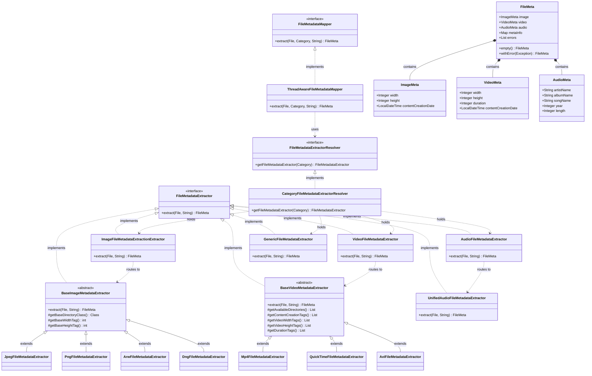

# Metadata Extraction

## Overview

The metadata extraction layer answers: "what does this file contain, and what format-specific properties can we read from it?" It runs as Phase 1 of the rename pipeline and populates a `FileModel` for every input file. Three libraries handle different concerns:

| Library                                 | Version | Role in this project                                                                                          |
|-----------------------------------------|---------|---------------------------------------------------------------------------------------------------------------|
| **metadata-extractor** (com.drewnoakes) | 2.19.0  | EXIF, IPTC, XMP, and container metadata for images and videos — provides typed `Directory` objects per format |
| **Apache Tika**                         | 3.3.0   | MIME type detection from file content (not extension); routes each file to the correct category extractor     |
| **jAudioTagger**                        | 2.0.19  | ID3, Vorbis, MP4, and other audio tag reading for 19+ audio formats                                           |

Using three libraries rather than one is intentional: no single library covers all three concerns. Apache Tika is the best-in-class content-type detector; metadata-extractor has the richest EXIF/IPTC support for images and videos; jAudioTagger has the broadest audio tag coverage. They do not overlap in responsibility.

---

## Resolver Chain

The pipeline entry point in `core` calls `FileMetadataMapper.extract(file, category, mimeType)`. The `metadata` module provides the implementation. The full call chain:

```
Phase 1 (core module)
└── ThreadAwareFileMapper.safeMap(file)
    └── fileMetadataMapper.extract(file, category, mimeType)
        └── ThreadAwareFileMetadataMapper
            └── fileMetadataExtractorResolver.getFileMetadataExtractor(category)
                └── CategoryFileMetadataExtractorResolver
                    ├── IMAGE   → ImageFileMetadataExtractionExtractor
                    │             └── routes by MIME → format-specific extractor (20 formats)
                    ├── AUDIO   → AudioFileMetadataExtractor
                    │             └── UnifiedAudioFileMetadataExtractor (all 19 formats)
                    ├── VIDEO   → VideoFileMetadataExtractor
                    │             └── routes by MIME → format-specific extractor (3 formats)
                    └── GENERIC → GenericFileMetadataExtractor → FileMeta.empty()
```

**`ThreadAwareFileMetadataMapper`** (`ua.renamer.app.metadata.extractor`) implements `FileMetadataMapper` — the interface that `core` depends on. It delegates to `CategoryFileMetadataExtractorResolver` to select the appropriate strategy, wraps the call in a try-catch, and returns `FileMeta.withError(e)` if any uncaught exception escapes the strategy. This is the top-level safety net for the extraction layer.

**`CategoryFileMetadataExtractorResolver`** (`ua.renamer.app.metadata.extractor`) implements `FileMetadataExtractorResolver`. It holds one instance of each of the four category-level dispatchers and selects by `Category` enum value. Any category that is not `IMAGE`, `AUDIO`, or `VIDEO` falls through to `GenericFileMetadataExtractor`.

**Category-level dispatchers** (`ua.renamer.app.metadata.extractor.strategy`) each implement `FileMetadataExtractor` and route by MIME type string to a format-specific extractor. For audio, a single `UnifiedAudioFileMetadataExtractor` handles all 19 MIME types, so `AudioFileMetadataExtractor` simply delegates to it for every supported MIME. For image and video, each MIME type maps to a distinct concrete extractor class.

**`GenericFileMetadataExtractor`** is the fallback: it ignores the file entirely and returns `FileMeta.empty()`. No metadata is available for files in the `GENERIC` category.

---

## Image Metadata

**Category dispatcher:** `ImageFileMetadataExtractionExtractor`  
**Base class:** `BaseImageMetadataExtractor` (template method pattern)  
**Library:** metadata-extractor

### Supported Formats

| Format    | MIME type                   | Camera type            |
|-----------|-----------------------------|------------------------|
| JPEG      | `image/jpeg`                | Any                    |
| PNG       | `image/png`                 | Any                    |
| GIF       | `image/gif`                 | Any                    |
| BMP       | `image/bmp`                 | Any                    |
| TIFF      | `image/tiff`                | Any                    |
| WebP      | `image/webp`                | Any                    |
| HEIC/HEIF | `image/heic`, `image/heif`  | Apple, modern phones   |
| AVIF      | `image/avif`                | Modern                 |
| ICO       | `image/x-icon`              | Any                    |
| PCX       | `image/x-pcx`               | Legacy                 |
| EPS       | `application/postscript`    | Any                    |
| PSD       | `image/vnd.adobe.photoshop` | Adobe                  |
| ARW       | `image/x-sony-arw`          | Sony RAW               |
| CR2       | `image/x-canon-cr2`         | Canon RAW              |
| CR3       | `image/x-canon-cr3`         | Canon RAW (newer)      |
| NEF       | `image/x-nikon-nef`         | Nikon RAW              |
| ORF       | `image/x-olympus-orf`       | Olympus RAW            |
| RAF       | `image/x-fujifilm-raf`      | Fujifilm RAW           |
| RW2       | `image/x-panasonic-rw2`     | Panasonic RAW          |
| DNG       | `image/x-adobe-dng`         | Adobe Digital Negative |

### Typed Fields Extracted

`ImageMeta` (`ua.renamer.app.api.model.meta.category`) contains three typed fields. All are nullable; accessors return `Optional`.

| Field                 | Type            | Source                                                             | Notes                                                              |
|-----------------------|-----------------|--------------------------------------------------------------------|--------------------------------------------------------------------|
| `width`               | `Integer`       | Format-specific directory tag, EXIF fallback                       | Pixels                                                             |
| `height`              | `Integer`       | Format-specific directory tag, EXIF fallback                       | Pixels                                                             |
| `contentCreationDate` | `LocalDateTime` | EXIF TAG_DATETIME_ORIGINAL → TAG_DATETIME → TAG_DATETIME_DIGITIZED | Earliest non-null value; timezone-aware if timezone tag is present |

### Raw Metadata Map

In addition to typed fields, every image extraction appends a raw `Map<String, String>` to `FileMeta.metaInfo`. `MetadataCommons.buildMetadataMap()` flattens all `metadata-extractor` directories and tags into entries keyed as `"DirectoryName.TagName"` with their human-readable description as the value. This map is the source for fields like ISO, focal length, camera model, lens model, color space, and orientation — they are present in `metaInfo` when the EXIF data contains them, but are not promoted to typed model fields.

### Template Method Pattern

`BaseImageMetadataExtractor` defines the extraction algorithm. Subclasses implement three abstract methods to provide format-specific tag constants:

```java
private abstract Class<? extends Directory> getBaseDirectoryClass();
protected abstract int getBaseWidthTag();
protected abstract int getBaseHeightTag();
```

The base class calls `ImageMetadataReader.readMetadata(file)`, reads `ExifImageDirectory`, `ExifIFD0Directory`, and `ExifSubIFDDirectory`, then calls the abstract methods to resolve the format's native width/height tags before falling back to shared EXIF tags. For example:

```java
// JpegFileMetadataExtractor
private Class<? extends Directory> getBaseDirectoryClass() { return JpegDirectory.class; }
protected int getBaseWidthTag()  { return JpegDirectory.TAG_IMAGE_WIDTH; }
protected int getBaseHeightTag() { return JpegDirectory.TAG_IMAGE_HEIGHT; }
```

`creationDate` extraction searches EXIF datetime tags in priority order (ORIGINAL → DATETIME → DIGITIZED), applying timezone offsets where present, and returns the earliest non-null value.

---

## Video Metadata

**Category dispatcher:** `VideoFileMetadataExtractor`  
**Base class:** `BaseVideoMetadataExtractor` (template method pattern)  
**Library:** metadata-extractor

### Supported Formats

| Format          | MIME type         |
|-----------------|-------------------|
| MP4             | `video/mp4`       |
| QuickTime (MOV) | `video/quicktime` |
| AVI             | `video/x-msvideo` |

### Typed Fields Extracted

`VideoMeta` (`ua.renamer.app.api.model.meta.category`) contains four typed fields. All are nullable; accessors return `Optional`.

| Field                 | Type            | Notes                                                  |
|-----------------------|-----------------|--------------------------------------------------------|
| `width`               | `Integer`       | Pixels                                                 |
| `height`              | `Integer`       | Pixels                                                 |
| `duration`            | `Integer`       | Seconds — see duration heuristic below                 |
| `contentCreationDate` | `LocalDateTime` | Earliest non-null value across available datetime tags |

**Duration heuristic:** Some container formats store duration in milliseconds, others in seconds. The extractor applies a threshold: if the raw tag value is greater than 10 000, it divides by 1 000 to convert to seconds. Values ≤ 10 000 are treated as already being in seconds.

### Template Method Pattern

`BaseVideoMetadataExtractor` defines the extraction algorithm. Subclasses implement five abstract methods:

```java
private abstract List<Class<? extends Directory>> getAvailableDirectories();
protected abstract List<Integer> getContentCreationTags();
protected abstract List<Integer> getVideoWidthTags();
protected abstract List<Integer> getVideoHeightTags();
protected abstract List<Integer> getDurationTags();
```

The base class reads all directories from `ImageMetadataReader.readMetadata(file)` and searches each tag list in order, returning the minimum non-null value found (for numeric fields) or the earliest datetime (for creation date). Returning the minimum prevents outlier values from container headers from overriding the actual stream dimensions.

---

## Audio Metadata

**Category dispatcher:** `AudioFileMetadataExtractor`  
**Concrete extractor:** `UnifiedAudioFileMetadataExtractor`  
**Library:** jAudioTagger

Unlike image and video, all audio formats are handled by a single concrete extractor. The dispatcher (`AudioFileMetadataExtractor`) routes all 19 supported MIME types to `UnifiedAudioFileMetadataExtractor`; no format-specific subclasses are needed because jAudioTagger presents a uniform tag API (`FieldKey` enum) across all formats.

### Supported Formats

| Format     | MIME type                    |
|------------|------------------------------|
| MP3        | `audio/mpeg`                 |
| MP2        | `audio/mp2`                  |
| MP4 Audio  | `audio/mp4`                  |
| WAV        | `audio/wav`                  |
| FLAC       | `audio/flac`                 |
| OGG        | `audio/ogg`                  |
| WMA        | `audio/x-ms-wma`             |
| AIFF       | `audio/aiff`, `audio/x-aiff` |
| APE        | `audio/ape`                  |
| Musepack   | `audio/musepack`             |
| WavPack    | `audio/wavpack`              |
| Speex      | `audio/speex`                |
| Opus       | `audio/opus`                 |
| AU         | `audio/basic`                |
| DSF        | `audio/dsf`                  |
| Real Audio | `audio/x-realaudio`          |
| OptimFrog  | `audio/x-optimfrog`          |
| TTA        | `audio/x-tta`                |

### Typed Fields Extracted

`AudioMeta` (`ua.renamer.app.api.model.meta.category`) contains five typed fields. All are nullable; accessors return `Optional`.

| Field        | Type      | Source tag                                             | Notes                                                                                                      |
|--------------|-----------|--------------------------------------------------------|------------------------------------------------------------------------------------------------------------|
| `artistName` | `String`  | `FieldKey.ARTIST` → `FieldKey.ALBUM_ARTIST` (fallback) | Falls back to album artist if artist tag is empty                                                          |
| `albumName`  | `String`  | `FieldKey.ALBUM`                                       |                                                                                                            |
| `songName`   | `String`  | `FieldKey.TITLE`                                       |                                                                                                            |
| `year`       | `Integer` | `FieldKey.YEAR`                                        | First 4-digit sequence extracted from the tag string; validated to 1900–2100; `null` if missing or invalid |
| `length`     | `Integer` | `AudioHeader.getTrackLength()`                         | Seconds; `null` if 0 or unavailable                                                                        |

**Year extraction:** The YEAR tag value is treated as a string; the extractor finds the first 4 consecutive digits and converts them to an integer. Values outside 1900–2100 are discarded as likely corrupt or default values.

---

## FileModel.metadata Structure

`FileModel.metadata` holds a `FileMeta` instance (nullable; accessor returns `Optional<FileMeta>`). `FileMeta` is an immutable value object with five fields:

| Field      | Type                  | Present when                                                                          |
|------------|-----------------------|---------------------------------------------------------------------------------------|
| `image`    | `ImageMeta?`          | File is an IMAGE category file with readable EXIF/format metadata                     |
| `video`    | `VideoMeta?`          | File is a VIDEO category file with readable container metadata                        |
| `audio`    | `AudioMeta?`          | File is an AUDIO category file with readable tags                                     |
| `metaInfo` | `Map<String, String>` | Always present (empty map if nothing extracted); raw tag dump from metadata-extractor |
| `errors`   | `List<String>`        | Non-empty when one or more extraction steps failed; does not prevent partial results  |

Only one of `image`, `video`, or `audio` will be populated for a given file — they are mutually exclusive by category routing. `GENERIC` category files result in `FileMeta.empty()`, which has all three as `null` and empty `metaInfo` and `errors`.

**`FileMeta.empty()`** is a shared constant; `GenericFileMetadataExtractor` returns it for every call. No allocation occurs for generic files.

**`FileMeta.withError(e)`** factory methods allow capturing an error without any metadata fields set. Used by `ThreadAwareFileMetadataMapper` as the top-level catch-all and by category dispatchers for unsupported MIME types.

---

## Thread Safety

The metadata extraction layer is called from Phase 1's virtual-thread pool — one task per file, potentially many concurrent calls. No explicit synchronization is required because:

1. **All extractors are stateless singletons.** Every class in the extraction chain is bound as `@Singleton` in `DIMetadataModule`. The constructors inject dependencies; there is no mutable instance state.

2. **`ThreadAwareFileMetadataMapper` wraps every call in try-catch.** Any exception that escapes the strategy is caught and converted to `FileMeta.withError(e)`. The virtual thread terminates normally; the error is surfaced in the `FileMeta.errors` field and propagates to `FileModel.metadata`.

3. **Library thread safety.** `metadata-extractor` opens and reads the file within each `ImageMetadataReader.readMetadata(file)` call; it does not share state across calls. jAudioTagger creates a new `AudioFile` object per `AudioFileIO.read(file)` call.

The name "ThreadAwareFileMetadataMapper" reflects its role as the coordination point for concurrent calls, not an indication that it contains locking code.

---

## Class Diagram



---

> See [pipeline-architecture.md](pipeline-architecture.md) for how Phase 1 calls this module and handles per-file errors.  
> See [data-models.md](data-models.md) for the full `FileModel.metadata` field reference.
