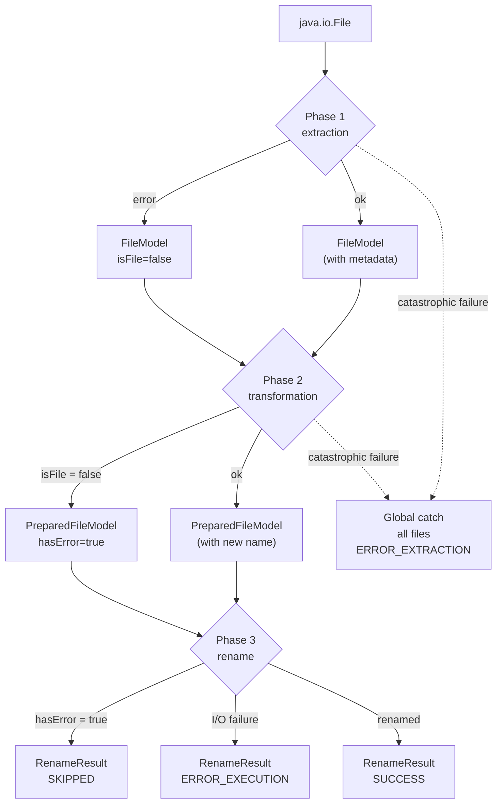

# Pipeline Architecture

## Pipeline Overview

The rename pipeline transforms a list of `java.io.File` references into `RenameResult` records through four sequential
phases. Each phase produces an immutable model that the next phase consumes:
`File → FileModel → PreparedFileModel → RenameResult`. Phases 1 and 2 run work in parallel using Java 25 virtual
threads; Phases 2.5 and 3 are strictly sequential. The pipeline never throws — every error is captured in a status field
of the appropriate model and propagated forward.

**Entry point:** `FileRenameOrchestratorImpl` (`ua.renamer.app.core.service.impl`)  
**Interface:** `FileRenameOrchestrator` (`ua.renamer.app.api.service`)

```mermaid
sequenceDiagram
    autonumber
    participant Caller
    participant Orc as FileRenameOrchestratorImpl
    participant VT as "Virtual Thread Pool"
    participant Mapper as ThreadAwareFileMapper
    participant TX as Transformer
    participant Dedup as DuplicateNameResolverImpl
    participant Exec as RenameExecutionServiceImpl
    Caller ->>+ Orc: execute(files, mode, config, callback)

    rect rgb(230, 240, 255)
        Note over Orc, Mapper: Phase 1 - Metadata Extraction (parallel)
        Orc ->>+ VT: newVirtualThreadPerTaskExecutor
        loop per file
            VT ->> Mapper: map(file)
            Mapper -->> VT: FileModel (isFile=false on error)
        end
        VT -->>- Orc: List&lt;FileModel&gt;
    end

    rect rgb(230, 255, 230)
        Note over Orc, TX: Phase 2 - Transformation (parallel or sequential)
        alt most modes
            Orc ->>+ VT: newVirtualThreadPerTaskExecutor
            loop per FileModel
                VT ->> TX: transform(fileModel, config)
                TX -->> VT: PreparedFileModel
            end
            VT -->>- Orc: List&lt;PreparedFileModel&gt;
        else NUMBER_FILES mode
            Orc ->> TX: transformBatch(fileModels, config)
            TX -->> Orc: List&lt;PreparedFileModel&gt;
        end
    end

    rect rgb(255, 255, 220)
        Note over Orc, Dedup: Phase 2.5 - Duplicate Resolution (sequential)
        Orc ->> Dedup: resolve(preparedFiles)
        Dedup -->> Orc: List&lt;PreparedFileModel&gt;
    end

    rect rgb(255, 230, 230)
        Note over Orc, Exec: Phase 3 - Physical Rename (sequential, deepest-first)
        loop per PreparedFileModel, depth-ordered
            Orc ->> Exec: execute(preparedFile)
            Exec -->> Orc: RenameResult
        end
    end

    Orc -->>- Caller: List<RenameResult>
```

> See [data-models.md](data-models.md) for full field reference on `FileModel`, `PreparedFileModel`, and `RenameResult`.

---

## Phase 1: Metadata Extraction

**Input:** `List<File>`  **Output:** `List<FileModel>`  **Threading:** parallel, virtual threads

`FileRenameOrchestratorImpl` submits one `CompletableFuture` per file to a `newVirtualThreadPerTaskExecutor`. Each task
delegates to `ThreadAwareFileMapper`, which:

1. Validates the file (readable, exists, is a regular file)
2. Reads filesystem attributes (size, creation date, modification date)
3. Detects the MIME type and maps it to a `Category` (`IMAGE`, `AUDIO`, `VIDEO`, `GENERIC`)
4. Resolves known extensions for that MIME type via a thread-safe `ConcurrentHashMap` cache
5. Invokes the injected `fileMetadataMapper` to extract format-specific metadata (EXIF, tags, etc.)
6. Builds and returns an immutable `FileModel`

**Error capture:** If any step throws, the exception is caught inside the virtual-thread task and a `FileModel` is
returned with `isFile = false`. The file is not dropped — it flows into Phase 2, which propagates the error forward
without attempting a transformation.

**Progress:** An `AtomicInteger` counts completed files; the `ProgressCallback` is invoked (null-safely) after each
file completes.

```java
try(ExecutorService executor = Executors.newVirtualThreadPerTaskExecutor()) {
  return files.parallelStream()
    .map(file -> CompletableFuture.supplyAsync(() -> fileMapper.mapFrom(file), executor))
    .map(CompletableFuture::join)
    .toList();
}
```

The `try-with-resources` block ensures the executor shuts down and all tasks complete before the phase returns.

---

## Phase 2: Transformation

**Input:** `List<FileModel>`  **Output:** `List<PreparedFileModel>`  **Threading:** parallel (most modes) or
sequential (`NUMBER_FILES`)

The orchestrator pattern-matches on `TransformationMode` and routes to the appropriate transformer. Each transformer
implements `FileTransformationService` and receives the matched config object.

**Parallel path (all modes except `NUMBER_FILES`):**

```java
try(ExecutorService executor = Executors.newVirtualThreadPerTaskExecutor()) {
  return fileModels.parallelStream()
    .map(model -> CompletableFuture.supplyAsync(() -> transformer.transform(model, config), executor))
    .map(CompletableFuture::join)
    .toList();
}
```

Each `transform()` call is independent — transformers are stateless and the result list order is preserved via the
sequential `join` pass.

**Sequential path (`NUMBER_FILES` mode):**

`NUMBER_FILES` assigns a monotonically increasing counter to each file. Because the counter is positional (file N in the
sorted list gets index N), all files must be processed in one ordered batch call. The orchestrator calls
`SequenceTransformer.transformBatch(fileModels, config)` directly — no virtual-thread pool is created for this mode.

**Error propagation:** Files where `FileModel.isFile == false` pass through Phase 2 with
`PreparedFileModel.hasError = true`. Transformers check this flag and skip the computation, preserving the original
error.

> See [transformation-modes.md](transformation-modes.md) for per-mode transformer documentation.

---

## Phase 2.5: Duplicate Resolution

**Input:** `List<PreparedFileModel>`  **Output:** `List<PreparedFileModel>`  **Threading:** sequential

`DuplicateNameResolverImpl` detects files in the same directory that would end up with the same target name and appends
a numeric suffix to all but the first.

**Algorithm:**

1. **Group** all models by `NameKey(parentDir, newFullName)` — a record that encodes both the target directory and the
   computed filename. Files in different directories never collide.

2. **Track used names** in a `HashSet<NameKey>` seeded with all original target names, preventing a resolved name from
   colliding with another existing target.

3. **Process each collision group:**
    - Groups of size 1: pass through unchanged.
    - Groups of size ≥ 2: the first model keeps its name; subsequent models receive a suffix.
    - Models with `hasError = true` are skipped — their name is not modified.

4. **Suffix generation** — format: `" (N)"` where N is zero-padded based on group context:

   | Scenario | Padding rule | Example |
   |----------|--------------|---------|
   | Base name is numeric and zero-padded (e.g., `"01"`, `"001"`) | `max(basePadding, groupSizePadding)` | Base `"01"` with 3 files → `max(2, 1)=2` → `" (01)"`, `" (02)"` |
   | Base name is numeric but not zero-padded (e.g., `"10"`, `"100"`) | `groupSizePadding` only | Base `"100"` with 2 files → `len("2")=1` → `" (1)"`, `" (2)"` |
   | Base name is non-numeric (e.g., `"file"`, `"photo"`) | `groupSizePadding` only | 10 files → `len("10")=2` → `" (01)"`, `" (02)"`, …, `" (09)"` |

   The suffix counter starts at 1 and increments until a non-colliding name is found in `usedNames`.

5. **Rebuild** each affected model via `PreparedFileModel.toBuilder()` — all other fields are preserved.

---

## Phase 3: Physical Rename

**Input:** `List<PreparedFileModel>`  **Output:** `List<RenameResult>`  **Threading:** sequential

`RenameExecutionServiceImpl.execute(PreparedFileModel)` is called for each file in depth-first order. The deepest-first
sort prevents a `NoSuchFileException` that would occur if a parent directory were renamed before its children:

```java
prepared.stream()
  .sorted(Comparator.comparingInt(
      (PreparedFileModel p) -> p.getOldPath().getNameCount())
    .reversed())
  .map(renameExecutor::execute)
  .toList();
```

**Per-file execution — 4-step guard:**

| Step | Check                                | Outcome on failure                                                                                                                                                       |
|------|--------------------------------------|--------------------------------------------------------------------------------------------------------------------------------------------------------------------------|
| 1    | `preparedFile.hasError()`            | Return `ERROR_EXTRACTION` (original not a file) or `SKIPPED`                                                                                                             |
| 2    | `preparedFile.needsRename()`         | Return `SKIPPED` — old name equals new name, no I/O needed                                                                                                               |
| 3    | `nameValidator.isValid(newFullName)` | Return `ERROR_TRANSFORMATION` — catches Windows-illegal characters (e.g., `:`) before any path operations, preventing `InvalidPathException` from masking the real cause |
| 4    | Resolve conflicts + rename           | Proceed to physical rename; return `ERROR_EXECUTION` on I/O failure                                                                                                      |

**Disk conflict resolution:** If the computed target path already exists on disk (a file not in the current batch),
`resolveConflictWithDisk()` appends ` (NNN)` with 3-digit zero-padding and tries up to `MAX_SUFFIX_ATTEMPTS = 999`
variants. Returns `null` if all 999 are occupied, which results in `ERROR_EXECUTION`.

**Case-only rename:** On case-insensitive filesystems (macOS HFS+, Windows NTFS), `Files.move()` treats a rename from
`IMG.jpg` to `img.jpg` as a no-op — the file stays as `IMG.jpg`. The implementation detects case-only changes using a
case-insensitive comparison of absolute paths (`oldPath.equalsIgnoreCase(newPath)`) and falls back to `File.renameTo()`,
which correctly handles case changes on these filesystems. The conflict resolution step is skipped for case changes since
the source and target are technically the same file on case-insensitive systems.

---

## Virtual Threads

Phases 1 and 2 use `Executors.newVirtualThreadPerTaskExecutor()` because both are I/O-bound:

- **Phase 1** blocks on filesystem attribute reads and metadata library parsing (disk + CPU for EXIF/audio tags)
- **Phase 2** is CPU-light string manipulation, but the virtual-thread overhead is negligible and the code is simpler
  unified under one pattern

Phase 2.5 and Phase 3 are sequential by design (algorithm correctness depends on ordering), so no executor is created.

Each executor is opened in a `try-with-resources` block scoped to its phase. When the block exits,
`ExecutorService.close()` is called, which calls `shutdown()` and blocks on `awaitTermination()` — guaranteeing all
tasks complete before the next phase begins. The executor is never reused across phases.

---

## No-Throw Contract

The pipeline guarantees that `execute()` never propagates an exception to the caller. Every error is captured in the
appropriate model field:



**`RenameStatus` codes:**

| Status                 | Phase set                 | Meaning                                                       |
|------------------------|---------------------------|---------------------------------------------------------------|
| `SUCCESS`              | Phase 3                   | File physically renamed                                       |
| `SKIPPED`              | Phase 3                   | Name unchanged, or error from previous phase                  |
| `ERROR_EXTRACTION`     | Phase 1 or global catch   | File unreadable or metadata extraction failed                 |
| `ERROR_TRANSFORMATION` | Phase 2 or Phase 3 step 3 | Transformation produced an invalid name                       |
| `ERROR_EXECUTION`      | Phase 3                   | Physical rename failed (I/O error or 999 conflicts exhausted) |

The global `try-catch` in `execute()` wraps the entire 4-phase sequence. If a catastrophic failure escapes all per-phase
guards, the catch block builds an `ERROR_EXTRACTION` result for every input file and returns the list — the caller
always receives a complete result list of the same size as the input.

---

## Preview Mode

The UI calls a subset of the pipeline for live preview (before the user commits to a rename):

| Method                                               | Phases executed      | Purpose                                                                     |
|------------------------------------------------------|----------------------|-----------------------------------------------------------------------------|
| `extractMetadata(files, callback)`                   | Phase 1 only         | Populate the file list with metadata for display                            |
| `computePreview(fileModels, mode, config, callback)` | Phases 2 + 2.5       | Show computed new names with duplicate suffixes, no disk I/O                |
| `execute(files, mode, config, callback)`             | All 4 phases         | Perform the actual rename                                                   |
| `executeAsync(files, mode, config, callback)`        | All 4 phases (async) | Wraps `execute()` in `CompletableFuture.supplyAsync()` for UI thread safety |

`computePreview()` deliberately excludes Phase 3 — it produces the same `PreparedFileModel` list that `execute()` would
consume, but stops before touching the filesystem. The UI renders this list as a before/after comparison.
