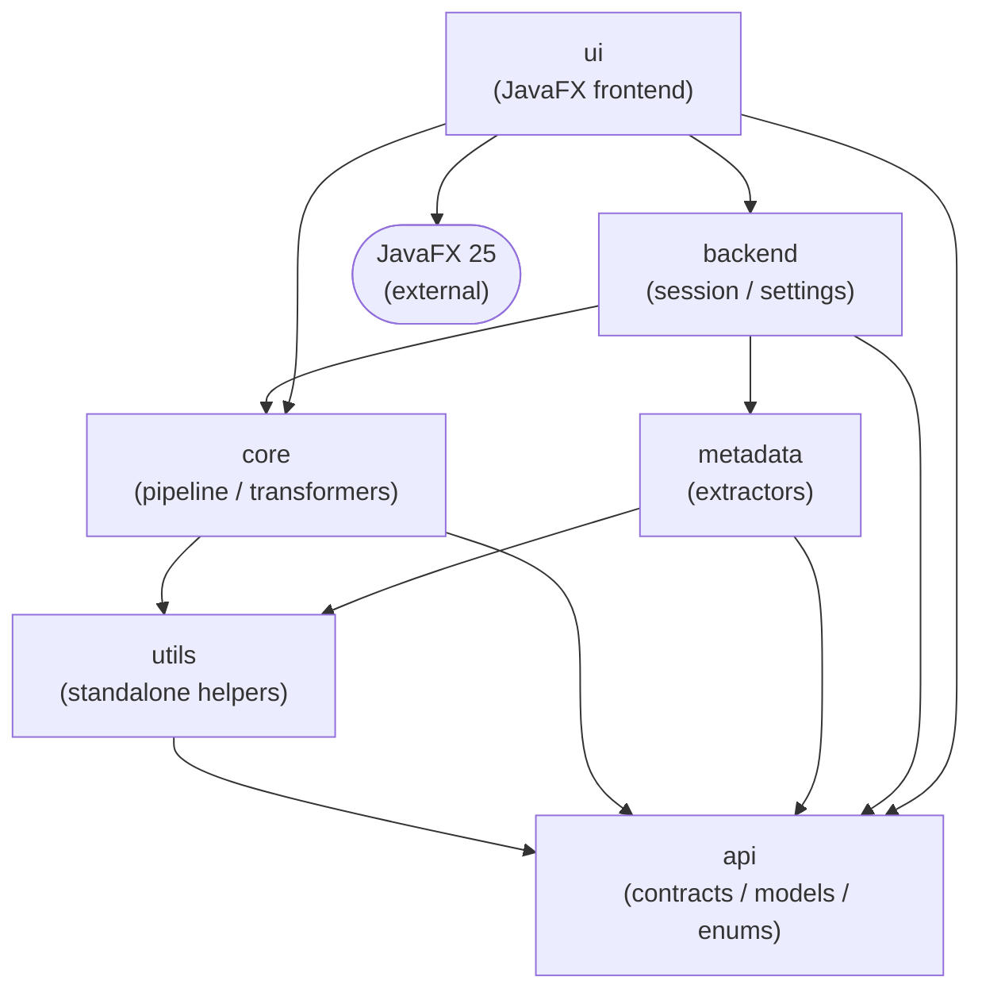

# Project Overview

## Overview

Renamer App is a JavaFX 25 desktop application for batch renaming files using metadata extracted directly from file
content — EXIF data, audio tags, video streams, and other embedded properties. Target users are photographers, audio
engineers, and power users who manage large collections of media files and need rule-based, preview-before-rename
workflows. The application applies one or more configurable transformation modes to a file list, resolves naming
conflicts automatically, and performs the physical rename — all without data loss (errors are captured per-file, never
thrown to the caller).

The codebase is ~460 classes across 6 JPMS modules. Entry point: `ua.renamer.app.Launcher` →
`ua.renamer.app.ui.RenamerApplication`.

---

## Module Map

| Module     | Root Package              | Role                                                                                                    | Key Classes                                                                                                                                                       |
|------------|---------------------------|---------------------------------------------------------------------------------------------------------|-------------------------------------------------------------------------------------------------------------------------------------------------------------------|
| `api`      | `ua.renamer.app.api`      | Shared contracts — all interfaces, models, enums, and session abstractions that cross module boundaries | `FileRenameOrchestrator`, `FileModel`, `PreparedFileModel`, `RenameResult`, `SessionApi`                                                                          |
| `utils`    | `ua.renamer.app.utils`    | Standalone helpers with no project-layer dependencies                                                   | `TextUtils`, `FileUtils`, `DateTimeUtils`, `CaseUtils`, `SizeUtils`                                                                                               |
| `core`     | `ua.renamer.app.core`     | Transformation pipeline — orchestrates all four phases and owns the transformers                        | `FileRenameOrchestratorImpl`, `ThreadAwareFileMapper`, `DuplicateNameResolverImpl`, `RenameExecutionServiceImpl`, `DIV2ServiceModule`                             |
| `metadata` | `ua.renamer.app.metadata` | Metadata extraction — 25+ format-specific strategies for image, audio, and video files                  | `CategoryFileMetadataExtractorResolver`, `ImageFileMetadataExtractionExtractor`, `AudioFileMetadataExtractor`, `GenericFileMetadataExtractor`, `DIMetadataModule` |
| `backend`  | `ua.renamer.app.backend`  | Session and settings layer — stateful rename session, persistent settings, JavaFX-free                  | `RenameSession`, `RenameSessionService`, `SettingsServiceImpl`, `BackendExecutor`, `DIBackendModule`                                                              |
| `ui`       | `ua.renamer.app.ui`       | JavaFX frontend — controllers, FXML views, widgets, converters, DI wiring                               | `RenamerApplication`, `ApplicationMainViewController`, `DIAppModule`, `DICoreModule`, `DIUIModule`                                                                |

---

## Module Dependency Graph

Layering rationale: `api` is the dependency floor — it defines the contracts that all other modules implement or
consume. `utils` stands alone and is shared by `core` and `metadata` without creating a cycle. `core` and `metadata` are
parallel leaves at the business-logic tier; neither depends on the other, which allows `metadata` extraction strategies
to evolve independently of pipeline logic. `backend` assembles them into a stateful session layer, and `ui` sits at the
top — it is the only module that may import JavaFX types.

> See [pipeline-architecture.md](pipeline-architecture.md) for how data flows through the phases at runtime.  
> See [dependency-injection.md](dependency-injection.md) for how Guice modules wire these layers together.

---

## JPMS Design Decisions

### FX-Free Backend (enforced at compile time)

`ua.renamer.app.backend` contains no `requires javafx.*` directive — this is intentional and enforced by JPMS. Any class
in `backend` that accidentally imports a JavaFX type produces a compile error. This boundary ensures:

- Business logic and settings serialization are testable without a JavaFX runtime
- The session layer can be reused by a headless CLI or server process without change
- The dependency direction is strict: `ui` depends on `backend`, never the reverse

### Intentionally Unexported Packages

Several packages are compiled into their module but deliberately excluded from `exports`:

| Module     | Unexported package area                                                        | Reason                                                                                                                          |
|------------|--------------------------------------------------------------------------------|---------------------------------------------------------------------------------------------------------------------------------|
| `core`     | Internal transformer implementations (`service.transformation.*` impl classes) | Public API is `FileTransformationService` interface in `api`; callers never instantiate transformers directly                   |
| `metadata` | Internal extraction strategy details                                           | `CategoryFileMetadataExtractorResolver` is the single public entry point; format-specific strategies are implementation details |
| `backend`  | Internal session state fields                                                  | Session mutations go through `RenameSessionService`; raw state access would bypass invariant checks                             |
| `api`      | `exception` package                                                            | Exceptions are implementation-private; the no-throw contract means callers never catch them directly                            |

The general rule: if downstream modules only need an interface, the concrete class is unexported.

---

## Tech Stack

| Library             | Version | Purpose in this project                                                                       |
|---------------------|---------|-----------------------------------------------------------------------------------------------|
| Java                | 25      | Language and platform; virtual threads (Phase 1 & 2 parallelism)                              |
| JavaFX              | 25.0.2  | UI framework — FXML views, controls, CSS theming                                              |
| Google Guice        | 7.0.0   | Dependency injection across all 6 modules                                                     |
| Lombok              | 1.18.44 | `@Builder`, `@RequiredArgsConstructor`, `@Value` — reduces boilerplate on models and services |
| SLF4J               | 2.0.17  | Logging API used throughout                                                                   |
| Logback             | 1.5.32  | Logging implementation (configured in `backend`)                                              |
| Apache Tika         | 3.3.0   | File type detection and content parsing in `metadata`                                         |
| metadata-extractor  | 2.19.0  | EXIF / IPTC / XMP tag extraction for image files                                              |
| jAudioTagger        | 2.0.19  | ID3, Vorbis, MP4 tag reading for audio files                                                  |
| Google Guava        | 33.5.0  | Utility collections used in metadata extraction                                               |
| Apache Commons IO   | 2.21.0  | File I/O helpers in `utils` and `core`                                                        |
| Jackson             | 2.21.2  | JSON serialization for persistent settings in `backend`                                       |
| JSpecify            | 1.0.0   | `@Nullable` / `@NonNull` annotations for null-safety analysis                                 |
| Jakarta Annotations | 3.0.0   | `@PostConstruct`, lifecycle annotations for Guice-managed beans                               |
| Jakarta Inject      | 2.0.1   | Standard `@Inject`, `@Singleton`, `@Named` annotations                                        |
| JUnit 5 BOM         | 6.0.3   | Test framework                                                                                |
| AssertJ             | 3.27.7  | Fluent assertion library                                                                      |
| Mockito             | 5.23.0  | Mocking framework for unit tests                                                              |
