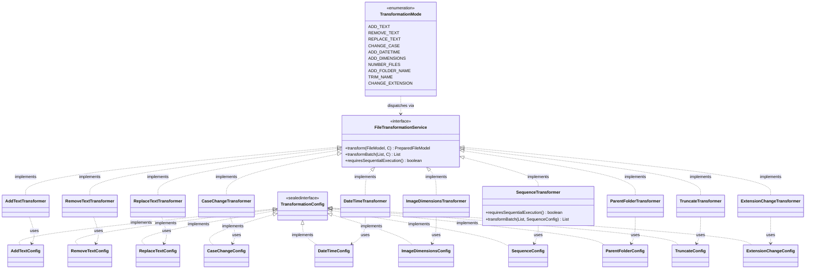

# Transformation Modes — Developer Reference

## Strategy Pattern Overview

Each transformation mode is implemented as a stateless strategy class that implements `FileTransformationService<C>`, a
generic interface in `ua.renamer.app.core.service`:

```java

@FunctionalInterface
public interface FileTransformationService<C> {
    PreparedFileModel transform(FileModel input, C config);

    default List<PreparedFileModel> transformBatch(List<FileModel> inputs, C config) {
        return inputs.stream().map(fm -> transform(fm, config)).toList();
    }

    default boolean requiresSequentialExecution() {
        return false;
    }
}
```

`transform()` is the only abstract method — the interface is `@FunctionalInterface`. `transformBatch()` has a default
implementation that delegates to `transform()` for each input; `SequenceTransformer` overrides both.
`requiresSequentialExecution()` returns `false` by default; only `SequenceTransformer` overrides it to return `true`.

**Orchestrator dispatch:** `FileRenameOrchestratorImpl` pattern-matches on the `TransformationMode` enum value to select
the correct transformer and config type. If `requiresSequentialExecution()` returns `true`, the orchestrator calls
`transformBatch()` directly instead of spawning a virtual-thread pool. Otherwise, each `transform()` call runs
concurrently in a `newVirtualThreadPerTaskExecutor`. See [pipeline-architecture.md](pipeline-architecture.md) for the
full dispatch flow.

**No-throw contract:** All transformers capture errors in `PreparedFileModel.hasError` and
`PreparedFileModel.errorMessage`. No transformer propagates an exception to the orchestrator.

---

## Config Class Pattern

Every mode has a dedicated, immutable config class in `ua.renamer.app.api.model.config`. All configs implement the
sealed `TransformationConfig` interface:

```java
public sealed interface TransformationConfig
        permits AddTextConfig, RemoveTextConfig, ReplaceTextConfig,
        CaseChangeConfig, DateTimeConfig, ImageDimensionsConfig,
        SequenceConfig, ParentFolderConfig, TruncateConfig,
        ExtensionChangeConfig {
}
```

The `sealed` keyword is intentional: adding a new transformation mode requires adding to the `permits` clause, which
triggers a compile error in `FileRenameOrchestratorImpl`'s exhaustive switch — forcing the implementer to wire up the
new mode before the project builds.

**Class structure:** All config classes use `@Value @Builder(setterPrefix = "with")`. The `@Value` annotation makes all
fields `private final` and generates an all-args constructor. The `setterPrefix = "with"` means builder calls use
`.withFieldName(value)`, not `.fieldName(value)`.

**Validation:** Each config class overrides the Lombok-generated `build()` method to run validation before construction.
Validation uses `Objects.requireNonNull()` for non-null constraints and explicit `IllegalArgumentException` for range
checks:

```java

@Value
@Builder(setterPrefix = "with")
public class ExampleConfig implements TransformationConfig {
    String requiredField;
    int rangeField;

    public static class ExampleConfigBuilder {
        public ExampleConfig build() {
            Objects.requireNonNull(requiredField, "requiredField must not be null");
            if (rangeField < 0) {
                throw new IllegalArgumentException("rangeField must be >= 0, got: " + rangeField);
            }
            return new ExampleConfig(requiredField, rangeField);
        }
    }
}
```

**`@Builder.Default`:** Only `DateTimeConfig` uses `@Builder.Default` fields — four boolean flags with documented
defaults (`useFallbackDateTime = false`, `useUppercaseForAmPm = true`, `useCustomDateTimeAsFallback = false`,
`applyToExtension = false`). All other config classes use primitive or reference fields with no builder defaults.

---

## Mode Reference

### 1. ADD_TEXT

**Purpose:** Prepend or append a fixed string to the filename stem.

**Strategy class:** `AddTextTransformer` — `ua.renamer.app.core.service.transformation`  
**Config class:** `AddTextConfig` — `ua.renamer.app.api.model.config`  
**Parallel-safe:** Yes

**Config parameters:**

| Field       | Type           | Required | Description                       |
|-------------|----------------|----------|-----------------------------------|
| `textToAdd` | `String`       | Yes      | Text to insert into the filename  |
| `position`  | `ItemPosition` | Yes      | `BEGIN` — prepend; `END` — append |

**Algorithm:**

- `BEGIN`: `newName = textToAdd + originalName`
- `END`: `newName = originalName + textToAdd`
- Extension preserved unchanged.

**Edge cases:**

- `textToAdd` may be an empty string — produces no visible change to the name (no error).
- Directories: error result (not a pass-through).

---

### 2. REMOVE_TEXT

**Purpose:** Remove a fixed string from the beginning or end of the filename stem.

**Strategy class:** `RemoveTextTransformer`  
**Config class:** `RemoveTextConfig`  
**Parallel-safe:** Yes

**Config parameters:**

| Field          | Type           | Required | Description                            |
|----------------|----------------|----------|----------------------------------------|
| `textToRemove` | `String`       | Yes      | Exact text to remove from the filename |
| `position`     | `ItemPosition` | Yes      | `BEGIN` — from start; `END` — from end |

**Algorithm:**

- `BEGIN`: if name starts with `textToRemove` → `name.substring(textToRemove.length())`; otherwise no-op.
- `END`: if name ends with `textToRemove` → `name.substring(0, name.length() - textToRemove.length())`; otherwise no-op.
- Extension preserved unchanged.

**Edge cases:**

- Text not found at the specified position → original name returned unchanged (no error).
- Directories: error result.

---

### 3. REPLACE_TEXT

**Purpose:** Replace a fixed string at the beginning, end, or everywhere in the filename stem.

**Strategy class:** `ReplaceTextTransformer`  
**Config class:** `ReplaceTextConfig`  
**Parallel-safe:** Yes

**Config parameters:**

| Field             | Type                   | Required | Description                     |
|-------------------|------------------------|----------|---------------------------------|
| `textToReplace`   | `String`               | Yes      | Text to find                    |
| `replacementText` | `String`               | Yes      | Text to substitute              |
| `position`        | `ItemPositionExtended` | Yes      | `BEGIN`, `END`, or `EVERYWHERE` |

**Algorithm:**

- `BEGIN`: if name starts with `textToReplace` → `replacementText + name.substring(textToReplace.length())`; otherwise
  no-op.
- `END`: if name ends with `textToReplace` →
  `name.substring(0, name.length() - textToReplace.length()) + replacementText`; otherwise no-op.
- `EVERYWHERE`: `name.replace(textToReplace, replacementText)` — replaces all occurrences.
- Extension preserved unchanged.

**Edge cases:**

- Text not found at `BEGIN`/`END` → no-op (no error).
- `EVERYWHERE` with no occurrences → no-op (no error).
- Directories: error result.

---

### 4. CHANGE_CASE

**Purpose:** Transform the filename stem to a different letter-casing style.

**Strategy class:** `CaseChangeTransformer`  
**Config class:** `CaseChangeConfig`  
**Parallel-safe:** Yes

**Config parameters:**

| Field                   | Type              | Required | Description                                           |
|-------------------------|-------------------|----------|-------------------------------------------------------|
| `caseOption`            | `TextCaseOptions` | Yes      | Target case style (8 options — see table below)       |
| `capitalizeFirstLetter` | `boolean`         | Yes      | After case conversion, capitalize the first character |

**`TextCaseOptions` values:**

| Value                  | Example           |
|------------------------|-------------------|
| `CAMEL_CASE`           | `camelCaseText`   |
| `PASCAL_CASE`          | `PascalCaseText`  |
| `SNAKE_CASE`           | `snake_case_text` |
| `SNAKE_CASE_SCREAMING` | `SNAKE_CASE_TEXT` |
| `KEBAB_CASE`           | `kebab-case-text` |
| `UPPERCASE`            | `UPPERCASE TEXT`  |
| `LOWERCASE`            | `lowercase text`  |
| `TITLE_CASE`           | `Title Case Text` |

**Algorithm:**

1. Apply `CaseUtils.toProvidedCase(name, caseOption)` — delegates to `ua.renamer.app.utils`.
2. If `capitalizeFirstLetter = true` and result is not empty:
   `Character.toUpperCase(result.charAt(0)) + result.substring(1)`.
3. Extension preserved unchanged.

**Edge cases:**

- Empty name after case conversion: `capitalizeFirstLetter` step is skipped to avoid `StringIndexOutOfBoundsException`.
- Directories: error result.

---

### 5. ADD_DATETIME

**Purpose:** Insert a formatted datetime string into the filename stem or replace it entirely.

**Strategy class:** `DateTimeTransformer`  
**Config class:** `DateTimeConfig`  
**Parallel-safe:** Yes

**Config parameters:**

| Field                         | Type                          | Required    | Default | Description                                                                              |
|-------------------------------|-------------------------------|-------------|---------|------------------------------------------------------------------------------------------|
| `source`                      | `DateTimeSource`              | Yes         | —       | Where to obtain the datetime value                                                       |
| `dateFormat`                  | `DateFormat`                  | Yes         | —       | Date portion format                                                                      |
| `timeFormat`                  | `TimeFormat`                  | Yes         | —       | Time portion format                                                                      |
| `dateTimeFormat`              | `DateTimeFormat`              | No          | `null`  | Combined format; overrides `dateFormat`/`timeFormat` when set                            |
| `position`                    | `ItemPositionWithReplacement` | Yes         | —       | `BEGIN`, `END`, or `REPLACE`                                                             |
| `customDateTime`              | `LocalDateTime`               | Conditional | `null`  | Required when `source = CUSTOM_DATE`                                                     |
| `separator`                   | `String`                      | No          | `null`  | Inserted between the datetime block and the filename                                     |
| `useFallbackDateTime`         | `boolean`                     | No          | `false` | Fall back to earliest available date when primary source is null                         |
| `useUppercaseForAmPm`         | `boolean`                     | No          | `true`  | Uppercase AM/PM designators in 12-hour formats                                           |
| `useCustomDateTimeAsFallback` | `boolean`                     | No          | `false` | Use `customDateTime` as the last-resort fallback (requires `useFallbackDateTime = true`) |
| `applyToExtension`            | `boolean`                     | No          | `false` | Apply the same datetime transformation to the extension                                  |

**`DateTimeSource` values:**

| Value                    | Source                                                                                |
|--------------------------|---------------------------------------------------------------------------------------|
| `FILE_CREATION_DATE`     | Filesystem creation timestamp                                                         |
| `FILE_MODIFICATION_DATE` | Filesystem last-modified timestamp                                                    |
| `CONTENT_CREATION_DATE`  | EXIF `DateTimeOriginal` or video creation date from embedded metadata                 |
| `CURRENT_DATE`           | `LocalDateTime.now()` at transform time                                               |
| `CUSTOM_DATE`            | `customDateTime` field — validated non-null by `build()` when this source is selected |

**Algorithm:**

1. Resolve datetime from `source`.
2. If null and `useFallbackDateTime = true`:
    - If `useCustomDateTimeAsFallback = true` and `customDateTime` is non-null: use it.
    - Otherwise: collect creation, modification, and content creation dates; use the earliest non-null value.
3. If still null: return error ("No datetime available for source: …").
4. Format via `dateTimeConverter.formatDateTime(dateFormat, timeFormat, dateTimeFormat)`.
5. If format is an AM/PM style and `useUppercaseForAmPm = false`: lowercase the AM/PM suffix.
6. Apply to filename based on `position`:
    - `BEGIN`: `formattedDateTime + separator + name`
    - `END`: `name + separator + formattedDateTime`
    - `REPLACE`: `formattedDateTime` (stem replaced entirely)
7. If `applyToExtension = true`: apply the same position-based logic to the extension; otherwise preserve the original
   extension.

**Edge cases:**

- `CONTENT_CREATION_DATE` resolves only for image and video files; returns `null` for audio/generic files.
- Directories: pass-through (no error, name unchanged).
- `CUSTOM_DATE` with null `customDateTime` is rejected at `build()` time before the transformer is ever called.

---

### 6. ADD_DIMENSIONS

**Purpose:** Insert image or video dimensions into the filename stem or replace it.

**Strategy class:** `ImageDimensionsTransformer`  
**Config class:** `ImageDimensionsConfig`  
**Parallel-safe:** Yes

**Config parameters:**

| Field           | Type                          | Required | Description                                                              |
|-----------------|-------------------------------|----------|--------------------------------------------------------------------------|
| `leftSide`      | `ImageDimensionOptions`       | Yes      | Value on the left of the separator (`DO_NOT_USE`, `WIDTH`, or `HEIGHT`)  |
| `rightSide`     | `ImageDimensionOptions`       | Yes      | Value on the right of the separator (`DO_NOT_USE`, `WIDTH`, or `HEIGHT`) |
| `separator`     | `String`                      | No       | Separator between left and right values (typically `"x"`)                |
| `position`      | `ItemPositionWithReplacement` | Yes      | `BEGIN`, `END`, or `REPLACE`                                             |
| `nameSeparator` | `String`                      | Yes      | Separator between the dimension block and the filename                   |

`build()` enforces that at least one of `leftSide`/`rightSide` is not `DO_NOT_USE`.

**`ImageDimensionOptions` values:** `DO_NOT_USE`, `WIDTH`, `HEIGHT`

**Algorithm:**

1. Extract `width`/`height` from `FileModel.metadata.imageMeta`; if absent, fall back to `videoMeta`.
2. If both are `null`: return error ("No image/video metadata available").
3. Build dimension string: left value + separator + right value (omit any side configured as `DO_NOT_USE`; omit
   separator if only one side is active).
4. If dimension string is empty: return error ("Cannot build dimension string from configuration").
5. Apply to filename based on `position`:
    - `BEGIN`: `dimensionStr + nameSeparator + name`
    - `END`: `name + nameSeparator + dimensionStr`
    - `REPLACE`: `dimensionStr`
6. Extension preserved unchanged.

**Edge cases:**

- Directories: pass-through (no error, name unchanged).
- Missing metadata (non-image, non-video file): error result.

---

### 7. NUMBER_FILES *(Sequential)*

**Purpose:** Assign a monotonically increasing sequence number to each filename, optionally restarting the counter per
folder.

**Strategy class:** `SequenceTransformer`  
**Config class:** `SequenceConfig`  
**Parallel-safe:** No — `requiresSequentialExecution()` returns `true`.

**Config parameters:**

| Field               | Type         | Required | Default  | Description                                                              |
|---------------------|--------------|----------|----------|--------------------------------------------------------------------------|
| `startNumber`       | `int`        | Yes      | —        | First sequence number                                                    |
| `stepValue`         | `int`        | Yes      | —        | Increment between consecutive numbers                                    |
| `padding`           | `int`        | Yes      | —        | Minimum digit width for zero-padding; `0` = no padding; must be ≥ 0      |
| `sortSource`        | `SortSource` | No       | —        | Criterion for ordering files before numbering                            |
| `perFolderCounting` | `boolean`    | Yes      | `false`* | `true` = independent counter per folder; `false` = single global counter |

\* Builder default is `false`. The UI sets `true` by default when constructing the config.

**`SortSource` values:**

| Value                            | Sort key                           | Null / absent handling        |
|----------------------------------|------------------------------------|-------------------------------|
| `FILE_NAME`                      | Alphabetical filename              | N/A                           |
| `FILE_PATH`                      | Absolute path string               | N/A                           |
| `FILE_SIZE`                      | File size in bytes                 | 0 if absent                   |
| `FILE_CREATION_DATETIME`         | Filesystem creation timestamp      | `LocalDateTime.MIN` if absent |
| `FILE_MODIFICATION_DATETIME`     | Filesystem last-modified timestamp | `LocalDateTime.MIN` if absent |
| `FILE_CONTENT_CREATION_DATETIME` | EXIF / video creation date         | `LocalDateTime.MIN` if absent |
| `IMAGE_WIDTH`                    | Width in pixels                    | 0 if absent                   |
| `IMAGE_HEIGHT`                   | Height in pixels                   | 0 if absent                   |

All sort criteria use filename then absolute path as stable tiebreakers.

**Algorithm (`transformBatch`):**

1. Partition inputs: invalid files (not a regular file or directory) → error results collected separately.
2. If `perFolderCounting = true`:
    - Group valid files by parent directory path using `LinkedHashMap` (preserves input order across groups).
    - For each group: sort by `sortSource`, then apply an independent counter starting at `startNumber`.
3. If `perFolderCounting = false`:
    - Sort all valid files globally by `sortSource`.
    - Apply a single counter starting at `startNumber`.
4. Counter increments by `stepValue` after each file.
5. Number formatted: if `padding ≤ 0` → raw integer string; if `padding > 0` → zero-padded to `padding` digits.
6. Sequence number replaces the filename stem entirely; extension preserved.
7. Combine error results and numbered results into a single returned list.

**Edge cases:**

- Calling `transform()` directly throws `UnsupportedOperationException` — this mode only supports `transformBatch()`.
- `stepValue` may be 0 (all files share the same number) or negative (countdown).
- Directories: error result (excluded from the valid file list before numbering).

---

### 8. ADD_FOLDER_NAME

**Purpose:** Prepend or append the names of one or more ancestor directories to the filename stem.

**Strategy class:** `ParentFolderTransformer`  
**Config class:** `ParentFolderConfig`  
**Parallel-safe:** Yes

**Config parameters:**

| Field                   | Type           | Required | Description                                      |
|-------------------------|----------------|----------|--------------------------------------------------|
| `numberOfParentFolders` | `int`          | Yes      | How many ancestor levels to include; must be ≥ 1 |
| `position`              | `ItemPosition` | Yes      | `BEGIN` — prepend; `END` — append                |
| `separator`             | `String`       | No       | Separator between folder names and filename      |

**Algorithm:**

1. Walk up the file's path collecting `numberOfParentFolders` ancestor names (immediate parent first).
2. Reverse the collected list so the furthest ancestor appears first (e.g., `grandparent_parent_filename`).
3. If the list is empty: return error ("No parent folders available").
4. Join names with `separator` to form `parentString`.
5. Apply to filename:
    - `BEGIN`: `parentString + separator + name`
    - `END`: `name + separator + parentString`
6. Extension preserved unchanged.

**Edge cases:**

- Requesting more levels than exist in the path: only available ancestor names are used (no error).
- Null path components in the filesystem hierarchy are silently skipped.
- Directories: error result.

---

### 9. TRIM_NAME

**Purpose:** Remove a fixed number of characters from the beginning or end of the filename stem, or strip
leading/trailing whitespace.

**Strategy class:** `TruncateTransformer`  
**Config class:** `TruncateConfig`  
**Parallel-safe:** Yes

**Config parameters:**

| Field             | Type              | Required | Description                                  |
|-------------------|-------------------|----------|----------------------------------------------|
| `numberOfSymbols` | `int`             | Yes      | Characters to remove; must be ≥ 0            |
| `truncateOption`  | `TruncateOptions` | Yes      | Which end to remove from, or whitespace trim |

**`TruncateOptions` values:**

| Value                     | Behavior                                                       |
|---------------------------|----------------------------------------------------------------|
| `REMOVE_SYMBOLS_IN_BEGIN` | Remove `numberOfSymbols` characters from the start of the name |
| `REMOVE_SYMBOLS_FROM_END` | Remove `numberOfSymbols` characters from the end of the name   |
| `TRUNCATE_EMPTY_SYMBOLS`  | `name.trim()` — remove leading and trailing whitespace         |

**Algorithm:**

- `REMOVE_SYMBOLS_IN_BEGIN`:
    - `name.length() ≤ numberOfSymbols` → result is empty string (entire name removed).
    - Otherwise → `name.substring(numberOfSymbols)`.
- `REMOVE_SYMBOLS_FROM_END`:
    - `name.length() ≤ numberOfSymbols` → result is empty string.
    - Otherwise → `name.substring(0, name.length() - numberOfSymbols)`.
- `TRUNCATE_EMPTY_SYMBOLS`: `name.trim()`.
- If result is an empty string: return error ("Truncation resulted in empty filename").
- Extension preserved unchanged.

**Edge cases:**

- `numberOfSymbols = 0` with `REMOVE_SYMBOLS_IN_BEGIN`/`REMOVE_SYMBOLS_FROM_END`: name unchanged (no characters
  removed).
- Name shorter than or equal to `numberOfSymbols`: entire name is removed → error.
- Directories: error result.

---

### 10. CHANGE_EXTENSION

**Purpose:** Replace the file extension, leaving the filename stem unchanged.

**Strategy class:** `ExtensionChangeTransformer`  
**Config class:** `ExtensionChangeConfig`  
**Parallel-safe:** Yes

**Config parameters:**

| Field          | Type     | Required | Description                                                                                     |
|----------------|----------|----------|-------------------------------------------------------------------------------------------------|
| `newExtension` | `String` | Yes      | Replacement extension; must be non-blank; leading dot is optional and is stripped automatically |

**Algorithm:**

1. `newExtension.trim()`.
2. If result starts with `.`: strip the leading dot.
3. If result is empty after trimming: return error ("New extension cannot be empty").
4. Return original filename stem with the new extension.

**Edge cases:**

- Directories: pass-through (no error, no change).
- `".jpg"` and `"jpg"` produce identical results — the transformer normalizes leading dots.
- Multiple leading dots: only the first is stripped (`"..jpg"` → `".jpg"`).

---

## Sequential Execution Contract

`NUMBER_FILES` (`SequenceTransformer`) is the only mode that requires sequential execution. The contract has three
parts:

**1. Interface signal:** `requiresSequentialExecution()` returns `true`. The orchestrator checks this before
dispatching:

```java
// FileRenameOrchestratorImpl — Phase 2 dispatch (simplified)
if(transformer.requiresSequentialExecution()){
        return transformer.

transformBatch(fileModels, config);  // no thread pool
}else{
        // parallel virtual-thread pool
        }
```

**2. `transform()` is disabled:** Calling `SequenceTransformer.transform()` directly throws
`UnsupportedOperationException`. This is a hard runtime guard — the method must never be called because positional
numbering requires the full ordered list of files to be available at once.

**3. `transformBatch()` owns the algorithm:** The entire sequencing logic lives in `transformBatch()`, which:

- Filters invalid files into error results before sorting.
- Sorts the valid file list (or each per-folder group) by `sortSource`.
- Applies the counter in sorted order, incrementing by `stepValue`.

The other nine transformers inherit the `default transformBatch()` implementation, which simply maps `transform()` over
the input list. Overriding `transformBatch()` is only necessary when the transformation of one file depends on the
position of other files in the list.

---

## Class Diagram



---

> See [pipeline-architecture.md](pipeline-architecture.md) for how transformers are invoked during Phase 2 and how the
> orchestrator decides between parallel and sequential execution.  
> See [add-transformation-mode.md](../guides/add-transformation-mode.md) for the step-by-step guide to adding a new
> mode.
