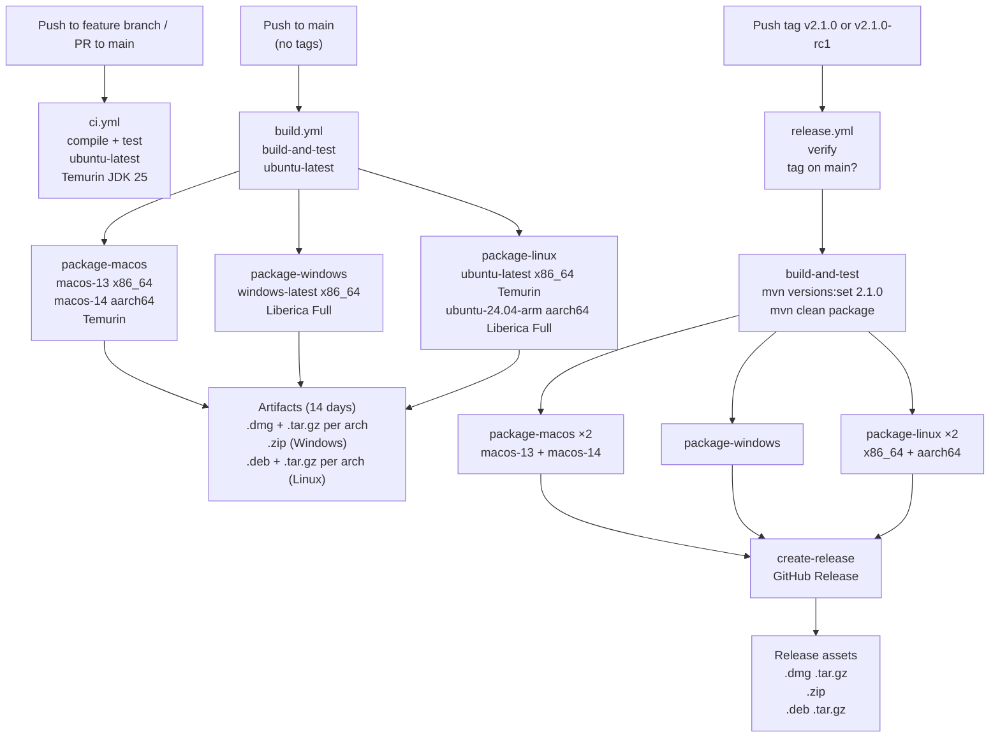

# CI/CD Pipeline Guide

This guide covers the three GitHub Actions workflows, how they trigger, how releases are versioned, and the day-to-day
developer workflow.

---

## 1. Overview

Three pipelines handle the full lifecycle:

| Workflow          | File          | Trigger                                     | Purpose                                                                   |
|-------------------|---------------|---------------------------------------------|---------------------------------------------------------------------------|
| Feature CI        | `ci.yml`      | Push to any non-`main` branch; PR to `main` | Fast compile + test validation                                            |
| Main Branch Build | `build.yml`   | Push to `main` (tags excluded)              | Prove `main` is always packageable; 14-day snapshot artifacts             |
| Tag Release       | `release.yml` | Push of tag matching `v*.*.*`               | Versioned release build, packages all platforms, publishes GitHub Release |



---

## 2. Feature CI (`ci.yml`)

**Trigger:** Push to any branch except `main`; pull request targeting `main`.

**Purpose:** Fast feedback — does the code compile and do tests pass? Build time: ~2–3 minutes.

**What runs:**

| Step           | Action                              |
|----------------|-------------------------------------|
| Checkout       | `actions/checkout@v4`               |
| Set up JDK     | Temurin JDK 25, Maven cache enabled |
| Build and test | `cd app && mvn verify`              |

No packaging, no artifacts. The sole purpose is validation. If this fails, the PR cannot be merged.

**Pass/fail criteria:** `mvn verify` succeeds. Any compile error or test failure fails the job.

---

## 3. Main Branch Build (`build.yml`)

**Trigger:** Push to `main`. Tags are excluded via `tags-ignore: '**'` — `release.yml` handles those.

**Purpose:** Prove that every commit merged to `main` is packageable on all target platforms. Produces snapshot
artifacts available for 14 days for manual testing.

### Job structure

**Job 1 — `build-and-test`** (ubuntu-latest, Temurin JDK 25):

1. `mvn clean package` — compiles, tests, and assembles JARs
2. Uploads `app/ui/target/libs/` as the `app-libs` artifact (retained 1 day — only needed by packaging jobs)

**Jobs 2–5 — packaging** (parallel, `fail-fast: false`; all download `app-libs`):

| Job                  | Runner                              | JDK                      | Output                      |
|----------------------|-------------------------------------|--------------------------|-----------------------------|
| `package-macos` (×2) | `macos-13`, `macos-14`              | Temurin                  | `.dmg` + `.tar.gz` per arch |
| `package-windows`    | `windows-latest`                    | Liberica Full (`jdk+fx`) | `.zip` (app-image)          |
| `package-linux` (×2) | `ubuntu-latest`, `ubuntu-24.04-arm` | Temurin / Liberica Full  | `.deb` + `.tar.gz` per arch |

**APP_VERSION:** Hardcoded placeholder `2.0.0` in the workflow env. Snapshot builds are not versioned from a tag — they
are for verification only, not distribution.

**Artifacts retained 14 days** under names: `macos-x86_64`, `macos-aarch64`, `windows-x86_64`, `linux-x86_64`,
`linux-aarch64`.

**Why Liberica Full on Linux arm64 and Windows:**  jpackage needs JavaFX `.jmod` files to link a self-contained JRE.
Liberica Full (`jdk+fx`) bundles them. macOS and Linux x86_64 work with Temurin because jpackage on these platforms
resolves JavaFX from the modular JARs already in `app/ui/target/libs/`.

---

## 4. Release Pipeline (`release.yml`)

**Trigger:** Tag push matching `v[0-9]+.[0-9]+.[0-9]+` (stable) or `v[0-9]+.[0-9]+.[0-9]+-*` (pre-release, e.g.
`v2.1.0-rc1`).

**Purpose:** Versioned, signed-off release — extract version from the tag, inject it into Maven, build, package all
platforms, publish a GitHub Release with all installer artifacts.

### Job flow

```
verify → build-and-test → package-macos (×2)  ─┐
                        → package-windows        ├→ create-release
                        → package-linux (×2)    ─┘
```

### Job 1 — `verify`

Two checks run before any build work:

1. **Tag is on `main`:**
   ```bash
   git fetch origin main
   git merge-base --is-ancestor ${{ github.sha }} origin/main
   ```
   If the tagged commit is not reachable from `main`, the job fails immediately. This prevents accidental releases from
   feature branches.

2. **Version extraction:**
   ```bash
   TAG="${GITHUB_REF_NAME}"             # e.g. v2.1.0-rc1
   FULL_VERSION="${TAG#v}"              # → 2.1.0-rc1  (GitHub Release name)
   JPACKAGE_VERSION="${FULL_VERSION%%-*}" # → 2.1.0    (Maven + jpackage --app-version)
   ```
   `FULL_VERSION` and `JPACKAGE_VERSION` are published as job outputs and consumed by all downstream jobs.

### Job 2 — `build-and-test`

1. `mvn versions:set -DnewVersion=2.1.0 -DgenerateBackupFiles=false` — updates `pom.xml` in the CI workspace only. *
   *This change is never committed.**
2. `mvn clean package` — builds with the injected version; JARs include the release version number.
3. Uploads `app/ui/target/libs/` as `app-libs` (retained 1 day).

### Jobs 3–5 — platform packaging

Same platform matrix as `build.yml`. Each job:

- Downloads `app-libs`
- Runs the platform packaging script with `APP_VERSION` set to `JPACKAGE_VERSION` from the `verify` job
- Uploads artifacts to `release-macos-{arch}`, `release-windows-x86_64`, `release-linux-{arch}` (retained 1 day —
  consumed by `create-release`)

### Job 6 — `create-release`

Downloads all `release-*` artifacts, collects `.dmg`, `.zip`, `.deb`, `.tar.gz` files, then calls
`softprops/action-gh-release@v2`:

- `name`: `Release v2.1.0-rc1`
- `prerelease`: `true` if the tag name contains `-` (e.g. `-rc1`, `-beta.1`)
- `generate_release_notes`: `true` — GitHub auto-generates notes from merged PRs
- `files`: all collected installer files

**Required permissions:** `contents: write` is declared at the workflow level. No repository secrets needed —
`GITHUB_TOKEN` is used automatically.

### Release artifact inventory

| File                               | Platform            | Type                 |
|------------------------------------|---------------------|----------------------|
| `Renamer-{v}-macos-x86_64.dmg`     | macOS Intel         | Installer            |
| `Renamer-{v}-macos-x86_64.tar.gz`  | macOS Intel         | Portable             |
| `Renamer-{v}-macos-aarch64.dmg`    | macOS Apple Silicon | Installer            |
| `Renamer-{v}-macos-aarch64.tar.gz` | macOS Apple Silicon | Portable             |
| `Renamer-{v}-windows-x86_64.zip`   | Windows x86_64      | Portable (app-image) |
| `Renamer-{v}-linux-x86_64.tar.gz`  | Linux x86_64        | Portable             |
| `renamer_{v}_amd64.deb`            | Linux x86_64        | Installer            |
| `Renamer-{v}-linux-aarch64.tar.gz` | Linux arm64         | Portable             |
| `renamer_{v}_arm64.deb`            | Linux arm64         | Installer            |

macOS DMGs are renamed inline in the YAML to append `-macos-{arch}` before upload, preventing filename collisions when
both arch artifacts are collected by `create-release`. `.deb` filenames are generated by jpackage with the host arch
already embedded — no renaming needed.

No code signing is applied. macOS Gatekeeper warning on first launch is documented in
`docs/developers/guides/cross-platform-notes.md`.

---

## 5. Version Management

**Git tags are the single source of truth for the release version.**

During development, `pom.xml` carries a static placeholder version (`2.0.0`). This version is used as-is for local
builds, feature-branch CI, and main-branch snapshot builds. It has no semantic meaning.

At release time:

```
Developer pushes tag v2.1.0
        │
        ▼
release.yml extracts: FULL_VERSION=2.1.0, JPACKAGE_VERSION=2.1.0
        │
        ▼
mvn versions:set -DnewVersion=2.1.0   (CI workspace only — never committed)
        │
        ▼
mvn clean package                      (JARs built with version 2.1.0)
        │
        ▼
jpackage --app-version 2.1.0          (installers labelled 2.1.0)
        │
        ▼
GitHub Release "Release v2.1.0"       (assets attached, release notes generated)
```

**Tag naming convention:**

| Tag             | Meaning           | jpackage version | GitHub prerelease? |
|-----------------|-------------------|------------------|--------------------|
| `v2.1.0`        | Stable release    | `2.1.0`          | No                 |
| `v2.1.0-rc1`    | Release candidate | `2.1.0`          | Yes                |
| `v2.1.0-beta.1` | Beta              | `2.1.0`          | Yes                |

The pre-release suffix is stripped for jpackage (which requires `X.Y.Z`) but preserved in the GitHub Release name. A tag
containing `-` causes `prerelease: true` in the GitHub Release.

**pom.xml is never committed with a release version.** The tag is the permanent, immutable record of what was released.
This keeps git history clean and avoids CI-generated version-bump commits.

---

## 6. Developer Workflow

### Day-to-day

```
# Work on a feature
git checkout -b feature/my-feature
# ... commit changes ...
git push origin feature/my-feature
# → ci.yml runs: compile + test (~2-3 min)

# Open PR to main
# → ci.yml runs on the PR

# Merge PR to main
# → build.yml runs: full matrix package (~15-20 min)
# → Snapshot artifacts available for 14 days (GitHub Actions → Artifacts)
```

### Creating a release

```bash
git checkout main && git pull

# Tag the release
git tag v2.1.0
git push origin v2.1.0
# → release.yml triggers automatically
# → GitHub Release published at github.com/…/releases/tag/v2.1.0
```

Pre-release:

```bash
git tag v2.1.0-rc1
git push origin v2.1.0-rc1
# → release.yml triggers; GitHub marks it as pre-release
```

### Hotfix

```bash
# Fix on main (direct commit or hotfix branch → PR → merge)
# Wait for build.yml to pass on main

git tag v2.1.1
git push origin v2.1.1
# → release.yml triggers with patch increment
```

---

## 7. Troubleshooting CI Failures

### Feature CI (`ci.yml`) failures

| Symptom                   | Likely cause                     | Fix                                                           |
|---------------------------|----------------------------------|---------------------------------------------------------------|
| Compile error             | Code doesn't compile             | Fix the compile error locally: `cd app && mvn compile -q -ff` |
| Test failure              | Failing unit or integration test | Run locally: `mvn test -q -ff -Dai=true -Dtest=FailingClass`  |
| `sun.misc.Unsafe` warning | Lombok with Java 25              | Informational only — not a failure                            |

### Main branch build (`build.yml`) failures

| Symptom                                  | Likely cause                                    | Fix                                                                                            |
|------------------------------------------|-------------------------------------------------|------------------------------------------------------------------------------------------------|
| `package-linux` arm64 fails on jpackage  | Temurin used instead of Liberica Full on arm64  | Matrix row for `ubuntu-24.04-arm` must use `distribution: liberica` and `java-package: jdk+fx` |
| `package-windows` fails on jpackage      | Liberica Full not selected                      | Matrix must use `distribution: liberica` and `java-package: jdk+fx`                            |
| `.deb` step skipped with warning         | `fakeroot` not installed                        | The Linux job installs `fakeroot` via `apt-get` — verify this step is present                  |
| Artifact download fails in packaging job | `build-and-test` job failed or artifact expired | Check `build-and-test` job logs; artifact retention is 1 day                                   |

### Release pipeline (`release.yml`) failures

| Symptom                                                         | Likely cause                            | Fix                                                                                  |
|-----------------------------------------------------------------|-----------------------------------------|--------------------------------------------------------------------------------------|
| `verify` fails: "Tag must point to a commit on the main branch" | Tag created on a branch other than main | Delete the tag, merge to main, re-tag                                                |
| `verify` fails: version extraction error                        | Tag format doesn't match pattern        | Tag must match `v[0-9]+.[0-9]+.[0-9]+` (with optional `-suffix`)                     |
| `build-and-test` fails                                          | Tests don't pass with injected version  | Ensure main branch CI is green before tagging                                        |
| `create-release` finds no files                                 | One or more packaging jobs failed       | Check individual `package-*` job logs; `fail-fast: false` means other jobs still run |

### Legacy workflow (`build-and-release.yml`)

`build-and-release.yml` is the previous monolithic workflow. It triggers on branches and tags matching `*-release-*` or
`*-snapshot-*`. **It is deprecated and should be deleted** — the three-workflow design above supersedes it. If you see
unexpected CI runs on `*-release-*` branches, this legacy workflow is still active.

To remove it:

```bash
git rm .github/workflows/build-and-release.yml
git commit -m "Remove deprecated build-and-release.yml workflow"
```
