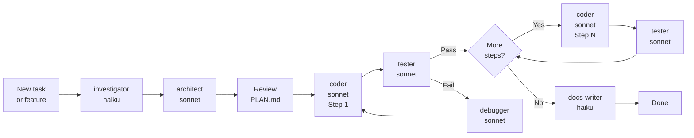

# Claude Code Agent and Skill Setup

This document is a technical reference for developers who use Claude Code to contribute to the Renamer App. It covers
how to invoke agents and skills, understand the development pipeline, and work with code analysis tools.

## 1. Overview

The Renamer App uses Claude Code's agent and skill system to assist with development tasks. Six specialized agents cover
the full development lifecycle — investigation, design, implementation, testing, debugging, and documentation — and can
be invoked individually or chained in a pipeline. Skills are context-loading instructions that give agents
project-specific knowledge for targeted tasks. MCP servers extend Claude Code with web search and code graph analysis
capabilities.

The ground truth for all AI-assisted workflows is `.claude/CLAUDE.md` (checked into the repository). Refer to it for the
authoritative agent list, build commands, and project conventions. Claude Code loads `.claude/CLAUDE.md` automatically
at the start of every session — you do not need to reference it manually.

## 2. Prerequisites

**Claude Code CLI** — Install from the Claude Code documentation. Requires an Anthropic API key.

**API key** — Set `ANTHROPIC_API_KEY` in your shell environment or via `claude config`.

**Working directory** — All agent invocations assume the project root (`/Users/ok/Development/GitHub/renamer_app`) as
the working directory. If you are in a subdirectory, absolute file paths are required in agent prompts.

**CLAUDE.md is auto-loaded** — Claude Code reads `.claude/CLAUDE.md` automatically at session start; you do not need to
reference it manually.

## 3. Agent Reference

Six specialized agents cover distinct phases of development. Each is tuned to this project's Java/Maven/JavaFX stack and
invoked via the `@"agent-name (agent)"` syntax.

### Agent Summary

| Agent          | Model         | Role                            | When to invoke                                                                          |
|----------------|---------------|---------------------------------|-----------------------------------------------------------------------------------------|
| `investigator` | Claude Haiku  | Read-only codebase cartographer | Before any new task — maps code, traces data flow, identifies modification scope        |
| `architect`    | Claude Sonnet | Technical designer              | After investigation — designs solution, evaluates trade-offs, writes `PLAN.md`          |
| `coder`        | Claude Sonnet | Step-by-step implementer        | After human approves `PLAN.md` — implements exactly one plan step at a time             |
| `tester`       | Claude Sonnet | JUnit 5 QA engineer             | After each coder step — writes tests, finds edge cases, verifies the no-throw contract  |
| `debugger`     | Claude Sonnet | Root cause analyst              | When any Maven build, test, or runtime failure occurs                                   |
| `docs-writer`  | Claude Haiku  | Technical writer                | After implementation — writes/updates README, ADRs, ARCHITECTURE.md, Javadoc, CHANGELOG |

### investigator

Strictly read-only. Maps the codebase, traces data flow through the V2 pipeline, and identifies exactly which files need
to change for a given task. Never modifies files. Its output (Modification Scope table, Data Flow diagram, Key Files
list) feeds the `architect` or `debugger`. Use this before starting any new task — understanding the scope prevents
wasted effort on incorrect solutions.

```bash
@"investigator (agent)" trace the data flow from file selection to physical rename
```

### architect

Designs solutions and writes `PLAN.md`. Never writes source code (.java, .fxml, .css, or any source file). Its output is
a step-by-step plan with exact file paths and Maven validation commands per step — detailed enough that `coder` can
implement without clarifying questions. Output is typically 20–40 lines with numbered steps, file paths, and inline
`mvn` commands for verifying each step.

```bash
@"architect (agent)" design a new REPLACE_TEXT transformation mode
```

### coder

Implements exactly one step from `PLAN.md` at a time. Reads the full plan first for context, then makes surgical changes
to only the files assigned in that step. Runs `../scripts/ai-build.sh` after each step to validate compilation and pass
linting. Its report feeds `tester`. Never skips steps or implements multiple steps in one invocation.

```bash
@"coder (agent)" implement Step 1 of PLAN.md
```

### tester

Writes JUnit 5 tests to verify what `coder` just implemented. Thinks adversarially: nulls, empty inputs, race
conditions, pipeline edge cases. Distinguishes implementation bugs from test bugs. Uses AssertJ fluent assertions and
Mockito 5 for mocks. Its report feeds `debugger` if failures are found.

```bash
@"tester (agent)" test the changes from Step 1 of PLAN.md
```

### debugger

Investigates build failures, test failures, and runtime errors. Finds the true root cause before touching any code —
never applies band-aids or silences errors with `@SuppressWarnings`. Its output includes the exact file and line of the
bug, root cause category, and what was fixed. Works iteratively with `tester` to confirm the fix via regression tests.

```bash
@"debugger (agent)" [paste full Maven error output here]
```

### docs-writer

Writes and updates documentation files only. Invokes `/project-docs` before writing anything to load documentation
standards. Produces README updates, ADRs, ARCHITECTURE.md sections, Javadoc, and changelogs. Its output is typically the
last step in a pipeline. Never modifies code or tests.

```bash
@"docs-writer (agent)" document the new REPLACE_TEXT mode added in PLAN.md
```

## 4. Standard Development Pipeline

The standard workflow for planned feature development follows this sequence: investigator → architect → human review →
coder → tester → repeat for each step → docs-writer. This pipeline ensures that every change is designed before code is
written, tested before commit, and documented upon completion.

### Pipeline Flowchart



### Step-by-Step Walkthrough

Use "adding a new transformation mode" as the running example:

**1. Investigate** — Map the codebase and identify all files that must change.

```bash
@"investigator (agent)" which files need to change to add a new V2 transformation mode?
```

Investigator produces a Modification Scope table identifying all files across `app/api`, `app/core`, and `app/ui` that
must be created or modified.

**2. Design** — Write a step-by-step plan with file paths and validation commands.

```bash
@"architect (agent)" design the ADD_DIMENSIONS transformation mode
```

Architect reads investigation output and writes `PLAN.md` with numbered steps, file paths, code snippets showing what to
add, and `mvn` commands to validate each step.

**3. Review** — Read `PLAN.md` and approve (or request changes) before any code is written. This is your gate — if the
plan is unclear or misses scope, ask the architect to revise.

**4. Implement** — Execute each step in sequence.

```bash
@"coder (agent)" implement Step 1 of PLAN.md
```

Coder modifies only the files assigned in Step 1, runs `../scripts/ai-build.sh` to validate, and reports what was
changed.

**5. Test** — Write JUnit 5 tests for the step that was just implemented.

```bash
@"tester (agent)" test the changes from Step 1 of PLAN.md
```

Tester writes tests covering happy path, edge cases, and error conditions. If tests fail, report to debugger.

**6. Repeat** steps 4–5 for each remaining step in `PLAN.md`. Do not skip steps or combine steps.

**7. Document** — After all steps pass, write or update documentation.

```bash
@"docs-writer (agent)" document the new ADD_DIMENSIONS mode
```

Docs-writer updates README if needed, adds an ADR if a decision was made, updates ARCHITECTURE.md, adds Javadoc to
public classes, and updates CHANGELOG.md.

## 5. Reactive Invocations

Reactive workflows are triggered by specific failure states or discovery of drift. These do not require a full
pipeline — invoke the appropriate agent for the problem.

### Build or Test Failure

Any Maven compile error, test failure, or runtime exception:

```bash
@"debugger (agent)" [paste full Maven [ERROR] output with stack trace]
```

After the fix is confirmed, add a regression test:

```bash
@"tester (agent)" write a regression test for the bug fixed in RenameExecutionServiceImpl
```

### Documentation Drift

When code has changed and docs have not been updated:

```bash
@"docs-writer (agent)" audit docs/ for drift from the current V2 pipeline implementation
```

### New Architecture Decision

When a significant technical decision is made (new framework, replaced module, changed data flow):

```bash
@"architect (agent)" write an ADR for switching from V1 to V2 transformation pipeline
@"docs-writer (agent)" add ADR-0007 to docs/adr/ based on the architect's output
```

## 6. Skills Reference

Skills are invoked with a `/command` in the Claude Code prompt. They load project-specific context and rules into
Claude's active session, giving it knowledge of conventions before it writes code or documentation. Skills are stored in
`.claude/skills/<skill-name>/SKILL.md` and loaded automatically when the slash command is used.

| Skill                     | Command                    | When to use                                                                                  |
|---------------------------|----------------------------|----------------------------------------------------------------------------------------------|
| `java-developer`          | `/java-developer`          | Writing any Java code — loads logging, Javadoc, dependency, and V2 model conventions         |
| `write-junit5-tests`      | `/write-junit5-tests`      | Writing unit or integration tests — loads test naming, AAA structure, and assertion patterns |
| `javafx`                  | `/javafx`                  | Writing JavaFX controllers, FXML, or CSS in `app/ui/`                                        |
| `javafx-ui-designer`      | `/javafx-ui-designer`      | Designing or theming JavaFX UI — colors, CSS tokens, layout, typography, accessibility       |
| `add-transformation-mode` | `/add-transformation-mode` | Adding a new V2 transformation mode end-to-end (multi-step across 4 modules)                 |
| `project-docs`            | `/project-docs`            | Writing or updating README, ADRs, or architecture docs — loads documentation standards       |
| `use-exiftool-metadata`   | `/use-exiftool-metadata`   | Embedding datetime/GPS into test media files                                                 |
| `use-ffmpeg-cli`          | `/use-ffmpeg-cli`          | Generating base test media files (images, video, audio)                                      |
| `create-mermaid-diagrams` | `/create-mermaid-diagrams` | Creating Mermaid diagrams — loads syntax rules, node shape reference, and common errors      |

## 7. MCP Servers

Two MCP servers extend Claude Code's capabilities for this project. MCP (Model Context Protocol) servers are external
tools that Claude Code can call to perform specialized tasks like web search or code analysis.

### py-search-helper

Provides web search and page extraction. Not configured in the project's `.claude/mcp.json` — requires separate
installation via `uv run py-search-helper-mcp`.

| Tool                                     | Purpose                                                 |
|------------------------------------------|---------------------------------------------------------|
| `search_web_ddg(query, max_results)`     | DuckDuckGo search — fastest for general library lookups |
| `search_web(engine, query, max_results)` | Search with a specific search engine                    |
| `open_page(url, max_chars)`              | Extract page content as Markdown                        |

**When to use:** Looking up library API docs (Apache Tika, Guice, JavaFX, metadata-extractor, Mockito), Java best
practices, or any information beyond Claude's training data.

**When NOT to use:** Content in `CLAUDE.md`, basic Java concepts, or project-specific code questions — these are
answered faster by reading the codebase directly.

### CodeGraphContext

Provides code graph analysis via a FalkorDB graph database. Configured in `.claude/mcp.json`. All tools are in the
`alwaysAllow` list — no approval prompt required. A CLI (`cgc`) is also available for terminal use.

**Before first use:** Index the repository.

```bash
cgc index .
```

Or via MCP tool:

```
add_code_to_graph with the repo path
```

Verify the index is current:

```bash
cgc list
```

Or via MCP tool: `list_indexed_repositories`.

| Task                                      | Tool                              | Key parameter                   |
|-------------------------------------------|-----------------------------------|---------------------------------|
| Find who calls a method                   | `analyze_code_relationships`      | `query_type: "find_callers"`    |
| Find what a method calls                  | `analyze_code_relationships`      | `query_type: "find_callees"`    |
| Class inheritance hierarchy               | `analyze_code_relationships`      | `query_type: "class_hierarchy"` |
| Search code by keyword                    | `find_code`                       | —                               |
| Find unused code                          | `find_dead_code`                  | —                               |
| Find the most complex functions           | `find_most_complex_functions`     | —                               |
| Calculate cyclomatic complexity           | `calculate_cyclomatic_complexity` | —                               |
| Repository statistics (class/file counts) | `get_repository_stats`            | —                               |
| Custom graph query (Cypher)               | `execute_cypher_query`            | —                               |
| Index the codebase                        | `add_code_to_graph`               | repo path                       |
| Check indexing progress                   | `check_job_status` / `list_jobs`  | —                               |

The complexity threshold is configured at 10 in `.claude/mcp.json` — functions above this value are flagged by
`find_most_complex_functions`.

## 8. CLAUDE.md

**Location:** `.claude/CLAUDE.md` (committed to the repository)

Claude Code loads `.claude/CLAUDE.md` automatically at the start of every session. It is the single source of truth for
how Claude behaves in this project — it overrides Claude's defaults for build commands, naming conventions, DI patterns,
agent invocations, and skill availability.

**What it contains:**

- Project description and module responsibilities
- Build commands for every workflow (compile, test, lint, run, package)
- Architecture overview and critical patterns (V2 builder `with` prefix, Guice constructor injection, JPMS exports)
- Agent table — models, roles, when to invoke, invocation examples
- Skills table — names and when to use
- MCP server descriptions and tool reference

**When to update `CLAUDE.md`:**

- A new agent is added or an existing agent's model changes
- A skill is renamed or its purpose changes
- A new build command or Maven flag becomes standard
- A critical convention is established (new naming rule, new DI pattern, new V2 model type)
- The module structure changes (new module added, module renamed)
- An MCP server is added or removed

Keep `CLAUDE.md` concise — it is loaded into context on every session. Verbose entries reduce the signal-to-noise ratio
for all subsequent interactions.
