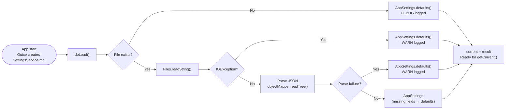

# Settings System

This document covers the settings architecture: the `SettingsService` interface, the JSON storage format, OS-specific
file paths, error handling, logging configuration, and how the settings dialog reads and writes settings.

---

## 1. Architecture

### SettingsService interface

`SettingsService` (`app/api`) is the public contract for all settings I/O:

| Method                  | Description                                                          |
|-------------------------|----------------------------------------------------------------------|
| `getCurrent()`          | Return the in-memory settings snapshot — no I/O                      |
| `load()`                | Read from disk, update the cache, return the result                  |
| `save(AppSettings)`     | Write to disk atomically, update the cache                           |
| `getSettingsFilePath()` | Return the OS-specific path to the settings file (may not exist yet) |

### SettingsServiceImpl

`SettingsServiceImpl` (`app/backend`) is the Guice `@Singleton` implementation. Key design decisions:

- **Eager load on injection:** The `@Inject` constructor immediately calls `doLoad()` — settings are available to every
  dependent class as soon as Guice creates the singleton.
- **Volatile in-memory cache:** The `current` field is declared `volatile` — reads from `getCurrent()` always see the
  most-recently saved state without synchronization overhead.
- **Atomic write:** `save()` writes to a sibling `.tmp` file first, then moves it over the target with
  `Files.move(..., ATOMIC_MOVE)`. On filesystems that do not support atomic move, a non-atomic replace is used as a
  fallback and logged at DEBUG.
- **Testability seam:** `getEnv(String name)` is a `protected` method that wraps `System.getenv()`. Test subclasses
  override it to inject fake `APPDATA` and `XDG_CONFIG_HOME` values without JVM-level environment manipulation.

### DI binding

`SettingsServiceImpl` is bound in `DIBackendModule`:

```java
bind(SettingsService .class).

to(SettingsServiceImpl .class).

in(Singleton .class);
```

`LoggingConfigService` is also bound as a singleton in the same module, with its `configure()` method invoked by Guice
via `@Inject` at startup.

---

## 2. AppSettings Fields

`AppSettings` is an immutable Lombok `@Value` class. Construct with `AppSettings.builder()` (prefix: `with`) or obtain
defaults via `AppSettings.defaults()`.

| Field                 | Type               | Default | Description                                                                            |
|-----------------------|--------------------|---------|----------------------------------------------------------------------------------------|
| `version`             | `int`              | `1`     | Schema version written to the JSON file; increment on breaking schema changes          |
| `language`            | `String`           | `"en"`  | BCP-47 language tag for the UI locale (e.g. `"en"`, `"uk_UA"`)                         |
| `customConfigEnabled` | `boolean`          | `false` | Whether the user has enabled a custom Logback configuration file                       |
| `customConfigPath`    | `@Nullable String` | `null`  | Absolute path to the custom Logback config file; stored but not yet applied at runtime |
| `loggingEnabled`      | `boolean`          | `false` | Whether file-based logging to `renamer.log` is active                                  |
| `logLevel`            | `LogLevel`         | `INFO`  | Severity threshold applied to the `ua.renamer.app` logger when file logging is enabled |

All defaults are defined as constants in `AppDefaults` (`app/api`):

```java
AppDefaults.SETTINGS_VERSION   =1
AppDefaults.DEFAULT_LANGUAGE   ="en"
AppDefaults.DEFAULT_LOG_LEVEL  =LogLevel.INFO
AppDefaults.SETTINGS_FILE_NAME ="settings.json"
AppDefaults.APP_DIR_NAME       ="Renamer"
```

---

## 3. Storage Format

### JSON file

The settings file is pretty-printed JSON:

```json
{
  "version": 1,
  "general": {
    "language": "en",
    "customConfigEnabled": false,
    "customConfigPath": null,
    "logging": {
      "enabled": false,
      "level": "INFO"
    }
  }
}
```

All fields in `general.logging` correspond to `AppSettings.loggingEnabled` and `AppSettings.logLevel`. The top-level
`version` field corresponds to `AppSettings.version`.

### OS-specific file locations

| OS      | Settings file path                                                                     |
|---------|----------------------------------------------------------------------------------------|
| macOS   | `~/Library/Application Support/Renamer/settings.json`                                  |
| Linux   | `$XDG_CONFIG_HOME/renamer/settings.json` (fallback: `~/.config/renamer/settings.json`) |
| Windows | `%APPDATA%\Renamer\settings.json`                                                      |

The directory is created automatically by `save()` on first write. On Linux, the directory name is lowercase (
`renamer`); on macOS and Windows it is `Renamer` (capitalized, matching `AppDefaults.APP_DIR_NAME`).

---

## 4. Error Handling

### Settings load flow



### Failure scenarios

| Scenario                          | Behavior                                 | Log     |
|-----------------------------------|------------------------------------------|---------|
| Settings file missing             | Returns `AppSettings.defaults()`         | `DEBUG` |
| `IOException` reading the file    | Returns `AppSettings.defaults()`         | `WARN`  |
| Malformed JSON (parse failure)    | Returns `AppSettings.defaults()`         | `WARN`  |
| Unknown `logLevel` string in JSON | Falls back to `DEFAULT_LOG_LEVEL` (INFO) | `WARN`  |

In all failure cases the app continues normally with default settings. No exception propagates to callers — `load()`
always returns a non-null `AppSettings`.

### Schema evolution

Missing JSON fields each fall back to their default value via Jackson's `.asText(default)` and `.asBoolean(default)`
accessors — no explicit migration step is required for additive schema changes. The `version` field is stored for future
use; no version-specific migration logic is currently implemented.

---

## 5. Logging Configuration

### LogLevel enum

`LogLevel` maps directly to Logback levels:

| Value   | Meaning                                                             |
|---------|---------------------------------------------------------------------|
| `DEBUG` | Finest-grained diagnostic information — for development             |
| `INFO`  | Normal operation confirmations                                      |
| `WARN`  | Potentially harmful situations that do not prevent normal operation |
| `ERROR` | Error events that may still allow the app to continue               |

### LoggingConfigService

`LoggingConfigService` (`app/backend`) manages the Logback runtime based on `AppSettings`. It operates on the
`ua.renamer.app` logger — not the ROOT logger — so third-party library logging is unaffected. Console logging is
controlled exclusively by `logback.xml` and is never modified here.

**Startup:** Guice calls `configure()` via `@Inject` when the singleton is created. `configure()` applies the saved log
level and, if `loggingEnabled` is `true`, adds a `RollingFileAppender` named `FILE`.

**After settings save:** `SettingsDialogController` calls `loggingConfigService.reconfigure(updated)` immediately after
`settingsService.save()`. `reconfigure()` removes the existing `FILE` appender (calling `appender.stop()` first to
release the Windows OS file handle), then adds a new one if `loggingEnabled` is still `true`.

### Log file location and rolling policy

| Property            | Value                                                                  |
|---------------------|------------------------------------------------------------------------|
| Active log file     | `<app-config-dir>/logs/renamer.log`                                    |
| Rolled file pattern | `<app-config-dir>/logs/renamer.yyyy-MM-dd.i.log`                       |
| Max file size       | 1 GB                                                                   |
| Max history         | 2 rolled files                                                         |
| Total size cap      | 2 GB                                                                   |
| Log pattern         | `%d{yyyy-MM-dd HH:mm:ss.SSS} [%thread] %-5level %logger{60} -- %msg%n` |

`<app-config-dir>` is the same directory as the settings file: `~/Library/Application Support/Renamer/` on macOS,
`~/.config/renamer/` on Linux, `%APPDATA%\Renamer\` on Windows.

---

## 6. Settings UI

`SettingsDialogController` (`app/ui`) shows the settings as a modal dialog. It is a Guice `@Singleton` — the same
instance handles every dialog open.

### Dialog flow

1. `show(owner)` loads `SettingsDialog.fxml` and calls `populateForm(settingsService.getCurrent())` to pre-fill all
   fields from the current in-memory settings.
2. The dialog opens as a window-modal `Dialog<ButtonType>`.
3. The user edits settings. Language selection immediately evaluates whether a restart is needed (see below).
4. **OK clicked:** `collectSettings()` reads the current form state → `settingsService.save(updated)` writes to disk →
   `loggingConfigService.reconfigure(updated)` applies logging changes in-process. If `save()` throws `IOException`, an
   error `Alert` is shown and the in-memory cache is not updated.
5. **Cancel clicked:** no changes are made.

### Live-apply vs restart-required

| Setting            | When applied     | Notes                                                                                                                             |
|--------------------|------------------|-----------------------------------------------------------------------------------------------------------------------------------|
| Language           | Restart required | `ResourceBundle` is loaded once at startup as a Guice singleton; changing the language takes effect only after restarting the app |
| Logging enabled    | Live (on OK)     | `loggingConfigService.reconfigure()` adds/removes the FILE appender immediately                                                   |
| Log level          | Live (on OK)     | `loggingConfigService.reconfigure()` sets the Logback level on `ua.renamer.app` immediately                                       |
| Custom config path | Not applied      | Stored in `AppSettings` and persisted to JSON, but `LoggingConfigService` does not currently read this field                      |

### Restart badge

When the user selects a language whose code does not match the current JVM locale's language prefix, a restart badge
becomes visible next to the language dropdown. The badge disappears if the user returns to the current locale's
language. The badge is informational only — it does not block saving.
