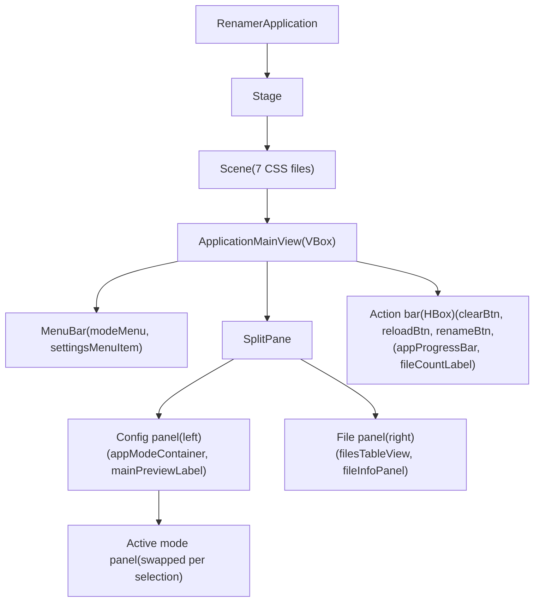

# JavaFX UI Architecture Reference

## 1. Application Lifecycle

The Renamer App uses a two-stage entry point due to JavaFX constraints.

**`Launcher.main()`** (at `ua.renamer.app.Launcher`) is a thin wrapper class that exists because a manifest entry point
must not extend `javafx.application.Application`. The Launcher simply calls `RenamerApplication.main(args)`.

**`RenamerApplication.main(String...)`** creates a Guice injector with three modules, stores it as a static field, and
calls `Application.launch()`:

```java
injector =Guice.

createInjector(new DIAppModule(), new

DICoreModule(), new

DIUIModule());

launch();
```

**`RenamerApplication.start(Stage)`** is the JavaFX entry point. It:

1. Retrieves the injected `ViewLoaderApi`, `AppResourceRegistryApi`, and `LanguageTextRetrieverApi` from the injector
2. Sets the stage title from i18n strings (`TextKeys.APP_HEADER`)
3. Sets minimum window dimensions: 900 × 500 (constants `MINIMAL_WIDTH`, `MINIMAL_HEIGHT`)
4. Loads the stage icon from the app resource registry
5. Calls `viewLoader.loadFXML(ViewNames.APP_MAIN_VIEW)` to load the main FXML
6. Creates a `Scene` with the loaded root, applies all 7 CSS stylesheets, and sets it on the stage
7. Calls `stage.show()`

**`DIUIModule.configure()`** installs `DIBackendModule`, binds widget builders and converters, and binds all 10 mode
controllers + 2 dialog controllers as `@Singleton`. It also provides `ModeViewRegistry` and `FxStateMirror` as eager
singletons.

**`DIUIModule.provideModeViewRegistry()`** is a `@Provides @Singleton` method that runs at injector creation time. It
loads all 10 mode FXML files via `ViewLoaderApi.createLoader()`, pairs each view with its injected controller, and
populates `ModeViewRegistry` with `Supplier<Parent>` factories and controller references.

---

## 2. Main Window Layout

The main window is defined in `ApplicationMainView.fxml` — a `VBox` with four zones: MenuBar, SplitPane (config panel +
file table), and action bar. The SplitPane divider starts at 35% (config) / 65% (file table).

| Zone                                 | FXML Element                             | Key `fx:id`s                                                                                               | `VBox.vgrow`             |
|--------------------------------------|------------------------------------------|------------------------------------------------------------------------------------------------------------|--------------------------|
| **MenuBar**                          | `<MenuBar>`                              | `modeMenu`, `settingsMenuItem`                                                                             | `NEVER`                  |
| **Config panel** (left of SplitPane) | `<VBox>` + `<StackPane>` + preview strip | `appModeContainer`, `mainPreviewLabel`                                                                     | `ALWAYS` (via SplitPane) |
| **File table** (right of SplitPane)  | `<TableView>`, `<VBox>`                  | `filesTableView`, `originalNameColumn`, `itemTypeColumn`, `newNameColumn`, `statusColumn`, `fileInfoPanel` | `ALWAYS` (via SplitPane) |
| **Action bar**                       | `<HBox>` (`.action-bar`)                 | `appProgressBar`, `progressLabel`, `fileCountLabel`, `clearBtn`, `reloadBtn`, `renameBtn`                  | `NEVER`                  |

The MenuBar provides mode selection and access to settings/help dialogs. The left config panel holds the active mode's
FXML (swapped dynamically via `FadeTransition`). The right file table displays rename previews with four columns:
original name, item type (file/folder icon), new name (monospace), and status badge. The file info panel below the table
shows metadata for the selected row. The action bar at the bottom holds progress feedback and action buttons.



---

## 3. Controller Hierarchy

**Main controller:** `ApplicationMainViewController implements Initializable` (in `ua.renamer.app.ui.controller`)

Injected dependencies:

- `SessionApi` — backend session state and rename orchestration
- `FxStateMirror` — observable properties bridge
- `ModeViewRegistry` — mode view and controller lookup
- `SettingsDialogController`, `FolderExpansionService` — for dialogs and folder handling
- `AppModesConverter`, `LanguageTextRetrieverApi`, `AppResourceRegistryApi` — resource access

`initialize(URL, ResourceBundle)` is called by FXMLLoader after construction. It:

- Builds mode `RadioMenuItem` items from the `TransformationMode` enum
- Configures table columns (`setCellValueFactory`, `setCellFactory` for custom rendering)
- Attaches row factory for dynamic CSS styling (`.row-ready`, `.row-error`, `.row-renamed`)
- Wires drag-drop listeners and context menus
- Attaches property listeners from `FxStateMirror` to update UI when backend state changes

`handleModeChanged(TransformationMode)` is called when the user selects a mode. It:

1. Calls `modeViewRegistry.getView(mode)` to retrieve the view factory
2. Invokes the factory to load the `Parent` node
3. Wraps the swap in a `FadeTransition` for visual polish
4. Retrieves the controller via `modeViewRegistry.getController(mode)`
5. Calls `callBind()` to dispatch `controller.bind(modeApi)` with type erasure handled

**Mode controllers (10 total)** implement `ModeControllerV2Api<P extends ModeParameters>`:

Two required methods:

- `void bind(ModeApi<P> modeApi)` — attaches listeners to FXML controls, initializes values from
  `modeApi.currentParameters()`, wires callbacks that call `modeApi.updateParameters(p -> p.withField(newVal))`
- `TransformationMode supportedMode()` — returns the mode this controller manages (used as a registry lookup key)

Concrete implementations (10 total):
`ModeAddTextController`, `ModeChangeCaseController`, `ModeAddDatetimeController`, `ModeAddDimensionsController`,
`ModeAddFolderNameController`, `ModeRemoveTextController`, `ModeReplaceTextController`, `ModeNumberFilesController`,
`ModeTrimNameController`, `ModeChangeExtensionController`

**Dialog controllers:** `SettingsDialogController`, `FolderDropDialogController` (both `@Singleton`, injected into
`ApplicationMainViewController`)

---

## 4. FXML Loading

`ViewLoaderService implements ViewLoaderApi` (in `ua.renamer.app.ui.service.impl`) loads FXML files via:

1. Resolves the classpath resource URL: `"fxml/" + viewName.getViewName()` (e.g., `fxml/ModeAddText.fxml`)
2. Calls `createLoader(ViewNames)` to configure an `FXMLLoader` with three critical settings:
    - `setResourceBundle(resourceBundle)` — enables `%key` i18n placeholder resolution in FXML
    - `setControllerFactory(injector::getInstance)` — **required** — Guice provides and injects controllers
    - `setBuilderFactory(builderFactory)` — enables custom widget construction in FXML (radio selectors, etc.)
3. Calls `loader.load()` to parse and instantiate the FXML and return the root `Parent`
4. Returns `Optional<Parent>` — never throws; logs warning and returns empty on any failure

**Critical rule:** FXML files MUST NOT include an `fx:controller` attribute. The controller factory on `FXMLLoader`
handles instantiation and injection. Including `fx:controller` conflicts with Guice's lifecycle and creates a second,
uninjected controller instance.

Example: `ModeAddText.fxml` (no `fx:controller` attribute — the loader provides the controller):

```xml

<VBox xmlns:fx="http://javafx.com/fxml"
      xmlns="http://javafx.com/javafx"
      prefHeight="400.0" prefWidth="600.0" spacing="12">
    <padding>
        <Insets top="12" right="12" bottom="12" left="12"/>
    </padding>

    <ItemPositionRadioSelector fx:id="itemPositionRadioSelector"
                               labelValue="%mode_add_text_label_position">
        <VBox.margin>
            <Insets bottom="4"/>
        </VBox.margin>
    </ItemPositionRadioSelector>

    <VBox VBox.vgrow="NEVER" spacing="8">
        <Label text="%mode_add_text_label_text" styleClass="label-section"/>
        <TextField fx:id="textField" maxWidth="Infinity"/>
    </VBox>
</VBox>
```

Controller (`ModeAddTextController` — Guice injects all dependencies):

```java

@RequiredArgsConstructor(onConstructor_ = {@Inject})
public class ModeAddTextController implements ModeControllerV2Api<AddTextParams>, Initializable {

    @FXML
    private TextField textField;
    @FXML
    private ItemPositionRadioSelector itemPositionRadioSelector;

    private ChangeListener<String> textToAddListener;

    @Override
    public void bind(ModeApi<AddTextParams> modeApi) {
        var params = modeApi.currentParameters();

        // Remove old listener to prevent accumulation on re-bind
        if (textToAddListener != null) {
            textField.textProperty().removeListener(textToAddListener);
        }

        // Initialize FXML controls from backend parameters
        textField.setText(params.textToAdd() != null ? params.textToAdd() : "");

        // Attach new listener that updates the backend when user changes the control
        textToAddListener = (obs, oldVal, newVal) -> {
            modeApi.updateParameters(p -> p.withTextToAdd(newVal));
        };
        textField.textProperty().addListener(textToAddListener);

        itemPositionRadioSelector.setValueSelectedHandler(pos ->
                modeApi.updateParameters(p -> p.withPosition(pos)));
    }
}
```

---

## 5. Mode Panel Lifecycle

When the user selects a mode in the MenuBar, the following sequence occurs:

```
ApplicationMainViewController.handleModeChanged(mode)
  → modeViewRegistry.getView(mode)                    // Supplier<Parent>
      → FXMLLoader.load()                             // Load FXML with injected controller
  → FadeTransition swaps appModeContainer content
  → modeViewRegistry.getController(mode)              // ModeControllerV2Api<?>
  → controller.bind(modeApi)
      → Remove old ChangeListeners (prevents accumulation on re-bind)
      → Initialize FXML controls from modeApi.currentParameters()
      → Attach new listeners:
          control.valueProperty().addListener(...)
              → modeApi.updateParameters(p -> p.withField(newVal))
              → Backend validates and computes preview
              → FxStateMirror publishes new preview
              → UI updates preview display
```

`ModeViewRegistry` (in `ua.renamer.app.ui.view`) stores two `EnumMap<TransformationMode, ?>` fields:

- `Map<TransformationMode, Supplier<Parent>> registry` — FXML view factories (suppliers that invoke the loaded FXML)
- `Map<TransformationMode, ModeControllerV2Api<?>> controllers` — controller lookup

Methods:

- `getView(mode)` — invokes the `Supplier` to obtain a fresh `Parent` each time (no caching; FXMLLoader.load() is
  idempotent)
- `getController(mode)` — returns the cached `@Singleton` controller instance

**Listener cleanup is critical:** Mode controllers store `ChangeListener` references as fields. The `bind()` method
removes the old listener before attaching a new one. Without this cleanup, re-selecting the same mode would accumulate
duplicate listeners, triggering redundant backend calls on every control change.

---

## 6. State Management

`FxStateMirror implements StatePublisher` (in `ua.renamer.app.ui.state`, `@Singleton`) bridges backend state to the UI
via observable properties. Backend services call `publish*()` methods from any thread (e.g., virtual thread pool). Every
`publish*()` wraps mutations in `Platform.runLater()` to move execution to the FX Application Thread.

Read-only properties exposed to the UI (accessed via property accessor methods):

| Property              | Type                                         | Updated by                                          |
|-----------------------|----------------------------------------------|-----------------------------------------------------|
| `files()`             | `ReadOnlyListProperty<RenameCandidate>`      | `publishFilesChanged()`                             |
| `preview()`           | `ReadOnlyListProperty<RenamePreview>`        | `publishFilesChanged()`, `publishPreviewChanged()`  |
| `renameResults()`     | `ReadOnlyListProperty<RenameSessionResult>`  | `publishRenameComplete()`                           |
| `status()`            | `ReadOnlyObjectProperty<SessionStatus>`      | `publishStatusChanged()`, `publishRenameComplete()` |
| `activeMode()`        | `ReadOnlyObjectProperty<TransformationMode>` | `publishModeChanged()`                              |
| `currentParameters()` | `ReadOnlyObjectProperty<ModeParameters>`     | `publishModeChanged()`                              |

`publishRenameComplete()` sets `renameResultsList` before updating `statusProp`. This order ensures that listeners
firing on status change already see the updated result list — no race condition.

---

## 7. CSS Theming

Seven CSS files (all applied to the `Scene` at startup via `AppResourceRegistryService`):

| File                | Purpose                                                                         |
|---------------------|---------------------------------------------------------------------------------|
| `base.css`          | Design token system on `.root`, JavaFX built-in control overrides               |
| `typography.css`    | Text utility classes (`.label-section`, `.label-caption`, `.label-body`)        |
| `buttons.css`       | Button variants (`.btn-primary`, `.btn-secondary`, `.btn-danger`, `.btn-ghost`) |
| `components.css`    | Form controls, badges, chips, preview panels, config panel                      |
| `table.css`         | Table rows, column headers, row state classes                                   |
| `file-info.css`     | Metadata panel (`.file-info-panel`, `.file-info-row`, etc.)                     |
| `accessibility.css` | WCAG 2.1 AA focus indicators for keyboard navigation                            |

**Design token system** — all tokens defined on `.root` in `base.css`, referenced throughout via CSS variable lookup:

Color tokens (selection):

| Token                    | Value     | Used for                          |
|--------------------------|-----------|-----------------------------------|
| `-color-primary`         | `#2C6FBF` | Buttons, focused borders, accents |
| `-color-bg-app`          | `#EFF4FA` | Window background                 |
| `-color-bg-header`       | `#1F3C5C` | Table column headers (dark navy)  |
| `-color-config-panel`    | `#E3EBF5` | Left config panel background      |
| `-color-row-ready`       | `#EBF1FA` | Table rows pending rename         |
| `-color-row-error`       | `#FEF2F2` | Table rows with errors            |
| `-color-row-renamed`     | `#E6F4EC` | Successfully renamed rows         |
| `-color-text-primary`    | `#162030` | Primary text                      |
| `-color-text-secondary`  | `#35506A` | Secondary text, labels            |
| `-color-text-on-primary` | `#FFFFFF` | Text on primary background        |

Spacing scale (8 px base unit): `-spacing-xs` (4 px) → `-spacing-sm` (8 px) → `-spacing-md` (12 px) → `-spacing-lg` (16
px) → `-spacing-xl` (24 px) → `-spacing-2xl` (32 px)

Font scale (Major Third — 1.25×): `-font-size-xs` (10 px) → `-font-size-sm` (11 px) → `-font-size-base` (13 px) →
`-font-size-md` (14 px) → `-font-size-lg` (16 px) → `-font-size-xl` (20 px)

Border radius: `-radius-sm` (4 px), `-radius-md` (6 px), `-radius-lg` (8 px)

Key component classes to know:

- `.btn-primary` / `.btn-secondary` / `.btn-danger` / `.btn-ghost` — button variants
- `.config-panel` — left sidebar mode area background
- `.action-bar` — bottom action bar background
- `.row-ready` / `.row-error` / `.row-renamed` — applied dynamically by row factory to `TableRow`
- `.badge-pending` / `.badge-success` / `.badge-error` / `.badge-warning` — status badges in table
- `.type-chip` / `.type-chip-folder` — file/folder type indicators
- `.changed-name-col .table-cell` — monospace font for renamed-name column

---

## 8. Widget System

`RadioSelector<T extends Enum<T>>` (abstract, extends `VBox`, in `ua.renamer.app.ui.widget`) — a custom widget for
enum-based radio button groups:

- Constructor takes `labelValue` (i18n key), `enumClass`, `StringConverter<T>`
- Builds one `RadioButton` per enum constant in a `ToggleGroup`, rendered vertically with a label
- `setValueSelectedHandler(Consumer<T> callback)` — **preferred** call in `bind()`: removes previous handler before
  registering new one, preventing listener accumulation on re-bind
- `getSelectedValue()` — returns the currently selected enum value; throws `IllegalStateException` if nothing is
  selected

Four concrete implementations (each typed to a specific enum):

| Class                                      | Enum                          |
|--------------------------------------------|-------------------------------|
| `ItemPositionRadioSelector`                | `ItemPosition`                |
| `ItemPositionExtendedRadioSelector`        | `ItemPositionExtended`        |
| `ItemPositionWithReplacementRadioSelector` | `ItemPositionWithReplacement` |
| `ItemPositionTruncateRadioSelector`        | `TruncateOptions`             |

Four builder classes (one per impl) in `ua.renamer.app.ui.widget.builder` + `RadioSelectorFactory` for programmatic
construction in FXML.

**12 `StringConverter` classes** in `ua.renamer.app.ui.converter` — one per enum used in FXML `ChoiceBox`/`ComboBox`
bindings or `RadioSelector` labels:

`AppModesConverter`, `DateFormatConverter`, `DateTimeFormatConverter`, `DateTimeSourceConverter`,
`ImageDimensionOptionsConverter`, `ItemPositionConverter`, `ItemPositionExtendedConverter`,
`ItemPositionWithReplacementConverter`, `SortSourceConverter`, `TextCaseOptionsConverter`, `TimeFormatConverter`,
`TruncateOptionsConverter`

---

## Cross-References

- [`docs/developers/architecture/dependency-injection.md`](../architecture/dependency-injection.md) — DI module
  structure and Guice binding details
- [`docs/developers/guides/add-transformation-mode.md`](../guides/add-transformation-mode.md) — step-by-step guide for
  adding a new mode panel
