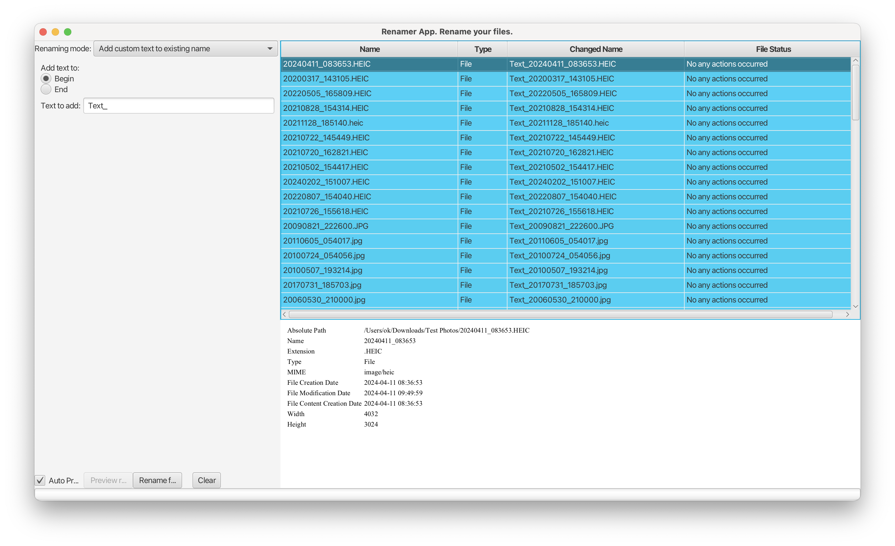
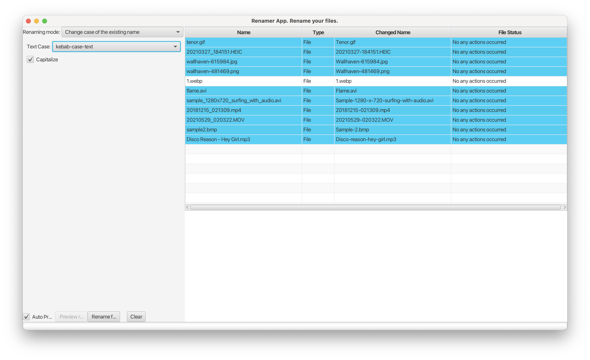
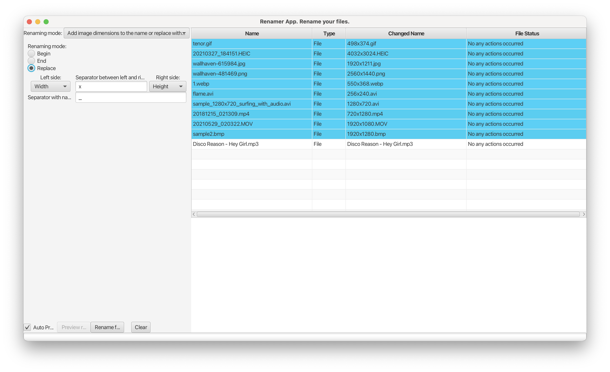
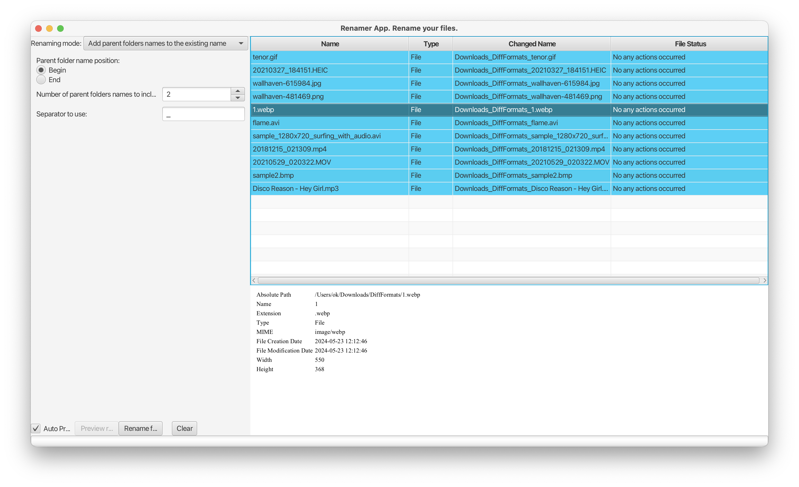
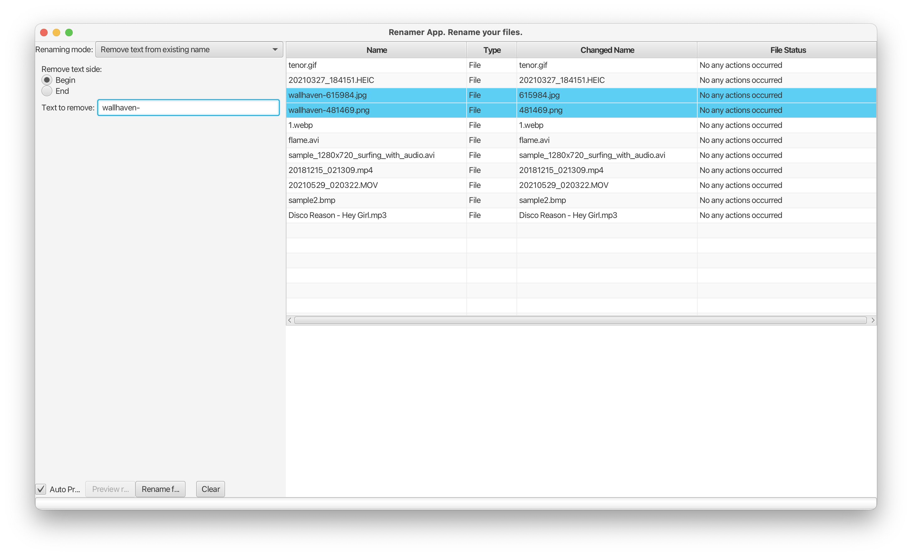
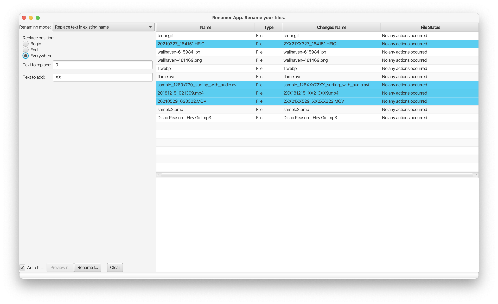
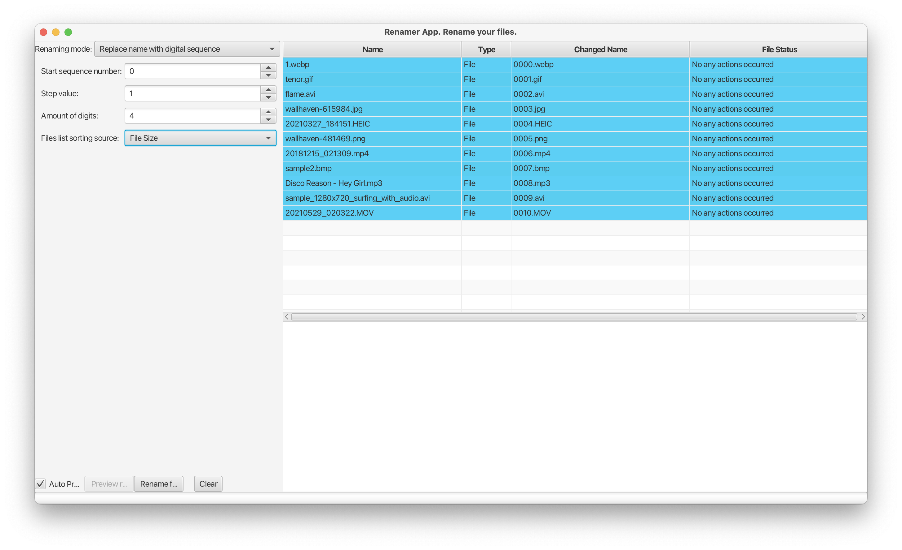
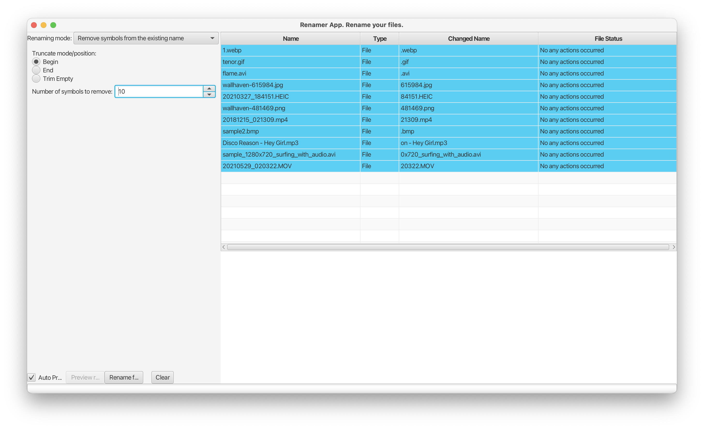
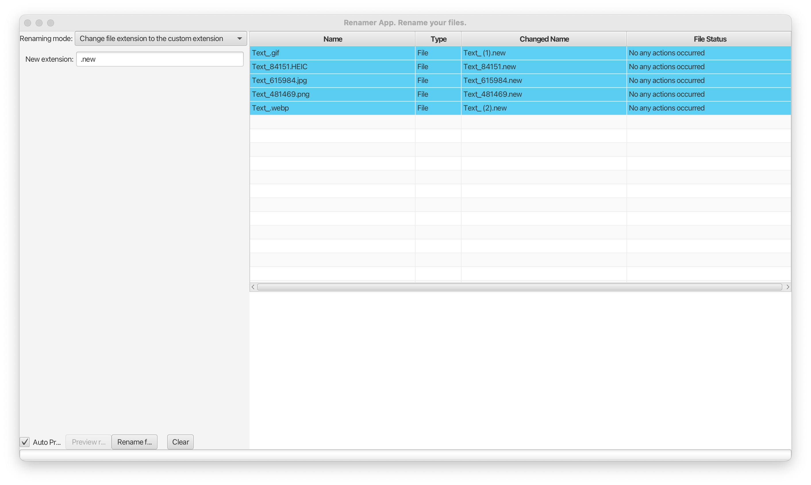

<!-- TOC -->
* [File Renamer Application](#file-renamer-application)
  * [Overview](#overview)
  * [Start renaming](#start-renaming)
    * [Renaming Modes](#renaming-modes)
      * [Add Custom Text](#add-custom-text)
      * [Change Text Case](#change-text-case)
      * [DateTime Integration](#datetime-integration)
      * [Image Dimensions](#image-dimensions)
      * [Parent Folder Names](#parent-folder-names)
      * [Remove Text](#remove-text)
      * [Replace Text](#replace-text)
      * [Digit Sequence Replacement](#digit-sequence-replacement)
      * [Symbol Truncation](#symbol-truncation)
      * [Change Extensions](#change-extensions)
    * [Caution](#caution)
  * [Future Enhancements](#future-enhancements)
<!-- TOC -->
# File Renamer Application

## Overview

The File Renamer Application offers users a convenient way to batch rename files with various customization options. Whether it's adding a sequential digit sequence, appending or prepending additional text, changing text case, or incorporating metadata like DateTime or image dimensions into the file names, this application provides flexibility and efficiency in file management tasks.

## Start renaming

Just chose files/folder in the file manager and **drag and drop** them to the right side of the app (Files Table View)

### Renaming Modes

Explore the different renaming modes available in the application:

#### Add Custom Text

Append or prepend custom text to the existing file names.

#### Change Text Case

Alter the case of file names to different variants, enhancing consistency and readability.

#### DateTime Integration

Incorporate DateTime information into file names or replace existing names with DateTime details, with support for various formats and source selection.

#### Image Dimensions

Utilize image width and height metadata to enrich file names, exclusive to image files.

#### Parent Folder Names

Include parent folder names in file names, offering organization and context.

#### Remove Text

Effortlessly trim text from the beginning or end of file names.

#### Replace Text

Swap text segments in file names with custom alternatives, enhancing file name clarity.

#### Digit Sequence Replacement

Replace file names with sequential digit sequences, with sorting options available for streamlined management.

#### Symbol Truncation

Remove specified symbols from file names, optimizing file name lengths.

#### Change Extensions

Modify file extensions, ensuring compatibility and consistency across file types.

### Caution

While the application offers powerful renaming capabilities, it's essential to exercise caution and maintain backups of your data before proceeding with any renaming operations. Some functionalities may be limited based on file metadata availability, and the application may append digital numbers to differentiate files with identical names.

## Future Enhancements

- **Expanded Metadata Support:** Implement support for additional file types, such as videos, to enhance metadata retrieval capabilities.
- **Multilingual Support:** Introduce multilingual support to cater to users worldwide.
- **UI Testing:** Conduct thorough testing of the user interface to ensure seamless user experience across different platforms.
- **Continuous Improvement:** Explore opportunities for further enhancements and optimizations to elevate user satisfaction and usability.
