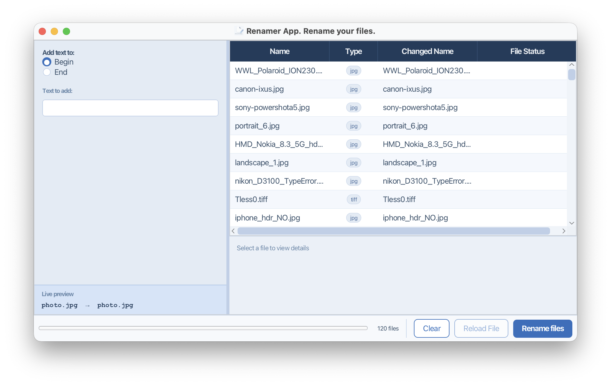
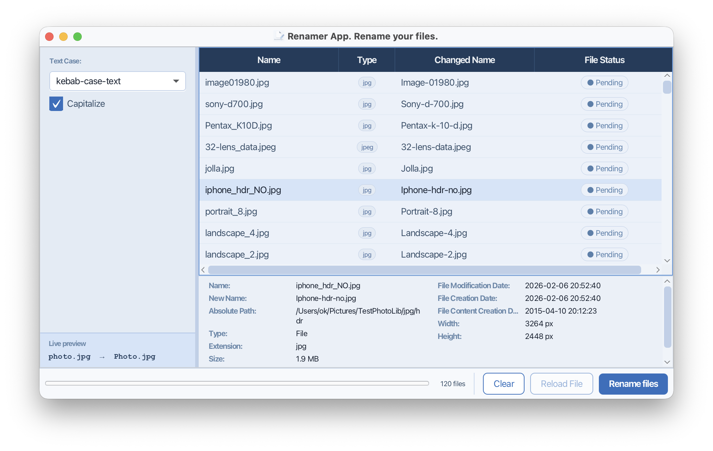
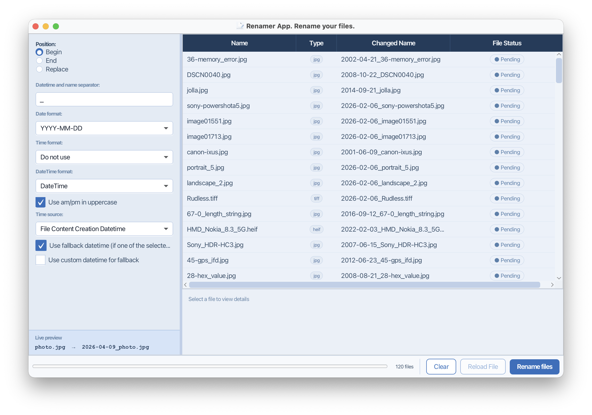
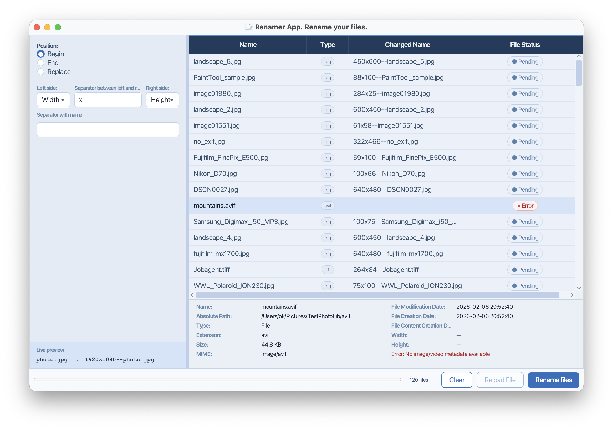
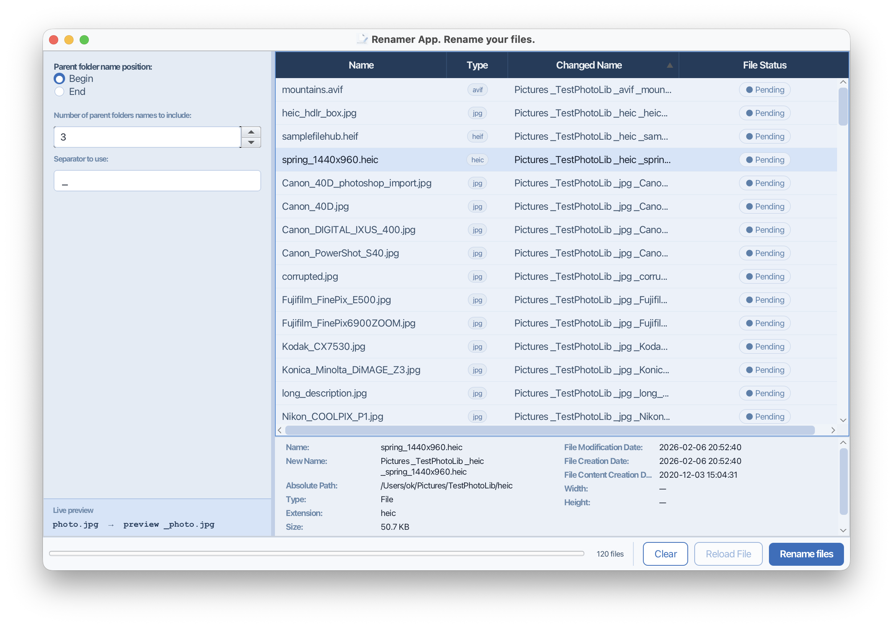
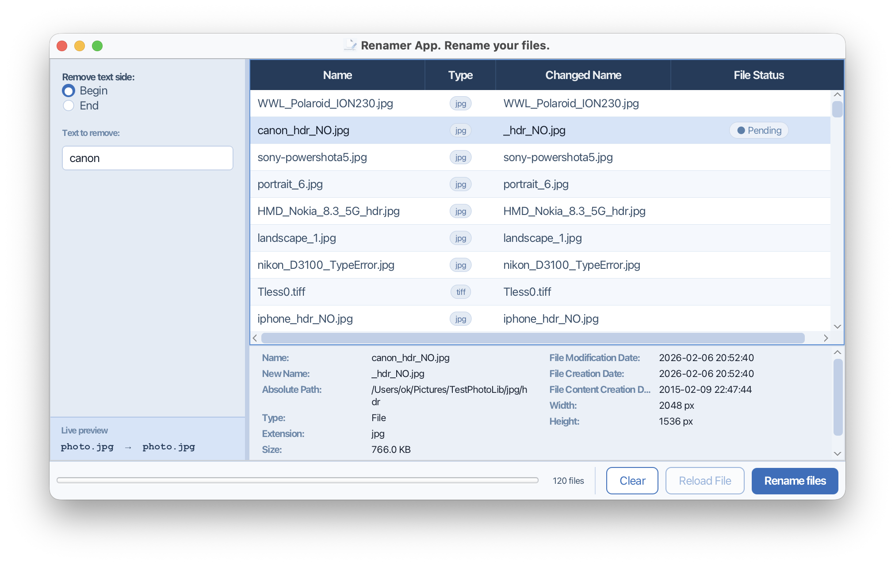
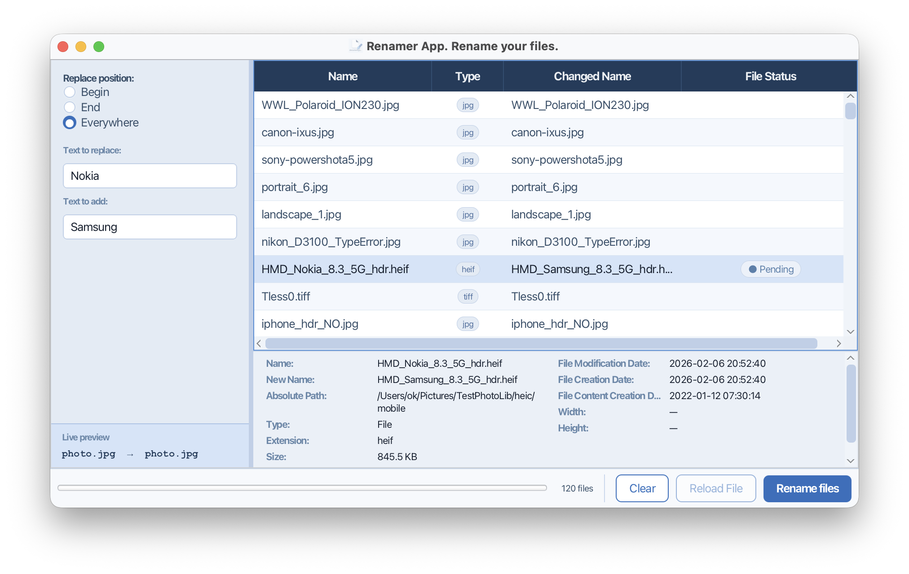
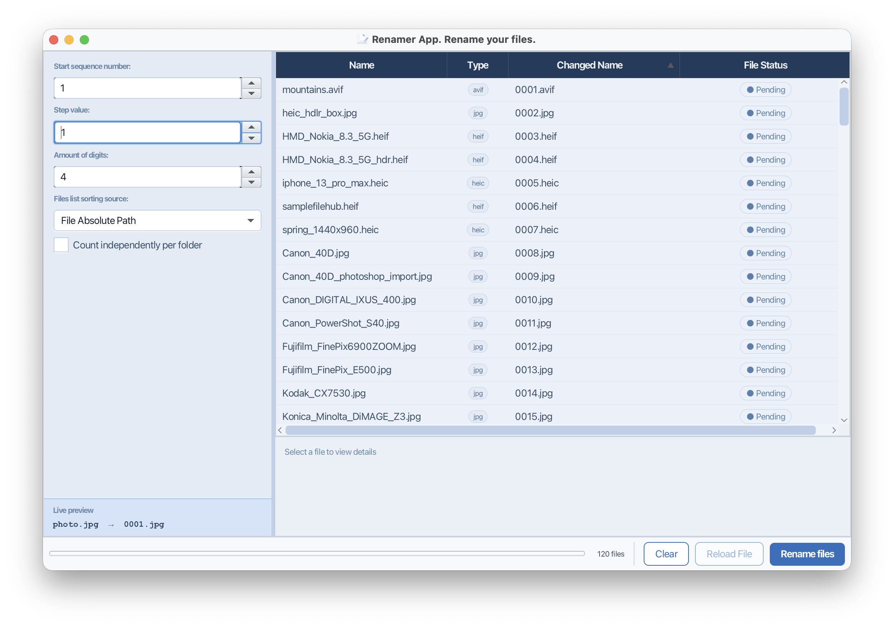
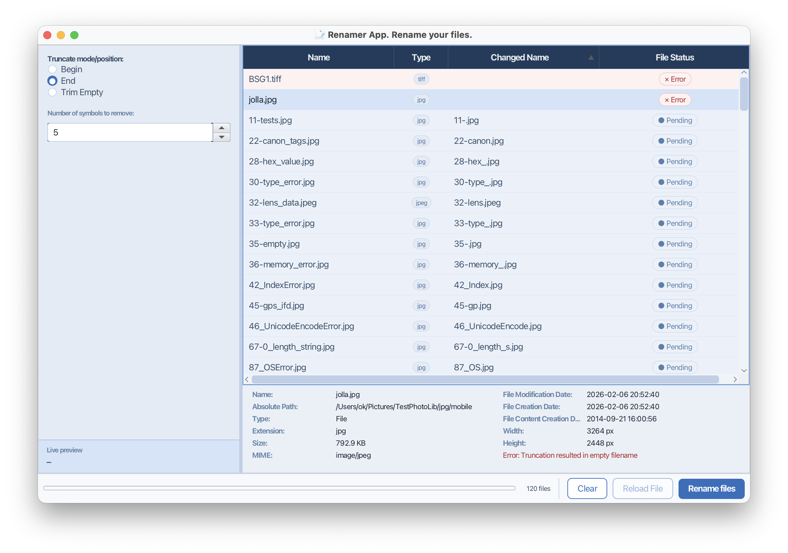
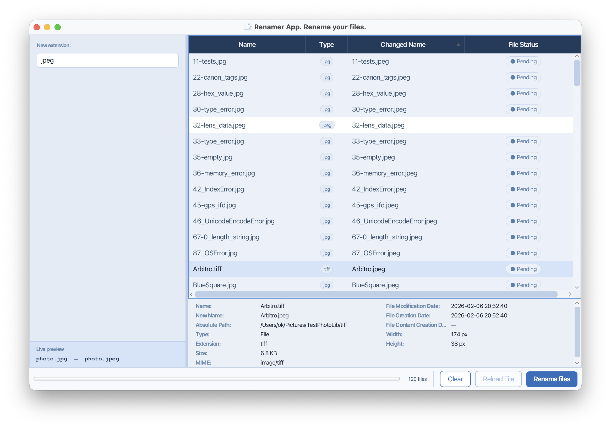

<!-- TOC -->
* [File Renamer Application](#file-renamer-application)
  * [Overview](#overview)
  * [Start renaming](#start-renaming)
    * [Renaming Modes](#renaming-modes)
      * [Add Text](#add-text)
      * [Change Case](#change-case)
      * [Add Date/Time](#add-datetime)
      * [Add Dimensions](#add-dimensions)
      * [Add Folder Name](#add-folder-name)
      * [Remove Text](#remove-text)
      * [Find & Replace](#find--replace)
      * [Number Files](#number-files)
      * [Trim Name](#trim-name)
      * [Change Extension](#change-extension)
    * [Important Notes](#important-notes)
<!-- TOC -->

# File Renamer Application

## Overview

The File Renamer Application enables batch renaming of files with extensive customization options. Add sequential numbers, append or prepend text, change capitalization, incorporate metadata like dates or image dimensions, and more—all with a live preview before any files are modified.

Metadata extraction (dates, image dimensions) is supported for the following file types:

**Image formats:** jpg, jpeg, jpe, png, gif, bmp, heif, heic, tiff, tif, psd, ico, pcx, webp, avif, arw, cr2, cr3, nef, orf, raf, rw2, dng, epsf, eps, epsi

**Video formats:** mp4, m4v, mov, qt, avi

**Audio formats:** m4a, m4b, m4p, m4r, wav, wave, mp3, flac, ogg, wma, aiff, aif, ape, mpc, wv, spx, opus, au, dsf, mp2, ra, ofr, tta

## Start renaming

Select files or folders in your file manager and drag them onto the File Renamer app window. Once added, click any file row to view detailed metadata extracted by the application.

### Renaming Modes

The application provides 10 renaming modes. Select the mode you need from the top menu bar, configure options in the right panel, and preview the results in the **Preview** column before committing the rename.

#### Add Text

Append or prepend custom text to existing filenames. Useful for adding prefixes like "2025_" or suffixes like "_final".

#### Change Case

Transform filename case to different variants: UPPERCASE, lowercase, Title Case, camelCase, or snake_case. Improves consistency and readability across your file collections.

#### Add Date/Time

Incorporate date and time information into filenames or replace names entirely with datetime values. Supports multiple formats and extraction from file metadata (EXIF creation date, file modification date, or metadata-extracted date).

#### Add Dimensions

Insert image width and height (e.g., "1920x1080") into filenames. Applies only to supported image file types.

#### Add Folder Name

Include parent folder names in filenames for organization and context. Useful when organizing files from multiple source directories.

#### Remove Text

Trim text from the beginning or end of filenames. Removes unwanted prefixes or suffixes efficiently.

#### Find & Replace

Find and replace text segments within filenames. Enter the text to find and its replacement to update filenames precisely.

#### Number Files

Rename files with sequential numeric sequences (001, 002, 003, etc.). Configure sorting by name, date, or size to control the numbering order. Useful for organizing photo collections or video sequences.

#### Trim Name

Remove specified characters from filenames by position (from the beginning or end). Optimizes long filenames and removes unwanted character sequences.

#### Change Extension

Modify file extensions to ensure compatibility and consistency across file types. Simply specify the new extension.

### Important Notes

The application is powerful, but exercise caution:

- **Always maintain backups** of your original files before renaming large batches.
- **Metadata availability** varies by file type — if a file lacks the requested metadata (e.g., EXIF date in a photo), the mode may not apply the full transformation.
- **Duplicate filename handling** — if a rename operation would create files with identical names, the application automatically appends `_1`, `_2`, etc. to differentiate them.
- **Live preview** — always review the **Preview** column before clicking **Rename** to ensure the results match your expectations.

See the [User Guide](user-guide.md) for detailed instructions and the [Mode Reference Card](mode-reference-card.md) for quick syntax examples.
